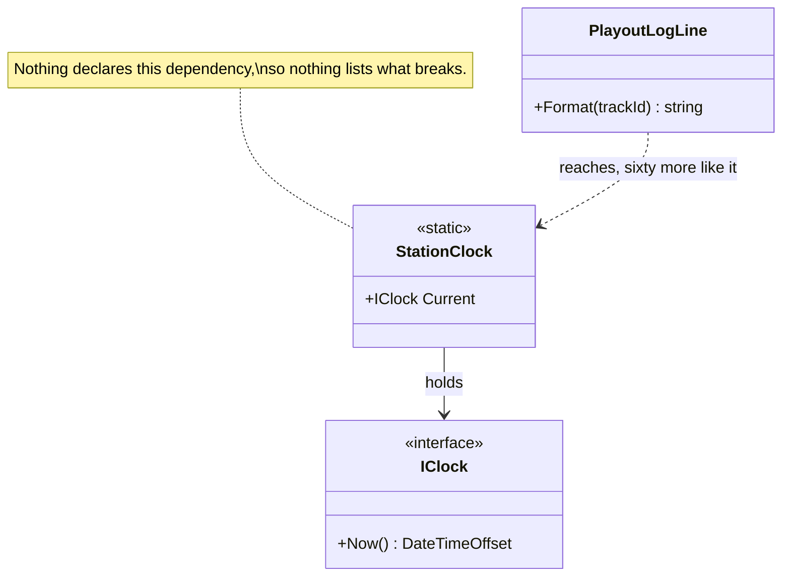

# Ambient Context

🌍 🇬🇧 English (this file) · 🇫🇷 [Français](AmbientContext-fr.md)

## Intent

Ambient Context exposes a dependency through a static access point that any code may reach, so that it is
passed to nobody and available to everybody. The book names it as an anti-pattern — and named it as a
pattern eight years earlier.

## Problem

Everything at the station needs the time, and for nine years everything got it from one static property:

```csharp
public static class StationClock {
    public static IClock Current { get; set; } = new SystemClock();
}
```

It is reached from sixty-one places, and the transmitter guard's clock — injected through its constructor,
on purpose, after the outside-broadcast incident — is the exception rather than the rule.

What it cost showed up in the tests. Freezing the clock for one test froze it for whatever ran beside it, so
the schedule tests had to run in sequence, and the suite went from forty seconds to four minutes. Nobody
connected the two for a year.

## Solution

There is no solution here; this is the anti-pattern in the 2019 reading. What the annotation records is a
fact about what can be known.

Whatever depends on an ambient context says so nowhere. Two classes that use the time and two that need
nothing look identical from outside, so there is no list of what breaks when it changes — and the only way to
find the sixty-one call sites is to search for the name.

The book's remedy is to inject the dependency: the transmitter guard already does, and it is the one class
whose test can freeze a clock without affecting anything else.

## Structure



Only one of the sixty-one consumers is drawn, and drawing them all is the point: they would all be dotted
arrows from classes whose signatures mention nothing.

## The roles

| Role | Annotation | Applies to | What it carries |
|---|---|---|---|
| AmbientContext | `[AmbientContext]` | class, property, field | The static access point through which the dependency is reached. |

One role, and three targets. The sample puts it on the **property**, not on the class, and the reason is the
pattern's definition: an injected `StationClock` would be an ordinary dependency, and it is `Current` that
lets anything reach it.

## The example

From [`AmbientContextUsage.cs`](../../../../DesignPatternCatalog.Usage/DependencyInjection/AmbientContextUsage.cs).

```csharp
public static class StationClock {

    [AmbientContext]
    public static IClock Current { get; set; } = new SystemClock();

}
```

Static, settable, and defaulted. Each of the three does damage. Static means nobody has to declare it;
settable means a test can replace it and so can anything else; and the working default means a consumer that
never thought about the clock still gets one, so the dependency is never noticed.

The annotation sits on the property rather than on the class, and the sample says why: the access point is
what makes it ambient.

```csharp
public sealed class PlayoutLogLine {

    public string Format(string trackId) {
        return $"{StationClock.Current.Now():HH:mm:ss} {trackId}";
    }

}
```

One of the sixty-one, and the sample is careful to present it as *a fair example of why they were written
this way*. Reaching for the clock here is one line; taking it as a parameter would mean threading it through
four callers, none of which needs it.

That is the trade the ambient context offers, and it is a real one — which is why the entry records the shape
rather than scolding about it.

### The author changed his mind, and the catalogue follows the edition

Worth knowing about this one: **the same author called it a pattern in the 2011 edition and files it under
anti-patterns in the 2019 one.**

The catalogue follows the 2019 edition, and that is exactly why
[ADR-0037](../../for-maintainers/adr/0037-admit-the-dependency-injection-catalogue.md) names the edition
rather than the work. A reader holding the first edition will find this entry classified against what their
copy says, and the record is where that is explained.

## Applicability

The 2019 edition gives no circumstances under which it recommends this. The 2011 edition did, and this guide
does not import them — the catalogue follows one edition, and borrowing the applicability of the other would
produce a page neither author would sign.

What can be stated is the trade the sample names, which is a fact about the alternative rather than a
recommendation: **reaching a static access point costs one line where injecting would cost a parameter on
every intermediate caller.** That is why sixty-one of them exist in code nobody was careless about.

## When not to use it

**Do not use it for anything a test needs to control.** This is the cost the station actually paid: a
dependency replaced globally cannot be replaced per test, so tests that touch it must run in sequence. Forty
seconds became four minutes, and the cause took a year to find.

**Do not use it where you need to know what depends on it.** Nothing declares an ambient dependency, so the
list of affected classes does not exist and cannot be produced except by searching for the name.

**Do not use it in a library.** A static access point in a library is a global your consumers inherit
without asking, and two consumers in one process cannot have different ones.

**Do not use it because injecting is tedious.** Threading a clock through four callers is the honest cost of
the honest design, and the sample admits the temptation rather than pretending it away.

**Do not give it a working default and then rely on the default.** The default is what makes the dependency
invisible: a consumer that never considered the clock still gets one, so nobody ever discovers they needed to
think about it.

## Advantages

The 2019 edition lists none, and this guide will not import the 2011 edition's. Two facts stand on their own:
a consumer needs no parameter, and an intermediate caller needs to know nothing about a dependency it does
not use. Both are real, both are why the shape spreads, and neither is offered here as a recommendation.

## Drawbacks

* Nothing declares the dependency, so what breaks when it changes cannot be listed.
* Replacing it for one test replaces it for whatever runs beside that test, which forces sequential tests.
* Two classes that depend on it and two that need nothing are indistinguishable from outside.
* It is settable from anywhere, so any code can change what everything else sees.
* A working default hides the dependency completely, so it is never a decision anyone took.

## Relations with other patterns

**`ConstructorInjection`** is the remedy, and the transmitter guard is the station's one example of it
applied to the clock.

**`PropertyInjection`** is what this is often reached for instead of, and it costs much less: an optional
dependency on one class rather than a global reachable from everywhere.

**`ServiceLocator`** is the neighbouring anti-pattern. Both hide the dependency from the contract; the
locator at least passes a registry, while this passes nothing.

**`SingletonLifestyle`** is what an ambient context resembles and is not: a singleton is registered and
injected, and its consumers declare it.

## Source

*Dependency Injection Principles, Practices, and Patterns*, Steven van Deursen and Mark Seemann, Manning,
2019 — chapter 5, DI anti-patterns.

The 2011 first edition, *Dependency Injection in .NET* by Mark Seemann, presents it as a pattern. The
catalogue follows the 2019 edition, which is the reason ADR-0037 names an edition rather than a work.

* [Index entry](../../../generated/catalog-index.md#ambientcontext-dependency-injection-principles-practices-and-patterns)
* [Generated attribute](../../../../DesignPatternCatalog.DependencyInjection/AmbientContext.cs)
* [Example](../../../../DesignPatternCatalog.Usage/DependencyInjection/AmbientContextUsage.cs)
