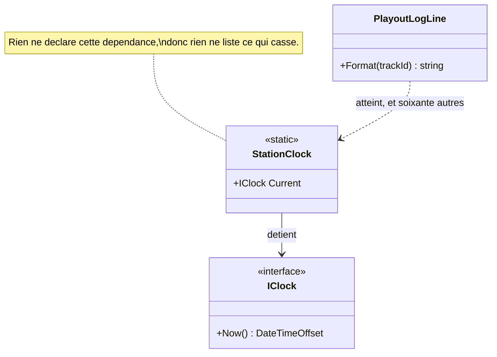

# Ambient Context

🌍 🇫🇷 Français (ce fichier) · 🇬🇧 [English](AmbientContext-en.md)

## Intention

Ambient Context expose une dépendance à travers un point d'accès statique que n'importe quel code peut
atteindre, de sorte qu'elle n'est passée à personne et disponible pour tout le monde. Le livre le nomme comme
un anti-patron — et l'avait nommé comme un patron huit ans plus tôt.

## Problème

Tout, à la station, a besoin de l'heure, et pendant neuf ans tout l'a obtenue d'une seule propriété
statique :

```csharp
public static class StationClock {
    public static IClock Current { get; set; } = new SystemClock();
}
```

Elle est atteinte depuis soixante et un endroits, et l'horloge du gardien d'émission — injectée par son
constructeur, à dessein, après l'incident de l'émission en extérieur — est l'exception plutôt que la règle.

Ce que cela a coûté est apparu dans les tests. Figer l'horloge pour un test la figeait pour tout ce qui
tournait à côté : les tests de grille ont dû s'exécuter en séquence, et la suite est passée de quarante
secondes à quatre minutes. Personne n'a fait le lien pendant un an.

## Solution

Il n'y a pas de solution ici ; c'est l'anti-patron dans la lecture de 2019. Ce que l'annotation consigne est
un fait sur ce qui peut être su.

Ce qui dépend d'un contexte ambiant ne le dit nulle part. Deux classes qui emploient l'heure et deux qui n'ont
besoin de rien sont identiques vues de l'extérieur : il n'existe donc aucune liste de ce qui casse quand il
change — et le seul moyen de trouver les soixante et un sites d'appel est de chercher le nom.

Le remède du livre est d'injecter la dépendance : le gardien d'émission le fait déjà, et c'est la seule
classe dont un test peut figer une horloge sans affecter quoi que ce soit d'autre.

## Structure



Un seul des soixante et un consommateurs est dessiné, et c'est le propos : tous seraient des flèches
pointillées venant de classes dont les signatures ne mentionnent rien.

## Les rôles

| Rôle | Annotation | S'applique à | Ce qu'il porte |
|---|---|---|---|
| AmbientContext | `[AmbientContext]` | classe, propriété, champ | Le point d'accès statique par lequel la dépendance est atteinte. |

Un seul rôle, et trois cibles. L'exemple la place sur la **propriété**, non sur la classe, et la raison est la
définition du patron : un `StationClock` injecté serait une dépendance ordinaire, et c'est `Current` qui
permet à n'importe quoi de l'atteindre.

## L'exemple

Extrait de [`AmbientContextUsage.cs`](../../../../DesignPatternCatalog.Usage/DependencyInjection/AmbientContextUsage.cs).

```csharp
public static class StationClock {

    [AmbientContext]
    public static IClock Current { get; set; } = new SystemClock();

}
```

Statique, modifiable, et dotée d'un défaut. Chacun des trois fait des dégâts. Statique veut dire que personne
n'a à la déclarer ; modifiable veut dire qu'un test peut la remplacer et que n'importe quoi d'autre aussi ; et
le défaut fonctionnel veut dire qu'un consommateur qui n'a jamais pensé à l'horloge en a une quand même, si
bien que la dépendance n'est jamais remarquée.

L'annotation siège sur la propriété plutôt que sur la classe, et l'exemple dit pourquoi : c'est le point
d'accès qui la rend ambiante.

```csharp
public sealed class PlayoutLogLine {

    public string Format(string trackId) {
        return $"{StationClock.Current.Now():HH:mm:ss} {trackId}";
    }

}
```

L'un des soixante et un, et l'exemple prend soin de le présenter comme *un exemple honnête de la raison pour
laquelle ils ont été écrits ainsi*. Atteindre l'horloge ici fait une ligne ; la prendre en paramètre
obligerait à la faire passer par quatre appelants, dont aucun n'en a besoin.

C'est le marché que propose le contexte ambiant, et c'en est un vrai — d'où le fait que l'entrée consigne la
forme au lieu de faire la morale.

### L'auteur a changé d'avis, et le catalogue suit l'édition

Bon à savoir sur celui-ci : **le même auteur l'appelait un patron dans l'édition de 2011 et le classe parmi
les anti-patrons dans celle de 2019.**

Le catalogue suit l'édition de 2019, et c'est exactement pourquoi
l'[ADR-0037](../../for-maintainers/adr/0037-admit-the-dependency-injection-catalogue.fr.md) nomme l'édition
plutôt que l'œuvre. Un lecteur qui a la première édition en main trouvera cette entrée classée contre ce que
dit son exemplaire, et le record est l'endroit où cela s'explique.

## Possibilités d'application

L'édition de 2019 ne donne aucune circonstance où elle le recommande. Celle de 2011 en donnait, et ce guide ne
les importe pas — le catalogue suit une édition, et emprunter l'applicabilité de l'autre produirait une page
qu'aucun des deux auteurs ne signerait.

Ce qui peut être énoncé, c'est le marché que nomme l'exemple, qui est un fait sur l'alternative et non une
recommandation : **atteindre un point d'accès statique coûte une ligne là où injecter coûterait un paramètre
à chaque appelant intermédiaire.** C'est pourquoi soixante et un existent dans du code dont personne n'a été
négligent.

## Quand ne pas l'utiliser

**Ne l'employez pas pour quoi que ce soit qu'un test doive contrôler.** C'est le coût que la station a
réellement payé : une dépendance remplacée globalement ne peut pas l'être par test, si bien que les tests qui
y touchent doivent s'exécuter en séquence. Quarante secondes sont devenues quatre minutes, et la cause a pris
un an à trouver.

**Ne l'employez pas là où vous devez savoir ce qui en dépend.** Rien ne déclare une dépendance ambiante : la
liste des classes affectées n'existe pas et ne peut être produite qu'en cherchant le nom.

**Ne l'employez pas dans une bibliothèque.** Un point d'accès statique dans une bibliothèque est une variable
globale que vos consommateurs héritent sans l'avoir demandée, et deux consommateurs dans un même processus ne
peuvent pas en avoir deux différents.

**Ne l'employez pas parce qu'injecter est fastidieux.** Faire passer une horloge par quatre appelants est le
coût honnête de la conception honnête, et l'exemple admet la tentation au lieu de la nier.

**Ne lui donnez pas un défaut fonctionnel pour ensuite compter sur le défaut.** Le défaut est ce qui rend la
dépendance invisible : un consommateur qui n'a jamais envisagé l'horloge en a une quand même, si bien que
personne ne découvre jamais qu'il aurait fallu y penser.

## Avantages

L'édition de 2019 n'en énumère aucun, et ce guide n'importera pas ceux de l'édition de 2011. Deux faits
tiennent debout seuls : un consommateur n'a besoin d'aucun paramètre, et un appelant intermédiaire n'a besoin
de rien savoir d'une dépendance dont il ne se sert pas. Les deux sont réels, les deux expliquent la
propagation de la forme, et aucun n'est proposé ici comme recommandation.

## Inconvénients

* Rien ne déclare la dépendance : ce qui casse quand elle change ne peut pas être listé.
* La remplacer pour un test la remplace pour tout ce qui tourne à côté, ce qui force des tests séquentiels.
* Deux classes qui en dépendent et deux qui n'ont besoin de rien sont indiscernables de l'extérieur.
* Elle est modifiable de partout : n'importe quel code peut changer ce que tout le reste voit.
* Un défaut fonctionnel masque complètement la dépendance : elle n'est jamais une décision que quelqu'un a
  prise.

## Liens avec les autres patrons

**`ConstructorInjection`** est le remède, et le gardien d'émission est l'unique exemple, à la station, de son
application à l'horloge.

**`PropertyInjection`** est ce vers quoi on se tourne souvent à la place de ceci, et cela coûte beaucoup moins
cher : une dépendance optionnelle sur une classe plutôt qu'une variable globale atteignable de partout.

**`ServiceLocator`** est l'anti-patron voisin. Les deux cachent la dépendance au contrat ; le locator passe au
moins un registre, celui-ci ne passe rien.

**`SingletonLifestyle`** est ce à quoi un contexte ambiant ressemble sans en être : un singleton est enregistré
et injecté, et ses consommateurs le déclarent.

## Source

*Dependency Injection Principles, Practices, and Patterns*, Steven van Deursen et Mark Seemann, Manning,
2019 — chapitre 5, les anti-patrons d'injection.

La première édition de 2011, *Dependency Injection in .NET* de Mark Seemann, le présente comme un patron. Le
catalogue suit l'édition de 2019, ce qui est la raison pour laquelle l'ADR-0037 nomme une édition et non une
œuvre.

* [Entrée d'index](../../../generated/catalog-index.md#ambientcontext-dependency-injection-principles-practices-and-patterns)
* [Attribut généré](../../../../DesignPatternCatalog.DependencyInjection/AmbientContext.cs)
* [Exemple](../../../../DesignPatternCatalog.Usage/DependencyInjection/AmbientContextUsage.cs)
