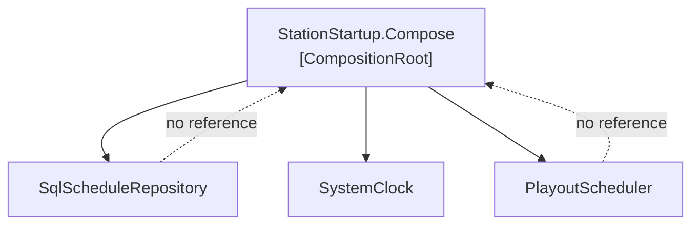

# Composition Root

🌍 🇬🇧 English (this file) · 🇫🇷 [Français](CompositionRoot-fr.md)

## Intent

Composition Root assembles the application's object graph in one location as close as possible to its
entry point, so that everything else is composed rather than composing.

## Problem

A community radio station's playout system: schedules, jingles, royalty returns to the collecting society,
and a transmitter that must never be handed silence.

It grew a container, and then the container grew into the code:

```csharp
public sealed class ScheduleEditor {
    public void Open(DateOnly day) {
        IScheduleRepository schedules = Container.Resolve<IScheduleRepository>();
        …
    }
}
```

A resolve call appeared in the schedule editor because a dependency was awkward to reach; another in the
royalty report because the first one had made it look normal. By the time anybody counted there were
nineteen, in eleven classes, and nothing could be constructed in a test without standing up the whole
container.

## Solution

The pattern puts the composing in one place.

The object graph is assembled at a single location, as close to the application's entry point as it goes.
Everything else receives what it needs and composes nothing, which is what lets each class be built in a
test with three lines and no container at all.

There is one composition root per application, however large the application grows — the rule is one per
application, not one per feature. A library has none, because composing is the application's decision and
a library that composes has taken it away from its host.

## Structure



Every arrow of construction leaves the root and none returns. The dashed non-references are the pattern:
no module below knows the root exists.

## The roles

| Role | Annotation | Applies to | What it carries |
|---|---|---|---|
| CompositionRoot | `[CompositionRoot]` | class, method | The one place where the application's modules are put together, and the only place a DI container may be referenced. |

One role, not repeatable, and applicable to a class or to a method — the difference between a startup type
whose whole job is composing and one method inside a larger entry point.

## The example

From [`CompositionRootUsage.cs`](../../../../DesignPatternCatalog.Usage/DependencyInjection/CompositionRootUsage.cs).

```csharp
public static class StationStartup {

    [CompositionRoot]
    public static PlayoutScheduler Compose(string scheduleConnectionString) {
        // Pure DI here — no container — because the graph is small enough to read. The annotation is
        // about where composition happens, not about what does it.
        IScheduleRepository schedules = new SqlScheduleRepository(scheduleConnectionString);
        IClock              clock     = new SystemClock();

        return new PlayoutScheduler(schedules, clock);
    }

}
```

Three lines of composition, and no container anywhere. That is worth noticing: the pattern is about *where*
composition happens, not about what performs it. The book calls composition by hand **Pure DI**, and a
graph small enough to read is a legitimate reason to have no container at all.

The nineteen resolve calls became zero, and the rule that keeps them there is checkable by a build: no
assembly but this one references the container package.

```csharp
public sealed class PlayoutScheduler {

    private readonly IScheduleRepository _schedules;
    private readonly IClock              _clock;

    public PlayoutScheduler(IScheduleRepository schedules, IClock clock) {
        _schedules = schedules;
        _clock     = clock;
    }

    public string NowPlaying() {
        return _schedules.WhatIsOnAt(_clock.Now()) ?? "Sustaining Service";
    }

}
```

What the root makes possible, read from the other end. This class takes what it needs and knows nothing
about how it was obtained — so a test builds it with two fakes and no infrastructure.

The sample's remark states the scope rule twice, and both halves matter. There is **one** of these for the
station, and there would be one however large the station grew. And the playout library that ships to the
two relay stations has **none**, on purpose: composing is the application's decision, and a library that
composes has taken it away from its host.

## Applicability

**Compose the object graph in a single location, as close as possible to the application's entry point.**

**Have exactly one composition root per application**, not one per feature or per module.

**Reference the DI container only from the composition root**, if a container is used at all.

**Do not give a library a composition root.** The book is explicit that composition is the application's
responsibility: a reusable library composes nothing, because its host is the one that gets to decide.

## When not to use it

**Do not put one in a library.** This is the book's own restriction, and it is the misuse that costs a
consumer the most: a library that composes forces its host's choices, and the host has no seam left to
change them.

**Do not have more than one.** Two roots in one application means two places where the graph is decided,
and a class wired differently in each — which is the same failure the nineteen resolve calls were, in a
tidier costume.

**Do not read it as *use a container*.** A container is one way to compose and the pattern is indifferent
to it. Where the graph is small enough to read, Pure DI is simpler and gives a compile error rather than a
run-time resolution failure.

**Do not expect it to be small forever.** In a large application the root is genuinely large, and the book
accepts that; splitting it into per-module methods called from one place keeps it readable without giving
up the single location.

## Advantages

* Composition happens in one place, so what depends on what can be read rather than searched for.
* Every other class becomes constructible in a test with no container.
* A container reference in any other assembly becomes a build-checkable violation.
* A change of implementation is a change in one file.

## Drawbacks

* The root grows with the application, and a large graph in one method is hard to read even when it is
  correct.
* Everything the application needs must be reachable from the entry point, which occasionally forces a
  parameter through a layer that has no use for it.
* Nothing in the language enforces the single location: the annotation records it, and only a rule over the
  annotation refuses the second one.

## Relations with other patterns

**`ConstructorInjection`** is what the root calls. The two are the pattern's two halves: classes declare
what they need, and the root supplies it.

**`ControlFreak`** is what the root replaces — a class that constructs its own dependencies is one the root
cannot compose.

**`ServiceLocator`** is the shape the nineteen resolve calls had, and what the root exists to remove.

**`SingletonLifestyle`**, **`ScopedLifestyle`** and **`TransientLifestyle`** are decided in the root: it is
the place where each class's lifetime is chosen, and where the mismatch between two of them is created.

## Source

*Dependency Injection Principles, Practices, and Patterns*, Steven van Deursen and Mark Seemann, Manning,
2019 — chapter 4, DI patterns (and chapter 7, which treats composition roots at length).

* [Index entry](../../../generated/catalog-index.md#compositionroot-dependency-injection-principles-practices-and-patterns)
* [Generated attribute](../../../../DesignPatternCatalog.DependencyInjection/CompositionRoot.cs)
* [Example](../../../../DesignPatternCatalog.Usage/DependencyInjection/CompositionRootUsage.cs)
