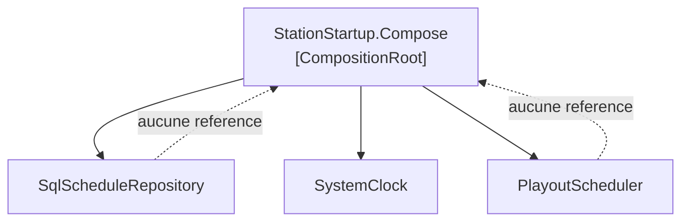

# Composition Root

🌍 🇫🇷 Français (ce fichier) · 🇬🇧 [English](CompositionRoot-en.md)

## Intention

Composition Root assemble le graphe d'objets de l'application en un seul endroit, aussi près que possible
de son point d'entrée, de sorte que tout le reste soit composé au lieu de composer.

## Problème

Le système de diffusion d'une radio associative : grilles de programmes, jingles, déclarations de droits à
la société de perception, et un émetteur à qui il ne faut jamais donner du silence.

Il s'est doté d'un conteneur, puis le conteneur a poussé dans le code :

```csharp
public sealed class ScheduleEditor {
    public void Open(DateOnly day) {
        IScheduleRepository schedules = Container.Resolve<IScheduleRepository>();
        …
    }
}
```

Un appel de résolution est apparu dans l'éditeur de grille parce qu'une dépendance était pénible à
atteindre ; un autre dans l'état des droits, parce que le premier avait rendu la chose normale. Quand
quelqu'un les a comptés, il y en avait dix-neuf, dans onze classes, et plus rien ne pouvait être construit
dans un test sans monter le conteneur entier.

## Solution

Le patron met la composition à un seul endroit.

Le graphe d'objets est assemblé en un lieu unique, aussi près du point d'entrée de l'application que
possible. Tout le reste reçoit ce dont il a besoin et ne compose rien, ce qui permet de bâtir chaque classe
dans un test en trois lignes et sans conteneur.

Il y a une racine de composition par application, quelle que soit sa taille — la règle est une par
application, non une par fonctionnalité. Une bibliothèque n'en a aucune, parce que composer est la décision
de l'application, et qu'une bibliothèque qui compose la lui a retirée.

## Structure



Toutes les flèches de construction partent de la racine et aucune n'y revient. Les non-références en
pointillé sont le patron : aucun module en dessous ne sait que la racine existe.

## Les rôles

| Rôle | Annotation | S'applique à | Ce qu'il porte |
|---|---|---|---|
| CompositionRoot | `[CompositionRoot]` | classe, méthode | L'unique endroit où les modules de l'application sont assemblés, et le seul où un conteneur d'injection puisse être référencé. |

Un seul rôle, non répétable, applicable à une classe ou à une méthode — la différence entre un type de
démarrage dont tout le métier est de composer et une méthode au sein d'un point d'entrée plus vaste.

## L'exemple

Extrait de [`CompositionRootUsage.cs`](../../../../DesignPatternCatalog.Usage/DependencyInjection/CompositionRootUsage.cs).

```csharp
public static class StationStartup {

    [CompositionRoot]
    public static PlayoutScheduler Compose(string scheduleConnectionString) {
        // Pure DI here — no container — because the graph is small enough to read. The annotation is
        // about where composition happens, not about what does it.
        IScheduleRepository schedules = new SqlScheduleRepository(scheduleConnectionString);
        IClock              clock     = new SystemClock();

        return new PlayoutScheduler(schedules, clock);
    }

}
```

Trois lignes de composition, et pas de conteneur. Cela mérite d'être remarqué : le patron porte sur *où* la
composition a lieu, non sur ce qui l'effectue. Le livre appelle la composition à la main **Pure DI**, et un
graphe assez petit pour se lire est une raison légitime de n'avoir aucun conteneur.

Les dix-neuf appels de résolution sont devenus zéro, et la règle qui les y maintient est contrôlable par la
compilation : aucune assembly hors celle-ci ne référence le paquet du conteneur.

```csharp
public sealed class PlayoutScheduler {

    private readonly IScheduleRepository _schedules;
    private readonly IClock              _clock;

    public PlayoutScheduler(IScheduleRepository schedules, IClock clock) {
        _schedules = schedules;
        _clock     = clock;
    }

    public string NowPlaying() {
        return _schedules.WhatIsOnAt(_clock.Now()) ?? "Sustaining Service";
    }

}
```

Ce que la racine rend possible, lu depuis l'autre bout. Cette classe prend ce dont elle a besoin et ne sait
rien de la façon dont elle l'a obtenu — un test la bâtit donc avec deux doublures et aucune infrastructure.

La remarque de l'exemple énonce deux fois la règle de portée, et les deux moitiés comptent. Il y en a
**une** pour la station, et il y en aurait une quelle que soit la taille prise par la station. Et la
bibliothèque de diffusion livrée aux deux relais n'en a **aucune**, à dessein : composer est la décision de
l'application, et une bibliothèque qui compose l'a retirée à son hôte.

## Possibilités d'application

**Composez le graphe d'objets en un lieu unique, aussi près que possible du point d'entrée de
l'application.**

**N'ayez qu'une racine de composition par application**, non une par fonctionnalité ou par module.

**Ne référencez le conteneur d'injection que depuis la racine de composition**, si un conteneur est employé.

**Ne donnez pas de racine de composition à une bibliothèque.** Le livre est explicite : la composition est
la responsabilité de l'application ; une bibliothèque réutilisable ne compose rien, parce que c'est son hôte
qui décide.

## Quand ne pas l'utiliser

**N'en mettez pas dans une bibliothèque.** C'est la restriction propre du livre, et c'est le mésusage qui
coûte le plus cher à un consommateur : une bibliothèque qui compose impose les choix de son hôte, et l'hôte
n'a plus de prise pour en changer.

**N'en ayez pas plus d'une.** Deux racines dans une application, ce sont deux endroits où le graphe est
décidé, et une classe câblée différemment dans chacun — soit le même échec que les dix-neuf appels de
résolution, en tenue plus propre.

**Ne lisez pas cela comme *employez un conteneur*.** Un conteneur est une façon de composer et le patron y
est indifférent. Là où le graphe est assez petit pour se lire, Pure DI est plus simple et donne une erreur
de compilation plutôt qu'un échec de résolution à l'exécution.

**N'attendez pas qu'elle reste petite.** Dans une grande application la racine est réellement grande, et le
livre l'accepte ; la scinder en méthodes par module appelées depuis un seul endroit la garde lisible sans
renoncer au lieu unique.

## Avantages

* La composition a lieu à un seul endroit : ce qui dépend de quoi se lit au lieu de se chercher.
* Toutes les autres classes deviennent constructibles dans un test sans conteneur.
* Une référence au conteneur dans toute autre assembly devient une violation contrôlable par la
  compilation.
* Un changement d'implémentation est un changement dans un fichier.

## Inconvénients

* La racine grossit avec l'application, et un grand graphe dans une méthode est difficile à lire même
  lorsqu'il est correct.
* Tout ce dont l'application a besoin doit être atteignable depuis le point d'entrée, ce qui force parfois
  un paramètre à traverser une couche qui n'en fait rien.
* Rien dans le langage n'impose le lieu unique : l'annotation le consigne, et seule une règle portant sur
  elle refuse la seconde.

## Liens avec les autres patrons

**`ConstructorInjection`** est ce que la racine appelle. Les deux sont les deux moitiés du patron : les
classes déclarent ce dont elles ont besoin, la racine le fournit.

**`ControlFreak`** est ce que la racine remplace — une classe qui construit ses propres dépendances est une
classe que la racine ne peut pas composer.

**`ServiceLocator`** est la forme qu'avaient les dix-neuf appels de résolution, et ce que la racine existe
pour retirer.

**`SingletonLifestyle`**, **`ScopedLifestyle`** et **`TransientLifestyle`** sont décidés dans la racine :
c'est l'endroit où la durée de vie de chaque classe est choisie, et où se crée la discordance entre deux
d'entre elles.

## Source

*Dependency Injection Principles, Practices, and Patterns*, Steven van Deursen et Mark Seemann, Manning,
2019 — chapitre 4, les patrons d'injection (et chapitre 7, qui traite longuement des racines de
composition).

* [Entrée d'index](../../../generated/catalog-index.md#compositionroot-dependency-injection-principles-practices-and-patterns)
* [Attribut généré](../../../../DesignPatternCatalog.DependencyInjection/CompositionRoot.cs)
* [Exemple](../../../../DesignPatternCatalog.Usage/DependencyInjection/CompositionRootUsage.cs)
