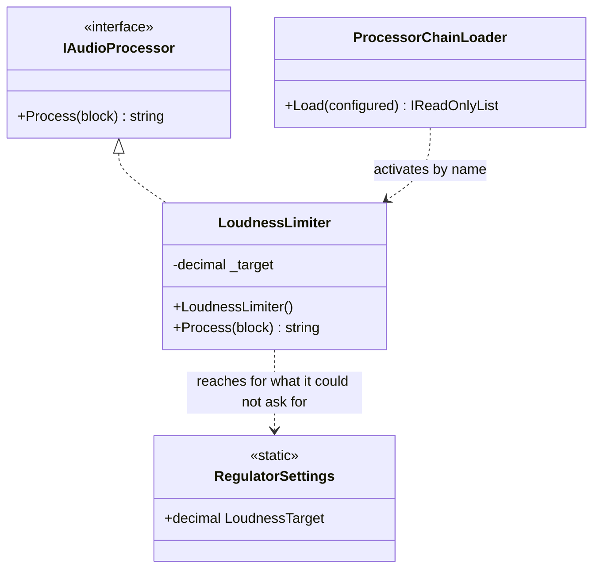

# Constrained Construction

🌍 🇬🇧 English (this file) · 🇫🇷 [Français](ConstrainedConstruction-fr.md)

## Intent

Constrained Construction requires every implementation of an abstraction to offer a particular constructor
signature, so that something outside can create them all the same way. The book names it as an anti-pattern.

## Problem

The station's audio processors — the compressor, the de-esser, the loudness limiter the regulator requires —
are loaded by name from a configuration file, so that the engineer can reorder the chain without a
deployment.

```csharp
chain.Add((IAudioProcessor)Activator.CreateInstance(processor)!);
```

`Activator.CreateInstance` means every processor must have a parameterless constructor, which means none of
them can declare what it needs.

The limiter needs the regulator's current loudness target, which changes twice a year. It gets it from a
static, because its constructor is not allowed to ask for it.

## Solution

There is no solution here; this is the anti-pattern. What the annotation does is put the constraint where the
constraint lands.

The constructor is the declaration a reader consults to learn what a class needs. When its signature is
imposed from outside, its emptiness stops being evidence: reading it tells you nothing, which is precisely
the problem. The annotation says so at the constructor, rather than leaving the answer three files away.

The book's remedy, where the loader can be changed, is to have it call something that can supply arguments —
a factory, or a container that resolves the type rather than activating it.

## Structure



The last arrow is the consequence. The dependency does not vanish because the constructor cannot declare it;
it arrives by another route, and that route is invisible in the signature.

## The roles

| Role | Annotation | Applies to | What it carries |
|---|---|---|---|
| ConstrainedConstruction | `[ConstrainedConstruction]` | constructor | A constructor whose signature is imposed from outside rather than chosen to declare what the class needs. |

One role, and it sits on the **constructor** because that is the declaration the constraint lands on. The
loader that imposes it is not annotated — the sample says so explicitly, and the reason is that the loader is
ordinary reflection doing what it was asked to do.

## The example

From [`ConstrainedConstructionUsage.cs`](../../../../DesignPatternCatalog.Usage/DependencyInjection/ConstrainedConstructionUsage.cs).

```csharp
public sealed class LoudnessLimiter : IAudioProcessor {

    private readonly decimal _target;

    [ConstrainedConstruction]
    public LoudnessLimiter() {
        _target = RegulatorSettings.LoudnessTarget;
    }

    public string Process(string block) {
        return $"{block}@{_target}";
    }

}
```

A parameterless constructor that reads a static. The sample's remark states the reading that matters:
parameterless **because the loader requires it, not because this class needs nothing.**

The honest reading of this constructor is *the dependencies arrive by another route*, which no signature
anywhere states. Annotating it is what makes the loader's constraint visible from the class it constrains —
without it, a reader wonders why a class with an obvious dependency declares none, and the answer is three
files away.

```csharp
public static class RegulatorSettings {

    public static decimal LoudnessTarget { get; set; } = -23.0m;

}
```

The other route, and it is an [Ambient Context](AmbientContext-en.md). That is the usual pairing: a
constrained constructor cannot receive, so something static has to be reachable, and one anti-pattern
produces the other.

```csharp
public sealed class ProcessorChainLoader {

    public IReadOnlyList<IAudioProcessor> Load(IEnumerable<Type> configured) {
        List<IAudioProcessor> chain = new List<IAudioProcessor>();
        foreach (Type processor in configured) {
            chain.Add((IAudioProcessor)Activator.CreateInstance(processor)!);
        }

        return chain;
    }

}
```

The participant that imposes the constraint, deliberately unannotated. The entry holds one role, on the
constructor, because that is where the cost is borne — and the loader is doing exactly what late binding
looks like when it works.

## Applicability

The book gives no circumstances under which it recommends this. What it does acknowledge, and what the sample
is built on, is that the constraint often comes from something you did not write:

**The shape appears where a serializer, a framework or a late-binding loader instantiates the type.** The
engineer's ability to reorder the chain without a deployment is a real requirement, and
`Activator.CreateInstance` is what delivers it.

**Annotate it so the emptiness of the constructor is not read as evidence.** That is the whole of what the
annotation adds: a reader who meets a parameterless constructor on a class with obvious dependencies learns
here that the signature was imposed.

## When not to use it

**Do not impose it where you control the loader.** If the code that instantiates can be changed, have it call
something that supplies arguments. The constraint exists because `Activator.CreateInstance` was chosen, and
choosing differently removes it.

**Do not read the empty constructor as a design.** This is the misreading the annotation exists against: the
class has dependencies, and they are worse for being undeclared.

**Do not accept it for an abstraction you are designing now.** An interface whose implementations must all
offer the same constructor signature has put a requirement in a place C# cannot express — the book's point is
that the constraint is not part of the contract and cannot be.

**Do not annotate the loader.** The constraint lands on the constructor, and marking both would say the
reflection is the defect. It is not; it is what was asked for.

## Advantages

The book lists none, and this guide will not invent any. What is true is that late binding delivers something
real — the engineer reorders the processing chain by editing a configuration file, with no deployment — and
the parameterless constructor is the price that mechanism charges. That is a fact about the mechanism, not an
argument for the shape.

## Drawbacks

* The constructor declares nothing, so a reader cannot learn what the class needs from the one place they
  would look.
* The dependencies arrive by another route, usually a static one, so the class acquires a second
  anti-pattern.
* The constraint is not expressible in C#, so nothing checks that an implementation offers the signature
  until it is activated and throws.
* A new dependency cannot be declared, so it has to be smuggled — and the next one after that too.

## Relations with other patterns

**`ConstructorInjection`** is what the constraint forbids, and what the class would declare if it could.

**`AmbientContext`** is where the dependency actually comes from, in this sample and usually. The two
anti-patterns travel together.

**`ControlFreak`** is the neighbouring case where the class chose to construct its own dependency; here it had
no choice, which is why the annotation is different.

**`ServiceLocator`** is the other route out of a constrained constructor: rather than reaching a static, the
class asks a registry.

## Source

*Dependency Injection Principles, Practices, and Patterns*, Steven van Deursen and Mark Seemann, Manning,
2019 — chapter 5, DI anti-patterns.

* [Index entry](../../../generated/catalog-index.md#constrainedconstruction-dependency-injection-principles-practices-and-patterns)
* [Generated attribute](../../../../DesignPatternCatalog.DependencyInjection/ConstrainedConstruction.cs)
* [Example](../../../../DesignPatternCatalog.Usage/DependencyInjection/ConstrainedConstructionUsage.cs)
