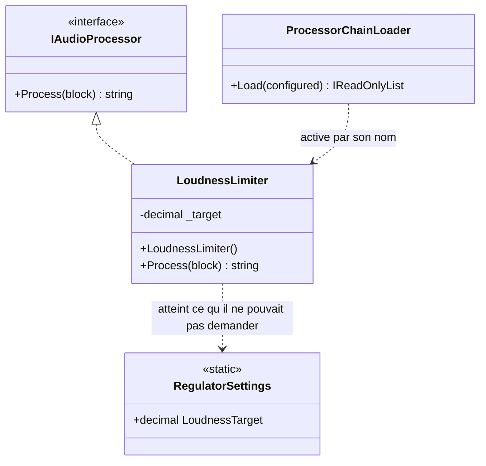

# Constrained Construction

🌍 🇫🇷 Français (ce fichier) · 🇬🇧 [English](ConstrainedConstruction-en.md)

## Intention

Constrained Construction exige de toute implémentation d'une abstraction qu'elle offre une signature de
constructeur particulière, pour que quelque chose d'extérieur puisse les créer toutes de la même façon. Le
livre le nomme comme un anti-patron.

## Problème

Les processeurs audio de la station — le compresseur, le dé-esseur, le limiteur de sonie qu'exige le
régulateur — sont chargés par leur nom depuis un fichier de configuration, pour que l'ingénieur puisse
réordonner la chaîne sans déploiement.

```csharp
chain.Add((IAudioProcessor)Activator.CreateInstance(processor)!);
```

`Activator.CreateInstance` veut dire que tout processeur doit avoir un constructeur sans paramètre, ce qui
veut dire qu'aucun ne peut déclarer ce dont il a besoin.

Le limiteur a besoin de la cible de sonie en vigueur chez le régulateur, qui change deux fois par an. Il
l'obtient d'une variable statique, parce que son constructeur n'a pas le droit de la demander.

## Solution

Il n'y a pas de solution ici ; c'est l'anti-patron. Ce que fait l'annotation, c'est placer la contrainte là où
la contrainte retombe.

Le constructeur est la déclaration qu'un lecteur consulte pour apprendre ce dont une classe a besoin. Quand sa
signature est imposée de l'extérieur, sa vacuité cesse d'être une preuve : le lire n'apprend rien, ce qui est
précisément le problème. L'annotation le dit au constructeur, au lieu de laisser la réponse à trois fichiers
de là.

Le remède du livre, là où le chargeur peut être changé, est de lui faire appeler quelque chose qui sache
fournir des arguments — une fabrique, ou un conteneur qui résout le type au lieu de l'activer.

## Structure



La dernière flèche est la conséquence. La dépendance ne s'évanouit pas parce que le constructeur ne peut pas la
déclarer ; elle arrive par un autre chemin, et ce chemin est invisible dans la signature.

## Les rôles

| Rôle | Annotation | S'applique à | Ce qu'il porte |
|---|---|---|---|
| ConstrainedConstruction | `[ConstrainedConstruction]` | constructeur | Un constructeur dont la signature est imposée de l'extérieur plutôt que choisie pour déclarer ce dont la classe a besoin. |

Un seul rôle, et il siège sur le **constructeur** parce que c'est la déclaration sur laquelle la contrainte
retombe. Le chargeur qui l'impose n'est pas annoté — l'exemple le dit explicitement, et la raison est que le
chargeur est de la réflexion ordinaire qui fait ce qu'on lui a demandé.

## L'exemple

Extrait de [`ConstrainedConstructionUsage.cs`](../../../../DesignPatternCatalog.Usage/DependencyInjection/ConstrainedConstructionUsage.cs).

```csharp
public sealed class LoudnessLimiter : IAudioProcessor {

    private readonly decimal _target;

    [ConstrainedConstruction]
    public LoudnessLimiter() {
        _target = RegulatorSettings.LoudnessTarget;
    }

    public string Process(string block) {
        return $"{block}@{_target}";
    }

}
```

Un constructeur sans paramètre qui lit une variable statique. La remarque de l'exemple énonce la lecture qui
compte : sans paramètre **parce que le chargeur l'exige, non parce que cette classe n'a besoin de rien.**

La lecture honnête de ce constructeur est *les dépendances arrivent par un autre chemin*, ce qu'aucune
signature n'énonce nulle part. L'annoter est ce qui rend la contrainte du chargeur visible depuis la classe
qu'elle contraint — sans elle, un lecteur se demande pourquoi une classe à dépendance évidente n'en déclare
aucune, et la réponse est à trois fichiers de là.

```csharp
public static class RegulatorSettings {

    public static decimal LoudnessTarget { get; set; } = -23.0m;

}
```

L'autre chemin, et c'est un [Ambient Context](AmbientContext-fr.md). C'est l'appariement habituel : un
constructeur contraint ne peut pas recevoir, donc il faut que quelque chose de statique soit atteignable, et
un anti-patron produit l'autre.

```csharp
public sealed class ProcessorChainLoader {

    public IReadOnlyList<IAudioProcessor> Load(IEnumerable<Type> configured) {
        List<IAudioProcessor> chain = new List<IAudioProcessor>();
        foreach (Type processor in configured) {
            chain.Add((IAudioProcessor)Activator.CreateInstance(processor)!);
        }

        return chain;
    }

}
```

Le participant qui impose la contrainte, délibérément non annoté. L'entrée porte un rôle, sur le constructeur,
parce que c'est là que le coût est supporté — et le chargeur fait exactement ce à quoi ressemble une liaison
tardive qui fonctionne.

## Possibilités d'application

Le livre ne donne aucune circonstance où il le recommande. Ce qu'il reconnaît, et sur quoi l'exemple est bâti,
c'est que la contrainte vient souvent de quelque chose que vous n'avez pas écrit :

**La forme apparaît là où un sérialiseur, un cadre technique ou un chargeur à liaison tardive instancie le
type.** La possibilité pour l'ingénieur de réordonner la chaîne sans déploiement est une exigence réelle, et
`Activator.CreateInstance` est ce qui la satisfait.

**Annotez-le pour que la vacuité du constructeur ne soit pas lue comme une preuve.** C'est tout ce qu'ajoute
l'annotation : un lecteur qui rencontre un constructeur sans paramètre sur une classe à dépendances évidentes
apprend ici que la signature a été imposée.

## Quand ne pas l'utiliser

**Ne l'imposez pas là où vous contrôlez le chargeur.** Si le code qui instancie peut être changé, faites-lui
appeler quelque chose qui fournisse des arguments. La contrainte existe parce que `Activator.CreateInstance` a
été choisi, et choisir autrement la retire.

**Ne lisez pas le constructeur vide comme une conception.** C'est la mauvaise lecture contre laquelle
l'annotation existe : la classe a des dépendances, et elles sont pires pour n'être pas déclarées.

**Ne l'acceptez pas pour une abstraction que vous concevez maintenant.** Une interface dont toutes les
implémentations doivent offrir la même signature de constructeur a mis une exigence à un endroit que C# ne sait
pas exprimer — le propos du livre est que la contrainte ne fait pas partie du contrat et ne peut pas en faire
partie.

**N'annotez pas le chargeur.** La contrainte retombe sur le constructeur, et marquer les deux dirait que la
réflexion est le défaut. Elle ne l'est pas ; c'est ce qui a été demandé.

## Avantages

Le livre n'en énumère aucun, et ce guide n'en inventera pas. Ce qui est vrai, c'est que la liaison tardive
apporte quelque chose de réel — l'ingénieur réordonne la chaîne de traitement en modifiant un fichier de
configuration, sans déploiement — et que le constructeur sans paramètre est le prix que ce mécanisme demande.
C'est un fait sur le mécanisme, non un argument pour la forme.

## Inconvénients

* Le constructeur ne déclare rien : un lecteur ne peut pas apprendre ce dont la classe a besoin au seul
  endroit où il regarderait.
* Les dépendances arrivent par un autre chemin, d'ordinaire statique : la classe acquiert un second
  anti-patron.
* La contrainte n'est pas exprimable en C# : rien ne vérifie qu'une implémentation offre la signature avant
  qu'elle soit activée et lève.
* Une nouvelle dépendance ne peut pas être déclarée : il faut la faire entrer en fraude — et celle d'après
  aussi.

## Liens avec les autres patrons

**`ConstructorInjection`** est ce que la contrainte interdit, et ce que la classe déclarerait si elle pouvait.

**`AmbientContext`** est l'endroit d'où la dépendance vient réellement, dans cet exemple et d'ordinaire. Les
deux anti-patrons voyagent ensemble.

**`ControlFreak`** est le cas voisin où la classe a choisi de construire sa propre dépendance ; ici elle
n'avait pas le choix, et c'est pourquoi l'annotation est différente.

**`ServiceLocator`** est l'autre issue d'un constructeur contraint : au lieu d'atteindre une variable statique,
la classe interroge un registre.

## Source

*Dependency Injection Principles, Practices, and Patterns*, Steven van Deursen et Mark Seemann, Manning,
2019 — chapitre 5, les anti-patrons d'injection.

* [Entrée d'index](../../../generated/catalog-index.md#constrainedconstruction-dependency-injection-principles-practices-and-patterns)
* [Attribut généré](../../../../DesignPatternCatalog.DependencyInjection/ConstrainedConstruction.cs)
* [Exemple](../../../../DesignPatternCatalog.Usage/DependencyInjection/ConstrainedConstructionUsage.cs)
