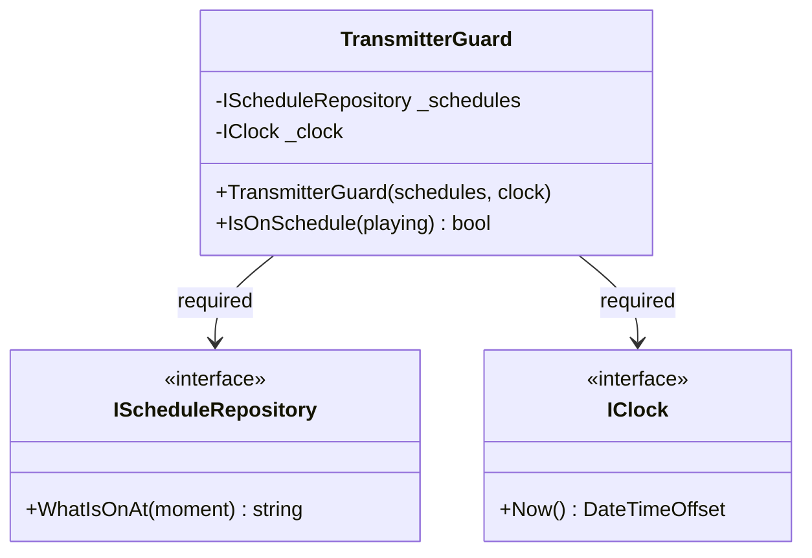

# Constructor Injection

🌍 🇬🇧 English (this file) · 🇫🇷 [Français](ConstructorInjection-fr.md)

## Intent

Constructor Injection declares the dependencies a class requires by taking them as constructor parameters,
so that an instance cannot exist without them.

## Problem

The station's transmitter guard decides, every ten seconds, whether what is going out is what should be
going out. It cannot work without the schedule and it cannot work without a clock: with either missing
there is no question for it to answer.

The version before this one took them as properties, set after construction by whoever remembered:

```csharp
public sealed class TransmitterGuard {
    public IScheduleRepository? Schedules { get; set; }
    public IClock?              Clock     { get; set; }
}
```

A new outside-broadcast path forgot the clock, and the guard compared the current programme against a
schedule read at midnight — for six days, without failing, because a null clock read as *no change to
report*.

## Solution

The pattern makes that impossible rather than unlikely.

What the class requires becomes a constructor parameter, so no instance can exist without it and no code
path anywhere can reach a half-built object. The compiler stops the caller that forgets.

The word the pattern turns on is **required**. A dependency that may legitimately be absent does not belong
here; a parameter added here is a new demand on every composition root that builds the type.

## Structure



Both arrows are required, and the constructor is the only door. There is no second way in for a caller who
has only one of the two.

## The roles

| Role | Annotation | Applies to | What it carries |
|---|---|---|---|
| ConstructorInjection | `[ConstructorInjection]` | constructor | The constructor through which a class receives what it cannot work without. |

One role, on a **constructor** rather than on a class — which is what lets a type with several constructors
say which one is the injection one.

## The example

From [`ConstructorInjectionUsage.cs`](../../../../DesignPatternCatalog.Usage/DependencyInjection/ConstructorInjectionUsage.cs).

```csharp
public sealed class TransmitterGuard {

    private readonly IScheduleRepository _schedules;
    private readonly IClock              _clock;

    [ConstructorInjection]
    public TransmitterGuard(IScheduleRepository schedules, IClock clock) {
        _schedules = schedules ?? throw new ArgumentNullException(nameof(schedules));
        _clock     = clock     ?? throw new ArgumentNullException(nameof(clock));
    }
```

Both fields are `readonly`, which is the half of the pattern the constructor makes possible: once set,
nothing can replace them, so a guard that was built correctly stays correct.

The null guards are not redundant with the parameter list. A caller can pass `null` explicitly, and the
book's *guard clause* is what turns that into a failure at construction rather than a `NullReferenceException`
in `IsOnSchedule` some hours later.

```csharp
    public bool IsOnSchedule(string whatIsActuallyPlaying) {
        string? expected = _schedules.WhatIsOnAt(_clock.Now());

        return expected is not null && expected == whatIsActuallyPlaying;
    }

}
```

No null checks on the dependencies here, and none needed. That is what the constructor bought: every method
of the class can assume both are present, which is why the class reads as a rule about schedules rather
than as a sequence of precautions.

The sample's remark makes the claim precise, and it is worth repeating because it is the one thing about
this annotation that can be got wrong. **The annotation is a claim about requirement, not about mechanism.**
A dependency that may legitimately be absent belongs on a property with a working default. And a parameter
added here is a new demand on every composition root that builds the type — the cost worth seeing before it
is paid.

## Applicability

**Use Constructor Injection when the consumer requires the dependency**, and cannot function without it.
The book makes this the default choice among the injection patterns: reach for it first, and use another
only where its condition genuinely fails.

**Use it when the same instance can serve the consumer for its whole lifetime.** A dependency that must
differ from call to call is method injection's case, not this one.

**Guard the parameters.** The book's own shape assigns to a read-only field after a null check, so a
misconstructed instance fails at construction rather than later.

## When not to use it

**Do not use it for an optional dependency.** A parameter the caller may reasonably not have is a
requirement the class does not actually have, and the class then has to tolerate a null it declared as
mandatory. The book's answer for that case is property injection with a working default.

**Do not use it for a dependency that varies per call.** The registry that changes with the collecting
society cannot be a constructor parameter without producing one instance per society, which is method
injection's whole reason for existing.

**Do not use it where the class is constructed by something you do not control.** A framework that calls a
parameterless constructor cannot supply parameters, and the shape that results is
[Constrained Construction](ConstrainedConstruction-en.md) — worth naming rather than fighting.

**Do not let the parameter list grow unchecked.** The book treats an over-long constructor as a code smell
of its own, *Constructor Over-injection*, and reads it as a sign the class has too many responsibilities
rather than as a problem with the pattern. That smell is deliberately not catalogued here
([ADR-0037](../../for-maintainers/adr/0037-admit-the-dependency-injection-catalogue.md)), so this guide
names it and does not annotate it.

## Advantages

* The dependency is required by construction: no instance of the class can exist without it.
* The class's contract states its preconditions, so a caller learns them from the signature.
* Fields can be `readonly`, so what was correct at construction stays correct.
* Every method can assume its dependencies are present, which keeps the class readable.
* A forgotten dependency is a build error, not a six-day silence.

## Drawbacks

* Every added parameter is a demand on every composition root that builds the type.
* A long parameter list is unpleasant, and reaching for a container to hide it treats the symptom.
* It cannot be used where something else constructs the type — a framework, a serializer, a plug-in host.

## Relations with other patterns

**`MethodInjection`** is the alternative when the dependency varies with the call rather than with the
instance.

**`PropertyInjection`** is the alternative when the dependency is genuinely optional and a working default
exists.

**`CompositionRoot`** is what supplies the parameters. The two patterns are the two halves of the same
arrangement.

**`ControlFreak`** is what this pattern replaces: a class that constructs its own dependency instead of
declaring it.

**`ConstrainedConstruction`** is what happens when something outside imposes the signature, and the class
can no longer declare anything.

## Source

*Dependency Injection Principles, Practices, and Patterns*, Steven van Deursen and Mark Seemann, Manning,
2019 — chapter 4, DI patterns.

* [Index entry](../../../generated/catalog-index.md#constructorinjection-dependency-injection-principles-practices-and-patterns)
* [Generated attribute](../../../../DesignPatternCatalog.DependencyInjection/ConstructorInjection.cs)
* [Example](../../../../DesignPatternCatalog.Usage/DependencyInjection/ConstructorInjectionUsage.cs)
