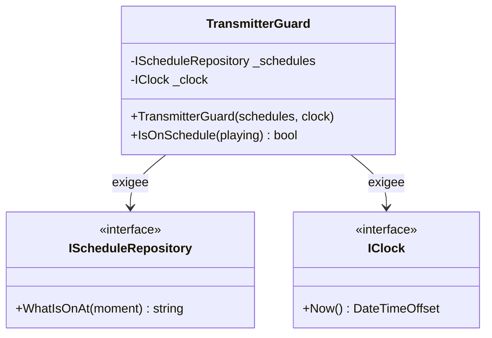

# Constructor Injection

🌍 🇫🇷 Français (ce fichier) · 🇬🇧 [English](ConstructorInjection-en.md)

## Intention

Constructor Injection déclare les dépendances qu'une classe exige en les prenant comme paramètres de
constructeur, de sorte qu'une instance ne puisse exister sans elles.

## Problème

Le gardien d'émission de la station décide, toutes les dix secondes, si ce qui sort est bien ce qui devrait
sortir. Il ne peut pas travailler sans la grille et il ne peut pas travailler sans une horloge : avec l'une
des deux manquante, il n'a plus de question à laquelle répondre.

La version précédente les prenait en propriétés, renseignées après construction par qui y pensait :

```csharp
public sealed class TransmitterGuard {
    public IScheduleRepository? Schedules { get; set; }
    public IClock?              Clock     { get; set; }
}
```

Un nouveau chemin pour les émissions en extérieur a oublié l'horloge, et le gardien a comparé le programme
en cours à une grille lue à minuit — pendant six jours, sans échouer, parce qu'une horloge nulle se lisait
comme *rien à signaler*.

## Solution

Le patron rend cela impossible plutôt qu'improbable.

Ce que la classe exige devient un paramètre de constructeur : aucune instance ne peut exister sans, et aucun
chemin d'exécution ne peut atteindre un objet à demi construit. Le compilateur arrête l'appelant qui oublie.

Le mot sur lequel repose le patron est **exigé**. Une dépendance qui peut légitimement être absente n'a pas
sa place ici ; un paramètre ajouté ici est une nouvelle exigence pour toute racine de composition qui bâtit
le type.

## Structure



Les deux flèches sont exigées, et le constructeur est la seule porte. Il n'y a pas de seconde entrée pour un
appelant qui n'aurait qu'une des deux.

## Les rôles

| Rôle | Annotation | S'applique à | Ce qu'il porte |
|---|---|---|---|
| ConstructorInjection | `[ConstructorInjection]` | constructeur | Le constructeur par lequel une classe reçoit ce sans quoi elle ne peut pas travailler. |

Un seul rôle, sur un **constructeur** et non sur une classe — ce qui permet à un type ayant plusieurs
constructeurs de dire lequel est celui de l'injection.

## L'exemple

Extrait de [`ConstructorInjectionUsage.cs`](../../../../DesignPatternCatalog.Usage/DependencyInjection/ConstructorInjectionUsage.cs).

```csharp
public sealed class TransmitterGuard {

    private readonly IScheduleRepository _schedules;
    private readonly IClock              _clock;

    [ConstructorInjection]
    public TransmitterGuard(IScheduleRepository schedules, IClock clock) {
        _schedules = schedules ?? throw new ArgumentNullException(nameof(schedules));
        _clock     = clock     ?? throw new ArgumentNullException(nameof(clock));
    }
```

Les deux champs sont `readonly`, ce qui est la moitié du patron que le constructeur rend possible : une fois
renseignés, rien ne peut les remplacer, si bien qu'un gardien correctement bâti reste correct.

Les gardes contre `null` ne sont pas redondantes avec la liste de paramètres. Un appelant peut passer `null`
explicitement, et la *clause de garde* du livre est ce qui transforme cela en échec à la construction plutôt
qu'en `NullReferenceException` dans `IsOnSchedule` quelques heures plus tard.

```csharp
    public bool IsOnSchedule(string whatIsActuallyPlaying) {
        string? expected = _schedules.WhatIsOnAt(_clock.Now());

        return expected is not null && expected == whatIsActuallyPlaying;
    }

}
```

Aucun contrôle de nullité sur les dépendances ici, et aucun nécessaire. C'est ce que le constructeur a
acheté : toutes les méthodes de la classe peuvent supposer les deux présentes, et c'est pourquoi la classe se
lit comme une règle sur les grilles plutôt que comme une suite de précautions.

La remarque de l'exemple précise la revendication, et cela mérite d'être répété parce que c'est la seule
chose que l'on puisse mal comprendre à propos de cette annotation. **L'annotation est une affirmation sur
l'exigence, non sur le mécanisme.** Une dépendance qui peut légitimement être absente appartient à une
propriété avec un défaut qui fonctionne. Et un paramètre ajouté ici est une nouvelle exigence pour toute
racine de composition qui bâtit le type — le coût qui mérite d'être vu avant d'être payé.

## Possibilités d'application

**Utilisez Constructor Injection lorsque le consommateur exige la dépendance** et ne peut pas fonctionner
sans elle. Le livre en fait le choix par défaut parmi les patrons d'injection : y recourir d'abord, et
n'employer un autre que là où sa condition échoue vraiment.

**Employez-le lorsque la même instance peut servir le consommateur toute sa vie.** Une dépendance qui doit
varier d'un appel à l'autre est le cas de l'injection par méthode, non celui-ci.

**Gardez les paramètres.** La forme propre au livre affecte un champ en lecture seule après un contrôle de
nullité, si bien qu'une instance mal construite échoue à la construction plutôt que plus tard.

## Quand ne pas l'utiliser

**Ne l'employez pas pour une dépendance optionnelle.** Un paramètre que l'appelant peut raisonnablement ne
pas avoir est une exigence que la classe n'a pas réellement, et la classe doit alors tolérer un `null`
qu'elle a déclaré obligatoire. La réponse du livre pour ce cas est l'injection par propriété avec un défaut
qui fonctionne.

**Ne l'employez pas pour une dépendance qui varie par appel.** Le registre qui change avec la société de
perception ne peut pas être un paramètre de constructeur sans produire une instance par société, ce qui est
toute la raison d'être de l'injection par méthode.

**Ne l'employez pas là où la classe est construite par quelque chose que vous ne contrôlez pas.** Un cadre
technique qui appelle un constructeur sans paramètre ne peut pas en fournir, et la forme qui en résulte est
[Constrained Construction](ConstrainedConstruction-fr.md) — qui mérite d'être nommée plutôt que combattue.

**Ne laissez pas la liste de paramètres croître sans contrôle.** Le livre traite un constructeur trop long
comme un *code smell* à part entière, *Constructor Over-injection*, et y lit le signe que la classe a trop de
responsabilités plutôt qu'un problème du patron. Ce smell n'est délibérément pas catalogué ici
([ADR-0037](../../for-maintainers/adr/0037-admit-the-dependency-injection-catalogue.fr.md)) : ce guide le
nomme et ne l'annote pas.

## Avantages

* La dépendance est exigée par construction : aucune instance de la classe ne peut exister sans elle.
* Le contrat de la classe énonce ses préconditions : un appelant les apprend de la signature.
* Les champs peuvent être `readonly`, si bien que ce qui était correct à la construction le reste.
* Toutes les méthodes peuvent supposer leurs dépendances présentes, ce qui garde la classe lisible.
* Une dépendance oubliée est une erreur de compilation, non six jours de silence.

## Inconvénients

* Chaque paramètre ajouté est une exigence pour toute racine de composition qui bâtit le type.
* Une longue liste de paramètres est déplaisante, et recourir à un conteneur pour la masquer traite le
  symptôme.
* Il est inutilisable là où autre chose construit le type — un cadre technique, un sérialiseur, un hôte de
  greffons.

## Liens avec les autres patrons

**`MethodInjection`** est la solution de rechange quand la dépendance varie avec l'appel plutôt qu'avec
l'instance.

**`PropertyInjection`** est la solution de rechange quand la dépendance est vraiment optionnelle et qu'un
défaut fonctionnel existe.

**`CompositionRoot`** est ce qui fournit les paramètres. Les deux patrons sont les deux moitiés du même
agencement.

**`ControlFreak`** est ce que ce patron remplace : une classe qui construit sa propre dépendance au lieu de
la déclarer.

**`ConstrainedConstruction`** est ce qui arrive quand quelque chose d'extérieur impose la signature, et que
la classe ne peut plus rien déclarer.

## Source

*Dependency Injection Principles, Practices, and Patterns*, Steven van Deursen et Mark Seemann, Manning,
2019 — chapitre 4, les patrons d'injection.

* [Entrée d'index](../../../generated/catalog-index.md#constructorinjection-dependency-injection-principles-practices-and-patterns)
* [Attribut généré](../../../../DesignPatternCatalog.DependencyInjection/ConstructorInjection.cs)
* [Exemple](../../../../DesignPatternCatalog.Usage/DependencyInjection/ConstructorInjectionUsage.cs)
