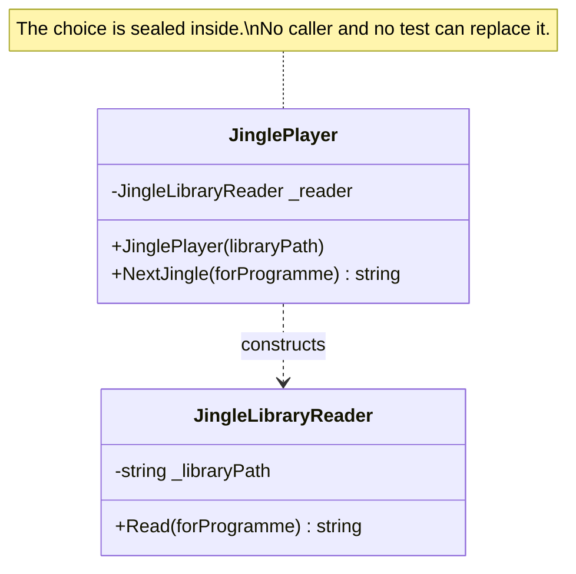

# Control Freak

🌍 🇬🇧 English (this file) · 🇫🇷 [Français](ControlFreak-fr.md)

## Intent

Control Freak is a class that creates the dependencies it uses, so that nothing outside it can choose them.
The book names it as an anti-pattern.

## Problem

The station's composition root was introduced last quarter, and eleven classes were left behind because
they construct what they use and nothing outside them can say otherwise.

```csharp
public JinglePlayer(string libraryPath) {
    _reader = new JingleLibraryReader(libraryPath);
}
```

Nobody wrote them that way on purpose; they were written before anybody asked the question. Each one works.
And each one cannot be pointed at a different jingle library by the relay stations, or at a fixture by a
test.

The problem the guide is about is not the shape. It is that there is no way to tell the eleven that were
accepted from the twelfth somebody adds next Tuesday.

## Solution

There is no solution here, because this is the anti-pattern. What the annotation does is different: it
counts.

Marking the eleven makes the build know there are eleven, and the rule becomes *no more than eleven, and
never more* — which is the only architecture rule that works on code that already exists. Without the
annotation the rule cannot be written, because the twelfth is indistinguishable from the eleven.

The book's own remedy is the migration: a constructor parameter and a line in the composition root. The
annotation is what makes the interval between deciding to migrate and having migrated survivable.

## Structure



The arrow says *constructs* rather than *depends on*, and that is the anti-pattern: a dependency arrow a
caller cannot redirect.

## The roles

| Role | Annotation | Applies to | What it carries |
|---|---|---|---|
| ControlFreak | `[ControlFreak]` | class, struct | The class that decides for itself what it depends on. |

One role. The book names three ways a class can be one — constructing the dependency, asking a factory for
it, or offering a second constructor that fills in the first's parameters — and the annotation does not
distinguish them, because the consequence is the same.

## The example

From [`ControlFreakUsage.cs`](../../../../DesignPatternCatalog.Usage/DependencyInjection/ControlFreakUsage.cs).

```csharp
[ControlFreak]
public sealed class JinglePlayer {

    private readonly JingleLibraryReader _reader;

    public JinglePlayer(string libraryPath) {
        // The dependency is chosen here, by this class, and by nobody else.
        _reader = new JingleLibraryReader(libraryPath);
    }

    public string? NextJingle(string forProgramme) {
        return _reader.Read(forProgramme);
    }

}
```

The constructor takes a `string` and produces a `JingleLibraryReader`. That is the shape: a parameter that
looks like configuration, hiding a decision about which collaborator will be used.

Two consequences follow, and the sample is explicit that the second is how it was noticed. The relay
stations cannot point it at their own library. And **a test cannot point it at a fixture** — there is no unit
test for this class, and there cannot be one without a disk.

The remark records where the migration stands, in one sentence worth copying: *it has not been done because
the class works, which is the correct reason to leave it and the wrong reason to forget it.*

The sample also states what the annotation is for, and it is worth reading against the instinct to treat
annotations as accusations:

> Annotating them is not a confession, it is a count.

And the limit of what it can do:

> It is not detection: a control freak that annotates itself is an honest one, and the one worth catching is
> the one nobody marked.

## Applicability

The book gives no circumstances under which this is the right answer. It is presented as an anti-pattern
throughout, and there is no counterpart here to the way *Domain-Driven Design* gives Smart UI a list of
advantages.

What this guide records instead is what the annotation is for, which is not the same question:

**Annotate a control freak to bound it.** A known count that a build enforces is what stops accepted debt
from growing silently.

**Annotate it to say the migration is understood and deferred**, rather than unnoticed.

## When not to use it

Since the pattern itself has no legitimate use, this section is about the annotation.

**Do not annotate instead of migrating, where migrating is cheap.** A constructor parameter and a line in
the composition root is often an hour's work. The annotation is for the case where the hour is not available
yet, not for the case where nobody wants to spend it.

**Do not annotate a class that is not one.** A class that constructs a value object, a `StringBuilder`, a
list — anything without a behavioural dependency worth substituting — is not a control freak, and marking it
inflates the count until the count means nothing.

**Do not read the annotation as approval.** It records a shape and a decision to defer. A codebase where the
count grows every quarter has an annotation doing the opposite of its job.

**Do not expect it to find them.** The annotation is written by hand, so the population it describes is the
population somebody looked at. The eleven are the ones that were found.

## Advantages

The book lists none, and this guide will not invent any. What follows is the honest reading of why the
eleven exist: writing a class that constructs what it needs is quicker in the moment, requires no
composition root, and works. That is why the shape appears in code nobody was careless about — and it is
also the whole of what can be said for it.

## Drawbacks

* Nothing outside the class can replace the dependency: not the relay stations, not a test, not a later
  requirement.
* The class is untestable in isolation, which is usually how it is discovered.
* Its real dependencies do not appear in its contract, so a reader learns them by reading the body.
* The choice is duplicated in every class that makes it, so a change of implementation is a search rather
  than an edit.

## Relations with other patterns

**`ConstructorInjection`** is the migration. Every control freak becomes one, plus a line in the composition
root.

**`CompositionRoot`** is what the class is invisible to, and what the migration makes it visible to.

**`ServiceLocator`** is the neighbouring anti-pattern: both take the choice away from the caller, one by
constructing and one by resolving.

**`ConstrainedConstruction`** is the case where the class is a control freak because it has no choice —
something outside imposes a signature that cannot declare dependencies.

**`AmbientContext`** is the third way the same information disappears from a contract.

## Source

*Dependency Injection Principles, Practices, and Patterns*, Steven van Deursen and Mark Seemann, Manning,
2019 — chapter 5, DI anti-patterns.

* [Index entry](../../../generated/catalog-index.md#controlfreak-dependency-injection-principles-practices-and-patterns)
* [Generated attribute](../../../../DesignPatternCatalog.DependencyInjection/ControlFreak.cs)
* [Example](../../../../DesignPatternCatalog.Usage/DependencyInjection/ControlFreakUsage.cs)
