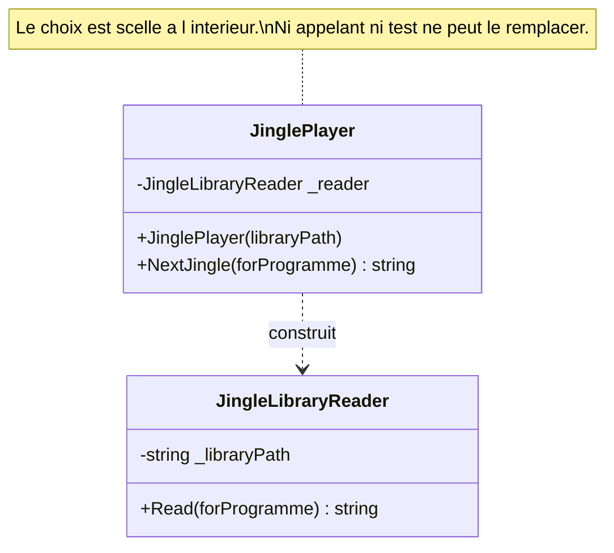

# Control Freak

🌍 🇫🇷 Français (ce fichier) · 🇬🇧 [English](ControlFreak-en.md)

## Intention

Control Freak est une classe qui crée les dépendances qu'elle emploie, si bien que rien d'extérieur ne peut
les choisir. Le livre le nomme comme un anti-patron.

## Problème

La racine de composition de la station a été introduite le trimestre dernier, et onze classes sont restées en
arrière parce qu'elles construisent ce qu'elles emploient et que rien d'extérieur ne peut en décider
autrement.

```csharp
public JinglePlayer(string libraryPath) {
    _reader = new JingleLibraryReader(libraryPath);
}
```

Personne ne les a écrites ainsi à dessein ; elles ont été écrites avant que quiconque pose la question.
Chacune fonctionne. Et aucune ne peut être pointée vers une autre bibliothèque de jingles par les relais, ni
vers une fixture par un test.

Le problème dont traite ce guide n'est pas la forme. C'est qu'il n'existe aucun moyen de distinguer les onze
qui ont été acceptées de la douzième que quelqu'un ajoutera mardi prochain.

## Solution

Il n'y a pas de solution ici, puisque c'est l'anti-patron. Ce que fait l'annotation est autre chose : elle
compte.

Marquer les onze fait savoir à la compilation qu'il y en a onze, et la règle devient *pas plus de onze, et
jamais plus* — qui est la seule règle d'architecture qui fonctionne sur du code déjà existant. Sans
l'annotation, la règle ne peut pas s'écrire, parce que la douzième est indiscernable des onze.

Le remède propre au livre est la migration : un paramètre de constructeur et une ligne dans la racine de
composition. L'annotation est ce qui rend supportable l'intervalle entre la décision de migrer et la
migration.

## Structure



La flèche dit *construit* et non *dépend de*, et c'est cela l'anti-patron : une flèche de dépendance qu'un
appelant ne peut pas rediriger.

## Les rôles

| Rôle | Annotation | S'applique à | Ce qu'il porte |
|---|---|---|---|
| ControlFreak | `[ControlFreak]` | classe, struct | La classe qui décide elle-même de ce dont elle dépend. |

Un seul rôle. Le livre nomme trois façons pour une classe d'en être une — construire la dépendance, la
demander à une fabrique, ou offrir un second constructeur qui renseigne les paramètres du premier — et
l'annotation ne les distingue pas, parce que la conséquence est la même.

## L'exemple

Extrait de [`ControlFreakUsage.cs`](../../../../DesignPatternCatalog.Usage/DependencyInjection/ControlFreakUsage.cs).

```csharp
[ControlFreak]
public sealed class JinglePlayer {

    private readonly JingleLibraryReader _reader;

    public JinglePlayer(string libraryPath) {
        // The dependency is chosen here, by this class, and by nobody else.
        _reader = new JingleLibraryReader(libraryPath);
    }

    public string? NextJingle(string forProgramme) {
        return _reader.Read(forProgramme);
    }

}
```

Le constructeur prend une `string` et produit un `JingleLibraryReader`. C'est la forme : un paramètre qui a
l'air d'une configuration, cachant une décision sur le collaborateur qui sera employé.

Deux conséquences s'ensuivent, et l'exemple dit explicitement que la seconde est celle par laquelle la chose a
été remarquée. Les relais ne peuvent pas la pointer vers leur propre bibliothèque. Et **un test ne peut pas la
pointer vers une fixture** — il n'y a pas de test unitaire pour cette classe, et il ne peut pas y en avoir
sans un disque.

La remarque consigne où en est la migration, en une phrase qui mérite d'être copiée : *elle n'a pas été faite
parce que la classe fonctionne, ce qui est la bonne raison de la laisser et la mauvaise raison de l'oublier.*

L'exemple énonce aussi à quoi sert l'annotation, et cela vaut d'être lu contre l'instinct qui prend les
annotations pour des accusations :

> Les annoter n'est pas un aveu, c'est un décompte.

Et la limite de ce qu'elle peut faire :

> Ce n'est pas de la détection : un control freak qui s'annote lui-même est un control freak honnête, et celui
> qui vaut d'être attrapé est celui que personne n'a marqué.

## Possibilités d'application

Le livre ne donne aucune circonstance où ceci serait la bonne réponse. Il est présenté comme un anti-patron
de bout en bout, et il n'y a ici aucun équivalent de la façon dont *Domain-Driven Design* dote Smart UI d'une
liste d'avantages.

Ce que ce guide consigne à la place, c'est à quoi sert l'annotation, qui n'est pas la même question :

**Annotez un control freak pour le borner.** Un décompte connu que la compilation impose est ce qui empêche
une dette acceptée de croître en silence.

**Annotez-le pour dire que la migration est comprise et différée**, plutôt que passée inaperçue.

## Quand ne pas l'utiliser

Le patron n'ayant pas d'usage légitime, cette section porte sur l'annotation.

**N'annotez pas au lieu de migrer, là où migrer est peu coûteux.** Un paramètre de constructeur et une ligne
dans la racine de composition, c'est souvent une heure de travail. L'annotation est pour le cas où l'heure
n'est pas encore disponible, non pour le cas où personne ne veut la dépenser.

**N'annotez pas une classe qui n'en est pas une.** Une classe qui construit un objet-valeur, un
`StringBuilder`, une liste — quoi que ce soit sans dépendance comportementale qui vaille d'être substituée —
n'est pas un control freak, et la marquer gonfle le décompte jusqu'à ce qu'il ne veuille plus rien dire.

**Ne lisez pas l'annotation comme une approbation.** Elle consigne une forme et une décision de différer. Une
base de code dont le décompte croît chaque trimestre a une annotation qui fait le contraire de son métier.

**N'attendez pas qu'elle les trouve.** L'annotation est écrite à la main : la population qu'elle décrit est
celle que quelqu'un a regardée. Les onze sont celles qui ont été trouvées.

## Avantages

Le livre n'en énumère aucun, et ce guide n'en inventera pas. Ce qui suit est la lecture honnête de la raison
pour laquelle les onze existent : écrire une classe qui construit ce dont elle a besoin est plus rapide sur
le moment, ne demande aucune racine de composition, et fonctionne. C'est pourquoi la forme apparaît dans du
code dont personne n'a été négligent — et c'est aussi tout ce qu'on peut dire pour elle.

## Inconvénients

* Rien d'extérieur à la classe ne peut remplacer la dépendance : ni les relais, ni un test, ni une exigence
  ultérieure.
* La classe est intestable isolément, ce qui est d'ordinaire la façon dont on la découvre.
* Ses vraies dépendances n'apparaissent pas dans son contrat : un lecteur les apprend en lisant le corps.
* Le choix est dupliqué dans chaque classe qui le fait, si bien qu'un changement d'implémentation est une
  recherche plutôt qu'une modification.

## Liens avec les autres patrons

**`ConstructorInjection`** est la migration. Chaque control freak en devient un, plus une ligne dans la racine
de composition.

**`CompositionRoot`** est ce à quoi la classe est invisible, et ce à quoi la migration la rend visible.

**`ServiceLocator`** est l'anti-patron voisin : les deux retirent le choix à l'appelant, l'un en construisant,
l'autre en résolvant.

**`ConstrainedConstruction`** est le cas où la classe est un control freak parce qu'elle n'a pas le choix —
quelque chose d'extérieur impose une signature qui ne peut déclarer aucune dépendance.

**`AmbientContext`** est la troisième façon dont la même information disparaît d'un contrat.

## Source

*Dependency Injection Principles, Practices, and Patterns*, Steven van Deursen et Mark Seemann, Manning,
2019 — chapitre 5, les anti-patrons d'injection.

* [Entrée d'index](../../../generated/catalog-index.md#controlfreak-dependency-injection-principles-practices-and-patterns)
* [Attribut généré](../../../../DesignPatternCatalog.DependencyInjection/ControlFreak.cs)
* [Exemple](../../../../DesignPatternCatalog.Usage/DependencyInjection/ControlFreakUsage.cs)
