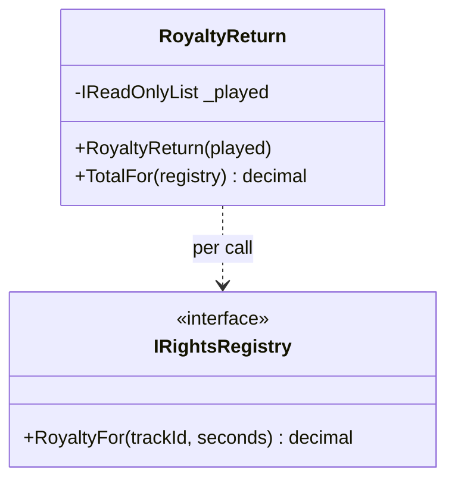

# Method Injection

🌍 🇬🇧 English (this file) · 🇫🇷 [Français](MethodInjection-fr.md)

## Intent

Method Injection supplies a dependency as a parameter of the method that uses it, so that it may differ from
one call to the next.

## Problem

Every quarter the station reports what it played to a collecting society, and which society depends on the
track: the domestic one for most of it, a different one for the two hours of imported jazz, and a third for
anything from the community archive, which charges nothing but wants the returns anyway.

The report class first took the society in its constructor:

```csharp
public RoyaltyReturn(IReadOnlyList<(string, int)> played, IRightsRegistry registry) { … }
```

which meant three report classes — then one report class built three times per quarter, with a loop outside
it that nobody could follow.

The registry is not a property of the report. It is a property of the reporting.

## Solution

The pattern puts the dependency where it actually varies.

The dependency becomes a parameter of the method that uses it, supplied by the caller at the moment of the
call. One report, three calls, and the thing that changes is visible at the point it changes.

What the pattern asserts is that the dependency belongs to the **invocation** and not to the instance. That
is also the one way to get it wrong while the code still compiles.

## Structure



The dotted arrow is the difference from constructor injection. There is no field, so there is no line from
the class to the registry that outlives a call.

## The roles

| Role | Annotation | Applies to | What it carries |
|---|---|---|---|
| MethodInjection | `[MethodInjection]` | method | The method that is handed its dependency by the caller rather than by construction. |

One role, on the method — because that is where the claim is true. A class may have one method injected and
five that are not.

## The example

From [`MethodInjectionUsage.cs`](../../../../DesignPatternCatalog.Usage/DependencyInjection/MethodInjectionUsage.cs).

```csharp
public sealed class RoyaltyReturn {

    private readonly IReadOnlyList<(string TrackId, int Seconds)> _played;

    public RoyaltyReturn(IReadOnlyList<(string TrackId, int Seconds)> played) {
        _played = played;
    }
```

What belongs to the instance is in the constructor: the quarter's play-out is a property of *this* return.
The two patterns coexist in one class, and the split between them is the modelling decision.

```csharp
    [MethodInjection]
    public decimal TotalFor(IRightsRegistry registry) {
        decimal total = 0m;
        foreach ((string trackId, int seconds) in _played) {
            total += registry.RoyaltyFor(trackId, seconds);
        }

        return total;
    }

}
```

The registry arrives, is used, and is not kept. Notice there is no field for it — and that absence is the
pattern rather than an omission.

The sample's remark names the failure exactly, and it is worth quoting because nothing detects it: **the way
to break it is to hold on to what arrives here.** Assign it to a field, cache it *to avoid passing it
around*, and the code will compile, pass its tests, and report the archive's tracks to the domestic society
for the rest of the year.

The same quarter is reported to three societies, and none of them is *the* registry for this report. That
sentence is the test for whether this pattern is the right one.

## Applicability

**Use Method Injection when the dependency can vary with each method call.** The book's condition is that
narrow, and it is what separates this from constructor injection.

**Use it when the caller is the one that knows which dependency applies.** The loop that chooses among the
three societies is outside the report, because the choice is the caller's.

**Use it where a dependency is supplied to an implementation by the framework that calls it.** The book
notes this as the common case in practice — a method that receives a context or a service it did not ask for
at construction.

## When not to use it

**Do not use it for a dependency that belongs to the instance.** A dependency the class needs on every call,
always the same one, is a constructor parameter; passing it on every call makes every caller carry knowledge
it does not need.

**Do not store what arrives.** This is the pattern's single failure mode, and it fails silently: the field
holds the first caller's dependency and every later call uses it. Nothing in C# prevents it and no test
written against one society will notice.

**Do not use it to shorten a constructor.** Moving a required dependency to a method parameter to tidy a
long parameter list moves the problem to every call site and hides the responsibility the book's
*Constructor Over-injection* smell was pointing at.

**Do not use it where the number of parameters makes the method unreadable.** A method with four injected
dependencies and two real arguments is asking to be a class.

## Advantages

* The dependency varies where it actually varies, and the variation is visible at the call site.
* One class serves all three cases instead of three classes or three constructions.
* The instance holds nothing about the call, so it can be reused across calls without carrying state.
* The method's signature states what that call needs, which the constructor could not have said.

## Drawbacks

* Every caller must supply it, so a new dependency is a change at every call site.
* Holding on to what arrives breaks the pattern silently, and neither the compiler nor a single-case test
  will say so.
* A method with several injected parameters becomes hard to read, and hard to distinguish from one with
  genuine arguments.

## Relations with other patterns

**`ConstructorInjection`** is the default, and this is the exception to it: reach for the constructor unless
the dependency genuinely varies per call.

**`PropertyInjection`** is the other exception, for an optional dependency rather than a varying one.

**`CompositionRoot`** does not supply these. That is the practical consequence of the pattern: the root
composes the report, and the caller chooses the registry.

**`ServiceLocator`** is what a class does instead when it resolves the registry itself — the same variation,
obtained without stating it in any signature.

## Source

*Dependency Injection Principles, Practices, and Patterns*, Steven van Deursen and Mark Seemann, Manning,
2019 — chapter 4, DI patterns.

* [Index entry](../../../generated/catalog-index.md#methodinjection-dependency-injection-principles-practices-and-patterns)
* [Generated attribute](../../../../DesignPatternCatalog.DependencyInjection/MethodInjection.cs)
* [Example](../../../../DesignPatternCatalog.Usage/DependencyInjection/MethodInjectionUsage.cs)
