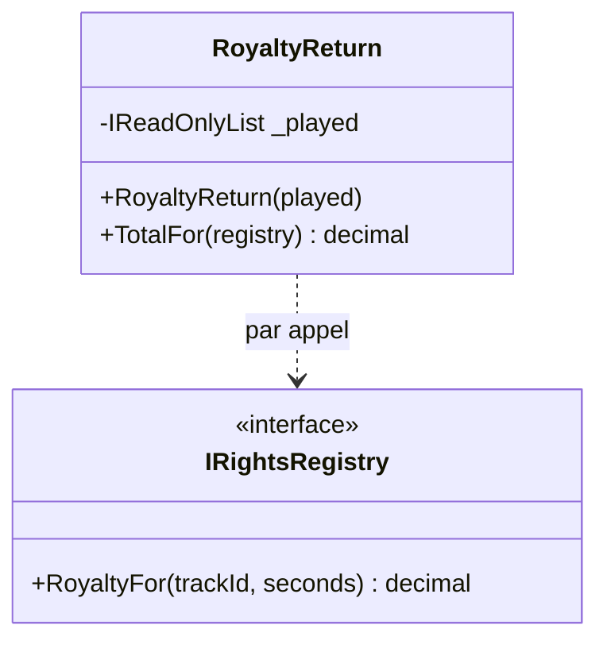

# Method Injection

🌍 🇫🇷 Français (ce fichier) · 🇬🇧 [English](MethodInjection-en.md)

## Intention

Method Injection fournit une dépendance en paramètre de la méthode qui l'emploie, de sorte qu'elle puisse
différer d'un appel à l'autre.

## Problème

Chaque trimestre, la station déclare ce qu'elle a diffusé à une société de perception, et la société dépend
du morceau : la société nationale pour l'essentiel, une autre pour les deux heures de jazz importé, et une
troisième pour tout ce qui vient du fonds associatif, qui ne facture rien mais veut les déclarations quand
même.

La classe de déclaration a d'abord pris la société dans son constructeur :

```csharp
public RoyaltyReturn(IReadOnlyList<(string, int)> played, IRightsRegistry registry) { … }
```

ce qui a donné trois classes de déclaration — puis une seule classe bâtie trois fois par trimestre, avec une
boucle à l'extérieur que personne ne savait suivre.

Le registre n'est pas une propriété de la déclaration. C'est une propriété du fait de déclarer.

## Solution

Le patron met la dépendance là où elle varie réellement.

La dépendance devient un paramètre de la méthode qui l'emploie, fourni par l'appelant au moment de l'appel.
Une déclaration, trois appels, et ce qui change est visible à l'endroit où cela change.

Ce que le patron affirme, c'est que la dépendance appartient à l'**invocation** et non à l'instance. C'est
aussi la seule façon de se tromper alors que le code compile encore.

## Structure



La flèche pointillée est la différence avec l'injection par constructeur. Il n'y a pas de champ, donc pas de
lien entre la classe et le registre qui survive à un appel.

## Les rôles

| Rôle | Annotation | S'applique à | Ce qu'il porte |
|---|---|---|---|
| MethodInjection | `[MethodInjection]` | méthode | La méthode à qui l'appelant remet sa dépendance, plutôt que la construction. |

Un seul rôle, sur la méthode — parce que c'est là que la revendication est vraie. Une classe peut avoir une
méthode injectée et cinq qui ne le sont pas.

## L'exemple

Extrait de [`MethodInjectionUsage.cs`](../../../../DesignPatternCatalog.Usage/DependencyInjection/MethodInjectionUsage.cs).

```csharp
public sealed class RoyaltyReturn {

    private readonly IReadOnlyList<(string TrackId, int Seconds)> _played;

    public RoyaltyReturn(IReadOnlyList<(string TrackId, int Seconds)> played) {
        _played = played;
    }
```

Ce qui appartient à l'instance est dans le constructeur : la diffusion du trimestre est une propriété de
*cette* déclaration. Les deux patrons coexistent dans une classe, et le partage entre eux est la décision de
modélisation.

```csharp
    [MethodInjection]
    public decimal TotalFor(IRightsRegistry registry) {
        decimal total = 0m;
        foreach ((string trackId, int seconds) in _played) {
            total += registry.RoyaltyFor(trackId, seconds);
        }

        return total;
    }

}
```

Le registre arrive, sert, et n'est pas conservé. Remarquer qu'il n'y a pas de champ pour lui — et cette
absence est le patron plutôt qu'un oubli.

La remarque de l'exemple nomme l'échec exactement, et cela vaut d'être cité parce que rien ne le détecte :
**la façon de casser le patron est de conserver ce qui arrive ici.** L'affecter à un champ, le mettre en
cache « pour éviter de le passer partout », et le code compilera, passera ses tests, et déclarera les
morceaux du fonds associatif à la société nationale pour le reste de l'année.

Le même trimestre est déclaré à trois sociétés, et aucune n'est *la* société de cette déclaration. Cette
phrase est le test pour savoir si ce patron est le bon.

## Possibilités d'application

**Utilisez Method Injection lorsque la dépendance peut varier à chaque appel de méthode.** La condition du
livre est aussi étroite que cela, et c'est ce qui sépare ce patron de l'injection par constructeur.

**Employez-le lorsque c'est l'appelant qui sait quelle dépendance s'applique.** La boucle qui choisit parmi
les trois sociétés est en dehors de la déclaration, parce que le choix appartient à l'appelant.

**Employez-le là où une dépendance est fournie à une implémentation par le cadre technique qui l'appelle.**
Le livre le note comme le cas courant en pratique — une méthode qui reçoit un contexte ou un service qu'elle
n'a pas demandé à la construction.

## Quand ne pas l'utiliser

**Ne l'employez pas pour une dépendance qui appartient à l'instance.** Une dépendance dont la classe a besoin
à chaque appel, toujours la même, est un paramètre de constructeur ; la passer à chaque appel fait porter à
tous les appelants une connaissance dont ils n'ont pas besoin.

**Ne stockez pas ce qui arrive.** C'est l'unique mode de défaillance du patron, et il échoue en silence : le
champ retient la dépendance du premier appelant et tous les appels suivants l'emploient. Rien en C# ne
l'empêche, et aucun test écrit contre une seule société ne s'en apercevra.

**Ne l'employez pas pour raccourcir un constructeur.** Déplacer une dépendance exigée vers un paramètre de
méthode pour ranger une longue liste déplace le problème vers tous les sites d'appel et masque la
responsabilité que le smell *Constructor Over-injection* du livre désignait.

**Ne l'employez pas là où le nombre de paramètres rend la méthode illisible.** Une méthode avec quatre
dépendances injectées et deux vrais arguments demande à devenir une classe.

## Avantages

* La dépendance varie là où elle varie réellement, et la variation est visible au site d'appel.
* Une classe sert les trois cas au lieu de trois classes ou de trois constructions.
* L'instance ne retient rien de l'appel : elle est réutilisable d'un appel à l'autre sans porter d'état.
* La signature de la méthode énonce ce dont cet appel a besoin, ce que le constructeur ne pouvait pas dire.

## Inconvénients

* Tous les appelants doivent la fournir : une nouvelle dépendance est un changement à chaque site d'appel.
* Conserver ce qui arrive brise le patron en silence, et ni le compilateur ni un test à cas unique ne le
  diront.
* Une méthode à plusieurs dépendances injectées devient difficile à lire, et difficile à distinguer d'une
  méthode à vrais arguments.

## Liens avec les autres patrons

**`ConstructorInjection`** est le choix par défaut, et celui-ci en est l'exception : recourir au constructeur
sauf si la dépendance varie vraiment par appel.

**`PropertyInjection`** est l'autre exception, pour une dépendance optionnelle plutôt que variable.

**`CompositionRoot`** ne fournit pas celles-ci. C'est la conséquence pratique du patron : la racine compose
la déclaration, et l'appelant choisit le registre.

**`ServiceLocator`** est ce qu'une classe fait à la place quand elle résout le registre elle-même — la même
variation, obtenue sans l'énoncer dans aucune signature.

## Source

*Dependency Injection Principles, Practices, and Patterns*, Steven van Deursen et Mark Seemann, Manning,
2019 — chapitre 4, les patrons d'injection.

* [Entrée d'index](../../../generated/catalog-index.md#methodinjection-dependency-injection-principles-practices-and-patterns)
* [Attribut généré](../../../../DesignPatternCatalog.DependencyInjection/MethodInjection.cs)
* [Exemple](../../../../DesignPatternCatalog.Usage/DependencyInjection/MethodInjectionUsage.cs)
