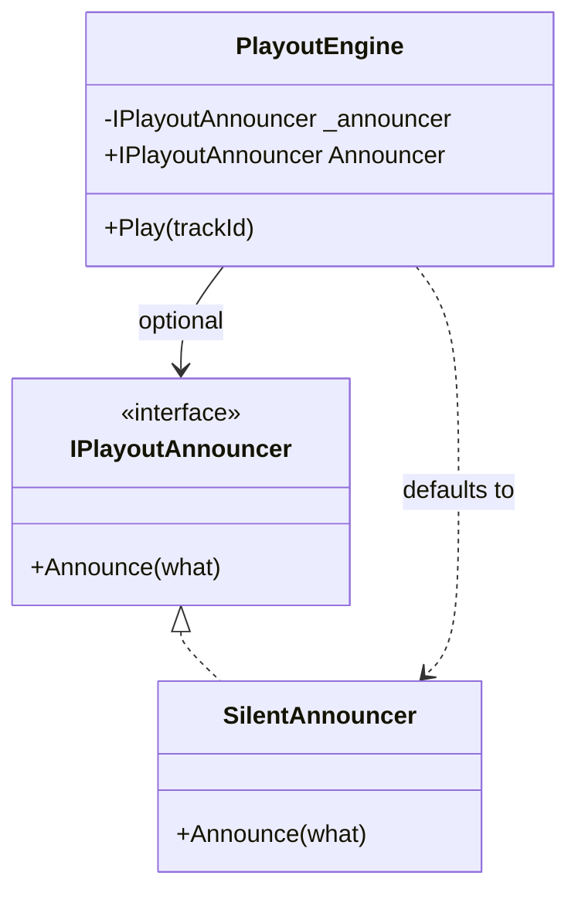

# Property Injection

🌍 🇬🇧 English (this file) · 🇫🇷 [Français](PropertyInjection-fr.md)

## Intent

Property Injection exposes a settable property through which an optional dependency may be supplied, the
class remaining usable when it is not.

## Problem

The playout engine can announce what it is doing — track changes, fades, the moment it falls back to the
sustaining service. The station's own installation sends that to the studio wallboard. The two relay
stations that run the same engine have no wallboard and want none.

Requiring an announcer in the constructor meant the relays passed a do-nothing one:

```csharp
new PlayoutEngine(new NullAnnouncer())
```

which meant the do-nothing one was public API, which meant somebody eventually shipped it to the main
station by configuring the wrong profile. Nobody noticed for a fortnight: the wallboard was blank, and a
blank wallboard looks like a quiet night.

## Solution

The pattern says what is true: the engine works without an announcer, and announcing is something an
installation may add.

The dependency becomes a settable property with a local default that genuinely works. A caller who wants
something else sets it; a caller who does not gets correct behaviour without supplying anything.

The default is what makes the pattern honest. Without a default that works, the dependency is required and
the property is a constructor parameter that has forgotten to fail — and it fails later, on a null
reference, far from here.

## Structure



The arrow to `SilentAnnouncer` is what distinguishes this from a nullable field. The engine always has an
announcer; the question is only which.

## The roles

| Role | Annotation | Applies to | What it carries |
|---|---|---|---|
| PropertyInjection | `[PropertyInjection]` | property | The property through which a caller may replace a dependency the class already has a good local default for. |

One role, on the property. The annotation asserts that a working default exists — which is a claim about the
class, made where a reader will meet it.

## The example

From [`PropertyInjectionUsage.cs`](../../../../DesignPatternCatalog.Usage/DependencyInjection/PropertyInjectionUsage.cs).

```csharp
/// <remarks>
///     This is what makes the property injection honest. Without a default that genuinely works, the
///     dependency is required and the property is a constructor parameter that has forgotten to fail.
/// </remarks>
public sealed class SilentAnnouncer : IPlayoutAnnouncer {

    public void Announce(string what) { }

}
```

An empty method, and the sample is careful to say it is *the default and not a placeholder*. That
distinction is the whole pattern: a class whose default does nothing **useful** has a required dependency,
while a class whose default does nothing **because nothing is wanted** has an optional one. Here the relay
stations genuinely want no announcements.

```csharp
public sealed class PlayoutEngine {

    private IPlayoutAnnouncer _announcer = new SilentAnnouncer();

    [PropertyInjection]
    public IPlayoutAnnouncer Announcer {
        get => _announcer;
        set => _announcer = value ?? new SilentAnnouncer();
    }
```

Three details, each doing work.

The field is initialised at its declaration, so the engine is correct from the instant it is constructed —
there is no window in which it has no announcer.

The setter refuses `null` by falling back rather than by throwing. That is the book's shape for this
pattern: the property's contract is *you may replace the default*, and `null` is a request to have the
default back.

The field is **not** `readonly`, which is the cost. A constructor-injected dependency cannot be swapped
after construction; this one can, at any time, including halfway through a broadcast.

```csharp
    public void Play(string trackId) {
        _announcer.Announce($"now playing {trackId}");
    }

}
```

No null check, because there cannot be a null. That is what the initialised field bought.

The sample names the failure this shape prevents, and it is the one with no exception: a required dependency
left null throws somewhere far from here, days later, at three in the morning; a genuinely optional one with
a working default never throws at all, because there was nothing to announce to.

## Applicability

**Use Property Injection when the consumer has a good local default for the dependency**, and can work
correctly without being given anything.

**Use it when you need to be able to change the dependency at any time during the consumer's lifetime.**

**Give the property a default that genuinely works**, assigned at declaration, so the object is never in a
state where the dependency is absent.

The book treats this as the last resort among the three injection patterns, and the condition it states is
narrow: the dependency must be genuinely optional, which in practice is rarer than it looks.

## When not to use it

**Do not use it for a required dependency.** This is the misuse the pattern exists against, and the reason
the sample's `SilentAnnouncer` matters: a property injection with no working default is a required
dependency that has forgotten to fail, and it fails on a null reference far from the class that declared it.

**Do not use it as a way to shorten a constructor.** Moving a required dependency to a property trades a
compile error for a run-time one, which is a strictly worse position than the long parameter list.

**Do not use it where the dependency must not change after construction.** Anything settable can be set
twice, and a class whose correctness depends on its dependency being fixed should take it in a constructor
and hold it in a `readonly` field.

**Do not use it in a library whose consumers cannot be trusted to look.** A property nobody sets is a
default nobody chose, and the sample's fortnight of blank wallboard is what that looks like when the default
is the wrong one for that installation.

## Advantages

* The class states honestly that the dependency is optional, and a caller learns that from the signature.
* An installation that wants nothing supplies nothing, rather than supplying a null object it must also
  maintain as public API.
* The dependency can be replaced at any point in the object's life, which is occasionally what is wanted.
* The class needs no null checks, because the default is assigned at declaration.

## Drawbacks

* The dependency can be replaced at any point in the object's life, which is usually **not** what is
  wanted — and nothing prevents it being replaced twice, or during an operation.
* The field cannot be `readonly`, so the class loses the guarantee that what was correct at construction
  stays correct.
* A default that does not genuinely work turns the pattern into a deferred null-reference failure, and
  nothing in the language distinguishes the two cases.
* A caller who does not know the property exists gets the default silently, which looks like working
  software.

## Relations with other patterns

**`ConstructorInjection`** is what to use instead in almost every case: the book makes it the default and
this the exception for genuinely optional dependencies.

**`MethodInjection`** is the other exception, for a dependency that varies per call rather than one that is
optional.

**`CompositionRoot`** is where the property is set, when it is set at all — which keeps the choice in the
one place that composes.

**`AmbientContext`** is the shape this pattern is often reached for instead of, and it costs more: a static
access point makes the dependency reachable from everywhere rather than optional in one place.

## Source

*Dependency Injection Principles, Practices, and Patterns*, Steven van Deursen and Mark Seemann, Manning,
2019 — chapter 4, DI patterns.

* [Index entry](../../../generated/catalog-index.md#propertyinjection-dependency-injection-principles-practices-and-patterns)
* [Generated attribute](../../../../DesignPatternCatalog.DependencyInjection/PropertyInjection.cs)
* [Example](../../../../DesignPatternCatalog.Usage/DependencyInjection/PropertyInjectionUsage.cs)
