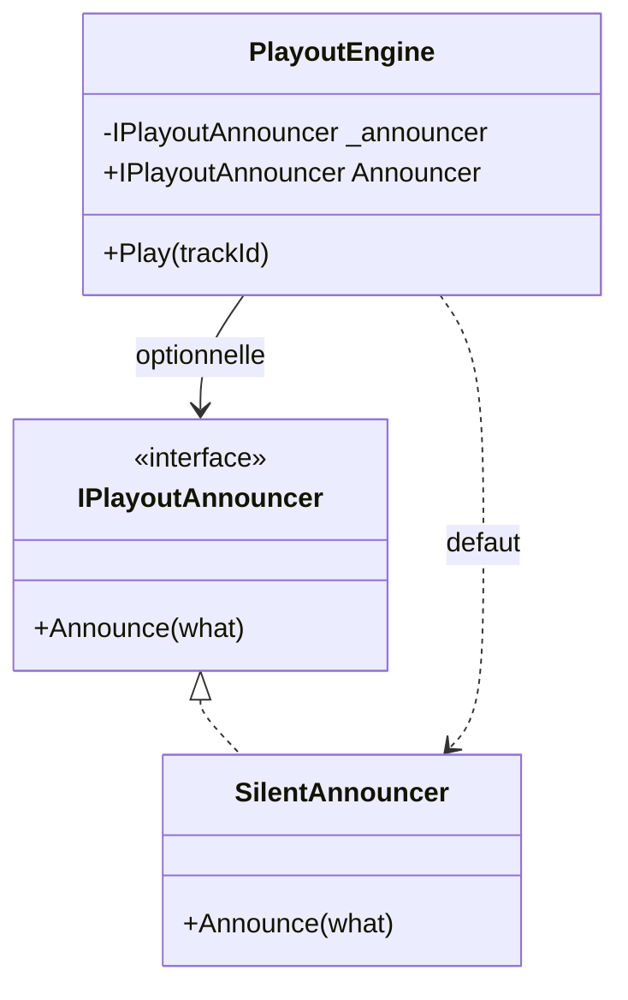

# Property Injection

🌍 🇫🇷 Français (ce fichier) · 🇬🇧 [English](PropertyInjection-en.md)

## Intention

Property Injection expose une propriété modifiable par laquelle une dépendance optionnelle peut être
fournie, la classe restant utilisable quand elle ne l'est pas.

## Problème

Le moteur de diffusion sait annoncer ce qu'il fait — changements de morceau, fondus, le moment où il bascule
sur le programme de secours. L'installation de la station envoie cela au tableau du studio. Les deux relais
qui font tourner le même moteur n'ont pas de tableau et n'en veulent pas.

Exiger un annonceur dans le constructeur obligeait les relais à en passer un qui ne fait rien :

```csharp
new PlayoutEngine(new NullAnnouncer())
```

ce qui faisait de l'annonceur muet une API publique, ce qui a fini par le livrer à la station principale par
une erreur de profil. Personne ne l'a vu pendant quinze jours : le tableau était vide, et un tableau vide
ressemble à une nuit calme.

## Solution

Le patron dit ce qui est vrai : le moteur fonctionne sans annonceur, et annoncer est quelque chose qu'une
installation peut ajouter.

La dépendance devient une propriété modifiable dotée d'un défaut local qui fonctionne réellement. Un appelant
qui veut autre chose le remplace ; un appelant qui n'en veut pas obtient un comportement correct sans rien
fournir.

Le défaut est ce qui rend le patron honnête. Sans un défaut qui fonctionne, la dépendance est exigée et la
propriété est un paramètre de constructeur qui a oublié d'échouer — et il échoue plus tard, sur une référence
nulle, loin d'ici.

## Structure



La flèche vers `SilentAnnouncer` est ce qui distingue ceci d'un champ nullable. Le moteur a toujours un
annonceur ; la seule question est lequel.

## Les rôles

| Rôle | Annotation | S'applique à | Ce qu'il porte |
|---|---|---|---|
| PropertyInjection | `[PropertyInjection]` | propriété | La propriété par laquelle un appelant peut remplacer une dépendance dont la classe a déjà un bon défaut local. |

Un seul rôle, sur la propriété. L'annotation affirme qu'un défaut fonctionnel existe — une affirmation sur la
classe, faite là où un lecteur la rencontrera.

## L'exemple

Extrait de [`PropertyInjectionUsage.cs`](../../../../DesignPatternCatalog.Usage/DependencyInjection/PropertyInjectionUsage.cs).

```csharp
/// <remarks>
///     This is what makes the property injection honest. Without a default that genuinely works, the
///     dependency is required and the property is a constructor parameter that has forgotten to fail.
/// </remarks>
public sealed class SilentAnnouncer : IPlayoutAnnouncer {

    public void Announce(string what) { }

}
```

Une méthode vide, et l'exemple prend soin de dire que c'est *le défaut et non un bouche-trou*. Cette
distinction est tout le patron : une classe dont le défaut ne fait rien d'**utile** a une dépendance exigée,
tandis qu'une classe dont le défaut ne fait rien **parce qu'on ne veut rien** en a une optionnelle. Ici, les
relais ne veulent réellement aucune annonce.

```csharp
public sealed class PlayoutEngine {

    private IPlayoutAnnouncer _announcer = new SilentAnnouncer();

    [PropertyInjection]
    public IPlayoutAnnouncer Announcer {
        get => _announcer;
        set => _announcer = value ?? new SilentAnnouncer();
    }
```

Trois détails, chacun utile.

Le champ est initialisé à sa déclaration : le moteur est correct dès l'instant où il est construit — il n'y a
pas de fenêtre où il n'a pas d'annonceur.

L'accesseur en écriture refuse `null` en retombant sur le défaut plutôt qu'en levant. C'est la forme du livre
pour ce patron : le contrat de la propriété est *vous pouvez remplacer le défaut*, et `null` est une demande
de le retrouver.

Le champ n'est **pas** `readonly`, et c'est le coût. Une dépendance injectée par constructeur ne peut pas être
échangée après construction ; celle-ci peut l'être à tout moment, y compris au milieu d'une émission.

```csharp
    public void Play(string trackId) {
        _announcer.Announce($"now playing {trackId}");
    }

}
```

Aucun contrôle de nullité, parce qu'il ne peut pas y avoir de `null`. C'est ce que le champ initialisé a
acheté.

L'exemple nomme l'échec que cette forme prévient, et c'est celui qui ne lève aucune exception : une
dépendance exigée laissée nulle échoue loin d'ici, des jours plus tard, à trois heures du matin ; une
dépendance vraiment optionnelle avec un défaut fonctionnel n'échoue jamais, parce qu'il n'y avait rien à
annoncer.

## Possibilités d'application

**Utilisez Property Injection lorsque le consommateur a un bon défaut local pour la dépendance** et peut
fonctionner correctement sans qu'on lui donne quoi que ce soit.

**Employez-le lorsque vous devez pouvoir changer la dépendance à tout moment de la vie du consommateur.**

**Donnez à la propriété un défaut qui fonctionne réellement**, affecté à la déclaration, pour que l'objet ne
soit jamais dans un état où la dépendance est absente.

Le livre en fait le dernier recours parmi les trois patrons d'injection, et la condition qu'il énonce est
étroite : la dépendance doit être vraiment optionnelle, ce qui est en pratique plus rare qu'il n'y paraît.

## Quand ne pas l'utiliser

**Ne l'employez pas pour une dépendance exigée.** C'est le mésusage contre lequel le patron existe, et la
raison pour laquelle le `SilentAnnouncer` de l'exemple compte : une injection par propriété sans défaut
fonctionnel est une dépendance exigée qui a oublié d'échouer, et elle échoue sur une référence nulle loin de
la classe qui l'a déclarée.

**Ne l'employez pas pour raccourcir un constructeur.** Déplacer une dépendance exigée vers une propriété
échange une erreur de compilation contre une erreur d'exécution, ce qui est strictement pire que la longue
liste de paramètres.

**Ne l'employez pas là où la dépendance ne doit pas changer après construction.** Tout ce qui est modifiable
peut être modifié deux fois, et une classe dont la justesse dépend d'une dépendance fixe doit la prendre au
constructeur et la garder dans un champ `readonly`.

**Ne l'employez pas dans une bibliothèque dont on ne peut pas attendre des consommateurs qu'ils regardent.**
Une propriété que personne ne renseigne est un défaut que personne n'a choisi, et les quinze jours de tableau
vide de l'exemple sont ce à quoi cela ressemble quand le défaut est le mauvais pour cette installation.

## Avantages

* La classe énonce honnêtement que la dépendance est optionnelle, et un appelant l'apprend de la signature.
* Une installation qui ne veut rien ne fournit rien, au lieu de fournir un objet nul qu'il faut aussi
  maintenir en API publique.
* La dépendance peut être remplacée à tout moment de la vie de l'objet, ce qui est occasionnellement voulu.
* La classe n'a besoin d'aucun contrôle de nullité, puisque le défaut est affecté à la déclaration.

## Inconvénients

* La dépendance peut être remplacée à tout moment de la vie de l'objet, ce qui d'ordinaire n'est **pas**
  voulu — et rien n'empêche qu'elle le soit deux fois, ou pendant une opération.
* Le champ ne peut pas être `readonly` : la classe perd la garantie que ce qui était correct à la
  construction le reste.
* Un défaut qui ne fonctionne pas réellement transforme le patron en échec de référence nulle différé, et
  rien dans le langage ne distingue les deux cas.
* Un appelant qui ignore l'existence de la propriété obtient le défaut en silence, ce qui ressemble à un
  logiciel qui marche.

## Liens avec les autres patrons

**`ConstructorInjection`** est ce qu'il faut employer à la place dans presque tous les cas : le livre en fait
le choix par défaut et de celui-ci l'exception pour les dépendances vraiment optionnelles.

**`MethodInjection`** est l'autre exception, pour une dépendance qui varie par appel plutôt qu'optionnelle.

**`CompositionRoot`** est l'endroit où la propriété est renseignée, quand elle l'est — ce qui garde le choix
au seul endroit qui compose.

**`AmbientContext`** est la forme vers laquelle on se tourne souvent à la place de ce patron, et elle coûte
plus cher : un point d'accès statique rend la dépendance atteignable de partout au lieu d'optionnelle à un
endroit.

## Source

*Dependency Injection Principles, Practices, and Patterns*, Steven van Deursen et Mark Seemann, Manning,
2019 — chapitre 4, les patrons d'injection.

* [Entrée d'index](../../../generated/catalog-index.md#propertyinjection-dependency-injection-principles-practices-and-patterns)
* [Attribut généré](../../../../DesignPatternCatalog.DependencyInjection/PropertyInjection.cs)
* [Exemple](../../../../DesignPatternCatalog.Usage/DependencyInjection/PropertyInjectionUsage.cs)
