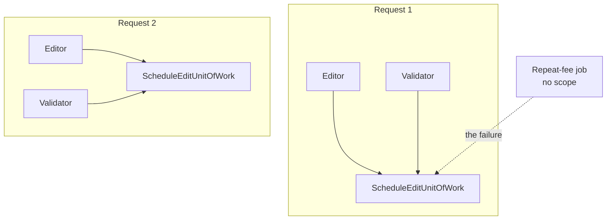

# Scoped Lifestyle

🌍 🇬🇧 English (this file) · 🇫🇷 [Français](ScopedLifestyle-fr.md)

## Intent

Scoped Lifestyle means one instance serves a well-defined scope — a web request, a unit of work — and a
different one serves the next.

## Problem

Producers edit next week's schedule through a web front end. Moving a programme touches four tables, and
either all four move or none does.

So everything serving one request shares one transaction, and the next request gets its own. That is one
instance per scope, shared inside it — and it is the lifestyle that carries the most obligations while looking
the simplest.

The failure it cannot prevent on its own is reaching it from outside a scope, and the station has hit it: a
background job that recalculates repeat fees was written by copying an editor class, resolved the transaction
outside any request, and wrote four tables under a transaction nobody would ever commit. It failed silently
for a week — the rows were there in the job's own reads.

## Solution

The pattern ties the instance's life to a scope, and the annotation states what that buys and what it does
not.

One instance exists per scope and is shared by everything inside it. So it need not be safe against the whole
application, only against whatever runs concurrently within one scope — which for a typical web front end is
nothing.

What the lifestyle cannot prevent is the two ways the scope is escaped: reaching the instance from outside one,
and a longer-lived class holding on to it past the end of one. Both have happened at the station.

## Structure



Two scopes, one instance each, shared inside. The dashed arrow is the failure the lifestyle does not prevent:
a consumer with no scope of its own, reaching in.

## The roles

| Role | Annotation | Applies to | What it carries |
|---|---|---|---|
| ScopedLifestyle | `[ScopedLifestyle]` | class, struct | A class of which one instance exists per scope and is shared by everything inside it. |

One role, on the class. As with the other two lifestyles, the annotation is a claim about the class's
obligations rather than a copy of the container's configuration.

## The example

From [`ScopedLifestyleUsage.cs`](../../../../DesignPatternCatalog.Usage/DependencyInjection/ScopedLifestyleUsage.cs).

```csharp
[ScopedLifestyle]
public sealed class ScheduleEditUnitOfWork {

    private readonly List<string> _pending = new List<string>();

    public void Stage(string change) {
        _pending.Add(change);
    }

    public IReadOnlyList<string> Commit() {
        List<string> committed = new List<string>(_pending);
        _pending.Clear();

        return committed;
    }

}
```

A plain `List<string>`, mutable, with no lock anywhere — and that is the licence the lifestyle grants. It need
not be safe against the whole application, only against whatever runs concurrently inside a single request,
which for this front end is nothing.

Compare with [Singleton Lifestyle](SingletonLifestyle-en.md), where the same field would have to be immutable
and the class thread-safe. The two pages are the same class written under two obligations.

`Commit` copies and clears, so the instance is reusable inside its scope but carries nothing across the
boundary. That is the shape a scoped class wants: the state belongs to the scope, and the scope ends.

The sample records **two failures the lifestyle does not prevent, both of which have happened here.** Reaching
it from outside a scope, which is what the repeat-fee job did. And a longer-lived class holding on to it — a
singleton that captured this would use one request's transaction for every request after it, which is the shape
the singleton entry's second obligation is about.

## Applicability

**Use the scoped lifestyle where a well-defined scope exists** — a web request, a message being handled, a
unit of work — and everything serving that scope should share one instance.

**Use it where the state belongs to the scope**: a transaction, an identity map, an accumulated set of changes
that must be committed or discarded together.

**Rely on it for the safety the scope gives.** The class need only be safe against what runs concurrently
inside one scope, which is often nothing — and that is a real simplification over the singleton case.

## When not to use it

**Do not use it where there is no scope.** A background job, a startup task, a console command: none of them
is inside a request, and resolving a scoped class there is the repeat-fee failure. It is silent, because the
object works — it simply belongs to nothing.

**Do not let a longer-lived class capture it.** A singleton that holds a scoped instance uses one request's
state for every request after it. This is the book's *captive dependency* seen from the other side, and it is
the reason the singleton page recommends taking a factory.

**Do not hold it beyond the end of its scope.** Anything that survives the scope — a closure queued for later,
a task not awaited — is using state that has been committed or discarded.

**Do not assume the scope is what you think.** What counts as a scope is the container's configuration, not the
class's; a class marked scoped in an application whose scopes are per-thread rather than per-request has
obligations nobody stated.

**Do not use it where every consumer wants its own.** That is the transient case, and sharing within a scope
would make two consumers interfere.

## Advantages

* Everything serving one request shares one instance, so a transaction or an identity map is coherent by
  construction.
* The class need only be safe within a scope, which is usually a much weaker requirement than thread safety.
* State is released at the end of the scope, so nothing accumulates across requests.
* The obligation is written on the class, so a reader learns the scope rule without finding the registration.

## Drawbacks

* Resolving it outside a scope is a silent failure: the object works, and belongs to nothing.
* A longer-lived consumer capturing it is equally silent, and lasts until the process restarts.
* The definition of the scope lives in the container's configuration, not in the class, so the class's
  obligations depend on something it cannot see.
* It is the lifestyle with the most obligations and the least visible ones.

## Relations with other patterns

**`SingletonLifestyle`** is the longer life, and the mismatch between the two is where the captive-dependency
failure lives.

**`TransientLifestyle`** is the shorter one, for a class every consumer should have its own of.

**`CompositionRoot`** is where the scope is configured and the lifestyle chosen.

**`ServiceLocator`** is how a class outside a scope usually reaches in, which is what made the repeat-fee job
possible.

## Source

*Dependency Injection Principles, Practices, and Patterns*, Steven van Deursen and Mark Seemann, Manning,
2019 — chapter 8, object lifetime.

* [Index entry](../../../generated/catalog-index.md#scopedlifestyle-dependency-injection-principles-practices-and-patterns)
* [Generated attribute](../../../../DesignPatternCatalog.DependencyInjection/ScopedLifestyle.cs)
* [Example](../../../../DesignPatternCatalog.Usage/DependencyInjection/ScopedLifestyleUsage.cs)
