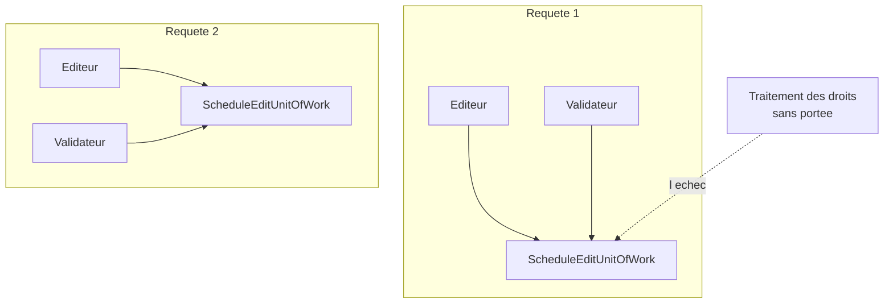

# Scoped Lifestyle

🌍 🇫🇷 Français (ce fichier) · 🇬🇧 [English](ScopedLifestyle-en.md)

## Intention

Scoped Lifestyle signifie qu'une instance sert une portée bien définie — une requête web, une unité de travail
— et qu'une autre sert la suivante.

## Problème

Les producteurs modifient la grille de la semaine prochaine par une interface web. Déplacer une émission touche
quatre tables, et soit les quatre bougent, soit aucune.

Donc tout ce qui sert une requête partage une transaction, et la requête suivante a la sienne. C'est une
instance par portée, partagée à l'intérieur — et c'est la durée de vie qui porte le plus d'obligations tout en
paraissant la plus simple.

L'échec qu'elle ne peut pas prévenir seule est de l'atteindre depuis l'extérieur d'une portée, et la station l'a
rencontré : un traitement de fond qui recalcule les droits de rediffusion a été écrit en copiant une classe
d'édition, a résolu la transaction en dehors de toute requête, et a écrit quatre tables sous une transaction que
personne ne validerait jamais. Cela a échoué en silence pendant une semaine — les lignes étaient bien là dans
les lectures du traitement lui-même.

## Solution

Le patron lie la vie de l'instance à une portée, et l'annotation énonce ce que cela achète et ce que cela
n'achète pas.

Une instance existe par portée et est partagée par tout ce qui s'y trouve. Elle n'a donc pas besoin d'être sûre
contre l'application entière, seulement contre ce qui tourne concurremment dans une portée — ce qui, pour une
interface web typique, est rien.

Ce que la durée de vie ne peut pas prévenir, ce sont les deux façons dont la portée est échappée : atteindre
l'instance depuis l'extérieur, et une classe à vie plus longue qui s'y accroche au-delà de la fin d'une portée.
Les deux sont arrivées à la station.

## Structure



Deux portées, une instance chacune, partagée à l'intérieur. La flèche pointillée est l'échec que la durée de vie
ne prévient pas : un consommateur sans portée propre, qui atteint l'instance.

## Les rôles

| Rôle | Annotation | S'applique à | Ce qu'il porte |
|---|---|---|---|
| ScopedLifestyle | `[ScopedLifestyle]` | classe, struct | Une classe dont il existe une instance par portée, partagée par tout ce qui s'y trouve. |

Un seul rôle, sur la classe. Comme pour les deux autres durées de vie, l'annotation est une revendication sur
les obligations de la classe plutôt qu'une copie de la configuration du conteneur.

## L'exemple

Extrait de [`ScopedLifestyleUsage.cs`](../../../../DesignPatternCatalog.Usage/DependencyInjection/ScopedLifestyleUsage.cs).

```csharp
[ScopedLifestyle]
public sealed class ScheduleEditUnitOfWork {

    private readonly List<string> _pending = new List<string>();

    public void Stage(string change) {
        _pending.Add(change);
    }

    public IReadOnlyList<string> Commit() {
        List<string> committed = new List<string>(_pending);
        _pending.Clear();

        return committed;
    }

}
```

Une simple `List<string>`, mutable, sans aucun verrou — et c'est la licence que la durée de vie accorde. Elle
n'a pas besoin d'être sûre contre l'application entière, seulement contre ce qui tourne concurremment dans une
requête, ce qui pour cette interface est rien.

À comparer avec [Singleton Lifestyle](SingletonLifestyle-fr.md), où le même champ devrait être immuable et la
classe sûre en concurrence. Les deux pages sont la même classe écrite sous deux obligations.

`Commit` copie et vide : l'instance est réutilisable dans sa portée mais ne porte rien au-delà de la frontière.
C'est la forme qu'une classe à portée veut : l'état appartient à la portée, et la portée finit.

L'exemple consigne **deux échecs que la durée de vie ne prévient pas, et les deux se sont produits ici.**
L'atteindre depuis l'extérieur d'une portée, ce qu'a fait le traitement des droits. Et une classe à vie plus
longue qui s'y accroche — un singleton qui l'aurait capturée emploierait la transaction d'une requête pour
toutes les requêtes suivantes, ce qui est la forme dont parle la seconde obligation de l'entrée singleton.

## Possibilités d'application

**Employez la durée de vie à portée là où une portée bien définie existe** — une requête web, un message en
cours de traitement, une unité de travail — et où tout ce qui sert cette portée doit partager une instance.

**Employez-la là où l'état appartient à la portée** : une transaction, une table d'identité, un ensemble de
changements accumulés qui doivent être validés ou jetés ensemble.

**Comptez sur elle pour la sûreté que la portée donne.** La classe n'a besoin d'être sûre que contre ce qui
tourne concurremment dans une portée, ce qui est souvent rien — et c'est une simplification réelle par rapport
au cas singleton.

## Quand ne pas l'utiliser

**Ne l'employez pas là où il n'y a pas de portée.** Un traitement de fond, une tâche de démarrage, une commande
en console : aucun n'est dans une requête, et résoudre une classe à portée là est l'échec des droits de
rediffusion. Il est silencieux, parce que l'objet fonctionne — il n'appartient simplement à rien.

**Ne laissez pas une classe à vie plus longue la capturer.** Un singleton qui détient une instance à portée
emploie l'état d'une requête pour toutes les requêtes suivantes. C'est la *dépendance captive* du livre vue de
l'autre côté, et c'est la raison pour laquelle la page singleton recommande de prendre une fabrique.

**Ne la détenez pas au-delà de la fin de sa portée.** Tout ce qui survit à la portée — une closure mise en file
pour plus tard, une tâche non attendue — emploie un état qui a été validé ou jeté.

**Ne supposez pas que la portée est ce que vous croyez.** Ce qui compte comme portée est la configuration du
conteneur, non celle de la classe ; une classe marquée à portée dans une application dont les portées sont par
thread plutôt que par requête a des obligations que personne n'a énoncées.

**Ne l'employez pas là où chaque consommateur veut la sienne.** C'est le cas transitoire, et le partage dans une
portée ferait interférer deux consommateurs.

## Avantages

* Tout ce qui sert une requête partage une instance : une transaction ou une table d'identité est cohérente par
  construction.
* La classe n'a besoin d'être sûre que dans une portée, ce qui est d'ordinaire une exigence bien plus faible que
  la sûreté en concurrence.
* L'état est relâché à la fin de la portée : rien ne s'accumule d'une requête à l'autre.
* L'obligation est écrite sur la classe : un lecteur apprend la règle de portée sans trouver l'enregistrement.

## Inconvénients

* La résoudre en dehors d'une portée est un échec silencieux : l'objet fonctionne, et n'appartient à rien.
* Un consommateur à vie plus longue qui la capture est tout aussi silencieux, et cela dure jusqu'au redémarrage
  du processus.
* La définition de la portée vit dans la configuration du conteneur, non dans la classe : les obligations de la
  classe dépendent de quelque chose qu'elle ne peut pas voir.
* C'est la durée de vie qui a le plus d'obligations et les moins visibles.

## Liens avec les autres patrons

**`SingletonLifestyle`** est la vie plus longue, et la discordance entre les deux est là où vit l'échec de la
dépendance captive.

**`TransientLifestyle`** est la plus courte, pour une classe dont chaque consommateur devrait avoir la sienne.

**`CompositionRoot`** est l'endroit où la portée est configurée et la durée de vie choisie.

**`ServiceLocator`** est la façon dont une classe hors portée atteint d'ordinaire l'instance, et c'est ce qui a
rendu possible le traitement des droits de rediffusion.

## Source

*Dependency Injection Principles, Practices, and Patterns*, Steven van Deursen et Mark Seemann, Manning,
2019 — chapitre 8, la durée de vie des objets.

* [Entrée d'index](../../../generated/catalog-index.md#scopedlifestyle-dependency-injection-principles-practices-and-patterns)
* [Attribut généré](../../../../DesignPatternCatalog.DependencyInjection/ScopedLifestyle.cs)
* [Exemple](../../../../DesignPatternCatalog.Usage/DependencyInjection/ScopedLifestyleUsage.cs)
