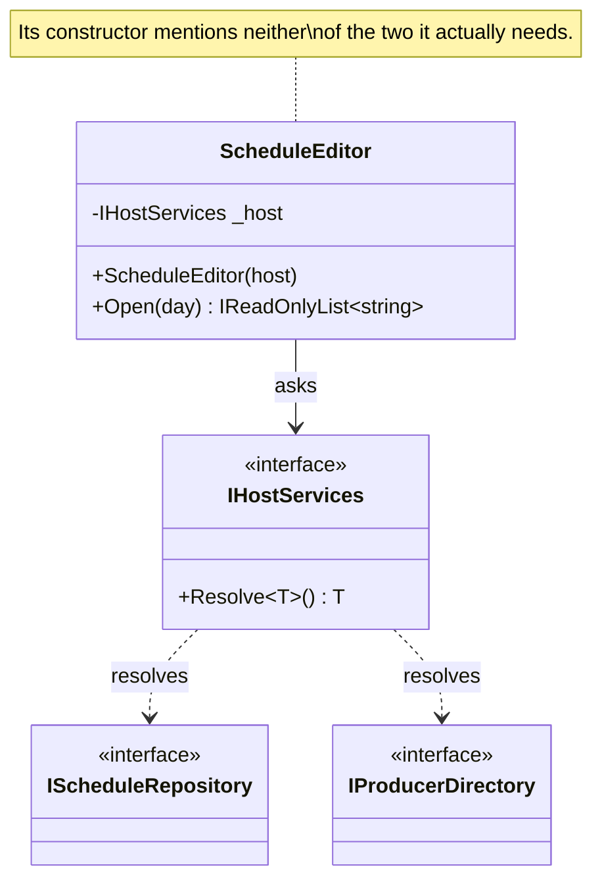

# Service Locator

🌍 🇬🇧 English (this file) · 🇫🇷 [Français](ServiceLocator-fr.md)

## Intent

Service Locator supplies a dependency by having the consumer ask a registry for it at the moment it is
needed, rather than being given it. The book names it as an anti-pattern; another author names it as a
pattern, and this page says so.

## Problem

The nineteen resolve calls the composition root replaced did not all go away. Four are in the schedule
editor, which runs inside a plug-in host the station does not control: the host constructs the editor and
there is no seam to inject through.

```csharp
public ScheduleEditor(IHostServices host) { _host = host; }

public IReadOnlyList<string> Open(DateOnly day) {
    IScheduleRepository schedules = _host.Resolve<IScheduleRepository>();
    IProducerDirectory  producers = _host.Resolve<IProducerDirectory>();
    …
}
```

Those four are staying until the host is replaced. The problem the guide is about is that they are
invisible: nothing in the editor's constructor says what must be registered for it to work.

## Solution

There is no solution here; this is an anti-pattern in the book's reading. What the annotation does is record
a structural fact.

The fact is this: **a class that resolves what it needs does not state its preconditions in its contract.**
Two things follow, and the second bites somebody other than the author. A missing registration is a failure
at run time rather than a broken build. And adding a dependency inside such a class is a breaking change
that breaks no build at all — every host compiles, and the one that forgot to register fails when a producer
opens the editor.

The book's remedy where a seam exists is constructor injection. Where the host genuinely offers no seam, the
annotation is what stops the four from being forgotten.

## Structure



The two dotted arrows are the dependencies the editor really has, and neither passes through its
constructor. That gap is the whole of what the pattern costs.

## The roles

| Role | Annotation | Applies to | What it carries |
|---|---|---|---|
| ServiceLocator | `[ServiceLocator.ServiceLocator]` | interface, class | The registry a consumer asks. It is not the participant that carries the cost. |
| Consumer | `[ServiceLocator.Consumer(ServiceLocator = typeof(…))]` | class, struct | A class that resolves what it needs instead of receiving it, and therefore does not state its preconditions in its contract. |

Two roles, and they say different things. On the registry the annotation marks **where the boundary is**, so
a rule can range over everything that touches it — a codebase has one registry against many consumers. On
the consumer it marks **the thing that actually costs**.

The registry's annotation reads `[ServiceLocator.ServiceLocator]`, which is a consequence of the generator's
naming and not a decision of its own: a role that shares its pattern's name nests under it.

## The example

From [`ServiceLocatorUsage.cs`](../../../../DesignPatternCatalog.Usage/DependencyInjection/ServiceLocatorUsage.cs).

```csharp
[ServiceLocator.ServiceLocator]
public interface IHostServices {

    T Resolve<T>() where T : class;

}
```

One method, generic, returning whatever is asked for. That signature is what makes the registry unable to
state anything useful about what it holds — and it is also why annotating it is about the boundary rather
than the cost: it is the thing a rule looks for references to.

```csharp
[ServiceLocator.Consumer(ServiceLocator = typeof(IHostServices))]
public sealed class ScheduleEditor {

    private readonly IHostServices _host;

    public ScheduleEditor(IHostServices host) {
        _host = host;
    }

    public IReadOnlyList<string> Open(DateOnly day) {
        // Neither of these appears in the constructor, so neither appears in the contract.
        IScheduleRepository schedules = _host.Resolve<IScheduleRepository>();
        IProducerDirectory  producers = _host.Resolve<IProducerDirectory>();

        return schedules.For(day, producers.OnDuty(day));
    }

}
```

The constructor takes the registry and nothing else. Read it and you learn that this class needs *a host* —
which is true and useless.

The sample's remark is worth reading in full on the second consequence, because it is the one that reaches
past the author: adding a dependency inside this class is a breaking change that breaks no build at all.
Every host compiles; the one that forgot to register fails when a producer opens the editor.

### The disagreement, and what the annotation does about it

Whether this is an anti-pattern is a live disagreement between two authors. **Martin Fowler named it as a
pattern** and leans toward it for application code. **Mark Seemann calls it an anti-pattern**, and this
catalogue follows his book because his book is the work being catalogued.

The sample is explicit about what the annotation does not do:

> Note what the annotation does NOT do: it does not take a side. It records a structural fact — this class
> does not state its preconditions — which is true either way, and leaves the verdict to whoever writes the
> rule.

In Seemann's later formulation the class does not communicate its preconditions, so its contract is
incomplete. That is the fact recorded. Whether it is a defect is the station's rule to state.

## Applicability

The book gives no circumstances under which it recommends this. What this guide can state is the case the
sample is built on, which the book itself acknowledges as the hard one:

**Use it where the host constructs your class and offers no seam to inject through.** A plug-in host, a
framework that instantiates types by name, a runtime you do not control. The four calls in the schedule
editor are staying until the host is replaced.

**Annotate it to bound it**, on the same reasoning as [Control Freak](ControlFreak-en.md): a known count a
build enforces is what stops the population growing.

Fowler's own applicability — that a service locator is a reasonable choice for application code, as against
a library — is his and is not the book's, and it is named here rather than adopted.

## When not to use it

**Do not use it where a seam exists.** If the class can take a constructor parameter, the book's answer is
that it should. The editor's four calls are excused by the host, not by convenience.

**Do not use it in a library.** This is the one point on which both authors agree: a library whose types
resolve their own dependencies imposes a registry on every consumer, and Fowler's leaning toward service
location is explicitly about application code.

**Do not use it to make a constructor shorter.** The dependencies do not go away; they stop being stated,
which converts a compile error into a run-time one.

**Do not annotate only the registry.** The registry is the boundary and the consumer is the cost. A codebase
that marks the one interface and none of its consumers has recorded where to look and not what is there.

## Advantages

The book lists none, and this guide will not invent any. Two things can be said honestly, and both are about
circumstance rather than design: it is available where constructor injection is not, because the host
constructs the class; and it requires no change to the host, which is what makes it the answer for the four
calls that remain.

Fowler's arguments for it as a pattern exist and are his; a reader who wants them should read him rather
than a summary here.

## Drawbacks

* The class does not state its preconditions, so its contract is incomplete — the book's central charge.
* A missing registration fails at run time, not at build time.
* Adding a dependency inside the class is a breaking change that breaks no build, so the failure lands on
  whoever hosts it.
* The class cannot be constructed in a test without a registry, so testing it means registering rather than
  passing.
* Every consumer depends on the registry, so the registry becomes something the whole codebase references.

## Relations with other patterns

**`ConstructorInjection`** is the remedy wherever a seam exists.

**`CompositionRoot`** is what removed fifteen of the nineteen calls, and what cannot reach the remaining
four.

**`ControlFreak`** is the sibling anti-pattern: both take the choice from the caller, one by constructing and
one by resolving.

**`AmbientContext`** goes further in the same direction — no registry is even passed, and the dependency is
reachable statically from anywhere.

**`ConstrainedConstruction`** is often what forces this: a host that instantiates by name cannot supply
parameters, so the class asks instead.

## Source

*Dependency Injection Principles, Practices, and Patterns*, Steven van Deursen and Mark Seemann, Manning,
2019 — chapter 5, DI anti-patterns.

The contrary reading is Martin Fowler's, in *Inversion of Control Containers and the Dependency Injection
pattern* (2004), where the service locator is presented as a pattern. This repository does not hold that
entry, and the disagreement is named here rather than resolved.

* [Index entry](../../../generated/catalog-index.md#servicelocator-dependency-injection-principles-practices-and-patterns)
* [Generated attribute](../../../../DesignPatternCatalog.DependencyInjection/ServiceLocator.cs)
* [Example](../../../../DesignPatternCatalog.Usage/DependencyInjection/ServiceLocatorUsage.cs)
