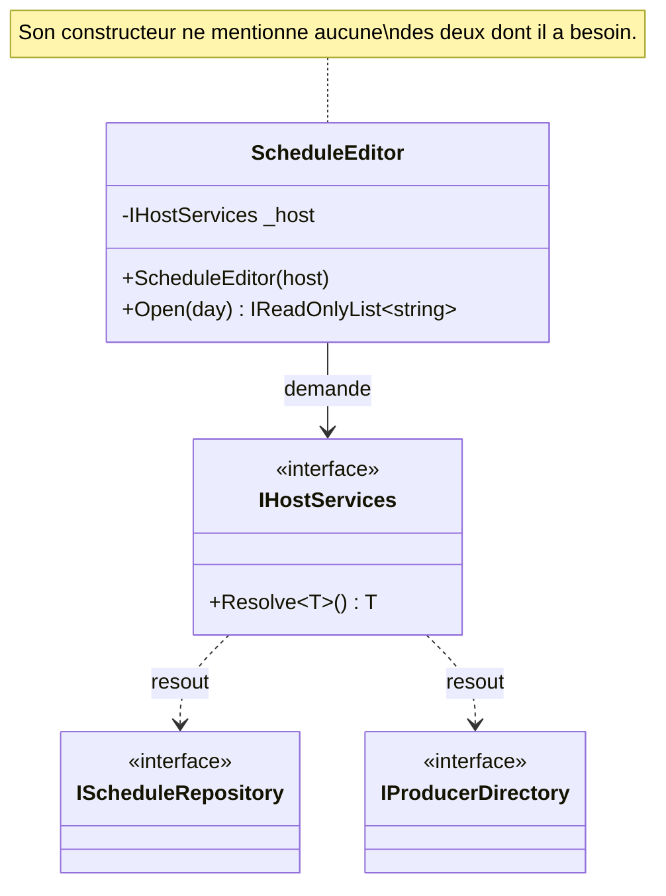

# Service Locator

🌍 🇫🇷 Français (ce fichier) · 🇬🇧 [English](ServiceLocator-en.md)

## Intention

Service Locator fournit une dépendance en faisant demander celle-ci par le consommateur à un registre, au
moment où il en a besoin, plutôt qu'en la lui donnant. Le livre le nomme comme un anti-patron ; un autre
auteur le nomme comme un patron, et cette page le dit.

## Problème

Les dix-neuf appels de résolution que la racine de composition a remplacés n'ont pas tous disparu. Quatre sont
dans l'éditeur de grille, qui tourne dans un hôte de greffons que la station ne contrôle pas : l'hôte
construit l'éditeur et il n'y a aucune prise pour injecter.

```csharp
public ScheduleEditor(IHostServices host) { _host = host; }

public IReadOnlyList<string> Open(DateOnly day) {
    IScheduleRepository schedules = _host.Resolve<IScheduleRepository>();
    IProducerDirectory  producers = _host.Resolve<IProducerDirectory>();
    …
}
```

Ces quatre-là restent jusqu'au remplacement de l'hôte. Le problème dont traite ce guide est qu'ils sont
invisibles : rien dans le constructeur de l'éditeur ne dit ce qui doit être enregistré pour qu'il
fonctionne.

## Solution

Il n'y a pas de solution ici ; c'est un anti-patron dans la lecture du livre. Ce que fait l'annotation est de
consigner un fait structurel.

Le fait est celui-ci : **une classe qui résout ce dont elle a besoin n'énonce pas ses préconditions dans son
contrat.** Deux choses s'ensuivent, et la seconde mord quelqu'un d'autre que l'auteur. Un enregistrement
manquant est un échec à l'exécution et non une compilation cassée. Et ajouter une dépendance dans une telle
classe est un changement de rupture qui ne casse aucune compilation — tous les hôtes compilent, et celui qui
a oublié d'enregistrer échoue quand un producteur ouvre l'éditeur.

Le remède du livre, là où une prise existe, est l'injection par constructeur. Là où l'hôte n'en offre
réellement aucune, l'annotation est ce qui empêche les quatre d'être oubliés.

## Structure



Les deux flèches pointillées sont les dépendances que l'éditeur a réellement, et aucune ne passe par son
constructeur. Cet écart est tout ce que coûte le patron.

## Les rôles

| Rôle | Annotation | S'applique à | Ce qu'il porte |
|---|---|---|---|
| ServiceLocator | `[ServiceLocator.ServiceLocator]` | interface, classe | Le registre qu'un consommateur interroge. Ce n'est pas le participant qui porte le coût. |
| Consumer | `[ServiceLocator.Consumer(ServiceLocator = typeof(…))]` | classe, struct | Une classe qui résout ce dont elle a besoin au lieu de le recevoir, et qui donc n'énonce pas ses préconditions dans son contrat. |

Deux rôles, et ils disent des choses différentes. Sur le registre, l'annotation marque **où est la
frontière**, pour qu'une règle puisse parcourir tout ce qui y touche — une base de code a un registre contre
de nombreux consommateurs. Sur le consommateur, elle marque **ce qui coûte réellement**.

L'annotation du registre s'écrit `[ServiceLocator.ServiceLocator]`, ce qui est une conséquence du nommage du
générateur et non une décision propre : un rôle qui porte le nom de son pattern s'imbrique sous lui.

## L'exemple

Extrait de [`ServiceLocatorUsage.cs`](../../../../DesignPatternCatalog.Usage/DependencyInjection/ServiceLocatorUsage.cs).

```csharp
[ServiceLocator.ServiceLocator]
public interface IHostServices {

    T Resolve<T>() where T : class;

}
```

Une méthode, générique, qui rend ce qu'on lui demande. Cette signature est ce qui empêche le registre
d'énoncer quoi que ce soit d'utile sur ce qu'il détient — et c'est aussi pourquoi l'annoter porte sur la
frontière plutôt que sur le coût : c'est la chose dont une règle cherche les références.

```csharp
[ServiceLocator.Consumer(ServiceLocator = typeof(IHostServices))]
public sealed class ScheduleEditor {

    private readonly IHostServices _host;

    public ScheduleEditor(IHostServices host) {
        _host = host;
    }

    public IReadOnlyList<string> Open(DateOnly day) {
        // Neither of these appears in the constructor, so neither appears in the contract.
        IScheduleRepository schedules = _host.Resolve<IScheduleRepository>();
        IProducerDirectory  producers = _host.Resolve<IProducerDirectory>();

        return schedules.For(day, producers.OnDuty(day));
    }

}
```

Le constructeur prend le registre et rien d'autre. Le lire apprend que cette classe a besoin *d'un hôte* —
ce qui est vrai et inutile.

La remarque de l'exemple mérite d'être lue en entier sur la seconde conséquence, parce que c'est celle qui
dépasse l'auteur : ajouter une dépendance dans cette classe est un changement de rupture qui ne casse aucune
compilation. Tous les hôtes compilent ; celui qui a oublié d'enregistrer échoue quand un producteur ouvre
l'éditeur.

### Le désaccord, et ce que l'annotation en fait

Savoir si c'est un anti-patron est un désaccord vivant entre deux auteurs. **Martin Fowler l'a nommé comme un
patron** et penche pour lui dans le code applicatif. **Mark Seemann l'appelle un anti-patron**, et ce
catalogue suit son livre parce que son livre est l'œuvre cataloguée.

L'exemple est explicite sur ce que l'annotation ne fait pas :

> Remarquer ce que l'annotation ne fait PAS : elle ne prend pas parti. Elle consigne un fait structurel —
> cette classe n'énonce pas ses préconditions — qui est vrai dans les deux lectures, et laisse le verdict à
> qui écrira la règle.

Dans la formulation plus tardive de Seemann, la classe ne communique pas ses préconditions : son contrat est
incomplet. C'est le fait consigné. Que ce soit un défaut, c'est à la règle de la station de le dire.

## Possibilités d'application

Le livre ne donne aucune circonstance où il le recommande. Ce que ce guide peut énoncer, c'est le cas sur
lequel l'exemple est bâti, et que le livre reconnaît lui-même comme le cas difficile :

**Employez-le là où l'hôte construit votre classe et n'offre aucune prise pour injecter.** Un hôte de
greffons, un cadre qui instancie des types par leur nom, un runtime que vous ne contrôlez pas. Les quatre
appels de l'éditeur restent jusqu'au remplacement de l'hôte.

**Annotez-le pour le borner**, sur le même raisonnement que [Control Freak](ControlFreak-fr.md) : un décompte
connu qu'une compilation impose est ce qui empêche la population de croître.

L'applicabilité propre à Fowler — qu'un service locator est un choix raisonnable pour du code applicatif, par
opposition à une bibliothèque — est la sienne et n'est pas celle du livre ; elle est nommée ici plutôt
qu'adoptée.

## Quand ne pas l'utiliser

**Ne l'employez pas là où une prise existe.** Si la classe peut prendre un paramètre de constructeur, la
réponse du livre est qu'elle doit le faire. Les quatre appels de l'éditeur sont excusés par l'hôte, non par la
commodité.

**Ne l'employez pas dans une bibliothèque.** C'est le seul point sur lequel les deux auteurs s'accordent : une
bibliothèque dont les types résolvent leurs propres dépendances impose un registre à tous ses consommateurs,
et le penchant de Fowler pour la localisation de services porte explicitement sur le code applicatif.

**Ne l'employez pas pour raccourcir un constructeur.** Les dépendances ne disparaissent pas ; elles cessent
d'être énoncées, ce qui convertit une erreur de compilation en erreur d'exécution.

**N'annotez pas seulement le registre.** Le registre est la frontière et le consommateur est le coût. Une base
de code qui marque l'interface unique et aucun de ses consommateurs a consigné où regarder et non ce qui s'y
trouve.

## Avantages

Le livre n'en énumère aucun, et ce guide n'en inventera pas. Deux choses peuvent être dites honnêtement, et
les deux portent sur la circonstance plutôt que sur la conception : il est disponible là où l'injection par
constructeur ne l'est pas, parce que l'hôte construit la classe ; et il ne demande aucun changement à l'hôte,
ce qui en fait la réponse pour les quatre appels qui restent.

Les arguments de Fowler en faveur du patron existent et sont les siens ; un lecteur qui les veut devrait le
lire plutôt qu'un résumé ici.

## Inconvénients

* La classe n'énonce pas ses préconditions : son contrat est incomplet — le reproche central du livre.
* Un enregistrement manquant échoue à l'exécution, non à la compilation.
* Ajouter une dépendance dans la classe est un changement de rupture qui ne casse aucune compilation :
  l'échec retombe sur qui l'héberge.
* La classe ne peut pas être construite dans un test sans registre : la tester suppose d'enregistrer plutôt
  que de passer.
* Tous les consommateurs dépendent du registre, si bien que le registre devient une chose que toute la base de
  code référence.

## Liens avec les autres patrons

**`ConstructorInjection`** est le remède partout où une prise existe.

**`CompositionRoot`** est ce qui a retiré quinze des dix-neuf appels, et ce qui ne peut pas atteindre les
quatre restants.

**`ControlFreak`** est l'anti-patron frère : les deux retirent le choix à l'appelant, l'un en construisant,
l'autre en résolvant.

**`AmbientContext`** va plus loin dans la même direction — aucun registre n'est même passé, et la dépendance
est atteignable statiquement de partout.

**`ConstrainedConstruction`** est souvent ce qui force ceci : un hôte qui instancie par nom ne peut pas
fournir de paramètres, donc la classe demande à la place.

## Source

*Dependency Injection Principles, Practices, and Patterns*, Steven van Deursen et Mark Seemann, Manning,
2019 — chapitre 5, les anti-patrons d'injection.

La lecture contraire est celle de Martin Fowler, dans *Inversion of Control Containers and the Dependency
Injection pattern* (2004), où le service locator est présenté comme un patron. Ce dépôt ne détient pas cette
entrée, et le désaccord est nommé ici plutôt que résolu.

* [Entrée d'index](../../../generated/catalog-index.md#servicelocator-dependency-injection-principles-practices-and-patterns)
* [Attribut généré](../../../../DesignPatternCatalog.DependencyInjection/ServiceLocator.cs)
* [Exemple](../../../../DesignPatternCatalog.Usage/DependencyInjection/ServiceLocatorUsage.cs)
