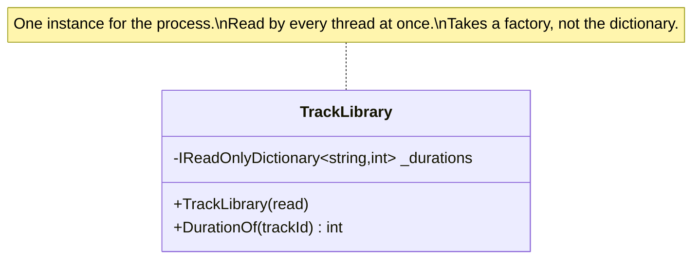

# Singleton Lifestyle

🌍 🇬🇧 English (this file) · 🇫🇷 [Français](SingletonLifestyle-fr.md)

## Intent

Singleton Lifestyle means one instance serves every consumer for the lifetime of the application, created
once and never replaced.

## Problem

The station's track library is forty thousand recordings with their duration, rights holder and territory
restrictions. Reading it takes eleven seconds, and every playout decision needs it.

So it is read once and shared by everything for as long as the process lives, and the composition root says
so:

```csharp
services.AddSingleton<TrackLibrary>();
```

That line is the whole record of the decision — and it says nothing about what the decision obliges the class
to be. A reader of `TrackLibrary` cannot tell that it is used concurrently, and a reader of the registration
cannot tell whether it is safe for that.

## Solution

The pattern is the lifetime; the annotation is what makes it a claim the class carries.

The annotation is not a description of what the container was told. It is a constraint the class has to
satisfy, written where the class is, and it is the only place that constraint is written down.

Two obligations follow, and neither is visible in the class itself. It is used concurrently, so it must be
thread-safe and hold nothing belonging to one caller. And everything it depends on outlives every consumer,
so a shorter-lived dependency reaching it is held long past the life it was given.

A rule can then check the two records against each other: every class marked here is registered once, and
every class registered once is marked. That is the point of annotating a lifestyle rather than trusting the
wiring.

## Structure



One class, and the whole content of the diagram is what the note says. A singleton has no structure; it has
obligations.

## The roles

| Role | Annotation | Applies to | What it carries |
|---|---|---|---|
| SingletonLifestyle | `[SingletonLifestyle]` | class, struct | A class of which exactly one instance exists. |

One role, on the class. The annotation is a claim about the class's obligations, not about the container's
configuration — which is why it belongs on the type rather than on the registration.

## The example

From [`SingletonLifestyleUsage.cs`](../../../../DesignPatternCatalog.Usage/DependencyInjection/SingletonLifestyleUsage.cs).

```csharp
[SingletonLifestyle]
public sealed class TrackLibrary {

    private readonly IReadOnlyDictionary<string, int> _durations;

    public TrackLibrary(Func<IReadOnlyDictionary<string, int>> read) {
        _durations = read();
    }

    public int DurationOf(string trackId) {
        return _durations.TryGetValue(trackId, out int seconds) ? seconds : 0;
    }

}
```

Three decisions, each one a consequence of the lifestyle.

**`IReadOnlyDictionary`, and `readonly`.** The first obligation is thread safety, and the cheapest way to get
it is to have nothing that can change. Nothing here may belong to one caller: a field remembering the last
query would be a field shared by everybody who ever queries.

**`Func<…>` rather than the dictionary itself.** This is the second obligation, and it is the one that bites
from outside. Everything this class depends on outlives every consumer, so a dependency with a shorter life
reaching in here is held far past the life it was given — a request-scoped connection captured by this class
would be used long after its request ended. Taking a factory rather than the thing lets the shorter-lived
dependency be created and released inside the call.

**No lazy initialisation, no lock.** The constructor reads eleven seconds' worth of data and is done. That is
possible because a singleton is constructed once, by the composition root, before any consumer exists — which
is a property of the lifestyle rather than of the class.

## Applicability

**Use the singleton lifestyle where one instance can serve every consumer for the application's lifetime.**

**Use it where creating the instance is expensive** and the cost should be paid once — eleven seconds, here,
paid at startup rather than per playout decision.

**Make the class thread-safe**, since it will be used concurrently, and let it hold nothing belonging to one
caller.

**Depend only on things that live at least as long**, or take a factory for those that do not. The book calls
the violation a *captive dependency*, and it is the failure this lifestyle causes most often.

## When not to use it

**Do not use it for a class that holds anything belonging to one caller.** A field that remembers the last
query, a cached user, a current transaction — all of them become shared by everybody, and the bug looks like
data belonging to the wrong request.

**Do not use it for a class that cannot be made thread-safe.** The lifestyle guarantees concurrent use;
making the class safe is not optional, and a lock around everything is a bottleneck rather than a solution.

**Do not let it depend on anything shorter-lived.** A scoped or transient dependency captured by a singleton
outlives its own lifetime — the book's captive dependency — and the failure is silent: the object still works,
against state that should have been discarded.

**Do not confuse it with the Gang of Four's Singleton pattern.** They are different things and this catalogue
holds both. The Gang of Four's is a class that enforces its own uniqueness and offers global access; this is a
registration decision made outside the class, and the class remains ordinary — constructible, injectable,
testable. A reader who conflates them ends up writing the one whose drawbacks the
[Singleton page](../gang-of-four/Singleton-en.md) sets out.

**Do not use it where the eleven seconds are not real.** A cheap class registered as a singleton buys nothing
and takes on both obligations for free.

## Advantages

* An expensive construction is paid once, at startup, rather than per consumer.
* Every consumer sees the same data, so there is no question of two views disagreeing.
* Memory is bounded: forty thousand recordings exist once regardless of load.
* The obligations are written where the class is, so a reader learns them without finding the registration.

## Drawbacks

* Thread safety becomes mandatory, and it is the class's problem rather than the container's.
* Nothing per-caller may be held, which constrains the design in ways the class itself does not explain.
* A shorter-lived dependency captured here is used long past its life, and nothing reports it.
* The instance lives for the process, so anything it holds is never released.

## Relations with other patterns

**`ScopedLifestyle`** and **`TransientLifestyle`** are the other two, and the mismatch between this one and
either of them is where the captive-dependency failure comes from.

**`CompositionRoot`** is where the lifestyle is chosen, and the only place the choice is otherwise recorded.

**`ConstructorInjection`** is how the factory arrives, and the reason it can be a `Func<…>` rather than the
thing itself.

**`AmbientContext`** is what a singleton is often reached for instead of, and the difference is the whole
point: a singleton is injected and declared, an ambient context is neither.

## Source

*Dependency Injection Principles, Practices, and Patterns*, Steven van Deursen and Mark Seemann, Manning,
2019 — chapter 8, object lifetime.

* [Index entry](../../../generated/catalog-index.md#singletonlifestyle-dependency-injection-principles-practices-and-patterns)
* [Generated attribute](../../../../DesignPatternCatalog.DependencyInjection/SingletonLifestyle.cs)
* [Example](../../../../DesignPatternCatalog.Usage/DependencyInjection/SingletonLifestyleUsage.cs)
