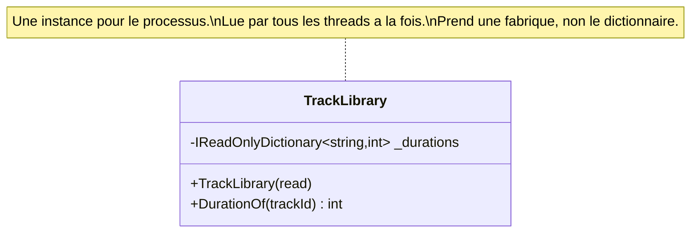

# Singleton Lifestyle

🌍 🇫🇷 Français (ce fichier) · 🇬🇧 [English](SingletonLifestyle-en.md)

## Intention

Singleton Lifestyle signifie qu'une instance sert tous les consommateurs pendant toute la vie de
l'application, créée une fois et jamais remplacée.

## Problème

La discothèque de la station compte quarante mille enregistrements, avec leur durée, leur ayant droit et leurs
restrictions de territoire. La lire prend onze secondes, et toute décision de diffusion en a besoin.

Elle est donc lue une fois et partagée par tout, aussi longtemps que vit le processus, et la racine de
composition le dit :

```csharp
services.AddSingleton<TrackLibrary>();
```

Cette ligne est toute la trace de la décision — et elle ne dit rien de ce que la décision oblige la classe à
être. Un lecteur de `TrackLibrary` ne peut pas savoir qu'elle est employée en concurrence, et un lecteur de
l'enregistrement ne peut pas savoir si elle est sûre pour cela.

## Solution

Le patron est la durée de vie ; l'annotation est ce qui en fait une revendication que la classe porte.

L'annotation n'est pas une description de ce qu'on a dit au conteneur. C'est une contrainte que la classe doit
satisfaire, écrite là où la classe est, et c'est le seul endroit où cette contrainte est consignée.

Deux obligations s'ensuivent, et aucune n'est visible dans la classe elle-même. Elle est employée en
concurrence : elle doit donc être sûre pour cela et ne rien détenir qui appartienne à un appelant. Et tout ce
dont elle dépend survit à tous les consommateurs : une dépendance à durée de vie plus courte qui l'atteint est
détenue bien au-delà de la vie qu'on lui avait donnée.

Une règle peut alors confronter les deux traces : toute classe marquée ici est enregistrée une fois, et toute
classe enregistrée une fois est marquée. C'est l'intérêt d'annoter une durée de vie plutôt que de se fier au
câblage.

## Structure



Une classe, et tout le contenu du diagramme est ce que dit la note. Un singleton n'a pas de structure ; il a
des obligations.

## Les rôles

| Rôle | Annotation | S'applique à | Ce qu'il porte |
|---|---|---|---|
| SingletonLifestyle | `[SingletonLifestyle]` | classe, struct | Une classe dont il existe exactement une instance. |

Un seul rôle, sur la classe. L'annotation est une revendication sur les obligations de la classe, non sur la
configuration du conteneur — et c'est pourquoi elle appartient au type plutôt qu'à l'enregistrement.

## L'exemple

Extrait de [`SingletonLifestyleUsage.cs`](../../../../DesignPatternCatalog.Usage/DependencyInjection/SingletonLifestyleUsage.cs).

```csharp
[SingletonLifestyle]
public sealed class TrackLibrary {

    private readonly IReadOnlyDictionary<string, int> _durations;

    public TrackLibrary(Func<IReadOnlyDictionary<string, int>> read) {
        _durations = read();
    }

    public int DurationOf(string trackId) {
        return _durations.TryGetValue(trackId, out int seconds) ? seconds : 0;
    }

}
```

Trois décisions, chacune conséquence de la durée de vie.

**`IReadOnlyDictionary`, et `readonly`.** La première obligation est la sûreté en concurrence, et le moyen le
moins cher de l'obtenir est de n'avoir rien qui puisse changer. Rien ici ne doit appartenir à un appelant : un
champ qui retiendrait la dernière requête serait un champ partagé par tous ceux qui interrogent.

**`Func<…>` plutôt que le dictionnaire lui-même.** C'est la seconde obligation, et celle qui mord depuis
l'extérieur. Tout ce dont cette classe dépend survit à tous les consommateurs : une dépendance à vie plus
courte qui l'atteint est détenue bien au-delà de la vie qu'on lui avait donnée — une connexion à portée de
requête capturée par cette classe serait employée longtemps après la fin de sa requête. Prendre une fabrique
plutôt que la chose permet à la dépendance plus courte d'être créée et relâchée dans l'appel.

**Aucune initialisation paresseuse, aucun verrou.** Le constructeur lit onze secondes de données et c'est
fini. C'est possible parce qu'un singleton est construit une fois, par la racine de composition, avant qu'aucun
consommateur existe — une propriété de la durée de vie plutôt que de la classe.

## Possibilités d'application

**Employez la durée de vie singleton là où une instance peut servir tous les consommateurs pendant toute la vie
de l'application.**

**Employez-la là où créer l'instance coûte cher** et où le coût doit être payé une fois — onze secondes ici,
payées au démarrage plutôt qu'à chaque décision de diffusion.

**Rendez la classe sûre en concurrence**, puisqu'elle sera employée concurremment, et ne lui laissez rien
détenir qui appartienne à un appelant.

**Ne dépendez que de choses qui vivent au moins aussi longtemps**, ou prenez une fabrique pour celles qui ne le
font pas. Le livre appelle la violation une *dépendance captive*, et c'est l'échec que cette durée de vie
provoque le plus souvent.

## Quand ne pas l'utiliser

**Ne l'employez pas pour une classe qui détient quoi que ce soit appartenant à un appelant.** Un champ qui
retient la dernière requête, un utilisateur en cache, une transaction courante — tous deviennent partagés par
tout le monde, et le défaut ressemble à des données appartenant à la mauvaise requête.

**Ne l'employez pas pour une classe qu'on ne peut pas rendre sûre en concurrence.** La durée de vie garantit
l'usage concurrent ; rendre la classe sûre n'est pas facultatif, et un verrou autour de tout est un goulet
plutôt qu'une solution.

**Ne la laissez pas dépendre de quoi que ce soit de plus court.** Une dépendance à portée ou transitoire
capturée par un singleton survit à sa propre durée de vie — la dépendance captive du livre — et l'échec est
silencieux : l'objet fonctionne toujours, contre un état qui aurait dû être jeté.

**Ne la confondez pas avec le patron Singleton du Gang of Four.** Ce sont deux choses différentes et ce
catalogue détient les deux. Celui du Gang of Four est une classe qui impose sa propre unicité et offre un accès
global ; ceci est une décision d'enregistrement prise hors de la classe, et la classe reste ordinaire —
constructible, injectable, testable. Un lecteur qui les confond finit par écrire celui dont la
[page Singleton](../gang-of-four/Singleton-fr.md) expose les inconvénients.

**Ne l'employez pas là où les onze secondes ne sont pas réelles.** Une classe peu coûteuse enregistrée en
singleton n'achète rien et endosse les deux obligations gratuitement.

## Avantages

* Une construction coûteuse est payée une fois, au démarrage, plutôt que par consommateur.
* Tous les consommateurs voient les mêmes données : il n'y a pas de question de deux vues qui divergent.
* La mémoire est bornée : quarante mille enregistrements existent une fois quelle que soit la charge.
* Les obligations sont écrites là où la classe est : un lecteur les apprend sans trouver l'enregistrement.

## Inconvénients

* La sûreté en concurrence devient obligatoire, et c'est le problème de la classe et non du conteneur.
* Rien de propre à un appelant ne peut être détenu, ce qui contraint la conception d'une façon que la classe
  elle-même n'explique pas.
* Une dépendance à vie plus courte capturée ici est employée bien au-delà de sa vie, et rien ne le signale.
* L'instance vit pour le processus : tout ce qu'elle détient n'est jamais relâché.

## Liens avec les autres patrons

**`ScopedLifestyle`** et **`TransientLifestyle`** sont les deux autres, et la discordance entre celle-ci et
l'une des deux est d'où vient l'échec de la dépendance captive.

**`CompositionRoot`** est l'endroit où la durée de vie est choisie, et le seul autre endroit où le choix est
consigné.

**`ConstructorInjection`** est la façon dont la fabrique arrive, et la raison pour laquelle ce peut être un
`Func<…>` plutôt que la chose elle-même.

**`AmbientContext`** est ce vers quoi on se tourne souvent à la place d'un singleton, et la différence est tout
le propos : un singleton est injecté et déclaré, un contexte ambiant n'est ni l'un ni l'autre.

## Source

*Dependency Injection Principles, Practices, and Patterns*, Steven van Deursen et Mark Seemann, Manning,
2019 — chapitre 8, la durée de vie des objets.

* [Entrée d'index](../../../generated/catalog-index.md#singletonlifestyle-dependency-injection-principles-practices-and-patterns)
* [Attribut généré](../../../../DesignPatternCatalog.DependencyInjection/SingletonLifestyle.cs)
* [Exemple](../../../../DesignPatternCatalog.Usage/DependencyInjection/SingletonLifestyleUsage.cs)
