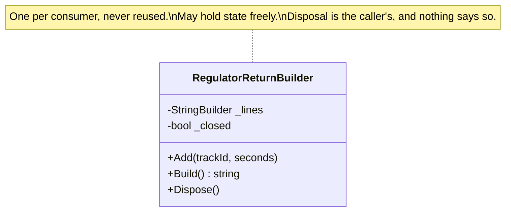

# Transient Lifestyle

🌍 🇬🇧 English (this file) · 🇫🇷 [Français](TransientLifestyle-fr.md)

## Intent

Transient Lifestyle means a new instance is created for every consumer that asks for one, and none is ever
reused.

## Problem

Building the hourly regulator return means accumulating three thousand play-out lines into one document. The
builder that does it is stateful by design — it is a buffer with a pen — and giving it a longer life than one
return would put January's lines in February's document.

So it is transient: a new one for each consumer that asks, and no reuse. That is the easy half.

The half worth annotating is what happens because it is `IDisposable`. The container hands it out and then
forgets it, so the disposal is somebody's job and there is no compiler and no container that will say whose.
The version before this one was resolved and never disposed, and the station leaked a file handle per hour for
five months.

## Solution

The lifestyle is the licence, and the annotation is where the obligation it leaves behind is written down.

A fresh instance is made for every consumer, so nothing of it survives the consumer that received it. That is
what lets the class be written as a buffer rather than as a function: it may hold state freely.

What the lifestyle does not settle is disposal. A container generally does not track what it hands out
transiently, so a disposable transient is a leak nothing reports — no exception, no failing test, just a handle
per hour. Whoever asks for one owns it, and the type says `IDisposable` and says nothing about who calls it.

## Structure



The class holds mutable state and a disposal method, and neither is a defect here. The note is what the
annotation adds to it.

## The roles

| Role | Annotation | Applies to | What it carries |
|---|---|---|---|
| TransientLifestyle | `[TransientLifestyle]` | class, struct | A class of which a fresh instance is made on each request. |

One role, on the class — a claim about the class's licence and its obligation, not a copy of the container's
registration.

## The example

From [`TransientLifestyleUsage.cs`](../../../../DesignPatternCatalog.Usage/DependencyInjection/TransientLifestyleUsage.cs).

```csharp
[TransientLifestyle]
public sealed class RegulatorReturnBuilder : IDisposable {

    private readonly StringBuilder _lines = new StringBuilder();

    private bool _closed;
```

A `StringBuilder` and a flag, both mutable, and neither guarded. That is the licence the lifestyle grants:
nothing of this instance survives the consumer that received it, which is why this class can be written as a
buffer rather than as a function.

Compare with [Singleton Lifestyle](SingletonLifestyle-en.md), where the same two fields would be a bug. The
three lifestyle pages are the same question — what may this class hold? — answered three ways.

```csharp
    public void Add(string trackId, int seconds) {
        if (_closed) { throw new ObjectDisposedException(nameof(RegulatorReturnBuilder)); }

        _lines.Append(trackId).Append(';').Append(seconds).Append('\n');
    }

    public string Build() {
        return _lines.ToString();
    }

    public void Dispose() {
        _closed = true;
    }

}
```

`Add` checks `_closed` and throws, which is the class doing what it can about a lifecycle nothing else
enforces. It cannot make the caller dispose it; it can make a use-after-dispose loud rather than silent.

The sample states where the obligation is written down, and it is worth reading as a statement about the
limits of types: *whoever asks for one owns it, and this remark is where that is written down — the type says
`IDisposable` and says nothing about who calls it.*

The version before this one was resolved and never disposed. Five months, one file handle per hour, no
exception, no failing test.

## Applicability

**Use the transient lifestyle where every consumer needs its own instance**, and sharing would make two
consumers interfere.

**Use it where the class is stateful by design.** The builder is a buffer, and the lifestyle is what makes that
safe rather than reckless.

**Use it where creation is cheap.** A new instance per consumer is the point, so the cost is paid every time.

**Decide who disposes, and write it down.** The container will not, so the obligation belongs in the class's
documentation or in a convention the codebase states.

## When not to use it

**Do not use it for an expensive class.** The construction cost is paid per consumer, which is the singleton
case turned inside out — eleven seconds per playout decision rather than eleven seconds at startup.

**Do not use it for a disposable class without deciding who disposes.** This is the failure the sample
records, and it is the one the lifestyle causes most: the container generally does not track transients, so
nothing disposes them and nothing reports that nothing did.

**Do not use it where consumers must agree.** Two consumers with their own transaction, their own identity map,
their own accumulated changes will not agree with each other — that is the scoped case.

**Do not register something transient and then capture it.** A singleton or scoped class holding a transient
keeps one instance alive for its own lifetime, which quietly converts the lifestyle into something else.

## Advantages

* Every consumer gets its own, so a stateful class is safe without locks or immutability.
* Nothing survives the consumer, so state cannot leak between two uses.
* The class can be written in the shape the problem wants — a buffer, an accumulator, a builder.
* No thread-safety obligation at all, since no two consumers share an instance.

## Drawbacks

* Construction is paid per consumer, which is wrong for anything expensive.
* Disposal is unowned by default: a disposable transient is a leak that produces no exception and no failing
  test.
* A longer-lived consumer that captures one silently changes its lifetime.
* Many short-lived instances put pressure on the allocator, which matters in a hot path.

## Relations with other patterns

**`ScopedLifestyle`** is the next life up, for a class that should be shared within a request rather than per
consumer.

**`SingletonLifestyle`** is the longest, and the three together are one decision: how long may this instance
live, and what may it therefore hold.

**`CompositionRoot`** is where the lifestyle is chosen, and where a `using` around the resolved instance would
sit.

**`ConstructorInjection`** is how a transient is usually supplied, and a `Func<…>` parameter is how a
longer-lived class gets a fresh one without capturing it.

## Source

*Dependency Injection Principles, Practices, and Patterns*, Steven van Deursen and Mark Seemann, Manning,
2019 — chapter 8, object lifetime.

* [Index entry](../../../generated/catalog-index.md#transientlifestyle-dependency-injection-principles-practices-and-patterns)
* [Generated attribute](../../../../DesignPatternCatalog.DependencyInjection/TransientLifestyle.cs)
* [Example](../../../../DesignPatternCatalog.Usage/DependencyInjection/TransientLifestyleUsage.cs)
