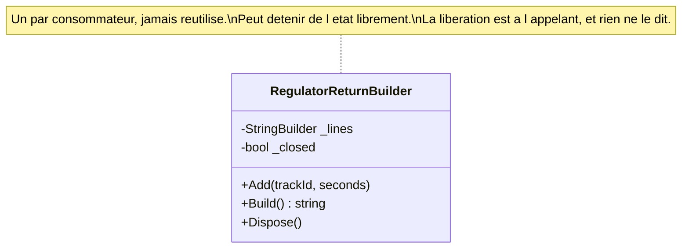

# Transient Lifestyle

🌍 🇫🇷 Français (ce fichier) · 🇬🇧 [English](TransientLifestyle-en.md)

## Intention

Transient Lifestyle signifie qu'une nouvelle instance est créée pour chaque consommateur qui en demande une, et
qu'aucune n'est jamais réutilisée.

## Problème

Construire la déclaration horaire au régulateur suppose d'accumuler trois mille lignes de diffusion en un seul
document. Le constructeur qui s'en charge est avec état par conception — c'est un tampon avec un stylo — et lui
donner une vie plus longue qu'une déclaration mettrait les lignes de janvier dans le document de février.

Il est donc transitoire : un nouveau pour chaque consommateur qui demande, et aucune réutilisation. C'est la
moitié facile.

La moitié qui mérite l'annotation est ce qui arrive parce qu'il est `IDisposable`. Le conteneur le distribue puis
l'oublie : la libération est le métier de quelqu'un, et il n'y a ni compilateur ni conteneur pour dire de qui. La
version précédente était résolue et jamais libérée, et la station a fui un descripteur de fichier par heure
pendant cinq mois.

## Solution

La durée de vie est la licence, et l'annotation est l'endroit où l'obligation qu'elle laisse derrière elle est
consignée.

Une instance neuve est faite pour chaque consommateur : rien d'elle ne survit au consommateur qui l'a reçue. C'est
ce qui permet d'écrire la classe comme un tampon plutôt que comme une fonction : elle peut détenir de l'état
librement.

Ce que la durée de vie ne règle pas, c'est la libération. Un conteneur ne suit généralement pas ce qu'il
distribue en transitoire : un transitoire libérable est donc une fuite que rien ne signale — pas d'exception, pas
de test en échec, juste un descripteur par heure. Qui en demande un le possède, et le type dit `IDisposable` et
ne dit rien de qui l'appelle.

## Structure



La classe détient un état mutable et une méthode de libération, et ni l'un ni l'autre n'est un défaut ici. La note
est ce que l'annotation y ajoute.

## Les rôles

| Rôle | Annotation | S'applique à | Ce qu'il porte |
|---|---|---|---|
| TransientLifestyle | `[TransientLifestyle]` | classe, struct | Une classe dont une instance neuve est faite à chaque demande. |

Un seul rôle, sur la classe — une revendication sur la licence de la classe et sur son obligation, non une copie
de l'enregistrement du conteneur.

## L'exemple

Extrait de [`TransientLifestyleUsage.cs`](../../../../DesignPatternCatalog.Usage/DependencyInjection/TransientLifestyleUsage.cs).

```csharp
[TransientLifestyle]
public sealed class RegulatorReturnBuilder : IDisposable {

    private readonly StringBuilder _lines = new StringBuilder();

    private bool _closed;
```

Un `StringBuilder` et un drapeau, tous deux mutables, et aucun protégé. C'est la licence que la durée de vie
accorde : rien de cette instance ne survit au consommateur qui l'a reçue, et c'est pourquoi cette classe peut
s'écrire comme un tampon plutôt que comme une fonction.

À comparer avec [Singleton Lifestyle](SingletonLifestyle-fr.md), où ces deux mêmes champs seraient un défaut. Les
trois pages de durée de vie sont la même question — que cette classe peut-elle détenir ? — répondue de trois
façons.

```csharp
    public void Add(string trackId, int seconds) {
        if (_closed) { throw new ObjectDisposedException(nameof(RegulatorReturnBuilder)); }

        _lines.Append(trackId).Append(';').Append(seconds).Append('\n');
    }

    public string Build() {
        return _lines.ToString();
    }

    public void Dispose() {
        _closed = true;
    }

}
```

`Add` contrôle `_closed` et lève, ce qui est la classe faisant ce qu'elle peut au sujet d'un cycle de vie que rien
d'autre n'impose. Elle ne peut pas forcer l'appelant à la libérer ; elle peut rendre bruyant, plutôt que
silencieux, un usage après libération.

L'exemple énonce où l'obligation est consignée, et cela mérite d'être lu comme une affirmation sur les limites des
types : *qui en demande un le possède, et cette remarque est l'endroit où cela est écrit — le type dit
`IDisposable` et ne dit rien de qui l'appelle.*

La version précédente était résolue et jamais libérée. Cinq mois, un descripteur de fichier par heure, aucune
exception, aucun test en échec.

## Possibilités d'application

**Employez la durée de vie transitoire là où chaque consommateur a besoin de sa propre instance**, et où le
partage ferait interférer deux consommateurs.

**Employez-la là où la classe est avec état par conception.** Le constructeur est un tampon, et la durée de vie
est ce qui rend cela sûr plutôt qu'imprudent.

**Employez-la là où la création est peu coûteuse.** Une instance neuve par consommateur est le propos : le coût
est payé chaque fois.

**Décidez qui libère, et écrivez-le.** Le conteneur ne le fera pas : l'obligation appartient à la documentation de
la classe ou à une convention que la base de code énonce.

## Quand ne pas l'utiliser

**Ne l'employez pas pour une classe coûteuse.** Le coût de construction est payé par consommateur, ce qui est le
cas singleton retourné — onze secondes par décision de diffusion au lieu de onze secondes au démarrage.

**Ne l'employez pas pour une classe libérable sans décider qui libère.** C'est l'échec que l'exemple consigne, et
celui que la durée de vie provoque le plus : un conteneur ne suit généralement pas les transitoires, donc rien ne
les libère et rien ne signale que rien ne l'a fait.

**Ne l'employez pas là où les consommateurs doivent s'accorder.** Deux consommateurs avec leur propre transaction,
leur propre table d'identité, leurs propres changements accumulés ne s'accorderont pas entre eux — c'est le cas à
portée.

**N'enregistrez pas en transitoire pour ensuite capturer.** Un singleton ou une classe à portée qui détient un
transitoire garde une instance vivante pour sa propre durée de vie, ce qui convertit silencieusement la durée de
vie en autre chose.

## Avantages

* Chaque consommateur a la sienne : une classe avec état est sûre sans verrous ni immuabilité.
* Rien ne survit au consommateur : l'état ne peut pas fuir d'un usage à l'autre.
* La classe peut s'écrire dans la forme que le problème demande — un tampon, un accumulateur, un constructeur.
* Aucune obligation de sûreté en concurrence, puisque deux consommateurs ne partagent jamais une instance.

## Inconvénients

* La construction est payée par consommateur, ce qui est faux pour tout ce qui coûte cher.
* La libération n'a pas de propriétaire par défaut : un transitoire libérable est une fuite qui ne produit ni
  exception ni test en échec.
* Un consommateur à vie plus longue qui en capture un change silencieusement sa durée de vie.
* Beaucoup d'instances éphémères mettent l'allocateur sous pression, ce qui compte sur un chemin chaud.

## Liens avec les autres patrons

**`ScopedLifestyle`** est la vie immédiatement supérieure, pour une classe à partager dans une requête plutôt que
par consommateur.

**`SingletonLifestyle`** est la plus longue, et les trois ensemble sont une seule décision : combien de temps
cette instance peut-elle vivre, et que peut-elle donc détenir.

**`CompositionRoot`** est l'endroit où la durée de vie est choisie, et où un `using` autour de l'instance résolue
se placerait.

**`ConstructorInjection`** est la façon dont un transitoire est d'ordinaire fourni, et un paramètre `Func<…>` est
la façon dont une classe à vie plus longue en obtient un neuf sans le capturer.

## Source

*Dependency Injection Principles, Practices, and Patterns*, Steven van Deursen et Mark Seemann, Manning,
2019 — chapitre 8, la durée de vie des objets.

* [Entrée d'index](../../../generated/catalog-index.md#transientlifestyle-dependency-injection-principles-practices-and-patterns)
* [Attribut généré](../../../../DesignPatternCatalog.DependencyInjection/TransientLifestyle.cs)
* [Exemple](../../../../DesignPatternCatalog.Usage/DependencyInjection/TransientLifestyleUsage.cs)
