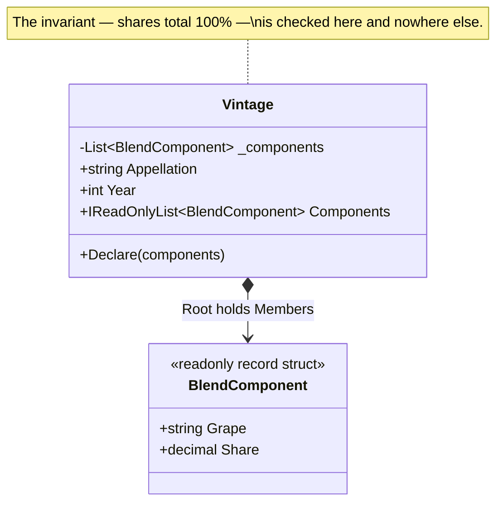

# Aggregate

🌍 🇬🇧 English (this file) · 🇫🇷 [Français](Aggregate-fr.md)

## Intent

Aggregate is a building block of a model-driven design for a cluster of entities and value objects
treated as one unit for the purpose of data changes, with a single root that everything outside the
boundary must go through.

## Problem

A wine vintage is a blend, and a blend is not a list of components. It is a list of components whose
proportions add up to exactly one hundred percent — the appellation rules are checked on the
declaration, and a blend that does not sum is not a draft, it is wrong.

Written as an open collection, nothing can hold that rule:

```csharp
public sealed class Vintage {
    public List<BlendComponent> Components { get; } = new();
}

vintage.Components.Add(new BlendComponent("Merlot", 60m));   // 60% and valid, apparently
```

The invariant spans several objects, so no single component can enforce it: each one only knows its own
share. And the property hands out the list itself, so any caller anywhere can add to it without passing
through a check that does not exist. The rule survives only as a comment.

## Solution

The pattern draws a boundary and puts one object in charge of it.

The components are clustered with the vintage, and the vintage becomes the root: the only member that
anything outside may hold a reference to, and the only participant that can see the whole and therefore
enforce a rule about the whole. Every change from outside goes through it.

The boundary is what makes the rule enforceable rather than merely stated. Once no caller can reach a
component except through the root, there is no path by which the invariant can be bypassed — not because
everyone remembers, but because the shape does not offer one.

## Structure



The filled diamond is the boundary. Nothing outside the diagram is permitted an arrow to
`BlendComponent`, and that prohibition is the pattern.

## The roles

| Role | Annotation | Applies to | What it carries |
|---|---|---|---|
| Root | `[Aggregate.Root]` | class | The single entity by which the aggregate is referenced from outside, and the only participant allowed to enforce the invariants that span the boundary. |
| Member | `[Aggregate.Member(Root = typeof(…))]` | class, struct | A participant living inside the boundary, reachable only through the root and never referenced by anything outside it. |

The member names its root, which is what makes the boundary readable from the code rather than inferred
from a diagram. Both annotations are repeatable, so a type that takes part in more than one aggregate can
say so instead of picking one.

## The example

From [`AggregateUsage.cs`](../../../../DesignPatternCatalog.Usage/DomainDrivenDesign/AggregateUsage.cs).

```csharp
[Aggregate.Root]
[Entity]
public sealed class Vintage {

    private readonly List<BlendComponent> _components = new();

    public Vintage(string appellation, int year) {
        Appellation = appellation;
        Year        = year;
    }
```

Two annotations on one class, and both are true: the root of an aggregate is an entity, because
something outside has to be able to refer to it, and referring requires an identity. The book states this
as part of the pattern rather than as a coincidence.

```csharp
    // Read-only on the way out: the only way to change the blend is the method below, which is
    // the only place the invariant is known.
    public IReadOnlyList<BlendComponent> Components => _components;

    public void Declare(params BlendComponent[] components) {
        decimal total = components.Sum(component => component.Share);

        // The invariant of the whole, checked by the only participant that can see the whole.
        if (total != 100m) { throw new InvalidOperationException($"A blend must total 100%, not {total}%."); }

        _components.Clear();
        _components.AddRange(components);
    }

}
```

The field is private and the property returns `IReadOnlyList`, so the only way to change the blend is the
method that knows the rule. A `List<BlendComponent>` exposed as a property would have made the invariant
a comment — which is exactly what the problem above shows.

`Declare` takes the whole blend at once rather than offering `Add`. That is not a stylistic choice: a
blend is only ever valid as a whole, so there is no intermediate state to expose. An `Add` would have to
either accept a 60% blend or refuse every component but the last.

```csharp
[Aggregate.Member(Root = typeof(Vintage))]
[ValueObject]
public readonly record struct BlendComponent(string Grape, decimal Share) {

    // A member of the boundary, and a value object besides: two blend components carrying the
    // same grape and the same share are the same statement about the wine, not two of them.

}
```

Two annotations again, and the second is what makes the member the safest kind there is: something
without an identity of its own cannot be referred to from outside even by accident.

Notice what is absent. No component is reachable by identity from outside — a caller cannot hold a
`BlendComponent` and ask the system about it, it asks the vintage. That is what makes the boundary real
rather than decorative, and it is what a rule over these annotations can check: no repository for a
member, and no member in a public signature outside its root.

## Applicability

**Use Aggregate when invariants involve relationships between several objects**, so that no single one of
them can enforce the rule.

**Cluster the entities and value objects into aggregates and define a boundary around each**, choosing
one entity as the root and controlling all access to the objects inside through it.

**Allow external objects to hold a reference to the root only.** The book permits a transient reference
to an internal member to be passed out for use within a single operation, and no longer.

**Use Aggregate to mark the scope of a change.** The book's rule is that when a change to any object
inside the boundary is committed, every invariant of the whole aggregate must be satisfied — which makes
the aggregate the unit in which consistency is stated.

## When not to use it

**Do not use Aggregate where there is no invariant spanning several objects.** The boundary buys the
enforcement of a rule about a whole; where the rule is about one object, that object is the whole, and
drawing a boundary around it adds a name and no guarantee.

**Do not draw a boundary that transaction and contention cannot bear.** This is a judgement the field
formed after the book — Vaughn Vernon's *Effective Aggregate Design* (2011) is where it was argued at
length — and it is worth stating because the failure is expensive: an aggregate that must be loaded and
locked whole becomes a bottleneck once several users touch it at once. The rule of thumb the field
settled on is to keep aggregates small and to reference other aggregates by identity rather than by
object.

**Do not use Aggregate to model a mere containment.** A vintage having components is not sufficient
reason; the question is whether something must be true of them together at every commit. A parent that
merely owns a list of children, with each child valid on its own, is a collection.

**Do not treat every entity as an aggregate root.** A root is the entity that the outside refers to, and
the pattern's benefit comes from there being fewer of them than there are entities. When every entity has
a repository and a global identity, the boundary is gone and only the vocabulary remains.

## Advantages

* An invariant that spans several objects becomes enforceable, because one participant can see the whole
  and every path goes through it.
* The number of objects the outside can refer to drops, which is what makes a large model navigable.
* Loading, saving and deleting have an obvious unit — the aggregate — instead of a per-class decision.
* The boundary is checkable: no repository for a member, and no member in a public signature outside its
  root.

## Drawbacks

* The boundary is a commitment, and the wrong one is costly to move once repositories, queries and
  transactions have been built on it.
* A large aggregate becomes a point of contention, since consistency of the whole is required at every
  commit.
* Going through the root is more code than reaching for the member, and the extra hop looks gratuitous
  until the day it is what prevents a bad write.
* Nothing in the language enforces any of it: the annotations record the boundary, and only a rule
  written over them can refuse a crossing.

## Relations with other patterns

**`Entity`** is what a root must be, since something outside refers to it and referring requires an
identity.

**`ValueObject`** is what members frequently are, and the safest kind of member: something with no
identity of its own cannot be referenced from outside in the first place.

**`Repository`** is provided for roots and for roots only. One repository per aggregate root, not one per
table, is the practical consequence of the boundary.

**`Factory`** is often what creates an aggregate, because assembling several participants into a state
that already satisfies the invariant is more than a constructor should carry.

## Source

*Domain-Driven Design: Tackling Complexity in the Heart of Software*, Eric Evans, Addison-Wesley, 2003 —
chapter 6, the life cycle of a domain object.

* [Index entry](../../../generated/catalog-index.md#aggregate-domain-driven-design)
* [Generated attribute](../../../../DesignPatternCatalog.DomainDrivenDesign/Aggregate.cs)
* [Example](../../../../DesignPatternCatalog.Usage/DomainDrivenDesign/AggregateUsage.cs)
