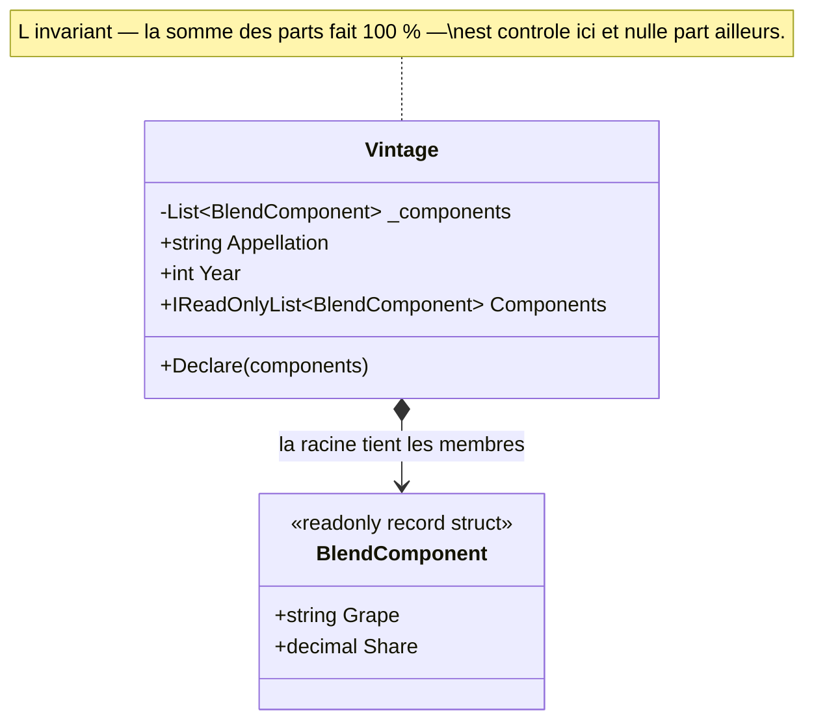

# Aggregate

🌍 🇫🇷 Français (ce fichier) · 🇬🇧 [English](Aggregate-en.md)

## Intention

Aggregate est une brique de la conception pilotée par le modèle, pour un groupe d'entités et
d'objets-valeurs traité comme une unité au regard des changements de données, avec une racine unique par
laquelle tout ce qui est extérieur à la frontière doit passer.

## Problème

Un millésime est un assemblage, et un assemblage n'est pas une liste de composants. C'est une liste de
composants dont les proportions font exactement cent pour cent — les règles d'appellation sont contrôlées
à la déclaration, et un assemblage qui ne fait pas le compte n'est pas un brouillon, il est faux.

Écrit en collection ouverte, rien ne peut porter cette règle :

```csharp
public sealed class Vintage {
    public List<BlendComponent> Components { get; } = new();
}

vintage.Components.Add(new BlendComponent("Merlot", 60m));   // 60 %, et valide, apparemment
```

L'invariant traverse plusieurs objets, donc aucun composant seul ne peut l'imposer : chacun ne connaît
que sa part. Et la propriété distribue la liste elle-même, si bien que n'importe quel appelant peut y
ajouter sans passer par un contrôle qui n'existe pas. La règle ne survit qu'en commentaire.

## Solution

Le patron trace une frontière et met un objet en charge de celle-ci.

Les composants sont groupés avec le millésime, et le millésime devient la racine : le seul membre auquel
l'extérieur puisse tenir une référence, et le seul participant qui voie le tout et puisse donc imposer
une règle sur le tout. Tout changement venu de l'extérieur passe par lui.

La frontière est ce qui rend la règle applicable plutôt que simplement énoncée. Dès lors qu'aucun
appelant ne peut atteindre un composant autrement que par la racine, il n'existe aucun chemin par lequel
l'invariant puisse être contourné — non parce que tout le monde y pense, mais parce que la forme n'en
offre aucun.

## Structure



Le losange plein est la frontière. Rien d'extérieur au diagramme n'a le droit à une flèche vers
`BlendComponent`, et cette interdiction est le patron.

## Les rôles

| Rôle | Annotation | S'applique à | Ce qu'il porte |
|---|---|---|---|
| Root | `[Aggregate.Root]` | classe | L'entité unique par laquelle l'agrégat est référencé de l'extérieur, et le seul participant autorisé à imposer les invariants qui traversent la frontière. |
| Member | `[Aggregate.Member(Root = typeof(…))]` | classe, struct | Un participant qui vit à l'intérieur de la frontière, atteignable seulement par la racine et jamais référencé de l'extérieur. |

Le membre nomme sa racine, ce qui rend la frontière lisible depuis le code plutôt que déduite d'un
schéma. Les deux annotations sont répétables : un type qui participe à plus d'un agrégat peut le dire au
lieu d'en choisir un.

## L'exemple

Extrait de [`AggregateUsage.cs`](../../../../DesignPatternCatalog.Usage/DomainDrivenDesign/AggregateUsage.cs).

```csharp
[Aggregate.Root]
[Entity]
public sealed class Vintage {

    private readonly List<BlendComponent> _components = new();

    public Vintage(string appellation, int year) {
        Appellation = appellation;
        Year        = year;
    }
```

Deux annotations sur une classe, et les deux sont vraies : la racine d'un agrégat est une entité, parce
qu'il faut que l'extérieur puisse s'y référer, et se référer suppose une identité. Le livre l'énonce
comme une part du patron et non comme une coïncidence.

```csharp
    // Read-only on the way out: the only way to change the blend is the method below, which is
    // the only place the invariant is known.
    public IReadOnlyList<BlendComponent> Components => _components;

    public void Declare(params BlendComponent[] components) {
        decimal total = components.Sum(component => component.Share);

        // The invariant of the whole, checked by the only participant that can see the whole.
        if (total != 100m) { throw new InvalidOperationException($"A blend must total 100%, not {total}%."); }

        _components.Clear();
        _components.AddRange(components);
    }

}
```

Le champ est privé et la propriété rend un `IReadOnlyList`, si bien que le seul moyen de changer
l'assemblage est la méthode qui connaît la règle. Un `List<BlendComponent>` exposé en propriété aurait
fait de l'invariant un commentaire — ce que montre précisément le problème plus haut.

`Declare` prend l'assemblage entier d'un coup au lieu d'offrir un `Add`. Ce n'est pas un choix de style :
un assemblage n'est jamais valide qu'en entier, il n'y a donc pas d'état intermédiaire à exposer. Un
`Add` devrait soit accepter un assemblage à 60 %, soit refuser tous les composants sauf le dernier.

```csharp
[Aggregate.Member(Root = typeof(Vintage))]
[ValueObject]
public readonly record struct BlendComponent(string Grape, decimal Share) {

    // A member of the boundary, and a value object besides: two blend components carrying the
    // same grape and the same share are the same statement about the wine, not two of them.

}
```

Deux annotations à nouveau, et la seconde fait du membre l'espèce la plus sûre qui soit : ce qui n'a pas
d'identité propre ne peut être désigné de l'extérieur, fût-ce par accident.

Remarquer ce qui est absent. Aucun composant n'est atteignable par identité depuis l'extérieur — un
appelant ne peut pas tenir un `BlendComponent` et interroger le système à son sujet, il interroge le
millésime. C'est ce qui rend la frontière réelle plutôt que décorative, et c'est ce qu'une règle portant
sur ces annotations peut contrôler : pas de dépôt pour un membre, pas de membre dans une signature
publique hors de sa racine.

## Possibilités d'application

**Utilisez Aggregate lorsque des invariants portent sur des relations entre plusieurs objets**, de sorte
qu'aucun d'eux pris seul ne peut imposer la règle.

**Groupez les entités et les objets-valeurs en agrégats et tracez une frontière autour de chacun**, en
choisissant une entité pour racine et en contrôlant par elle tout accès aux objets intérieurs.

**N'autorisez les objets extérieurs à tenir une référence qu'à la racine.** Le livre permet qu'une
référence transitoire vers un membre interne soit passée à l'extérieur pour la durée d'une seule
opération, et pas au-delà.

**Utilisez Aggregate pour marquer la portée d'un changement.** La règle du livre est que, lorsqu'un
changement sur un objet intérieur à la frontière est validé, tous les invariants de l'agrégat entier
doivent être satisfaits — ce qui fait de l'agrégat l'unité dans laquelle la cohérence est énoncée.

## Quand ne pas l'utiliser

**N'utilisez pas Aggregate là où aucun invariant ne traverse plusieurs objets.** La frontière achète
l'application d'une règle sur un tout ; là où la règle porte sur un objet, cet objet est le tout, et
tracer une frontière autour ajoute un nom et aucune garantie.

**Ne tracez pas une frontière que la transaction et la contention ne peuvent porter.** C'est un jugement
que la profession a formé après le livre — *Effective Aggregate Design* de Vaughn Vernon (2011) est
l'endroit où il a été argumenté en détail — et il vaut d'être énoncé parce que l'échec coûte cher : un
agrégat qu'il faut charger et verrouiller en entier devient un goulet dès que plusieurs utilisateurs y
touchent en même temps. La règle empirique retenue par la profession est de garder les agrégats petits et
de référencer les autres agrégats par identité plutôt que par objet.

**N'utilisez pas Aggregate pour modéliser une simple contenance.** Qu'un millésime ait des composants ne
suffit pas ; la question est de savoir si quelque chose doit être vrai d'eux ensemble à chaque validation.
Un parent qui possède une liste d'enfants valides chacun de son côté est une collection.

**Ne traitez pas chaque entité comme une racine d'agrégat.** Une racine est l'entité à laquelle
l'extérieur se réfère, et le bénéfice du patron vient de ce qu'il y en a moins qu'il n'y a d'entités.
Quand chaque entité a un dépôt et une identité globale, la frontière a disparu et il ne reste que le
vocabulaire.

## Avantages

* Un invariant qui traverse plusieurs objets devient applicable, parce qu'un participant voit le tout et
  que tous les chemins passent par lui.
* Le nombre d'objets auxquels l'extérieur peut se référer diminue, ce qui est ce qui rend un grand modèle
  navigable.
* Charger, enregistrer et supprimer ont une unité évidente — l'agrégat — au lieu d'une décision par
  classe.
* La frontière est contrôlable : pas de dépôt pour un membre, pas de membre dans une signature publique
  hors de sa racine.

## Inconvénients

* La frontière est un engagement, et la déplacer coûte cher une fois que dépôts, requêtes et transactions
  ont été bâtis dessus.
* Un gros agrégat devient un point de contention, puisque la cohérence du tout est exigée à chaque
  validation.
* Passer par la racine fait plus de code que d'atteindre le membre, et le détour paraît gratuit jusqu'au
  jour où c'est lui qui empêche une mauvaise écriture.
* Rien dans le langage n'impose quoi que ce soit de tout cela : les annotations consignent la frontière,
  et seule une règle écrite sur elles peut refuser un franchissement.

## Liens avec les autres patrons

**`Entity`** est ce que doit être une racine, puisque l'extérieur s'y réfère et que se référer suppose une
identité.

**`ValueObject`** est ce que sont souvent les membres, et l'espèce de membre la plus sûre : ce qui n'a pas
d'identité propre ne peut de toute façon pas être référencé de l'extérieur.

**`Repository`** est fourni pour les racines et pour elles seules. Un dépôt par racine d'agrégat, non un
par table, est la conséquence pratique de la frontière.

**`Factory`** est souvent ce qui crée un agrégat, parce qu'assembler plusieurs participants dans un état
satisfaisant déjà l'invariant est davantage qu'un constructeur ne devrait porter.

## Source

*Domain-Driven Design: Tackling Complexity in the Heart of Software*, Eric Evans, Addison-Wesley, 2003 —
chapitre 6, le cycle de vie d'un objet du domaine.

* [Entrée d'index](../../../generated/catalog-index.md#aggregate-domain-driven-design)
* [Attribut généré](../../../../DesignPatternCatalog.DomainDrivenDesign/Aggregate.cs)
* [Exemple](../../../../DesignPatternCatalog.Usage/DomainDrivenDesign/AggregateUsage.cs)
