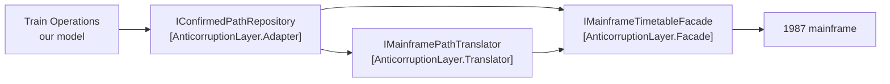

# Anticorruption Layer

🌍 🇬🇧 English (this file) · 🇫🇷 [Français](AnticorruptionLayer-fr.md)

## Intent

Anticorruption Layer is an isolating layer through which a downstream context talks to an upstream one, so
that the upstream model never reaches the downstream one.

## Problem

Regional rail. Paths are ultimately confirmed by a system written in 1987. It answers with fixed-width
records, it calls a section a `TRACK-SEG`, it encodes a time as an integer number of minutes since
midnight that goes past 1440 for trains running after midnight, and it reports a cancelled path as one
with an entry time of 9999.

None of that is negotiable: the mainframe is upstream, it has other consumers, and it will outlive this
project.

Left alone, that model creeps:

```csharp
public bool IsConfirmed(int entryMinutes) => entryMinutes != 9999;
```

One method takes an `int` because *the mainframe gives us minutes*. Then a field keeps a `TRACK-SEG`
string because converting felt wasteful. Within a year the operations model is reasoning about 9999 — a
concept it has no name for and no rule about.

## Solution

The pattern builds a wall, and puts three distinct jobs in it.

An isolating layer provides clients with functionality in terms of their own model. It talks to the other
system through that system's existing interface, requiring little or no modification to it, and
internally translates in both directions as necessary between the two models.

The value is in keeping the three jobs distinct rather than in having a wall at all:

* the **facade** simplifies the upstream system, still speaking the upstream language;
* the **translator** converts between the two models, and is the only thing that knows both;
* the **adapter** is what the downstream model calls, and speaks only the downstream language.

The test that the layer works is mechanical: no upstream type appears in any signature outside it.

## Structure



The wall runs between the adapter and the facade. To its left everything speaks the downstream language;
to its right, the upstream one. The translator is the only box that stands on both sides.

## The roles

| Role | Annotation | Applies to | What it carries |
|---|---|---|---|
| Facade | `[AnticorruptionLayer.Facade]` | interface, class | A simplified face over the upstream system, written in terms of the **upstream** model. It translates nothing. |
| Translator | `[AnticorruptionLayer.Translator]` | interface, class | Converts between the two models, in both directions. It is the only place that knows both. |
| Adapter | `[AnticorruptionLayer.Adapter(Facade = …, Translator = …)]` | interface, class | What the downstream context actually calls. No upstream type ever appears in a downstream signature. |

All three are repeatable, since one context may face more than one upstream system. The adapter names its
facade and its translator, which is what makes the layer readable as a unit rather than as three
unrelated interfaces.

## The example

From [`AnticorruptionLayerUsage.cs`](../../../../DesignPatternCatalog.Usage.TrainOperations/AnticorruptionLayerUsage.cs).

```csharp
/// <summary>
///     A record as the 1987 system returns it. Deliberately ugly: this is not ours to fix.
/// </summary>
public sealed record MainframePathRecord(string TrackSeg, int EntryMinutes, int ExitMinutes);
```

The upstream model, reproduced rather than improved. A layer that tidied it would be translating in the
wrong place, and would still have to face whatever the mainframe actually sends.

```csharp
[AnticorruptionLayer.Facade]
public interface IMainframeTimetableFacade {

    IReadOnlyCollection<MainframePathRecord> PathsForDay(string operatorCode, DateOnly day);

}
```

Easier to call, and still entirely in the mainframe's terms — `TrackSeg` and minutes-since-midnight are
still here. That restraint is the pattern rather than an oversight: a facade that started converting would
be doing the translator's job, and there would be two places that know both models.

```csharp
[AnticorruptionLayer.Translator]
public interface IMainframePathTranslator {

    ConfirmedPath? ToConfirmedPath(MainframePathRecord record);

}
```

The only thing in the codebase that knows both models. Everything the upstream system gets wrong by the
downstream lights is dealt with here and nowhere else: the 9999 sentinel becomes an absent path — which is
what the nullable return type is for — and minutes past 1440 become a time on the following day.

One file to review when the mainframe changes, and one file to read when a number looks wrong.

```csharp
[AnticorruptionLayer.Adapter(Facade = typeof(IMainframeTimetableFacade), Translator = typeof(IMainframePathTranslator))]
public interface IConfirmedPathRepository {

    IReadOnlyCollection<ConfirmedPath> ConfirmedFor(Operator holder, DateOnly day);

}
```

What train operations calls. `Operator`, `ConfirmedPath`, `DateOnly` — nothing upstream appears in the
signature, and that is the whole test. The name is the downstream model's own: it is a repository, because
that is what the operations model wanted, not a *gateway* named after the thing on the other side.

```csharp
public sealed record ConfirmedPath(SectionId Section, DateTimeOffset Entry, DateTimeOffset Exit);
```

A `SectionId` from the shared kernel and two `DateTimeOffset`s. Compare with `MainframePathRecord` above:
same three fields, and every one of them has changed type. That is what the translator does for a living.

## Applicability

**Create an isolating layer to provide clients with functionality in terms of their own domain model**,
when the other system's model is one the downstream model must not adopt.

**Talk to the other system through its existing interface**, requiring little or no modification to it —
which is what makes the pattern available when the upstream system cannot be changed.

**Translate in both directions as necessary between the two models**, inside the layer.

**Expose the layer as a set of services**, which is the form the book says its public interface usually
takes, though occasionally it takes the form of an entity.

## When not to use it

**Do not build one where the upstream model is fine to adopt.** The layer exists to keep a model out. If
the other system's vocabulary is one the downstream model would happily speak, the layer is translation
between two names for the same thing.

**Do not underestimate the cost.** The book says plainly that creating an anticorruption layer is not a
trivial undertaking. It is three interfaces, their implementations, and a translation that has to be
maintained as the upstream system moves — paid for by a model that stays clean.

**Do not let the facade translate.** The moment it does, two places know both models, and the property
that makes the translator reviewable — one file, one direction of ugliness — is gone.

**Do not let an upstream type escape.** One `int` parameter, one `TRACK-SEG` string kept in a field, and
the layer is decorative. This is the failure the annotations exist to make checkable.

**Do not use it where both sides can agree.** Two teams that can negotiate have cheaper options: a shared
kernel, or an open host service on the upstream side. The layer is for the case where the other side is
not going to change for anyone.

## Advantages

* The downstream model stays in its own terms, and none of the upstream system's decisions leak into it.
* Everything the upstream system gets wrong is handled in one reviewable file.
* The upstream system needs no modification, which is what makes the pattern available at all when it is
  a mainframe with other consumers.
* Replacing the upstream system touches the layer and nothing else.
* The test is mechanical — no upstream type in a downstream signature — so a rule over the annotations can
  check it.

## Drawbacks

* It is expensive: three roles, their implementations, and a translation to maintain.
* The translation costs at run time as well, on every call across the wall.
* It can hide upstream failure modes behind a tidy interface, so a downstream caller may not learn what
  it needs to know.
* The layer has to move whenever the upstream system does, and it is the first thing to rot when nobody
  owns it.

## Relations with other patterns

**`BoundedContext`** is what the layer defends. Without a boundary there is nothing for the upstream model
to corrupt.

**`OpenHostService`** is the same problem seen from the upstream side: instead of every consumer building
a layer, the provider publishes one protocol for all of them.

**`SharedKernel`** is the alternative when both sides can agree. The layer needs no agreement, which is why
it works against a system that will not negotiate.

**`Service`** is the form the book says the layer's public interface usually takes.

**`Facade`** and **`Adapter`** are the Gang of Four patterns the book borrows the names from, and the
correspondence is deliberate — though here they are two of three roles in a larger arrangement rather than
patterns in their own right.

## Source

*Domain-Driven Design: Tackling Complexity in the Heart of Software*, Eric Evans, Addison-Wesley, 2003 —
chapter 14, maintaining model integrity.

* [Index entry](../../../generated/catalog-index.md#anticorruptionlayer-domain-driven-design)
* [Generated attribute](../../../../DesignPatternCatalog.DomainDrivenDesign/AnticorruptionLayer.cs)
* [Example](../../../../DesignPatternCatalog.Usage.TrainOperations/AnticorruptionLayerUsage.cs)
