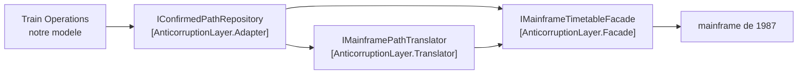

# Anticorruption Layer

🌍 🇫🇷 Français (ce fichier) · 🇬🇧 [English](AnticorruptionLayer-en.md)

## Intention

Anticorruption Layer est une couche d'isolement par laquelle un contexte aval parle à un contexte amont,
de sorte que le modèle amont n'atteigne jamais le modèle aval.

## Problème

Réseau ferroviaire régional. Les sillons sont en dernier ressort confirmés par un système écrit en 1987.
Il répond par des enregistrements à largeur fixe, il appelle une section un `TRACK-SEG`, il code une heure
en nombre entier de minutes depuis minuit qui dépasse 1440 pour les trains circulant après minuit, et il
signale un sillon annulé par une heure d'entrée de 9999.

Rien de cela n'est négociable : le mainframe est en amont, il a d'autres consommateurs, et il survivra à
ce projet.

Laissé à lui-même, ce modèle s'infiltre :

```csharp
public bool IsConfirmed(int entryMinutes) => entryMinutes != 9999;
```

Une méthode prend un `int` parce que « le mainframe nous donne des minutes ». Puis un champ conserve une
chaîne `TRACK-SEG` parce que convertir paraissait du gâchis. En un an, le modèle d'exploitation raisonne
sur 9999 — un concept dont il n'a ni nom ni règle.

## Solution

Le patron bâtit un mur, et y loge trois métiers distincts.

Une couche d'isolement fournit aux clients des fonctionnalités dans les termes de leur propre modèle. Elle
parle à l'autre système par l'interface existante de celui-ci, sans exiger de lui presque aucune
modification, et traduit en interne dans les deux sens entre les deux modèles.

La valeur est dans le fait de garder les trois métiers distincts, plus que dans l'existence du mur :

* la **façade** simplifie le système amont, en parlant toujours la langue amont ;
* le **traducteur** convertit entre les deux modèles, et est la seule chose qui connaisse les deux ;
* l'**adaptateur** est ce que le modèle aval appelle, et ne parle que la langue aval.

Le test que la couche fonctionne est mécanique : aucun type amont n'apparaît dans une signature hors
d'elle.

## Structure



Le mur passe entre l'adaptateur et la façade. À sa gauche tout parle la langue aval ; à sa droite, la
langue amont. Le traducteur est la seule boîte qui se tienne des deux côtés.

## Les rôles

| Rôle | Annotation | S'applique à | Ce qu'il porte |
|---|---|---|---|
| Facade | `[AnticorruptionLayer.Facade]` | interface, classe | Une face simplifiée sur le système amont, écrite dans les termes du modèle **amont**. Elle ne traduit rien. |
| Translator | `[AnticorruptionLayer.Translator]` | interface, classe | Convertit entre les deux modèles, dans les deux sens. C'est le seul endroit qui connaisse les deux. |
| Adapter | `[AnticorruptionLayer.Adapter(Facade = …, Translator = …)]` | interface, classe | Ce que le contexte aval appelle réellement. Aucun type amont n'apparaît jamais dans une signature aval. |

Les trois sont répétables, puisqu'un contexte peut faire face à plus d'un système amont. L'adaptateur
nomme sa façade et son traducteur, ce qui rend la couche lisible comme une unité plutôt que comme trois
interfaces sans rapport.

## L'exemple

Extrait de [`AnticorruptionLayerUsage.cs`](../../../../DesignPatternCatalog.Usage.TrainOperations/AnticorruptionLayerUsage.cs).

```csharp
/// <summary>
///     A record as the 1987 system returns it. Deliberately ugly: this is not ours to fix.
/// </summary>
public sealed record MainframePathRecord(string TrackSeg, int EntryMinutes, int ExitMinutes);
```

Le modèle amont, reproduit plutôt qu'amélioré. Une couche qui le rangerait traduirait au mauvais endroit,
et devrait de toute façon faire face à ce que le mainframe envoie réellement.

```csharp
[AnticorruptionLayer.Facade]
public interface IMainframeTimetableFacade {

    IReadOnlyCollection<MainframePathRecord> PathsForDay(string operatorCode, DateOnly day);

}
```

Plus facile à appeler, et toujours entièrement dans les termes du mainframe — `TrackSeg` et les minutes
depuis minuit sont toujours là. Cette retenue est le patron plutôt qu'un oubli : une façade qui se mettrait
à convertir ferait le métier du traducteur, et il y aurait deux endroits connaissant les deux modèles.

```csharp
[AnticorruptionLayer.Translator]
public interface IMainframePathTranslator {

    ConfirmedPath? ToConfirmedPath(MainframePathRecord record);

}
```

La seule chose de la base de code qui connaisse les deux modèles. Tout ce que le système amont fait mal du
point de vue aval est traité ici et nulle part ailleurs : la sentinelle 9999 devient un sillon absent — ce
à quoi sert le type de retour nullable — et les minutes au-delà de 1440 deviennent une heure du lendemain.

Un fichier à relire quand le mainframe change, et un fichier à lire quand un nombre paraît faux.

```csharp
[AnticorruptionLayer.Adapter(Facade = typeof(IMainframeTimetableFacade), Translator = typeof(IMainframePathTranslator))]
public interface IConfirmedPathRepository {

    IReadOnlyCollection<ConfirmedPath> ConfirmedFor(Operator holder, DateOnly day);

}
```

Ce qu'appelle l'exploitation. `Operator`, `ConfirmedPath`, `DateOnly` — rien d'amont n'apparaît dans la
signature, et c'est tout le test. Le nom est celui du modèle aval : c'est un dépôt, parce que c'est ce que
le modèle d'exploitation voulait, non une *passerelle* nommée d'après la chose d'en face.

```csharp
public sealed record ConfirmedPath(SectionId Section, DateTimeOffset Entry, DateTimeOffset Exit);
```

Un `SectionId` du noyau partagé et deux `DateTimeOffset`. À comparer au `MainframePathRecord` ci-dessus :
les mêmes trois champs, et chacun a changé de type. C'est de cela que vit le traducteur.

## Possibilités d'application

**Créez une couche d'isolement pour fournir aux clients des fonctionnalités dans les termes de leur propre
modèle du domaine**, lorsque le modèle de l'autre système est un modèle que le modèle aval ne doit pas
adopter.

**Parlez à l'autre système par son interface existante**, sans exiger de lui presque aucune modification —
ce qui est ce qui rend le patron disponible quand le système amont ne peut pas être changé.

**Traduisez dans les deux sens, autant que nécessaire, entre les deux modèles**, à l'intérieur de la
couche.

**Exposez la couche comme un ensemble de services**, forme que le livre dit être celle que prend
habituellement son interface publique, quoiqu'elle prenne parfois la forme d'une entité.

## Quand ne pas l'utiliser

**N'en bâtissez pas une là où le modèle amont peut être adopté sans dommage.** La couche existe pour tenir
un modèle dehors. Si le vocabulaire de l'autre système est un vocabulaire que le modèle aval parlerait
volontiers, la couche traduit entre deux noms de la même chose.

**Ne sous-estimez pas le coût.** Le livre dit sans détour que créer une couche anticorruption n'est pas une
entreprise triviale. Ce sont trois interfaces, leurs implémentations, et une traduction à maintenir à
mesure que le système amont bouge — payées par un modèle qui reste propre.

**Ne laissez pas la façade traduire.** Dès qu'elle le fait, deux endroits connaissent les deux modèles, et
la propriété qui rend le traducteur relisable — un fichier, un seul sens de laideur — a disparu.

**Ne laissez pas s'échapper un type amont.** Un paramètre `int`, une chaîne `TRACK-SEG` gardée dans un
champ, et la couche est décorative. C'est l'échec que les annotations existent pour rendre contrôlable.

**Ne l'employez pas là où les deux côtés peuvent s'accorder.** Deux équipes qui peuvent négocier ont des
options moins chères : un noyau partagé, ou un service hôte ouvert du côté amont. La couche est faite pour
le cas où l'autre côté ne changera pour personne.

## Avantages

* Le modèle aval reste dans ses propres termes, et aucune décision du système amont n'y fuit.
* Tout ce que le système amont fait mal est traité dans un seul fichier relisable.
* Le système amont n'a besoin d'aucune modification, ce qui est ce qui rend le patron disponible quand
  c'est un mainframe à plusieurs consommateurs.
* Remplacer le système amont touche la couche et rien d'autre.
* Le test est mécanique — aucun type amont dans une signature aval — donc une règle portant sur les
  annotations peut le contrôler.

## Inconvénients

* C'est cher : trois rôles, leurs implémentations, et une traduction à maintenir.
* La traduction coûte aussi à l'exécution, à chaque appel qui franchit le mur.
* Elle peut masquer les modes de défaillance amont derrière une interface propre, si bien qu'un appelant
  aval peut ne pas apprendre ce qu'il aurait besoin de savoir.
* La couche doit bouger chaque fois que le système amont bouge, et c'est la première chose qui pourrit
  quand personne ne la possède.

## Liens avec les autres patrons

**`BoundedContext`** est ce que la couche défend. Sans frontière, il n'y a rien que le modèle amont puisse
corrompre.

**`OpenHostService`** est le même problème vu du côté amont : au lieu que chaque consommateur bâtisse une
couche, le fournisseur publie un protocole pour tous.

**`SharedKernel`** est la solution de rechange quand les deux côtés peuvent s'accorder. La couche ne
demande aucun accord, et c'est pourquoi elle fonctionne contre un système qui ne négociera pas.

**`Service`** est la forme que le livre dit que prend habituellement l'interface publique de la couche.

**`Facade`** et **`Adapter`** sont les patrons du Gang of Four dont le livre emprunte les noms, et la
correspondance est délibérée — quoiqu'ils soient ici deux rôles sur trois dans un agencement plus vaste
plutôt que des patrons à part entière.

## Source

*Domain-Driven Design: Tackling Complexity in the Heart of Software*, Eric Evans, Addison-Wesley, 2003 —
chapitre 14, préserver l'intégrité du modèle.

* [Entrée d'index](../../../generated/catalog-index.md#anticorruptionlayer-domain-driven-design)
* [Attribut généré](../../../../DesignPatternCatalog.DomainDrivenDesign/AnticorruptionLayer.cs)
* [Exemple](../../../../DesignPatternCatalog.Usage.TrainOperations/AnticorruptionLayerUsage.cs)
