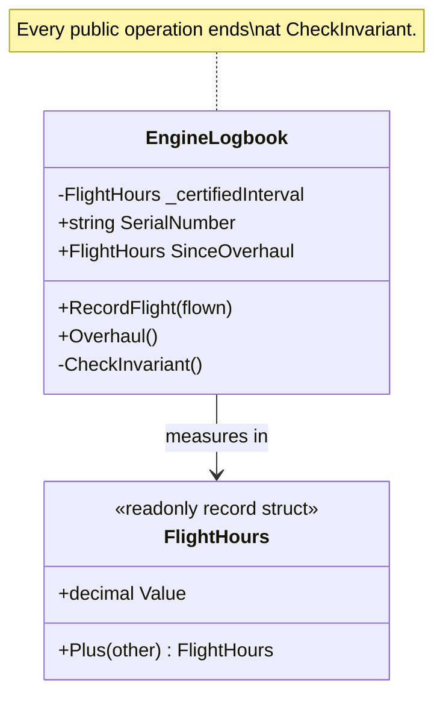

# Assertion

🌍 🇬🇧 English (this file) · 🇫🇷 [Français](Assertion-fr.md)

## Intent

Assertion states a post-condition of an operation or an invariant of a type explicitly, so that the
meaning of the code is defined by its promised effect rather than recovered by reading its
implementation.

## Problem

Aircraft maintenance: the logbook of an engine, and the hours it may fly before overhaul. *Hours since
overhaul never exceed the certified interval* is not a validation of an input. It is a statement that is
true of the engine at every instant, and an engine for which it is false is not a badly filled form — it
is an engine that must not fly.

Left implicit, that sentence lives in whoever last read the maintenance manual. The operations look
reasonable without it:

```csharp
public void RecordFlight(FlightHours flown) => SinceOverhaul = SinceOverhaul.Plus(flown);
public void Overhaul()                      => SinceOverhaul = new FlightHours(0m);
```

Nothing in either signature says which combinations of them are allowed. The rule has to be rediscovered
by reading both and holding them side by side — and rediscovered again by the next person who adds a
third operation.

The book states the cost in general terms: when the effects of operations are defined only by their
implementation, a design with much delegation becomes a tangle of cause and effect, and the only way to
understand the program is to trace execution through branching paths. The value of encapsulation is lost.

## Solution

The pattern states the contract instead of inferring it.

The post-condition of each operation and the invariant of the type are written down and checked. The
invariant lives in one place and every operation that could break it ends by calling it, so a third
operation added in a hurry two years from now either calls it or is visibly the one that does not.

Where the language cannot express the contract directly, the book's instruction is to write automated
unit tests for it, or to put it in documentation and diagrams where that fits the project. C# has no
contract clause, so the sample takes the first route and makes the checking method part of the type.

## Structure



## The roles

| Role | Annotation | Applies to | What it carries |
|---|---|---|---|
| Assertion | `[Assertion]` | method, class, struct | An operation whose post-condition is stated, or a type whose invariant is stated and checked rather than assumed. |

One role and two scopes, which is unusual and deliberate: on a type the annotation claims an invariant, on
a method it claims a post-condition. The annotation is inherited.

## The example

From [`AssertionUsage.cs`](../../../../DesignPatternCatalog.Usage/DomainDrivenDesign/AssertionUsage.cs).

```csharp
[Entity]
[Assertion]
public sealed class EngineLogbook {

    private readonly FlightHours _certifiedInterval;

    public EngineLogbook(string serialNumber, FlightHours certifiedInterval) {
        SerialNumber       = serialNumber;
        _certifiedInterval = certifiedInterval;
        SinceOverhaul      = new FlightHours(0m);

        CheckInvariant();
    }
```

`[Assertion]` on the class claims that the type has an invariant. The constructor ends by checking it,
which is what makes the claim start being true rather than becoming true later.

```csharp
    /// <summary>
    ///     Post-condition: the hours since overhaul have increased by <paramref name="flown" />, and the engine is
    ///     still within its certified interval. An engine that would exceed it is grounded instead.
    /// </summary>
    [Assertion]
    public void RecordFlight(FlightHours flown) {
        FlightHours candidate = SinceOverhaul.Plus(flown);

        if (candidate.Value > _certifiedInterval.Value) {
            throw new InvalidOperationException($"Engine {SerialNumber} would exceed its {_certifiedInterval.Value} h interval.");
        }

        SinceOverhaul = candidate;

        CheckInvariant();
    }
```

The post-condition is written before the code, in the prose the compiler ignores, and then enforced by
the code below it. Both matter and neither replaces the other: the sentence says what the operation
promises, and the check makes the promise fail loudly when it is broken.

Note the order. The candidate is computed, tested, and only then assigned. An implementation that
assigned first and checked afterwards would leave the object briefly outside its own invariant, which is
the state the pattern exists to say cannot happen.

```csharp
    /// <summary>
    ///     Post-condition: the hours since overhaul are zero.
    /// </summary>
    [Assertion]
    public void Overhaul() {
        SinceOverhaul = new FlightHours(0m);

        CheckInvariant();
    }
```

A one-line post-condition for a one-line operation. It is worth writing anyway: *the hours are zero* is
the whole reason the operation exists, and stating it is what lets a reader skip the body.

```csharp
    // The invariant of the type, stated once and checked rather than assumed. Every operation
    // above ends here, which is the property a rule over this annotation can require.
    [Assertion]
    private void CheckInvariant() {
        if (SinceOverhaul.Value < 0m || SinceOverhaul.Value > _certifiedInterval.Value) {
            throw new InvalidOperationException($"Engine {SerialNumber} is outside its certified interval.");
        }
    }
```

The invariant in one place, called from everywhere it could be broken. The annotation is what makes it
something a tool can range over: once the invariant method is named, a rule can require that every public
mutating operation of an annotated type ends by calling it — which is exactly the check that catches the
third operation somebody adds in a hurry.

## Applicability

**State post-conditions of operations and invariants of classes and aggregates.** The book's instruction
is that plain, and the pattern is the discipline of following it.

**Use Assertion where a design has enough delegation that effects cannot be read off a call.** The book
names this as the situation the pattern answers: implicit effects turn a delegating design into a tangle
of cause and effect, and tracing concrete execution defeats the abstraction the delegation was for.

**Where assertions cannot be coded directly in the language, write automated unit tests for them**, or
write them into documentation or diagrams where that fits the project's development process. The book
gives all three routes, in that order.

**Seek models with coherent sets of concepts, which lead a developer to infer the intended assertions.**
The book asks for this alongside stating them: a model whose concepts hang together shortens the learning
curve and reduces the risk of contradictory code, which is a cheaper form of the same guarantee.

## When not to use it

**Do not use Assertion in place of a coherent model.** The book asks for both, and puts the model first
for a reason: assertions on concepts that do not hang together document a design problem rather than
solving it. A type needing a long invariant to be usable is usually more than one type.

**Do not state a post-condition the operation does not keep.** A stated contract that is wrong is worse
than an unstated one, because a reader stops checking. This is the practical risk of the prose half of
the pattern: nothing compiles it, and nothing fails when it goes stale.

**Do not use Assertion for input validation.** Rejecting a badly filled form and asserting that an engine
is airworthy are different jobs. Validation answers a caller who may fix the input; a broken invariant
says the object should not exist, and the two want different treatment.

**Do not check an invariant on an immutable type.** A value object validated in its constructor has no
later moment at which it could become false, so an invariant method is a call that can only ever pass.

**Do not expect the annotation to enforce anything by itself.** It records that a contract exists and
names where it is checked; whether every mutating operation calls it is a rule someone still has to
write.

## Advantages

* The meaning of an operation is stated rather than recovered by reading its implementation.
* The invariant lives in one place, so an operation added later either respects it or is visibly the one
  that does not.
* Encapsulation survives delegation: a caller can rely on what an operation promises without tracing what
  it does.
* Failure is loud and immediate, at the operation that broke the rule rather than at the one that later
  read the broken state.
* The annotation gives a tool something to range over — the property that every public mutator ends at
  the invariant check is mechanically checkable.

## Drawbacks

* C# has no contract clause, so half the pattern is prose that nothing compiles and nothing keeps
  honest.
* Checking an invariant after every operation costs something, and on a hot path it is a cost that has to
  be judged rather than assumed away.
* A long invariant is easy to write and hard to read, and it hides that the type may be doing too much.
* Post-conditions are one more thing to keep in step with the code, and a stale one misleads more
  effectively than silence.

## Relations with other patterns

**`Aggregate`** is the other place the book puts invariants: the root enforces what must be true across
the boundary, and this pattern is the same discipline applied to a single type.

**`SideEffectFreeFunction`** is the complement. A function that changes nothing needs no post-condition
beyond what it returns, which is why the book presents the two together — reduce the number of operations
that need assertions, then assert about the ones that remain.

**`Entity`** is what usually carries an invariant, because it is what changes over time. The sample's
logbook is one.

**`ValueObject`** rarely needs the pattern: validated once at construction and immutable afterwards, it
has no window in which an invariant could be broken.

**`StandaloneClass`** makes assertions easier to state, since an invariant over a type that depends on
nothing is a sentence about that type alone.

## Source

*Domain-Driven Design: Tackling Complexity in the Heart of Software*, Eric Evans, Addison-Wesley, 2003 —
chapter 10, supple design.

* [Index entry](../../../generated/catalog-index.md#assertion-domain-driven-design)
* [Generated attribute](../../../../DesignPatternCatalog.DomainDrivenDesign/Assertion.cs)
* [Example](../../../../DesignPatternCatalog.Usage/DomainDrivenDesign/AssertionUsage.cs)
