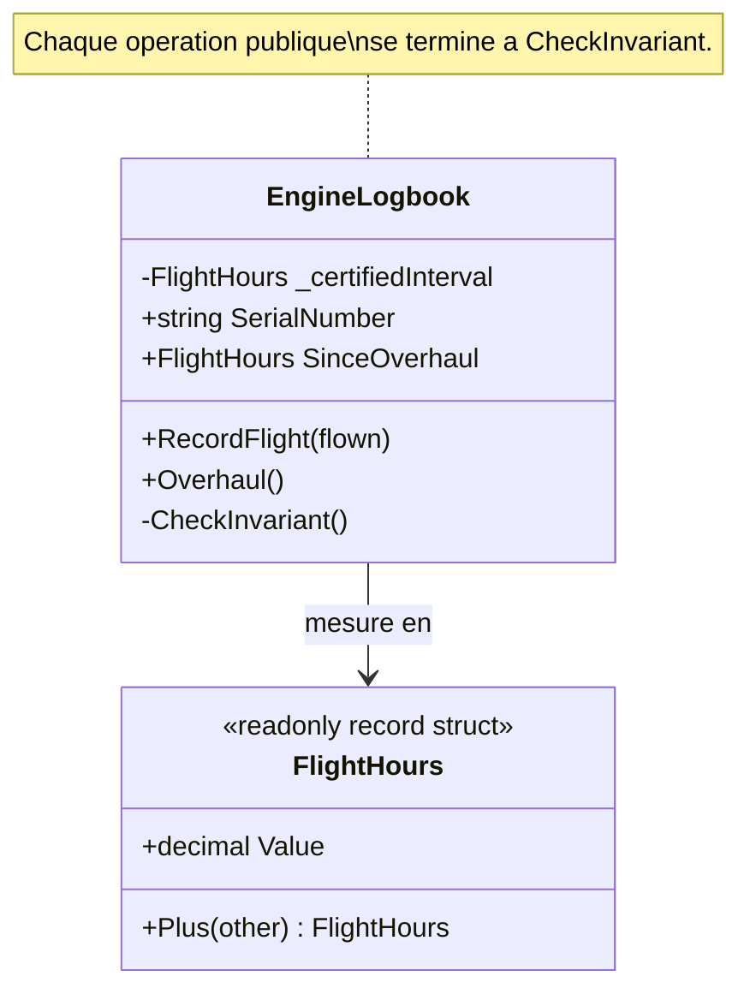

# Assertion

🌍 🇫🇷 Français (ce fichier) · 🇬🇧 [English](Assertion-en.md)

## Intention

Assertion énonce explicitement la post-condition d'une opération ou l'invariant d'un type, de sorte que le
sens du code soit défini par l'effet qu'il promet plutôt que retrouvé en lisant son implémentation.

## Problème

Maintenance aéronautique : le carnet d'un moteur, et les heures qu'il peut voler avant révision. « Les
heures depuis révision n'excèdent jamais l'intervalle certifié » n'est pas une validation de saisie. C'est
une affirmation vraie du moteur à chaque instant, et un moteur pour lequel elle est fausse n'est pas un
formulaire mal rempli — c'est un moteur qui ne doit pas voler.

Laissée implicite, cette phrase vit chez celui qui a lu le manuel de maintenance en dernier. Les
opérations paraissent raisonnables sans elle :

```csharp
public void RecordFlight(FlightHours flown) => SinceOverhaul = SinceOverhaul.Plus(flown);
public void Overhaul()                      => SinceOverhaul = new FlightHours(0m);
```

Rien dans l'une ni l'autre signature ne dit quelles combinaisons sont permises. La règle doit être
redécouverte en lisant les deux et en les tenant côte à côte — et redécouverte encore par la personne
suivante qui ajoutera une troisième opération.

Le livre énonce le coût en termes généraux : quand les effets des opérations ne sont définis que par leur
implémentation, une conception à forte délégation devient un enchevêtrement de causes et d'effets, et le
seul moyen de comprendre le programme est de tracer l'exécution à travers ses branchements. La valeur de
l'encapsulation est perdue.

## Solution

Le patron énonce le contrat au lieu de le déduire.

La post-condition de chaque opération et l'invariant du type sont écrits et vérifiés. L'invariant vit à un
seul endroit et toute opération susceptible de le rompre s'y termine, si bien qu'une troisième opération
ajoutée à la hâte dans deux ans l'appellera, ou sera visiblement celle qui ne l'appelle pas.

Là où le langage ne sait pas exprimer le contrat directement, l'instruction du livre est d'écrire des
tests unitaires automatisés pour lui, ou de le porter dans la documentation et les diagrammes là où cela
convient au projet. C# n'a pas de clause de contrat, si bien que l'exemple prend la première voie et fait
de la méthode de vérification une part du type.

## Structure



## Les rôles

| Rôle | Annotation | S'applique à | Ce qu'il porte |
|---|---|---|---|
| Assertion | `[Assertion]` | méthode, classe, struct | Une opération dont la post-condition est énoncée, ou un type dont l'invariant est énoncé et vérifié plutôt que supposé. |

Un rôle et deux portées, ce qui est inhabituel et délibéré : sur un type l'annotation revendique un
invariant, sur une méthode elle revendique une post-condition. L'annotation est héritée.

## L'exemple

Extrait de [`AssertionUsage.cs`](../../../../DesignPatternCatalog.Usage/DomainDrivenDesign/AssertionUsage.cs).

```csharp
[Entity]
[Assertion]
public sealed class EngineLogbook {

    private readonly FlightHours _certifiedInterval;

    public EngineLogbook(string serialNumber, FlightHours certifiedInterval) {
        SerialNumber       = serialNumber;
        _certifiedInterval = certifiedInterval;
        SinceOverhaul      = new FlightHours(0m);

        CheckInvariant();
    }
```

`[Assertion]` sur la classe revendique que le type a un invariant. Le constructeur se termine en le
vérifiant, ce qui fait que la revendication commence par être vraie au lieu de le devenir plus tard.

```csharp
    /// <summary>
    ///     Post-condition: the hours since overhaul have increased by <paramref name="flown" />, and the engine is
    ///     still within its certified interval. An engine that would exceed it is grounded instead.
    /// </summary>
    [Assertion]
    public void RecordFlight(FlightHours flown) {
        FlightHours candidate = SinceOverhaul.Plus(flown);

        if (candidate.Value > _certifiedInterval.Value) {
            throw new InvalidOperationException($"Engine {SerialNumber} would exceed its {_certifiedInterval.Value} h interval.");
        }

        SinceOverhaul = candidate;

        CheckInvariant();
    }
```

La post-condition est écrite avant le code, dans la prose que le compilateur ignore, puis imposée par le
code au-dessous. Les deux comptent et aucune ne remplace l'autre : la phrase dit ce que l'opération
promet, la vérification fait échouer bruyamment la promesse rompue.

Noter l'ordre. Le candidat est calculé, testé, et seulement ensuite affecté. Une implémentation qui
affecterait d'abord et vérifierait ensuite laisserait l'objet brièvement hors de son propre invariant, qui
est l'état que le patron existe pour déclarer impossible.

```csharp
    /// <summary>
    ///     Post-condition: the hours since overhaul are zero.
    /// </summary>
    [Assertion]
    public void Overhaul() {
        SinceOverhaul = new FlightHours(0m);

        CheckInvariant();
    }
```

Une post-condition d'une ligne pour une opération d'une ligne. Elle mérite d'être écrite quand même : *les
heures sont à zéro* est toute la raison d'être de l'opération, et l'énoncer est ce qui permet à un lecteur
de sauter le corps.

```csharp
    // The invariant of the type, stated once and checked rather than assumed. Every operation
    // above ends here, which is the property a rule over this annotation can require.
    [Assertion]
    private void CheckInvariant() {
        if (SinceOverhaul.Value < 0m || SinceOverhaul.Value > _certifiedInterval.Value) {
            throw new InvalidOperationException($"Engine {SerialNumber} is outside its certified interval.");
        }
    }
```

L'invariant à un seul endroit, appelé de partout où il pourrait être rompu. L'annotation est ce qui en
fait quelque chose qu'un outil peut parcourir : dès lors que la méthode d'invariant est nommée, une règle
peut exiger que toute opération publique mutante d'un type annoté se termine par son appel — ce qui est
exactement le contrôle qui rattrape la troisième opération ajoutée à la hâte.

## Possibilités d'application

**Énoncez les post-conditions des opérations et les invariants des classes et des agrégats.**
L'instruction du livre est aussi nette que cela, et le patron est la discipline de la suivre.

**Utilisez Assertion là où une conception délègue assez pour que les effets ne se lisent pas sur un
appel.** Le livre nomme cette situation comme celle à laquelle le patron répond : des effets implicites
transforment une conception déléguante en enchevêtrement de causes et d'effets, et devoir tracer
l'exécution concrète ruine l'abstraction pour laquelle la délégation existait.

**Là où les assertions ne peuvent être codées directement dans le langage, écrivez des tests unitaires
automatisés pour elles**, ou portez-les dans la documentation ou les diagrammes là où cela convient au
processus de développement du projet. Le livre donne les trois voies, dans cet ordre.

**Cherchez des modèles aux ensembles de concepts cohérents, qui conduisent un développeur à déduire les
assertions voulues.** Le livre le demande en même temps que de les énoncer : un modèle dont les concepts
se tiennent raccourcit la courbe d'apprentissage et réduit le risque de code contradictoire, ce qui est
une forme moins chère de la même garantie.

## Quand ne pas l'utiliser

**N'utilisez pas Assertion à la place d'un modèle cohérent.** Le livre demande les deux, et met le modèle
en premier pour une raison : des assertions sur des concepts qui ne se tiennent pas documentent un
problème de conception au lieu de le résoudre. Un type qui a besoin d'un long invariant pour être
utilisable est d'ordinaire plus d'un type.

**N'énoncez pas une post-condition que l'opération ne tient pas.** Un contrat énoncé et faux est pire
qu'un contrat passé sous silence, parce qu'un lecteur cesse de vérifier. C'est le risque pratique de la moitié en prose du
patron : rien ne la compile, et rien n'échoue quand elle se périme.

**N'utilisez pas Assertion pour valider une saisie.** Refuser un formulaire mal rempli et affirmer qu'un
moteur est en état de vol sont deux métiers. La validation répond à un appelant qui peut corriger sa
saisie ; un invariant rompu dit que l'objet ne devrait pas exister, et les deux appellent des traitements
différents.

**Ne vérifiez pas d'invariant sur un type immuable.** Un objet-valeur validé dans son constructeur n'a pas
de moment ultérieur où il pourrait devenir faux, si bien qu'une méthode d'invariant est un appel qui ne
peut que passer.

**N'attendez pas de l'annotation qu'elle impose quoi que ce soit d'elle-même.** Elle consigne qu'un
contrat existe et nomme l'endroit où il est vérifié ; que toute opération mutante l'appelle est une règle
qu'il reste à écrire.

## Avantages

* Le sens d'une opération est énoncé plutôt que retrouvé en lisant son implémentation.
* L'invariant vit à un seul endroit : une opération ajoutée plus tard le respecte, ou est visiblement
  celle qui ne le respecte pas.
* L'encapsulation survit à la délégation : un appelant peut se fier à ce qu'une opération promet sans
  tracer ce qu'elle fait.
* L'échec est bruyant et immédiat, à l'opération qui a rompu la règle plutôt qu'à celle qui a plus tard lu
  l'état rompu.
* L'annotation donne à un outil quelque chose à parcourir — la propriété selon laquelle tout mutateur
  public se termine par la vérification de l'invariant est mécaniquement contrôlable.

## Inconvénients

* C# n'a pas de clause de contrat, si bien que la moitié du patron est une prose que rien ne compile et
  que rien ne maintient honnête.
* Vérifier un invariant après chaque opération coûte quelque chose, et sur un chemin chaud ce coût doit
  être jugé plutôt qu'écarté.
* Un long invariant s'écrit facilement et se lit mal, et il masque que le type en fait peut-être trop.
* Les post-conditions sont une chose de plus à maintenir au pas du code, et une post-condition périmée
  induit en erreur plus efficacement que le silence.

## Liens avec les autres patrons

**`Aggregate`** est l'autre endroit où le livre place des invariants : la racine impose ce qui doit être
vrai à travers la frontière, et ce patron est la même discipline appliquée à un type unique.

**`SideEffectFreeFunction`** en est le complément. Une fonction qui ne change rien n'a besoin d'aucune
post-condition au-delà de ce qu'elle rend, et c'est pourquoi le livre présente les deux ensemble : réduire
le nombre d'opérations qui demandent des assertions, puis énoncer celles qui restent.

**`Entity`** est ce qui porte habituellement un invariant, parce que c'est ce qui change avec le temps. Le
carnet de l'exemple en est une.

**`ValueObject`** a rarement besoin du patron : validé une fois à la construction et immuable ensuite, il
n'a pas de fenêtre où un invariant pourrait être rompu.

**`StandaloneClass`** rend les assertions plus faciles à énoncer, puisqu'un invariant sur un type qui ne
dépend de rien est une phrase sur ce type seul.

## Source

*Domain-Driven Design: Tackling Complexity in the Heart of Software*, Eric Evans, Addison-Wesley, 2003 —
chapitre 10, la conception souple.

* [Entrée d'index](../../../generated/catalog-index.md#assertion-domain-driven-design)
* [Attribut généré](../../../../DesignPatternCatalog.DomainDrivenDesign/Assertion.cs)
* [Exemple](../../../../DesignPatternCatalog.Usage/DomainDrivenDesign/AssertionUsage.cs)
