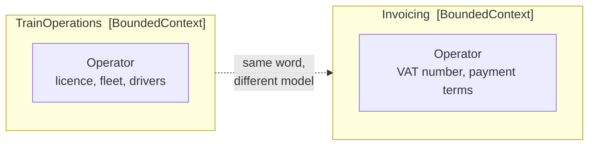

# Bounded Context

🌍 🇬🇧 English (this file) · 🇫🇷 [Français](BoundedContext-fr.md)

## Intent

Bounded Context delimits where one model applies. Inside it every term has exactly one meaning; outside
it the model makes no claim at all, and the same word may name something else entirely.

## Problem

Regional rail. Two parts of the business use the word *operator*.

In train operations, an operator is a company whose trains run on the network: it has a licence, a fleet,
drivers qualified for particular sections. In invoicing, an operator is a legal counterparty with a VAT
number and payment terms. Same word, and nothing of the first meaning survives.

The instinct is to unify them:

```csharp
public sealed class Operator {
    public string  LicenceNumber { get; }
    public string  VatNumber     { get; }
    public string  PaymentTerms  { get; }
    public Fleet   Fleet         { get; }
}
```

That class now carries a licence *and* a VAT number, and every rule about either needs a guard asking
which kind of operator this really is. It grows until nobody can say what it means — which is the failure
mode of a model with no boundary.

Neither definition is wrong. They belong to different models.

## Solution

The pattern draws the boundary and says what is inside it.

The context within which a model applies is defined explicitly — in terms of team organisation, of which
part of the application uses it, and of physical manifestations such as code bases and schemas. Inside
the boundary the model is kept strictly consistent; outside it, the questions are simply not this model's
business.

That last clause is the half most often dropped. The instruction is not only to be consistent within the
boundary, but not to be distracted by what lies beyond it.

## Structure



Two assemblies, two classes with the same name, and no arrow of dependency between them. The dashed line
is a fact about the vocabulary rather than a reference in the code.

## The roles

| Role | Annotation | Applies to | What it carries |
|---|---|---|---|
| BoundedContext | `[assembly: BoundedContext]` | assembly | The boundary of one model. Everything the assembly declares belongs to that model, and a term used here means what this model says it means. |

One role, on an assembly and on nothing else. A bounded context is not a type or a namespace: it is a
scope within which a model is consistent, and the assembly is the unit that draws it here.

The annotation cannot be repeated, and the reason is worth stating. An assembly declaring itself two
bounded contexts is not describing a boundary — it is describing a collision.

## The example

From [`BoundedContextUsage.cs`](../../../../DesignPatternCatalog.Usage.TrainOperations/BoundedContextUsage.cs).

```csharp
[assembly: BoundedContext]
```

One line, and it is the whole declaration. Everything else in the assembly is inside the boundary by
construction, which is why the annotation sits at assembly level rather than being repeated on each type.

```csharp
/// <summary>
///     A company running trains on the network — a licence and a fleet, not a payer.
/// </summary>
public sealed class Operator {

    public Operator(string licenceNumber, string name) {
        LicenceNumber = licenceNumber;
        Name          = name;
    }

    public string LicenceNumber { get; }
    public string Name          { get; }

}
```

Two properties, and the absence of a VAT number is the point. The summary says what this `Operator` is
*not*, which is unusual in a doc comment and useful here: the reader most likely to open this file is one
who has just met the other `Operator`.

The invoicing side carries its own, in
[`GenericSubdomainUsage.cs`](../../../../DesignPatternCatalog.Usage.Invoicing/GenericSubdomainUsage.cs) —
a `TrackAccessInvoice` keyed on `OperatorVatNumber`, with no licence anywhere. Two assemblies, two
models, and neither compiles against the other.

## Applicability

**Explicitly define the context within which a model applies.** The book's instruction is to make the
boundary a decision rather than an accident of how the code grew.

**Set the boundary in terms of team organisation, of usage within specific parts of the application, and
of physical manifestations such as code bases and database schemas.** All three are named, and the
physical one is what an annotation on an assembly can record.

**Keep the model strictly consistent within these bounds.**

**Do not be distracted or confused by issues outside the boundary.** This is the second half of the
instruction, and the one that makes the pattern a relief rather than a chore: outside the boundary, the
model is not obliged to have an opinion.

## When not to use it

**Do not draw a boundary you have no intention of policing.** The pattern's value comes from consistency
inside it. A context that quietly imports another context's types has a name and no boundary, and the
name then misleads.

**Do not use it to justify duplication that is not wanted.** Two contexts holding the same concept is
correct when the concept genuinely differs; it is expensive when it does not, and the book offers the
shared kernel for exactly that case rather than leaving duplication as the only answer.

**Do not put two models in one assembly.** The annotation cannot be repeated for this reason, and the
prohibition is the pattern rather than a limitation of it.

**Do not expect the boundary to be free.** Two models mean translation wherever they meet, and the book
devotes several patterns to that translation — anticorruption layer, open host service, published
language, shared kernel — because the cost is real and has to be paid somewhere.

## Advantages

* A term has one meaning, so a rule about it needs no guard asking which kind of thing this is.
* The model stays small enough to be understood, because it is not obliged to serve everyone.
* Teams can work without agreeing on everything: the boundary is what makes local decisions local.
* What is outside stops being a source of confusion, since the model makes no claim about it.
* The boundary is recorded where a tool can see it, so a reference that crosses it can be refused.

## Drawbacks

* Every meeting between contexts needs translation, and translation is code that exists for no other
  reason.
* The same concept may be modelled twice, and the two can drift in ways nothing detects.
* Drawing the boundary in the wrong place is expensive to correct once teams, schemas and deployments
  have settled around it.
* Nothing in C# enforces the boundary. The annotation records it; a rule over the annotations is what
  refuses the crossing.

## Relations with other patterns

**`SharedKernel`** is the deliberate exception: a small subset two contexts agree to share rather than
translate.

**`AnticorruptionLayer`** is how a downstream context talks to an upstream one without letting the
upstream model in.

**`OpenHostService`** and **`PublishedLanguage`** are the other two ways across — a protocol designed for
all comers, and a vocabulary published as the medium of exchange.

**`CoreDomain`** and **`GenericSubdomain`** classify contexts rather than bound them: the sample's train
operations assembly is both a bounded context and the core domain, and the invoicing assembly is both a
bounded context and a generic subdomain.

**`LayeredArchitecture`** partitions along a different axis. A layer separates concerns within one model;
a context separates models.

## Source

*Domain-Driven Design: Tackling Complexity in the Heart of Software*, Eric Evans, Addison-Wesley, 2003 —
chapter 14, maintaining model integrity.

* [Index entry](../../../generated/catalog-index.md#boundedcontext-domain-driven-design)
* [Generated attribute](../../../../DesignPatternCatalog.DomainDrivenDesign/BoundedContext.cs)
* [Example](../../../../DesignPatternCatalog.Usage.TrainOperations/BoundedContextUsage.cs)
