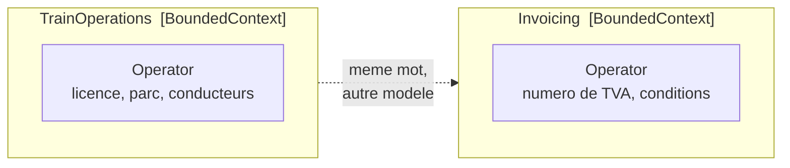

# Bounded Context

🌍 🇫🇷 Français (ce fichier) · 🇬🇧 [English](BoundedContext-en.md)

## Intention

Bounded Context délimite l'endroit où un modèle s'applique. À l'intérieur, chaque terme a exactement un
sens ; à l'extérieur, le modèle ne prétend plus rien, et le même mot peut nommer tout autre chose.

## Problème

Réseau ferroviaire régional. Deux parties de l'entreprise emploient le mot *opérateur*.

Dans l'exploitation, un opérateur est une entreprise dont les trains circulent sur le réseau : elle a une
licence, un parc, des conducteurs habilités sur certaines sections. Dans la facturation, un opérateur est
une contrepartie juridique avec un numéro de TVA et des conditions de paiement. Même mot, et rien du
premier sens ne survit.

L'instinct est de les unifier :

```csharp
public sealed class Operator {
    public string  LicenceNumber { get; }
    public string  VatNumber     { get; }
    public string  PaymentTerms  { get; }
    public Fleet   Fleet         { get; }
}
```

Cette classe porte désormais une licence *et* un numéro de TVA, et chaque règle sur l'un ou l'autre a
besoin d'une garde qui demande de quelle espèce d'opérateur il s'agit vraiment. Elle grossit jusqu'à ce
que plus personne ne sache ce qu'elle veut dire — soit le mode de défaillance d'un modèle sans frontière.

Aucune des deux définitions n'est fausse. Elles appartiennent à deux modèles.

## Solution

Le patron trace la frontière et dit ce qui est dedans.

Le contexte dans lequel un modèle s'applique est défini explicitement — en termes d'organisation des
équipes, de la partie de l'application qui l'emploie, et de manifestations physiques telles que les bases
de code et les schémas. À l'intérieur, le modèle est tenu strictement cohérent ; à l'extérieur, les
questions ne sont tout simplement pas l'affaire de ce modèle.

Cette dernière clause est la moitié qu'on laisse le plus souvent tomber. L'instruction n'est pas seulement
d'être cohérent dans la frontière, mais de ne pas se laisser distraire par ce qui est au-delà.

## Structure



Deux assemblies, deux classes de même nom, et aucune flèche de dépendance entre elles. La ligne pointillée
est un fait sur le vocabulaire, non une référence dans le code.

## Les rôles

| Rôle | Annotation | S'applique à | Ce qu'il porte |
|---|---|---|---|
| BoundedContext | `[assembly: BoundedContext]` | assembly | La frontière d'un modèle. Tout ce que l'assembly déclare appartient à ce modèle, et un terme employé ici veut dire ce que ce modèle dit qu'il veut dire. |

Un seul rôle, sur une assembly et rien d'autre. Un contexte borné n'est ni un type ni un espace de noms :
c'est une portée à l'intérieur de laquelle un modèle est cohérent, et l'assembly est l'unité qui la trace
ici.

L'annotation n'est pas répétable, et la raison mérite d'être dite. Une assembly qui se déclare deux
contextes bornés ne décrit pas une frontière — elle décrit une collision.

## L'exemple

Extrait de [`BoundedContextUsage.cs`](../../../../DesignPatternCatalog.Usage.TrainOperations/BoundedContextUsage.cs).

```csharp
[assembly: BoundedContext]
```

Une ligne, et c'est toute la déclaration. Tout le reste de l'assembly est dans la frontière par
construction, et c'est pourquoi l'annotation siège au niveau de l'assembly plutôt que d'être répétée sur
chaque type.

```csharp
/// <summary>
///     A company running trains on the network — a licence and a fleet, not a payer.
/// </summary>
public sealed class Operator {

    public Operator(string licenceNumber, string name) {
        LicenceNumber = licenceNumber;
        Name          = name;
    }

    public string LicenceNumber { get; }
    public string Name          { get; }

}
```

Deux propriétés, et l'absence de numéro de TVA est le propos. Le résumé dit ce que cet `Operator` n'est
*pas*, ce qui est inhabituel dans un commentaire de documentation et utile ici : le lecteur le plus
susceptible d'ouvrir ce fichier est celui qui vient de rencontrer l'autre `Operator`.

Le côté facturation porte le sien, dans
[`GenericSubdomainUsage.cs`](../../../../DesignPatternCatalog.Usage.Invoicing/GenericSubdomainUsage.cs) —
une `TrackAccessInvoice` clé sur `OperatorVatNumber`, sans licence nulle part. Deux assemblies, deux
modèles, et aucun ne compile contre l'autre.

## Possibilités d'application

**Définissez explicitement le contexte dans lequel un modèle s'applique.** L'instruction du livre est de
faire de la frontière une décision plutôt qu'un accident de la croissance du code.

**Posez la frontière en termes d'organisation des équipes, d'usage dans des parties précises de
l'application, et de manifestations physiques telles que les bases de code et les schémas de base de
données.** Les trois sont nommées, et la physique est ce qu'une annotation sur une assembly sait
consigner.

**Tenez le modèle strictement cohérent à l'intérieur de ces bornes.**

**Ne vous laissez pas distraire ni troubler par ce qui est hors de la frontière.** C'est la seconde moitié
de l'instruction, et celle qui fait du patron un soulagement plutôt qu'une corvée : hors de la frontière,
le modèle n'est pas tenu d'avoir un avis.

## Quand ne pas l'utiliser

**Ne tracez pas une frontière que vous n'avez pas l'intention de faire respecter.** La valeur du patron
vient de la cohérence à l'intérieur. Un contexte qui importe discrètement les types d'un autre a un nom et
pas de frontière, et le nom induit alors en erreur.

**Ne l'employez pas pour justifier une duplication non voulue.** Deux contextes portant le même concept
est correct quand le concept diffère vraiment ; c'est coûteux quand il ne diffère pas, et le livre propose
le noyau partagé exactement pour ce cas plutôt que de laisser la duplication pour seule réponse.

**Ne mettez pas deux modèles dans une assembly.** L'annotation n'est pas répétable pour cette raison, et
l'interdiction est le patron plutôt qu'une limite de celui-ci.

**N'attendez pas que la frontière soit gratuite.** Deux modèles, c'est de la traduction partout où ils se
rencontrent, et le livre consacre plusieurs patrons à cette traduction — couche anticorruption, service
hôte ouvert, langage publié, noyau partagé — parce que le coût est réel et doit être payé quelque part.

## Avantages

* Un terme a un sens, si bien qu'une règle à son sujet n'a besoin d'aucune garde demandant de quelle
  espèce il s'agit.
* Le modèle reste assez petit pour être compris, parce qu'il n'est pas tenu de servir tout le monde.
* Les équipes peuvent travailler sans s'accorder sur tout : la frontière est ce qui rend locales les
  décisions locales.
* Ce qui est dehors cesse d'être une source de confusion, puisque le modèle ne prétend rien à son sujet.
* La frontière est consignée là où un outil la voit, si bien qu'une référence qui la franchit peut être
  refusée.

## Inconvénients

* Chaque rencontre entre contextes demande une traduction, et la traduction est du code qui n'existe pour
  aucune autre raison.
* Le même concept peut être modélisé deux fois, et les deux peuvent diverger sans que rien ne le détecte.
* Tracer la frontière au mauvais endroit coûte cher à corriger une fois que les équipes, les schémas et
  les déploiements s'y sont installés.
* Rien en C# n'impose la frontière. L'annotation la consigne ; c'est une règle portant sur les annotations
  qui refuse le franchissement.

## Liens avec les autres patrons

**`SharedKernel`** est l'exception délibérée : un petit sous-ensemble que deux contextes conviennent de
partager plutôt que de traduire.

**`AnticorruptionLayer`** est la façon dont un contexte aval parle à un contexte amont sans laisser entrer
le modèle amont.

**`OpenHostService`** et **`PublishedLanguage`** sont les deux autres passages — un protocole conçu pour
tous les venants, et un vocabulaire publié comme medium d'échange.

**`CoreDomain`** et **`GenericSubdomain`** classent les contextes plutôt qu'ils ne les bornent :
l'assembly d'exploitation de l'exemple est à la fois un contexte borné et le domaine central, et
l'assembly de facturation à la fois un contexte borné et un sous-domaine générique.

**`LayeredArchitecture`** partitionne selon un autre axe. Une couche sépare des préoccupations à
l'intérieur d'un modèle ; un contexte sépare des modèles.

## Source

*Domain-Driven Design: Tackling Complexity in the Heart of Software*, Eric Evans, Addison-Wesley, 2003 —
chapitre 14, préserver l'intégrité du modèle.

* [Entrée d'index](../../../generated/catalog-index.md#boundedcontext-domain-driven-design)
* [Attribut généré](../../../../DesignPatternCatalog.DomainDrivenDesign/BoundedContext.cs)
* [Exemple](../../../../DesignPatternCatalog.Usage.TrainOperations/BoundedContextUsage.cs)
