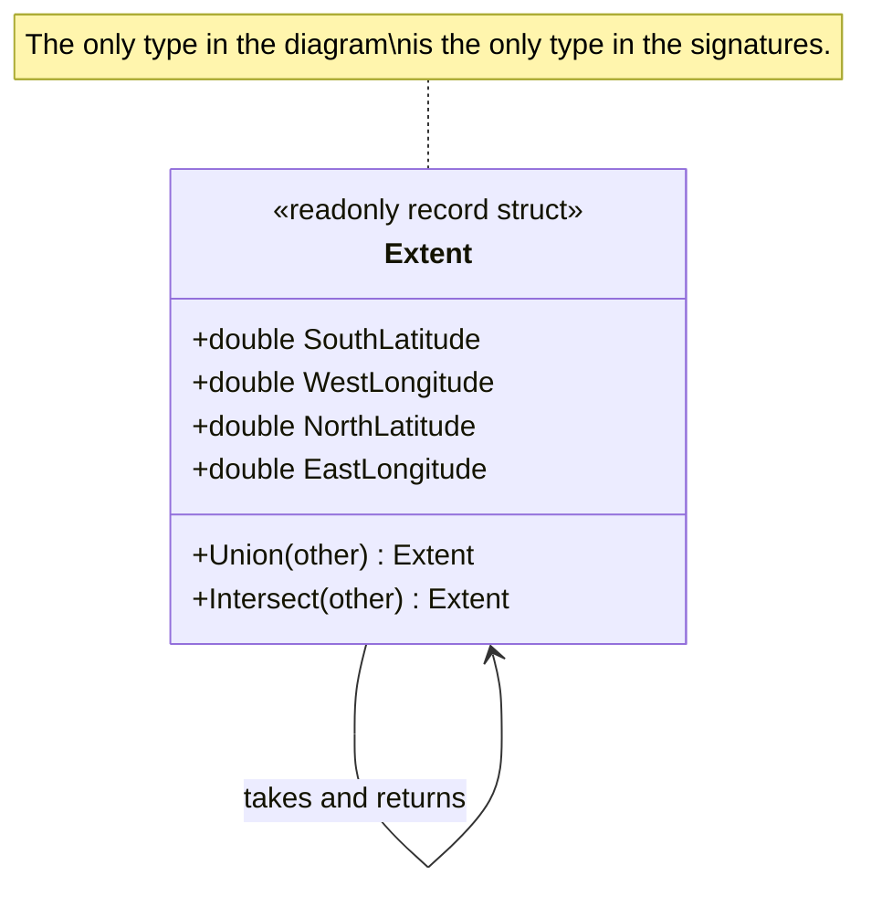

# Closure of Operation

🌍 🇬🇧 English (this file) · 🇫🇷 [Français](ClosureOfOperation-fr.md)

## Intent

Closure of Operation is an operation whose argument and return type are the type it is defined on, so
that it stays inside its own set of values and introduces no dependency on anything else.

## Problem

Cartography: the extent covered by a set of surveyed plots. A survey arrives as a few thousand plots, and
the map server needs the rectangle that contains them all.

Written the obvious way, that is a loop with four running variables:

```csharp
double minLat = double.MaxValue, maxLat = double.MinValue;
double minLon = double.MaxValue, maxLon = double.MinValue;

foreach (Extent plot in plots) {
    minLat = Math.Min(minLat, plot.SouthLatitude);
    maxLat = Math.Max(maxLat, plot.NorthLatitude);
    minLon = Math.Min(minLon, plot.WestLongitude);
    maxLon = Math.Max(maxLon, plot.EastLongitude);
}

return new Extent(minLat, minLon, maxLat, maxLon);
```

The abstraction the domain actually has — an extent — exists only in the reader's head, between the loop
and the constructor at the end. Between those two points there are four unrelated numbers, and the
invariant that they form a rectangle is not stated anywhere.

## Solution

The pattern defines the operation inside the abstraction.

An operation on `Extent` takes an `Extent` and gives back an `Extent`. Nothing else appears in the
signature — no primitive, no service, no type from another module — so the operation stays entirely
within the abstraction it belongs to.

Two things follow, and they are why the book singles this out rather than filing it under *nice
signature*. It composes without ceremony: `a.Union(b).Union(c)` is well-formed for the same reason
`1 + 2 + 3` is, so the whole survey folds into one line with no running state at all. And it introduces
no dependency: an operation returning a different type would couple `Extent` to that type, while this one
couples it to nothing, so the class stays readable on its own.

Where the implementing object holds state used in the computation, the book counts it as an argument too
— which is why the operation's type, its argument and its result are all the same here.

## Structure



The arrow from the class to itself is the pattern. A diagram that needed a second class would be showing
something else.

## The roles

| Role | Annotation | Applies to | What it carries |
|---|---|---|---|
| ClosureOfOperation | `[ClosureOfOperation]` | method | A method that takes and returns the type it is declared on, so that its results can be fed back into it without leaving the abstraction. |

One role, on a method. This is the most mechanically checkable claim in the catalogue: the annotation says
the parameter and the return type are the declaring type, and a rule can verify exactly that from the
signature, with no interpretation required.

## The example

From [`ClosureOfOperationUsage.cs`](../../../../DesignPatternCatalog.Usage/DomainDrivenDesign/ClosureOfOperationUsage.cs).

```csharp
[ValueObject]
public readonly record struct Extent {

    public Extent(double southLatitude, double westLongitude, double northLatitude, double eastLongitude) {
        SouthLatitude = southLatitude;
        WestLongitude = westLongitude;
        NorthLatitude = northLatitude;
        EastLongitude = eastLongitude;
    }

    public double SouthLatitude { get; }
    public double WestLongitude { get; }
    public double NorthLatitude { get; }
    public double EastLongitude { get; }
```

The four numbers that were loose variables in the problem, gathered into the concept the domain has a
word for.

```csharp
    /// <summary>
    ///     The smallest extent containing this one and <paramref name="other" />.
    /// </summary>
    [ClosureOfOperation]
    [SideEffectFreeFunction]
    public Extent Union(Extent other) {
        return new Extent(
            Math.Min(SouthLatitude, other.SouthLatitude),
            Math.Min(WestLongitude, other.WestLongitude),
            Math.Max(NorthLatitude, other.NorthLatitude),
            Math.Max(EastLongitude, other.EastLongitude));
    }
```

`Extent` in, `Extent` out, and the implementing object is the second operand. Read the signature alone and
it says everything the annotation claims — which is what makes this the one pattern in the catalogue a
tool can confirm rather than merely record.

Two annotations, and they are separate claims. Closure is about the types; freedom from effects is about
what the method does. An operation can have either without the other, and both happen to hold here.

```csharp
    /// <summary>
    ///     The part covered by both extents, or an empty extent where they do not meet.
    /// </summary>
    [ClosureOfOperation]
    [SideEffectFreeFunction]
    public Extent Intersect(Extent other) {
        double south = Math.Max(SouthLatitude, other.SouthLatitude);
        double west  = Math.Max(WestLongitude, other.WestLongitude);
        double north = Math.Min(NorthLatitude, other.NorthLatitude);
        double east  = Math.Min(EastLongitude, other.EastLongitude);

        return north <= south || east <= west ? new Extent(0, 0, 0, 0) : new Extent(south, west, north, east);
    }

}
```

`Intersect` is where closure costs something, and the sample does not hide it. Two extents that do not
meet have no intersection, and the operation must answer with an `Extent` anyway — so it answers with an
empty one. Returning `null` or an `Extent?` would leave the abstraction and break the composition the
pattern exists for; returning a degenerate value keeps it and asks the caller to know what an empty extent
means.

```csharp
[Service]
public sealed class SurveyExtent {

    // The whole survey folds into one expression, because every step of the fold stays an Extent.
    [SideEffectFreeFunction]
    public Extent Covering(IEnumerable<Extent> plots) => plots.Aggregate((left, right) => left.Union(right));

}
```

The payoff, against the loop in the problem. There is no running state, nothing to initialise, and no
moment at which four numbers are not yet a rectangle. `Aggregate` works here for exactly the reason the
book gives: every step of the fold stays inside the type.

## Applicability

**Where it fits, define an operation whose return type is the same as the type of its arguments.** The
book's *where it fits* is part of the instruction rather than a hedge — the pattern is offered as
something to reach for when the domain allows it, not as a rule to impose.

**Count the implementing object as an argument.** Where the implementer holds state used in the
computation, the book says the argument and the return type should be of the same type as the
implementer, which is what makes the operation closed under the set of instances of that type.

**Use Closure of Operation to obtain a high-level interface without introducing a dependency on other
concepts.** That is the book's stated benefit, and it is the reason the pattern is worth naming
separately from a merely convenient signature.

## When not to use it

**Do not force closure where the answer is genuinely another type.** An operation on two positions that
answers with a distance is not a failure of design; making it answer with a position to satisfy the shape
would be. The book's *where it fits* is the whole of the condition.

**Do not close an operation that has no meaningful degenerate value.** `Intersect` works because an empty
extent is a sensible answer. Where the missing answer has no representation, closure buys composition at
the cost of inventing a value that means *nothing*, and callers then have to test for it — which is the
cost the null they avoided would have made visible.

**Do not expect a whole type to be closed.** The book offers closure of operations for a subset as the
partial answer, and that is the usual case: some operations on a type close, others do not, and the
annotation is on the method rather than the class for exactly that reason.

**Do not use it where the abstraction is not the domain's.** Closing operations over a type nobody in the
business names produces an elegant algebra of something nobody asked for.

## Advantages

* Composition comes free: results feed back in, so folds and chains are well-formed without ceremony.
* No dependency is introduced, so the class remains readable on its own.
* The abstraction the domain has stays present in the code from beginning to end, rather than dissolving
  into loose variables between a loop and a constructor.
* Intermediate state disappears, and with it the window in which the invariant does not yet hold.
* The claim is verifiable from the signature alone, which is rare in this catalogue.

## Drawbacks

* It does not always fit, and forcing it distorts the model to satisfy a shape.
* A closed operation that must answer *nothing* needs a degenerate value, which the caller then has to
  recognise.
* Closure alone says nothing about effects: an operation can take and return its own type and still
  change the world.

## Relations with other patterns

**`SideEffectFreeFunction`** is the natural companion and a separate claim. Together they make an
operation both safe to repeat and safe to chain.

**`ValueObject`** is where closure most often applies, because a type described only by its values usually
has operations that stay within it.

**`StandaloneClass`** is the same goal reached differently: this pattern removes a dependency from a
signature, that one removes them from a whole type.

**`Specification`** composes for the same structural reason — a combination of specifications is a
specification — which is closure applied to a rule rather than to a value.

## Source

*Domain-Driven Design: Tackling Complexity in the Heart of Software*, Eric Evans, Addison-Wesley, 2003 —
chapter 10, supple design.

* [Index entry](../../../generated/catalog-index.md#closureofoperation-domain-driven-design)
* [Generated attribute](../../../../DesignPatternCatalog.DomainDrivenDesign/ClosureOfOperation.cs)
* [Example](../../../../DesignPatternCatalog.Usage/DomainDrivenDesign/ClosureOfOperationUsage.cs)
