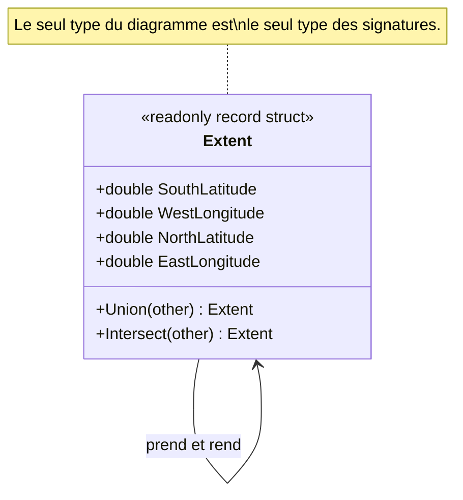

# Closure of Operation

🌍 🇫🇷 Français (ce fichier) · 🇬🇧 [English](ClosureOfOperation-en.md)

## Intention

Closure of Operation est une opération dont l'argument et le type de retour sont le type sur lequel elle
est définie, de sorte qu'elle reste dans son propre ensemble de valeurs et n'introduit de dépendance vers
rien d'autre.

## Problème

Cartographie : l'emprise couverte par un ensemble de parcelles levées. Un levé arrive sous forme de
quelques milliers de parcelles, et le serveur de cartes a besoin du rectangle qui les contient toutes.

Écrit de la façon évidente, c'est une boucle à quatre variables courantes :

```csharp
double minLat = double.MaxValue, maxLat = double.MinValue;
double minLon = double.MaxValue, maxLon = double.MinValue;

foreach (Extent plot in plots) {
    minLat = Math.Min(minLat, plot.SouthLatitude);
    maxLat = Math.Max(maxLat, plot.NorthLatitude);
    minLon = Math.Min(minLon, plot.WestLongitude);
    maxLon = Math.Max(maxLon, plot.EastLongitude);
}

return new Extent(minLat, minLon, maxLat, maxLon);
```

L'abstraction que le domaine possède réellement — une emprise — n'existe que dans la tête du lecteur,
entre la boucle et le constructeur de la fin. Entre ces deux points il y a quatre nombres sans rapport, et
l'invariant selon lequel ils forment un rectangle n'est énoncé nulle part.

## Solution

Le patron définit l'opération à l'intérieur de l'abstraction.

Une opération sur `Extent` prend un `Extent` et rend un `Extent`. Rien d'autre n'apparaît dans la
signature — pas de primitif, pas de service, pas de type venu d'un autre module —, si bien que l'opération
reste entièrement dans l'abstraction à laquelle elle appartient.

Deux choses s'ensuivent, et ce sont elles qui font que le livre distingue ce patron au lieu de le classer
sous « jolie signature ». Il compose sans cérémonie : `a.Union(b).Union(c)` est bien formé pour la même
raison que `1 + 2 + 3`, si bien que le levé entier se replie en une ligne sans aucun état courant. Et il
n'introduit pas de dépendance : une opération rendant un autre type coupleraient `Extent` à ce type, alors
que celle-ci ne le couple à rien, et la classe reste lisible seule.

Là où l'objet implémenteur porte un état employé dans le calcul, le livre le compte lui aussi comme un
argument — ce qui explique que le type de l'opération, son argument et son résultat soient ici les mêmes.

## Structure



La flèche de la classe vers elle-même est le patron. Un diagramme qui aurait besoin d'une seconde classe
montrerait autre chose.

## Les rôles

| Rôle | Annotation | S'applique à | Ce qu'il porte |
|---|---|---|---|
| ClosureOfOperation | `[ClosureOfOperation]` | méthode | Une méthode qui prend et rend le type sur lequel elle est déclarée, de sorte que ses résultats se réinjectent sans quitter l'abstraction. |

Un seul rôle, sur une méthode. C'est la revendication la plus mécaniquement contrôlable du catalogue :
l'annotation dit que le paramètre et le type de retour sont le type déclarant, et une règle peut vérifier
exactement cela depuis la signature, sans aucune interprétation.

## L'exemple

Extrait de [`ClosureOfOperationUsage.cs`](../../../../DesignPatternCatalog.Usage/DomainDrivenDesign/ClosureOfOperationUsage.cs).

```csharp
[ValueObject]
public readonly record struct Extent {

    public Extent(double southLatitude, double westLongitude, double northLatitude, double eastLongitude) {
        SouthLatitude = southLatitude;
        WestLongitude = westLongitude;
        NorthLatitude = northLatitude;
        EastLongitude = eastLongitude;
    }

    public double SouthLatitude { get; }
    public double WestLongitude { get; }
    public double NorthLatitude { get; }
    public double EastLongitude { get; }
```

Les quatre nombres qui étaient des variables libres dans le problème, rassemblés dans le concept que le
domaine sait nommer.

```csharp
    /// <summary>
    ///     The smallest extent containing this one and <paramref name="other" />.
    /// </summary>
    [ClosureOfOperation]
    [SideEffectFreeFunction]
    public Extent Union(Extent other) {
        return new Extent(
            Math.Min(SouthLatitude, other.SouthLatitude),
            Math.Min(WestLongitude, other.WestLongitude),
            Math.Max(NorthLatitude, other.NorthLatitude),
            Math.Max(EastLongitude, other.EastLongitude));
    }
```

`Extent` en entrée, `Extent` en sortie, et l'objet implémenteur est le second opérande. Lisez la seule
signature et elle dit tout ce que l'annotation revendique — ce qui fait de ce patron le seul du catalogue
qu'un outil puisse confirmer au lieu de simplement consigner.

Deux annotations, et ce sont deux revendications distinctes. La clôture porte sur les types ; l'absence
d'effets porte sur ce que fait la méthode. Une opération peut avoir l'une sans l'autre, et les deux se
trouvent tenir ici.

```csharp
    /// <summary>
    ///     The part covered by both extents, or an empty extent where they do not meet.
    /// </summary>
    [ClosureOfOperation]
    [SideEffectFreeFunction]
    public Extent Intersect(Extent other) {
        double south = Math.Max(SouthLatitude, other.SouthLatitude);
        double west  = Math.Max(WestLongitude, other.WestLongitude);
        double north = Math.Min(NorthLatitude, other.NorthLatitude);
        double east  = Math.Min(EastLongitude, other.EastLongitude);

        return north <= south || east <= west ? new Extent(0, 0, 0, 0) : new Extent(south, west, north, east);
    }

}
```

`Intersect` est l'endroit où la clôture coûte quelque chose, et l'exemple ne le cache pas. Deux emprises
qui ne se rencontrent pas n'ont pas d'intersection, et l'opération doit malgré tout répondre par un
`Extent` — elle répond donc par une emprise vide. Rendre `null` ou un `Extent?` quitterait l'abstraction
et briserait la composition pour laquelle le patron existe ; rendre une valeur dégénérée la conserve et
demande à l'appelant de savoir ce que veut dire une emprise vide.

```csharp
[Service]
public sealed class SurveyExtent {

    // The whole survey folds into one expression, because every step of the fold stays an Extent.
    [SideEffectFreeFunction]
    public Extent Covering(IEnumerable<Extent> plots) => plots.Aggregate((left, right) => left.Union(right));

}
```

Le gain, comparé à la boucle du problème. Il n'y a pas d'état courant, rien à initialiser, et aucun moment
où quatre nombres ne sont pas encore un rectangle. `Aggregate` fonctionne ici pour exactement la raison
que donne le livre : chaque pas du repli reste à l'intérieur du type.

## Possibilités d'application

**Là où cela convient, définissez une opération dont le type de retour est le même que celui de ses
arguments.** Le « là où cela convient » du livre fait partie de l'instruction plutôt qu'il ne la nuance —
le patron est proposé comme quelque chose à saisir quand le domaine le permet, non comme une règle à
imposer.

**Comptez l'objet implémenteur comme un argument.** Là où l'implémenteur porte un état employé dans le
calcul, le livre dit que l'argument et le type de retour doivent être du même type que l'implémenteur, ce
qui est ce qui rend l'opération close sur l'ensemble des instances de ce type.

**Utilisez Closure of Operation pour obtenir une interface de haut niveau sans introduire de dépendance
vers d'autres concepts.** C'est le bénéfice que le livre énonce, et c'est la raison pour laquelle le
patron mérite d'être nommé séparément d'une signature simplement commode.

## Quand ne pas l'utiliser

**Ne forcez pas la clôture là où la réponse est vraiment d'un autre type.** Une opération sur deux
positions qui répond par une distance n'est pas un échec de conception ; la faire répondre par une
position pour satisfaire la forme en serait un. Le « là où cela convient » du livre est toute la
condition.

**Ne clôturez pas une opération sans valeur dégénérée sensée.** `Intersect` fonctionne parce qu'une
emprise vide est une réponse raisonnable. Là où la réponse manquante n'a pas de représentation, la clôture
achète la composition au prix de l'invention d'une valeur qui veut dire *rien*, et les appelants doivent
alors la tester — soit le coût que le `null` évité aurait rendu visible.

**N'attendez pas qu'un type entier soit clos.** Le livre offre la clôture des opérations sur un
sous-ensemble comme réponse partielle, et c'est le cas usuel : certaines opérations d'un type se
clôturent, d'autres non, et l'annotation est sur la méthode plutôt que sur la classe pour exactement cette
raison.

**Ne l'employez pas là où l'abstraction n'est pas celle du domaine.** Clôturer des opérations sur un type
que personne dans le métier ne nomme produit une algèbre élégante de quelque chose que personne n'a
demandé.

## Avantages

* La composition vient gratuitement : les résultats se réinjectent, si bien que replis et chaînages sont
  bien formés sans cérémonie.
* Aucune dépendance n'est introduite, et la classe reste lisible seule.
* L'abstraction que possède le domaine reste présente dans le code du début à la fin, au lieu de se
  dissoudre en variables libres entre une boucle et un constructeur.
* L'état intermédiaire disparaît, et avec lui la fenêtre où l'invariant n'est pas encore vrai.
* La revendication est vérifiable depuis la seule signature, ce qui est rare dans ce catalogue.

## Inconvénients

* Cela ne convient pas toujours, et forcer déforme le modèle pour satisfaire une forme.
* Une opération close qui doit répondre *rien* a besoin d'une valeur dégénérée, que l'appelant doit ensuite
  reconnaître.
* La clôture seule ne dit rien des effets : une opération peut prendre et rendre son propre type et
  changer le monde malgré tout.

## Liens avec les autres patrons

**`SideEffectFreeFunction`** en est le compagnon naturel et une revendication distincte. Ensemble, ils
rendent une opération à la fois sûre à répéter et sûre à chaîner.

**`ValueObject`** est là où la clôture s'applique le plus souvent, parce qu'un type décrit uniquement par
ses valeurs a d'ordinaire des opérations qui restent en lui.

**`StandaloneClass`** est le même objectif atteint autrement : ce patron retire une dépendance d'une
signature, l'autre les retire d'un type entier.

**`Specification`** compose pour la même raison structurelle — une combinaison de spécifications est une
spécification — ce qui est la clôture appliquée à une règle plutôt qu'à une valeur.

## Source

*Domain-Driven Design: Tackling Complexity in the Heart of Software*, Eric Evans, Addison-Wesley, 2003 —
chapitre 10, la conception souple.

* [Entrée d'index](../../../generated/catalog-index.md#closureofoperation-domain-driven-design)
* [Attribut généré](../../../../DesignPatternCatalog.DomainDrivenDesign/ClosureOfOperation.cs)
* [Exemple](../../../../DesignPatternCatalog.Usage/DomainDrivenDesign/ClosureOfOperationUsage.cs)
