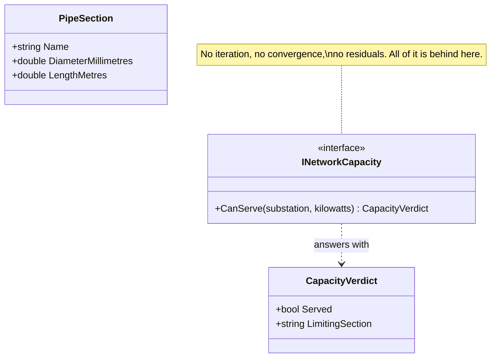

# Cohesive Mechanism

🌍 🇬🇧 English (this file) · 🇫🇷 [Français](CohesiveMechanism-fr.md)

## Intent

Cohesive Mechanism separates a self-contained piece of machinery — an algorithm, a formalism, a solver —
from the model that needs it, so that the model states what it wants and not how the answer is computed.

## Problem

A city's district heating network: a few hundred kilometres of insulated pipe, one plant, eleven thousand
buildings, and a planner who has to answer one question all day. *Can this new block be connected without
starving the end of the eastern branch in February?*

The model that answers it is small and readable — plants, pipes, substations, a demand per building. The
answer is not. It is a hydraulic and thermal balance over the whole network, solved iteratively, and it is
several hundred lines of numerics that mention nothing a planner would recognise.

Left in place, the numerics do not sit quietly beside the concepts. They pull on them:

```csharp
public sealed class PipeSection {
    public double DiameterMillimetres { get; }
    public double Residual            { get; set; }
    public double ReynoldsNumber      { get; set; }
    public bool   Converged           { get; set; }
}
```

A pipe grows a residual and a Reynolds number, a substation grows a convergence flag, and after a year of
that nobody can read the model to find out what the business believes, because two thirds of every class
is machinery.

## Solution

The pattern partitions the mechanism out.

The conceptually cohesive machinery is moved into a separate lightweight framework — the book says to
watch particularly for formalisms and well-documented categories of algorithms — and its capabilities are
exposed through an intention-revealing interface.

The other elements of the domain can then focus on expressing the problem, the *what*, and delegate the
intricacies of the solution, the *how*, to the framework.

What this rescues is the model rather than the algorithm. Separating them is what keeps a `Pipe` a pipe.
It also earns its keep in the other direction, though that is the lesser reason: a well-documented
category of algorithm can be tested against published cases, replaced by a faster one, or bought — and
none of that touches the model.

## Structure



`PipeSection` is in the picture to show what it stayed once the numerics moved out: three properties, and
nothing a planner would not recognise.

## The roles

| Role | Annotation | Applies to | What it carries |
|---|---|---|---|
| CohesiveMechanism | `[CohesiveMechanism]` | interface, class, assembly | Machinery factored out of the model and exposed by an interface that speaks of what it computes rather than of how. |

One role, and three scopes: an interface where the mechanism is one contract, a class where it is one
implementation, an assembly where it is a framework of its own.

## The example

From [`CohesiveMechanismUsage.cs`](../../../../DesignPatternCatalog.Usage/DomainDrivenDesign/CohesiveMechanismUsage.cs).

```csharp
/// <summary>
///     The hydraulic and thermal balance of the network, asked in the planner's language.
/// </summary>
/// <remarks>
///     Nothing here mentions iteration, convergence or residuals. That vocabulary lives entirely behind
///     this interface, which is the whole of what the pattern is for.
/// </remarks>
[CohesiveMechanism]
public interface INetworkCapacity {

    /// <summary>
    ///     Whether the network can carry a new load at the given connection point on the coldest design day.
    /// </summary>
    CapacityVerdict CanServe(string substation, double kilowatts);

}
```

Two things about this interface are worth reading closely.

**It is stated in what the planner wants to know, not in what the solver computes:** `CanServe`, not
`Solve`. That is the intention-revealing half of the book's instruction, and it is what makes the model
able to call the mechanism without adopting its vocabulary.

**It returns a reason when the answer is no.** A planner told *no* without being told which branch is
short has been given the algorithm's answer rather than the domain's.

```csharp
/// <summary>
///     The answer, with the part a planner acts on.
/// </summary>
public sealed record CapacityVerdict(bool Served, string? LimitingSection);
```

`LimitingSection` is the domain's half of the answer. The solver knows it as a matter of course — it is
whichever constraint bound first — and passing it out is the difference between a mechanism the model can
use and an oracle it must trust.

```csharp
/// <summary>
///     A stretch of pipe, and what it stayed once the numerics moved out.
/// </summary>
public sealed record PipeSection(string Name, double DiameterMillimetres, double LengthMetres);
```

The point of the whole exercise, in one line. Compare with the class in the problem above: same subject,
and the residual, the Reynolds number and the convergence flag are gone.

## Applicability

**Partition a conceptually cohesive mechanism into a separate lightweight framework**, when the mechanism
has grown to the point where the model no longer tells a story.

**Watch particularly for formalisms or well-documented categories of algorithms.** The book names these
as the strongest candidates, because a mechanism with a name in the literature is one that can be tested,
replaced or bought.

**Expose the capabilities of the framework with an intention-revealing interface**, so that the domain
states the problem and the framework holds the solution.

## When not to use it

**Do not reach for it before encapsulation stops working.** The book presents the pattern as what to do
when the ordinary discipline — hiding an algorithm behind a method with an intention-revealing name —
breaks down. Where a private method still tells the story, a framework is machinery around machinery.

**Do not confuse it with a generic subdomain.** The book distinguishes them explicitly, and the
distinction is the useful one: a generic subdomain *is* a model, of some part of the domain that nobody
competes on. A cohesive mechanism does not represent the domain at all — its purpose is to solve a knotty
computational problem that the expressive model poses.

**Do not let the mechanism's vocabulary into the interface.** A `Solve` that returns residuals has moved
the numerics rather than separated them, and the model will start reasoning about convergence again.

**Do not return a bare verdict where the domain needs a reason.** A mechanism that answers *no* and
nothing else forces the model to trust it, and a planner cannot act on trust.

## Advantages

* The model stays readable as a model: a pipe keeps three properties instead of growing seven.
* The mechanism can be tested against published cases, since a well-documented algorithm has them.
* It can be replaced by a faster implementation, or bought, without touching the domain.
* The two concerns can be worked on by different people, with different skills, at the same time.
* What the domain asks and what the machinery computes stop being written in one vocabulary, which is
  what made both hard to read.

## Drawbacks

* It is one more boundary to design, and an interface that gets it wrong forces callers to know the
  mechanism anyway.
* The intention-revealing interface can hide information the model needs — cost, confidence, why an answer
  came out as it did.
* Someone still has to own the mechanism, and a framework nobody owns rots faster than code inside a
  model.
* The separation is a judgement about where the domain ends, and nothing verifies it.

## Relations with other patterns

**`GenericSubdomain`** is the pattern this is most often confused with, and the book separates them: that
one is a model, this one is not.

**`CoreDomain`** is what the separation protects. Distillation is the chapter both belong to, and taking
the machinery out is one of the ways the core gets small.

**`Service`** is what the mechanism's interface usually looks like — a stateless operation stated in the
domain's language.

**`StandaloneClass`** is the same instinct at the scale of a type: reduce what a reader must hold in mind
in order to trust the code.

**`SideEffectFreeFunction`** is what a mechanism's operation typically is, which is what lets a planner
try a dozen connection points before committing to one.

## Source

*Domain-Driven Design: Tackling Complexity in the Heart of Software*, Eric Evans, Addison-Wesley, 2003 —
chapter 15, distillation.

* [Index entry](../../../generated/catalog-index.md#cohesivemechanism-domain-driven-design)
* [Generated attribute](../../../../DesignPatternCatalog.DomainDrivenDesign/CohesiveMechanism.cs)
* [Example](../../../../DesignPatternCatalog.Usage/DomainDrivenDesign/CohesiveMechanismUsage.cs)
