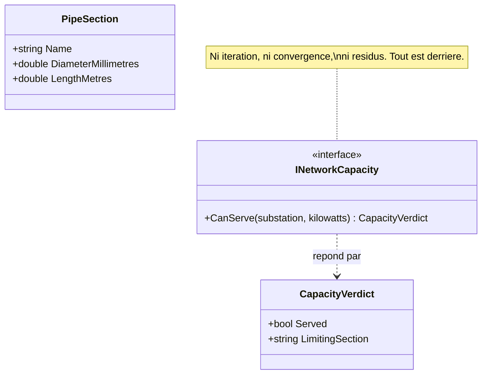

# Cohesive Mechanism

🌍 🇫🇷 Français (ce fichier) · 🇬🇧 [English](CohesiveMechanism-en.md)

## Intention

Cohesive Mechanism sépare une machinerie autonome — un algorithme, un formalisme, un solveur — du modèle
qui en a besoin, de sorte que le modèle énonce ce qu'il veut et non comment la réponse est calculée.

## Problème

Le réseau de chaleur d'une ville : quelques centaines de kilomètres de conduite isolée, une chaufferie,
onze mille bâtiments, et un planificateur qui doit répondre toute la journée à une seule question. *Ce
nouvel immeuble peut-il être raccordé sans affamer le bout de la branche est en février ?*

Le modèle qui y répond est petit et lisible — chaufferies, conduites, sous-stations, une demande par
bâtiment. La réponse ne l'est pas. C'est un équilibre hydraulique et thermique sur tout le réseau, résolu
itérativement, et cela fait plusieurs centaines de lignes de numérique qui ne mentionnent rien qu'un
planificateur reconnaîtrait.

Laissée sur place, la numérique ne siège pas tranquillement à côté des concepts. Elle tire dessus :

```csharp
public sealed class PipeSection {
    public double DiameterMillimetres { get; }
    public double Residual            { get; set; }
    public double ReynoldsNumber      { get; set; }
    public bool   Converged           { get; set; }
}
```

Une conduite se dote d'un résidu et d'un nombre de Reynolds, une sous-station d'un drapeau de convergence,
et après un an de cela plus personne ne peut lire le modèle pour savoir ce que le métier croit, parce que
les deux tiers de chaque classe sont de la machinerie.

## Solution

Le patron sort le mécanisme.

La machinerie conceptuellement cohésive est déplacée dans un cadre léger et séparé — le livre dit de
guetter en particulier les formalismes et les catégories d'algorithmes bien documentées — et ses capacités
sont exposées par une interface révélant l'intention.

Les autres éléments du domaine peuvent alors se concentrer sur l'expression du problème, le *quoi*, et
déléguer les subtilités de la solution, le *comment*, au cadre.

Ce que cela sauve, c'est le modèle plutôt que l'algorithme. Les séparer est ce qui fait qu'une `Pipe`
reste une conduite. Cela se rentabilise aussi dans l'autre sens, quoique ce soit la raison moindre : une
catégorie d'algorithme bien documentée peut être testée contre des cas publiés, remplacée par une plus
rapide, ou achetée — et rien de cela ne touche le modèle.

## Structure



`PipeSection` figure dans l'image pour montrer ce qu'elle est restée une fois la numérique sortie : trois
propriétés, et rien qu'un planificateur ne reconnaîtrait pas.

## Les rôles

| Rôle | Annotation | S'applique à | Ce qu'il porte |
|---|---|---|---|
| CohesiveMechanism | `[CohesiveMechanism]` | interface, classe, assembly | De la machinerie sortie du modèle et exposée par une interface qui parle de ce qu'elle calcule plutôt que de comment. |

Un seul rôle, et trois portées : une interface là où le mécanisme est un contrat, une classe là où il est
une implémentation, une assembly là où il est un cadre à part entière.

## L'exemple

Extrait de [`CohesiveMechanismUsage.cs`](../../../../DesignPatternCatalog.Usage/DomainDrivenDesign/CohesiveMechanismUsage.cs).

```csharp
/// <summary>
///     The hydraulic and thermal balance of the network, asked in the planner's language.
/// </summary>
/// <remarks>
///     Nothing here mentions iteration, convergence or residuals. That vocabulary lives entirely behind
///     this interface, which is the whole of what the pattern is for.
/// </remarks>
[CohesiveMechanism]
public interface INetworkCapacity {

    /// <summary>
    ///     Whether the network can carry a new load at the given connection point on the coldest design day.
    /// </summary>
    CapacityVerdict CanServe(string substation, double kilowatts);

}
```

Deux choses de cette interface méritent une lecture attentive.

**Elle est énoncée dans ce que le planificateur veut savoir, non dans ce que le solveur calcule :**
`CanServe`, non `Solve`. C'est la moitié « révéler l'intention » de l'instruction du livre, et c'est ce qui
permet au modèle d'appeler le mécanisme sans adopter son vocabulaire.

**Elle rend une raison quand la réponse est non.** Un planificateur à qui l'on dit *non* sans lui dire
quelle branche est courte a reçu la réponse de l'algorithme plutôt que celle du domaine.

```csharp
/// <summary>
///     The answer, with the part a planner acts on.
/// </summary>
public sealed record CapacityVerdict(bool Served, string? LimitingSection);
```

`LimitingSection` est la moitié domaine de la réponse. Le solveur la connaît de toute façon — c'est la
contrainte qui a saturé la première — et la faire ressortir est la différence entre un mécanisme que le
modèle peut employer et un oracle auquel il doit se fier.

```csharp
/// <summary>
///     A stretch of pipe, and what it stayed once the numerics moved out.
/// </summary>
public sealed record PipeSection(string Name, double DiameterMillimetres, double LengthMetres);
```

Le propos de tout l'exercice, en une ligne. À comparer à la classe du problème ci-dessus : même sujet, et
le résidu, le nombre de Reynolds et le drapeau de convergence ont disparu.

## Possibilités d'application

**Partitionnez un mécanisme conceptuellement cohésif dans un cadre léger et séparé**, lorsque le mécanisme
a grossi au point que le modèle ne raconte plus d'histoire.

**Guettez en particulier les formalismes et les catégories d'algorithmes bien documentées.** Le livre les
nomme comme les meilleurs candidats, parce qu'un mécanisme qui a un nom dans la littérature est un
mécanisme qui peut être testé, remplacé ou acheté.

**Exposez les capacités du cadre par une interface révélant l'intention**, de sorte que le domaine énonce
le problème et que le cadre détienne la solution.

## Quand ne pas l'utiliser

**N'y recourez pas avant que l'encapsulation cesse de fonctionner.** Le livre présente le patron comme ce
qu'il faut faire quand la discipline ordinaire — cacher un algorithme derrière une méthode au nom révélant
l'intention — cède. Là où une méthode privée raconte encore l'histoire, un cadre est de la machinerie
autour de la machinerie.

**Ne le confondez pas avec un sous-domaine générique.** Le livre les distingue explicitement, et la
distinction est celle qui sert : un sous-domaine générique *est* un modèle, d'une part du domaine sur
laquelle personne ne concourt. Un mécanisme cohésif ne représente pas le domaine du tout — son propos est
de résoudre un problème calculatoire épineux que le modèle expressif pose.

**Ne laissez pas le vocabulaire du mécanisme entrer dans l'interface.** Un `Solve` qui rend des résidus a
déplacé la numérique plutôt que de l'avoir séparée, et le modèle se remettra à raisonner sur la
convergence.

**Ne rendez pas un verdict nu là où le domaine a besoin d'une raison.** Un mécanisme qui répond *non* et
rien d'autre force le modèle à s'en remettre à lui, et un planificateur ne peut pas agir sur une confiance.

## Avantages

* Le modèle reste lisible comme un modèle : une conduite garde trois propriétés au lieu d'en gagner sept.
* Le mécanisme peut être testé contre des cas publiés, puisqu'un algorithme bien documenté en a.
* Il peut être remplacé par une implémentation plus rapide, ou acheté, sans toucher au domaine.
* Les deux préoccupations peuvent être travaillées par des personnes différentes, aux compétences
  différentes, en même temps.
* Ce que le domaine demande et ce que la machinerie calcule cessent d'être écrits dans un seul
  vocabulaire, ce qui rendait les deux difficiles à lire.

## Inconvénients

* C'est une frontière de plus à concevoir, et une interface qui la manque oblige les appelants à connaître
  le mécanisme malgré tout.
* L'interface révélant l'intention peut cacher une information dont le modèle a besoin — le coût, la
  confiance, la raison pour laquelle une réponse est sortie ainsi.
* Quelqu'un doit malgré tout posséder le mécanisme, et un cadre que personne ne possède pourrit plus vite
  que du code à l'intérieur d'un modèle.
* La séparation est un jugement sur l'endroit où le domaine s'arrête, et rien ne le vérifie.

## Liens avec les autres patrons

**`GenericSubdomain`** est le patron avec lequel celui-ci est le plus souvent confondu, et le livre les
sépare : celui-là est un modèle, celui-ci n'en est pas un.

**`CoreDomain`** est ce que la séparation protège. La distillation est le chapitre dont les deux relèvent,
et sortir la machinerie est l'une des façons dont le noyau devient petit.

**`Service`** est ce à quoi l'interface d'un mécanisme ressemble d'ordinaire — une opération sans état
énoncée dans la langue du domaine.

**`StandaloneClass`** est le même instinct à l'échelle d'un type : réduire ce qu'un lecteur doit tenir en
tête pour se fier au code.

**`SideEffectFreeFunction`** est ce qu'est typiquement l'opération d'un mécanisme, et c'est ce qui permet à
un planificateur d'essayer une douzaine de points de raccordement avant d'en retenir un.

## Source

*Domain-Driven Design: Tackling Complexity in the Heart of Software*, Eric Evans, Addison-Wesley, 2003 —
chapitre 15, la distillation.

* [Entrée d'index](../../../generated/catalog-index.md#cohesivemechanism-domain-driven-design)
* [Attribut généré](../../../../DesignPatternCatalog.DomainDrivenDesign/CohesiveMechanism.cs)
* [Exemple](../../../../DesignPatternCatalog.Usage/DomainDrivenDesign/CohesiveMechanismUsage.cs)
