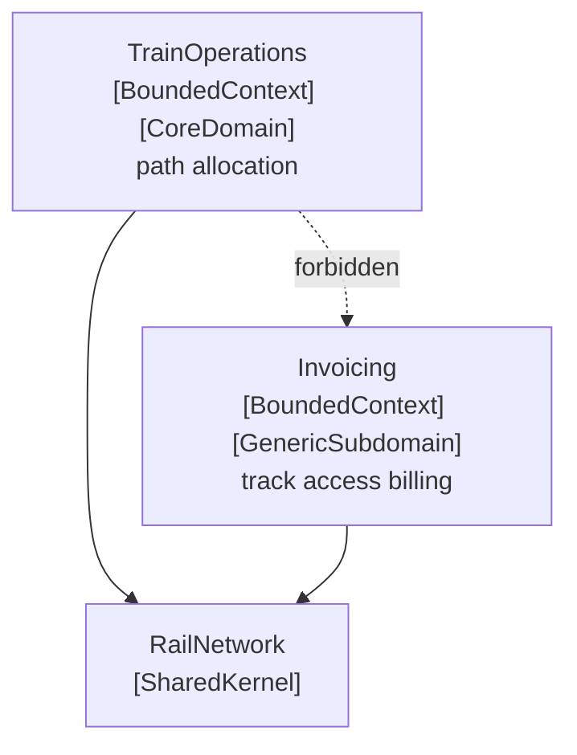

# Core Domain

🌍 🇬🇧 English (this file) · 🇫🇷 [Français](CoreDomain-fr.md)

## Intent

Core Domain is the part of the model that makes the product worth writing: what the organisation does
better than its competitors, and would not buy from anyone.

## Problem

Regional rail. The system has timetabling, path allocation, invoicing, tax rules, dunning, user accounts,
reporting, an export to the national portal and an interface to a 1987 mainframe. Every one of those is
complicated and every one is necessary.

Told that everything matters, a team distributes its attention evenly. The best modeller spends a quarter
on a dunning workflow because it was the ticket at the top. Path allocation — the thing this operator
actually competes on — stays as it was first sketched, because nobody was told it deserved more.

Nothing in the codebase says otherwise. The invoicing assembly and the operations assembly look alike
from the outside: same layout, same conventions, same number of classes.

## Solution

The pattern boils the model down and marks what is left.

The core domain is found and made easy to distinguish from the mass of supporting model and code. The
most valuable and specialised concepts are brought into sharp relief, and the core is kept small.

Then the consequence, which is what the pattern is for: the top talent goes to the core, and recruitment
follows. The effort of finding a deep model and developing a supple design is spent there — enough to
fulfil the vision of the system, and not spread evenly over everything that happens to be necessary.

## Structure



Two assemblies of similar size, and one annotation telling them apart. The dashed arrow is the rule the
annotation exists to support: what is core must not depend on what merely supports it.

## The roles

| Role | Annotation | Applies to | What it carries |
|---|---|---|---|
| CoreDomain | `[assembly: CoreDomain]` | assembly | Where the distinctive part of the model lives. It earns the best people and the most modelling effort, and it must not be allowed to depend on what merely supports it. |

One role, on an assembly, not repeatable. A system with two core domains has not finished distilling.

## The example

From [`CoreDomainUsage.cs`](../../../../DesignPatternCatalog.Usage.TrainOperations/CoreDomainUsage.cs).

```csharp
[assembly: CoreDomain]
```

The same assembly also carries `[assembly: BoundedContext]`, and the two say different things. The first
says *one model applies here*. This one says *this is the model worth the effort*. They are independent
in principle, as the invoicing assembly shows: a bounded context is very often not the core domain.

```csharp
/// <summary>
///     The right to run one train over one section within one minute — what the whole model is about.
/// </summary>
public sealed class TrainPath {

    public TrainPath(SectionId section, TimeOnly entry, TimeOnly exit) {
        Section = section;
        Entry   = entry;
        Exit    = exit;
    }

    public SectionId Section { get; }
    public TimeOnly  Entry   { get; }
    public TimeOnly  Exit    { get; }

    /// <summary>
    ///     Two paths conflict when they occupy one section at the same time.
    /// </summary>
    public bool ConflictsWith(TrainPath other) {
        return Section == other.Section && Entry < other.Exit && other.Entry < Exit;
    }

}
```

What makes path allocation core is that it is where the operator competes. Fitting one more freight path
into a timetable already dense with commuter services, without breaking a connection or exceeding what a
section can carry, is the thing this company does better than the operator on the next network — and it is
the thing no vendor sells. Billing is bought; path allocation is built.

`ConflictsWith` is one line, and that is the pattern rather than a shortcoming of the sample: the core is
distilled, so the concept at its centre is small enough to be stated exactly.

The consequence the annotation is meant to force is about **dependency**. Nothing here may reference the
invoicing assembly, because a path is allocated on operational grounds and would silently start being
allocated on billing grounds the day a tariff appeared in this code. An architecture test can check that,
and the annotation is what gives it something to range over — the difference between *we all know Train
Operations is the important one* and a build that fails when the dependency appears.

## Applicability

**Boil the model down, and provide a means of easily distinguishing the core domain from the mass of
supporting model and code.**

**Bring the most valuable and specialised concepts into sharp relief, and make the core small.**

**Apply top talent to the core domain, and recruit accordingly.** The book states this as part of the
pattern rather than as management advice: distillation is only useful if it changes where the effort
goes.

**Spend the effort in the core to find a deep model and develop a supple design** — sufficient to fulfil
the vision of the system.

## When not to use it

**Do not mark more than one thing core.** The value of the annotation is comparative. Two core domains
mean the distillation has not been done, and the effort will be distributed evenly again.

**Do not confuse *important* with *distinctive*.** Invoicing is important — an unbilled month is a serious
problem — and it is not core, because every railway in Europe bills track access the same way. The test is
whether the organisation would buy it.

**Do not mark it core and then treat it like everything else.** The annotation is a claim about where
effort goes. Recorded and ignored, it is worse than absent, because it says the question was considered.

**Do not let the core depend on what supports it.** This is the rule the annotation exists to support, and
the reference that breaks it is one line in a project file that looks entirely sensible on the day it is
added.

## Advantages

* The part of the model worth the effort is named, so effort can be directed rather than distributed.
* A dependency rule becomes checkable: what is core must not reach into what merely supports it.
* The core stays small, because distillation is what put it there.
* New arrivals learn what the system is actually about by reading one assembly.
* The judgement is recorded where it can be argued with, instead of living in whoever has been there
  longest.

## Drawbacks

* Choosing wrongly directs the best people at the wrong thing, and the annotation makes the mistake
  durable.
* What is core changes as the business changes, and nothing prompts a re-examination.
* Naming a core implies the rest is not, which is a statement about colleagues' work as well as about
  code.
* The annotation records a decision it cannot enforce: only a rule over it refuses the dependency.

## Relations with other patterns

**`GenericSubdomain`** is the other half of the same distillation, and the pair only means something
together: this is the part worth the effort, that is the part that is not.

**`BoundedContext`** is a different claim about the same assembly. One says *one model applies here*, the
other says *this model is the one worth the effort*.

**`CohesiveMechanism`** is what distillation removes from the core: machinery factored out so that what
remains reads as the domain.

**`SharedKernel`** is what a core domain usually is not — what two contexts share is by definition not
what distinguishes either.

**`PluggableComponentFramework`** is a larger structure that the book says only becomes available for a
mature, deeply distilled model.

## Source

*Domain-Driven Design: Tackling Complexity in the Heart of Software*, Eric Evans, Addison-Wesley, 2003 —
chapter 15, distillation.

* [Index entry](../../../generated/catalog-index.md#coredomain-domain-driven-design)
* [Generated attribute](../../../../DesignPatternCatalog.DomainDrivenDesign/CoreDomain.cs)
* [Example](../../../../DesignPatternCatalog.Usage.TrainOperations/CoreDomainUsage.cs)
