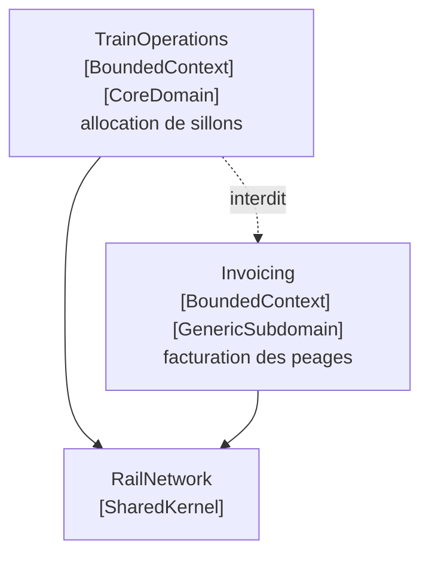

# Core Domain

🌍 🇫🇷 Français (ce fichier) · 🇬🇧 [English](CoreDomain-en.md)

## Intention

Core Domain est la part du modèle qui rend le produit digne d'être écrit : ce que l'organisation fait
mieux que ses concurrents, et qu'elle n'achèterait à personne.

## Problème

Réseau ferroviaire régional. Le système comporte la construction horaire, l'allocation de sillons, la
facturation, les règles fiscales, les relances, les comptes utilisateurs, les états, un export vers le
portail national et une interface avec un mainframe de 1987. Chacun de ces sujets est compliqué et chacun
est nécessaire.

À qui l'on dit que tout compte, une équipe répartit son attention également. Le meilleur modélisateur
passe un trimestre sur un enchaînement de relances parce que c'était le ticket en haut de la pile.
L'allocation de sillons — ce sur quoi cet opérateur concourt réellement — reste telle qu'elle a été
esquissée, parce que personne n'a dit qu'elle méritait davantage.

Rien dans la base de code ne dit le contraire. L'assembly de facturation et celle d'exploitation se
ressemblent vues de l'extérieur : même disposition, mêmes conventions, même nombre de classes.

## Solution

Le patron distille le modèle et marque ce qui reste.

Le domaine central est trouvé et rendu facile à distinguer de la masse du modèle et du code de soutien.
Les concepts les plus précieux et les plus spécialisés sont mis en relief, et le noyau est gardé petit.

Puis vient la conséquence, qui est ce à quoi sert le patron : les meilleurs vont au domaine central, et le
recrutement suit. L'effort de trouver un modèle profond et de développer une conception souple est dépensé
là — assez pour réaliser la vision du système, et non réparti également sur tout ce qui se trouve être
nécessaire.

## Structure



Deux assemblies de taille comparable, et une annotation qui les départage. La flèche pointillée est la
règle que l'annotation existe pour soutenir : ce qui est central ne doit pas dépendre de ce qui ne fait
que le soutenir.

## Les rôles

| Rôle | Annotation | S'applique à | Ce qu'il porte |
|---|---|---|---|
| CoreDomain | `[assembly: CoreDomain]` | assembly | L'endroit où vit la part distinctive du modèle. Elle mérite les meilleurs et le plus gros de l'effort de modélisation, et ne doit pas être laissée dépendre de ce qui ne fait que la soutenir. |

Un seul rôle, sur une assembly, non répétable. Un système à deux domaines centraux n'a pas fini de
distiller.

## L'exemple

Extrait de [`CoreDomainUsage.cs`](../../../../DesignPatternCatalog.Usage.TrainOperations/CoreDomainUsage.cs).

```csharp
[assembly: CoreDomain]
```

La même assembly porte aussi `[assembly: BoundedContext]`, et les deux disent des choses différentes. La
première dit *un modèle s'applique ici*. Celle-ci dit *c'est le modèle qui vaut l'effort*. Elles sont
indépendantes en principe, comme le montre l'assembly de facturation : un contexte borné n'est très
souvent pas le domaine central.

```csharp
/// <summary>
///     The right to run one train over one section within one minute — what the whole model is about.
/// </summary>
public sealed class TrainPath {

    public TrainPath(SectionId section, TimeOnly entry, TimeOnly exit) {
        Section = section;
        Entry   = entry;
        Exit    = exit;
    }

    public SectionId Section { get; }
    public TimeOnly  Entry   { get; }
    public TimeOnly  Exit    { get; }

    /// <summary>
    ///     Two paths conflict when they occupy one section at the same time.
    /// </summary>
    public bool ConflictsWith(TrainPath other) {
        return Section == other.Section && Entry < other.Exit && other.Entry < Exit;
    }

}
```

Ce qui rend l'allocation de sillons centrale, c'est que c'est là que l'opérateur concourt. Faire entrer un
sillon fret de plus dans un horaire déjà dense de dessertes périurbaines, sans rompre une correspondance
ni dépasser ce qu'une section peut porter, est ce que cette entreprise fait mieux que l'opérateur du
réseau voisin — et c'est ce qu'aucun fournisseur ne vend. La facturation s'achète ; l'allocation de sillons
se construit.

`ConflictsWith` fait une ligne, et c'est le patron plutôt qu'une insuffisance de l'exemple : le noyau est
distillé, donc le concept en son centre est assez petit pour être énoncé exactement.

La conséquence que l'annotation est censée forcer porte sur la **dépendance**. Rien ici ne peut référencer
l'assembly de facturation, parce qu'un sillon s'alloue sur des motifs d'exploitation et commencerait
silencieusement à s'allouer sur des motifs de facturation le jour où un tarif apparaîtrait dans ce code.
Un test d'architecture peut contrôler cela, et l'annotation est ce qui lui donne quelque chose à parcourir
— la différence entre « on sait tous que Train Operations est la plus importante » et une compilation qui
échoue quand la dépendance apparaît.

## Possibilités d'application

**Distillez le modèle, et fournissez un moyen de distinguer facilement le domaine central de la masse du
modèle et du code de soutien.**

**Mettez en relief les concepts les plus précieux et les plus spécialisés, et gardez le noyau petit.**

**Affectez les meilleurs au domaine central, et recrutez en conséquence.** Le livre l'énonce comme une
part du patron et non comme un conseil de gestion : la distillation n'est utile que si elle change
l'endroit où va l'effort.

**Dépensez dans le noyau l'effort de trouver un modèle profond et de développer une conception souple** —
assez pour réaliser la vision du système.

## Quand ne pas l'utiliser

**Ne marquez pas plus d'une chose comme centrale.** La valeur de l'annotation est comparative. Deux
domaines centraux veulent dire que la distillation n'a pas été faite, et l'effort sera de nouveau réparti
également.

**Ne confondez pas *important* et *distinctif*.** La facturation est importante — un mois non facturé est
un problème sérieux — et elle n'est pas centrale, parce que tous les chemins de fer d'Europe facturent les
péages de la même façon. Le test est de savoir si l'organisation l'achèterait.

**Ne la marquez pas centrale pour la traiter ensuite comme tout le reste.** L'annotation est une
affirmation sur l'endroit où va l'effort. Consignée et ignorée, elle est pire qu'absente, parce qu'elle dit
que la question a été examinée.

**Ne laissez pas le noyau dépendre de ce qui le soutient.** C'est la règle que l'annotation existe pour
soutenir, et la référence qui la rompt est une ligne dans un fichier de projet, tout à fait sensée le jour
où elle est ajoutée.

## Avantages

* La part du modèle qui vaut l'effort est nommée, si bien que l'effort peut être dirigé plutôt que
  réparti.
* Une règle de dépendance devient contrôlable : ce qui est central ne doit pas atteindre ce qui ne fait
  que le soutenir.
* Le noyau reste petit, puisque c'est la distillation qui l'y a mis.
* Les nouveaux arrivants apprennent de quoi le système parle vraiment en lisant une assembly.
* Le jugement est consigné là où il peut être contesté, au lieu de vivre chez celui qui est là depuis le
  plus longtemps.

## Inconvénients

* Choisir mal dirige les meilleurs vers la mauvaise chose, et l'annotation rend l'erreur durable.
* Ce qui est central change quand le métier change, et rien n'invite au réexamen.
* Nommer un noyau implique que le reste n'en est pas un, ce qui est une affirmation sur le travail de
  collègues autant que sur du code.
* L'annotation consigne une décision qu'elle ne peut pas imposer : seule une règle portant sur elle refuse
  la dépendance.

## Liens avec les autres patrons

**`GenericSubdomain`** est l'autre moitié de la même distillation, et la paire ne veut dire quelque chose
qu'ensemble : ceci est la part qui vaut l'effort, cela est la part qui ne le vaut pas.

**`BoundedContext`** est une affirmation différente sur la même assembly. L'une dit *un modèle s'applique
ici*, l'autre dit *ce modèle est celui qui vaut l'effort*.

**`CohesiveMechanism`** est ce que la distillation retire du noyau : de la machinerie sortie pour que ce
qui reste se lise comme le domaine.

**`SharedKernel`** est ce qu'un domaine central n'est d'ordinaire pas — ce que deux contextes partagent
n'est par définition pas ce qui distingue l'un ou l'autre.

**`PluggableComponentFramework`** est une structure plus vaste, que le livre dit ne devenir accessible que
pour un modèle mûr et profondément distillé.

## Source

*Domain-Driven Design: Tackling Complexity in the Heart of Software*, Eric Evans, Addison-Wesley, 2003 —
chapitre 15, la distillation.

* [Entrée d'index](../../../generated/catalog-index.md#coredomain-domain-driven-design)
* [Attribut généré](../../../../DesignPatternCatalog.DomainDrivenDesign/CoreDomain.cs)
* [Exemple](../../../../DesignPatternCatalog.Usage.TrainOperations/CoreDomainUsage.cs)
