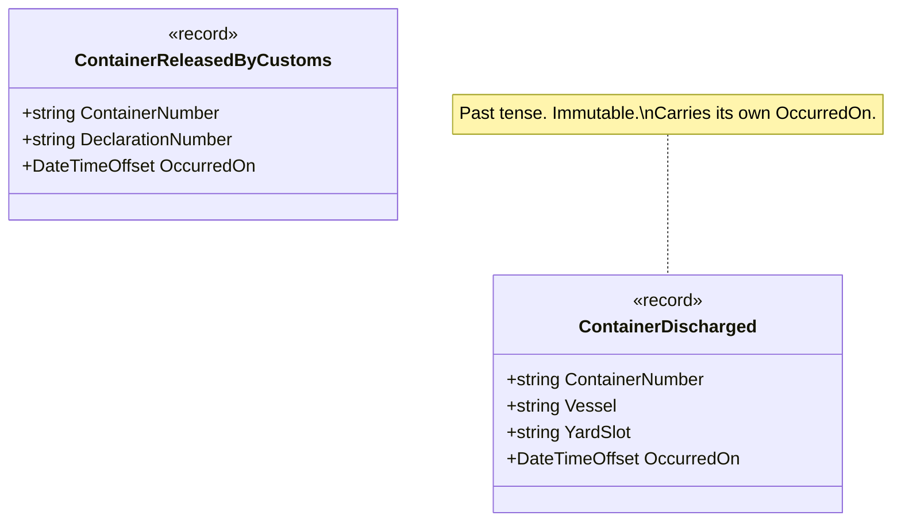

# Domain Event

🌍 🇬🇧 English (this file) · 🇫🇷 [Français](DomainEvent-fr.md)

## Intent

Domain Event states that something meaningful to the domain has happened. It is named in the past
tense, and it is immutable once raised.

## Problem

A container terminal. A container comes off a ship, and customs later releases it.

A terminal is not one system. The yard planner, the customs broker, the haulier's booking desk and the
invoicing back office all need to know that a container was discharged, and none of them can be called
synchronously by the crane.

Written as the discharge telling each of them, the crane acquires four dependencies it has no business
holding:

```csharp
public void Discharge(Container container, string yardSlot) {
    _yardPlanner.Assign(container, yardSlot);
    _customsBroker.Notify(container);
    _bookingDesk.MarkAvailable(container);
    _invoicing.StartDemurrageClock(container);
}
```

The fifth consumer is a fifth line, added by whoever asks. And the crane now waits for four systems in
order to finish a movement that already physically happened.

## Solution

The pattern publishes a statement rather than an instruction.

What the model publishes is not addressed to anybody in particular — it says that something happened.
Whoever cares subscribes, and the model does not learn who they are.

Three properties follow, and they are what make this a pattern rather than a message with a nice name.
It is in the past tense, so it cannot be refused. It is immutable, so a subscriber cannot rewrite history
for the subscribers after it. And it carries when it happened, distinctly from when it is handled.

## Structure



Two records and no collaborator. An event that pointed at a handler would be an instruction, which is the
thing the pattern is defined against.

## The roles

| Role | Annotation | Applies to | What it carries |
|---|---|---|---|
| DomainEvent | `[DomainEvent]` | class, struct | States, in the past tense, that something meaningful to the domain has happened. |

One role, so nothing to choose. The annotation is inherited.

## The example

From [`DomainEventUsage.cs`](../../../../DesignPatternCatalog.Usage/DomainDrivenDesign/DomainEventUsage.cs).

```csharp
[DomainEvent]
public sealed record ContainerDischarged(string ContainerNumber, string Vessel, string YardSlot, DateTimeOffset OccurredOn);

[DomainEvent]
public sealed record ContainerReleasedByCustoms(string ContainerNumber, string DeclarationNumber, DateTimeOffset OccurredOn);
```

Two lines, carrying four decisions.

**The name is in the past tense.** `ContainerDischarged`, not `DischargeContainer`. The second is a
command, addressed to someone, and it can be refused; the first has already happened and cannot. This is
the difference the pattern turns on, and it is visible in the name alone.

**`record` gives immutability and equality by value.** A subscriber that could edit the event would be
rewriting history for every subscriber after it.

**`OccurredOn` is on the event, not supplied by the handler.** Customs may release a container on Friday
and the invoicing run may see it on Monday; the demurrage calculation needs the Friday. An event without
its own timestamp silently becomes an event about when it was processed.

**The event carries values, not entity references.** `ContainerNumber` is a string, not a `Container`. A
handler waking up on Monday must not be shown the container as it is on Monday — it needs what was true
when the event occurred, and holding a reference would give it the opposite.

## Applicability

The 2003 book does not carry this pattern, and Evans' *Domain-Driven Design Reference* states it briefly
rather than in the form the book gives its building blocks. So this section is short by necessity rather
than by choice: what follows is what the Reference supports, and no more.

**Use Domain Event to model something that happened, which domain experts care about.**

**Name the event in the past tense**, and make it immutable once raised.

**Give the event the time at which it occurred**, distinctly from the time at which it is handled.

The field has built a much larger body of practice on top of this — event sourcing, outbox patterns,
eventual consistency between aggregates, the whole of the event-driven vocabulary. None of it is Evans',
and none of it is stated here.

## When not to use it

The Reference does not set out contraindications for this pattern, so what follows is a judgement the
field formed after it, and is marked as such rather than presented as Evans'.

**Do not use Domain Event where a direct call is honest.** One consumer, in the same transaction, that
must succeed for the operation to be correct — that is a method call. An event in that position adds
indirection and takes away the guarantee.

**Do not use it for something that has not happened yet.** A name in the imperative is the signal:
`DischargeContainer` can be refused, and a subscriber that refuses an event has nobody to tell.

**Do not put an entity reference in an event.** It is the most common way the pattern quietly fails: the
handler reads the object's present state instead of the state the event is about, and the bug appears
only when handling is delayed.

**Do not use it to escape a transaction you actually need.** Publishing an event makes consistency
eventual. Where the invariant must hold at every commit, the aggregate boundary is the tool, and an event
is a way of not noticing that the boundary was drawn wrong.

**Do not let events become an integration protocol by accident.** An event published outside the context
is a contract with people who cannot be renamed alongside your model — which is what published language
is for, and what the microservices catalogue's own Domain Event entry is about.

## Advantages

* The model states what happened without knowing who cares, so a fifth consumer costs nothing.
* The crane finishes its movement without waiting for four systems.
* The record of what happened is immutable and timestamped, which is what makes it auditable and
  replayable.
* Handlers are testable on their own: an event is a value, and constructing one needs nothing else.

## Drawbacks

* Consistency becomes eventual, and the moment at which the system is correct is no longer a single
  commit.
* What the system will do in response is no longer visible in one place — the cost the pattern shares
  with every form of decoupling.
* Delivery has to be arranged, and the arrangement is not part of the pattern: an event published and
  lost looks exactly like an event nobody subscribed to.
* Events are easy to multiply, and a model that publishes everything says nothing about what matters.

## Relations with other patterns

**`Aggregate`** is usually what raises an event: the boundary within which a change is consistent is the
natural place from which to announce that the change happened.

**`ValueObject`** is what an event should be made of, and what it should carry — values rather than
references, for the reason the example gives.

**`Entity`** is what an event must *not* carry a reference to, which is the same point read the other way
round.

**`PublishedLanguage`** is what an event becomes when it crosses a context boundary, and the point at
which it stops being an internal statement and starts being a contract.

**`Service`** is the alternative when the model needs an answer rather than a record: a service is asked
and replies, an event is stated and does not.

## Source

*Domain-Driven Design Reference: Definitions and Pattern Summaries*, Eric Evans, Domain Language, 2015.

The pattern is **not** in *Domain-Driven Design* (2003); Evans added it to the Reference in the eleven
years between the two, and this catalogue holds it under Domain-Driven Design for a reason recorded in
[ADR-0041](../../for-maintainers/adr/0041-hold-a-pattern-named-in-an-authors-later-reference-edition.md).
Martin Fowler published a *Domain Event* of his own on his site in 2005, which this repository does not
hold.

* [Index entry](../../../generated/catalog-index.md#domainevent-domain-driven-design)
* [Generated attribute](../../../../DesignPatternCatalog.DomainDrivenDesign/DomainEvent.cs)
* [Example](../../../../DesignPatternCatalog.Usage/DomainDrivenDesign/DomainEventUsage.cs)
