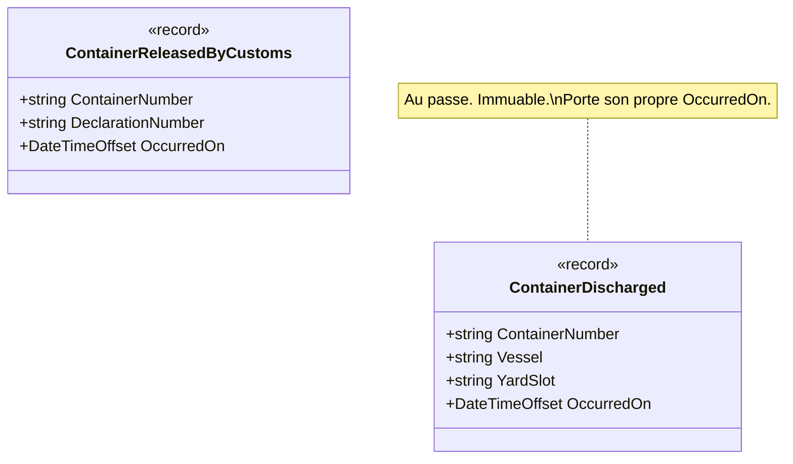

# Domain Event

🌍 🇫🇷 Français (ce fichier) · 🇬🇧 [English](DomainEvent-en.md)

## Intention

Domain Event énonce que quelque chose de significatif pour le domaine s'est produit. Il est nommé au
passé, et il est immuable une fois émis.

## Problème

Un terminal à conteneurs. Un conteneur est déchargé d'un navire, et la douane le dédouane plus tard.

Un terminal n'est pas un système. Le planificateur de parc, le commissionnaire en douane, le bureau de
réservation du transporteur et le back-office de facturation ont tous besoin de savoir qu'un conteneur a
été déchargé, et aucun d'eux ne peut être appelé de façon synchrone par le portique.

Écrit avec un déchargement qui prévient chacun d'eux, le portique acquiert quatre dépendances qu'il n'a
aucune raison de porter :

```csharp
public void Discharge(Container container, string yardSlot) {
    _yardPlanner.Assign(container, yardSlot);
    _customsBroker.Notify(container);
    _bookingDesk.MarkAvailable(container);
    _invoicing.StartDemurrageClock(container);
}
```

Le cinquième consommateur est une cinquième ligne, ajoutée par qui la demande. Et le portique attend
désormais quatre systèmes pour achever un mouvement qui a physiquement déjà eu lieu.

## Solution

Le patron publie une affirmation plutôt qu'une instruction.

Ce que le modèle publie n'est adressé à personne en particulier — cela dit que quelque chose s'est
produit. Qui s'y intéresse s'abonne, et le modèle n'apprend pas qui.

Trois propriétés s'ensuivent, et ce sont elles qui en font un patron plutôt qu'un message au joli nom. Il
est au passé, donc il ne peut pas être refusé. Il est immuable, donc un abonné ne peut pas réécrire
l'histoire pour les abonnés qui le suivent. Et il porte le moment où il s'est produit, distinct du moment
où il est traité.

## Structure



Deux enregistrements et aucun collaborateur. Un événement qui pointerait vers un gestionnaire serait une
instruction, soit la chose contre laquelle le patron se définit.

## Les rôles

| Rôle | Annotation | S'applique à | Ce qu'il porte |
|---|---|---|---|
| DomainEvent | `[DomainEvent]` | classe, struct | Énonce, au passé, que quelque chose de significatif pour le domaine s'est produit. |

Un seul rôle, donc rien à choisir. L'annotation est héritée.

## L'exemple

Extrait de [`DomainEventUsage.cs`](../../../../DesignPatternCatalog.Usage/DomainDrivenDesign/DomainEventUsage.cs).

```csharp
[DomainEvent]
public sealed record ContainerDischarged(string ContainerNumber, string Vessel, string YardSlot, DateTimeOffset OccurredOn);

[DomainEvent]
public sealed record ContainerReleasedByCustoms(string ContainerNumber, string DeclarationNumber, DateTimeOffset OccurredOn);
```

Deux lignes, qui portent quatre décisions.

**Le nom est au passé.** `ContainerDischarged`, non `DischargeContainer`. Le second est une commande,
adressée à quelqu'un, et elle peut être refusée ; le premier a déjà eu lieu et ne le peut pas. C'est la
différence sur laquelle repose le patron, et elle est visible dans le seul nom.

**`record` donne l'immuabilité et l'égalité par valeur.** Un abonné qui pourrait modifier l'événement
réécrirait l'histoire pour tous les abonnés qui le suivent.

**`OccurredOn` est sur l'événement, non fourni par le gestionnaire.** La douane peut dédouaner un
conteneur le vendredi et le traitement de facturation ne le voir que le lundi ; le calcul des surestaries
a besoin du vendredi. Un événement sans horodatage propre devient silencieusement un événement sur le
moment où il a été traité.

**L'événement porte des valeurs, non des références d'entités.** `ContainerNumber` est une chaîne, non un
`Container`. Un gestionnaire qui se réveille le lundi ne doit pas voir le conteneur tel qu'il est le
lundi — il a besoin de ce qui était vrai quand l'événement s'est produit, et tenir une référence lui
donnerait l'inverse.

## Possibilités d'application

Le livre de 2003 ne porte pas ce patron, et la *Domain-Driven Design Reference* d'Evans l'énonce
brièvement plutôt que sous la forme que le livre donne à ses briques. Cette section est donc courte par
nécessité et non par choix : ce qui suit est ce que la Reference soutient, et rien de plus.

**Utilisez Domain Event pour modéliser quelque chose qui s'est produit et qui intéresse les experts du
domaine.**

**Nommez l'événement au passé**, et rendez-le immuable une fois émis.

**Donnez à l'événement le moment où il s'est produit**, distinct du moment où il est traité.

La profession a bâti par-dessus un corpus de pratique bien plus vaste — event sourcing, boîte d'envoi,
cohérence à terme entre agrégats, tout le vocabulaire de l'événementiel. Rien de cela n'est d'Evans, et
rien de cela n'est énoncé ici.

## Quand ne pas l'utiliser

La Reference n'énonce pas de contre-indications pour ce patron : ce qui suit est donc un jugement que la
profession a formé après elle, et est marqué comme tel plutôt que présenté comme celui d'Evans.

**N'utilisez pas Domain Event là où un appel direct est honnête.** Un consommateur unique, dans la même
transaction, qui doit réussir pour que l'opération soit correcte — cela s'appelle un appel de méthode. Un
événement à cette place ajoute une indirection et retire la garantie.

**Ne l'employez pas pour quelque chose qui n'a pas encore eu lieu.** Un nom à l'impératif est le signal :
`DischargeContainer` peut être refusé, et un abonné qui refuse un événement n'a personne à qui le dire.

**Ne mettez pas de référence d'entité dans un événement.** C'est la façon la plus fréquente dont le patron
échoue en silence : le gestionnaire lit l'état présent de l'objet au lieu de l'état dont l'événement
parle, et le défaut n'apparaît que lorsque le traitement est différé.

**Ne l'employez pas pour échapper à une transaction dont vous avez réellement besoin.** Publier un
événement rend la cohérence différée. Là où l'invariant doit tenir à chaque validation, l'outil est la
frontière d'agrégat, et un événement est une façon de ne pas remarquer qu'elle a été mal tracée.

**Ne laissez pas les événements devenir un protocole d'intégration par accident.** Un événement publié
hors du contexte est un contrat avec des gens qu'on ne peut pas renommer en même temps que son modèle —
ce à quoi sert le langage publié, et ce dont parle l'entrée Domain Event du catalogue Microservices.

## Avantages

* Le modèle énonce ce qui s'est produit sans savoir qui s'y intéresse : un cinquième consommateur ne coûte
  rien.
* Le portique achève son mouvement sans attendre quatre systèmes.
* La trace de ce qui s'est produit est immuable et horodatée, ce qui la rend auditable et rejouable.
* Les gestionnaires se testent seuls : un événement est une valeur, et en construire un ne demande rien
  d'autre.

## Inconvénients

* La cohérence devient différée, et le moment où le système est correct n'est plus une validation unique.
* Ce que le système fera en réponse n'est plus visible à un seul endroit — le coût que le patron partage
  avec toute forme de découplage.
* La livraison doit être organisée, et l'organisation ne fait pas partie du patron : un événement publié
  et perdu ressemble exactement à un événement auquel personne ne s'était abonné.
* Les événements se multiplient facilement, et un modèle qui publie tout ne dit rien de ce qui compte.

## Liens avec les autres patrons

**`Aggregate`** est d'ordinaire ce qui émet un événement : la frontière à l'intérieur de laquelle un
changement est cohérent est l'endroit naturel d'où annoncer que le changement a eu lieu.

**`ValueObject`** est ce dont un événement devrait être fait, et ce qu'il devrait porter — des valeurs
plutôt que des références, pour la raison que donne l'exemple.

**`Entity`** est ce vers quoi un événement ne doit *pas* porter de référence, soit le même point lu à
l'envers.

**`PublishedLanguage`** est ce que devient un événement quand il franchit une frontière de contexte, et le
moment où il cesse d'être une affirmation interne pour devenir un contrat.

**`Service`** est la solution de rechange quand le modèle a besoin d'une réponse plutôt que d'une trace :
un service est interrogé et répond, un événement est énoncé et ne répond pas.

## Source

*Domain-Driven Design Reference: Definitions and Pattern Summaries*, Eric Evans, Domain Language, 2015.

Le patron n'est **pas** dans *Domain-Driven Design* (2003) ; Evans l'a ajouté à la Reference dans les onze
ans qui séparent les deux, et ce catalogue le détient sous Domain-Driven Design pour une raison consignée
dans
l'[ADR-0041](../../for-maintainers/adr/0041-hold-a-pattern-named-in-an-authors-later-reference-edition.fr.md).
Martin Fowler a publié un *Domain Event* de sa main sur son site en 2005, que ce dépôt ne détient pas.

* [Entrée d'index](../../../generated/catalog-index.md#domainevent-domain-driven-design)
* [Attribut généré](../../../../DesignPatternCatalog.DomainDrivenDesign/DomainEvent.cs)
* [Exemple](../../../../DesignPatternCatalog.Usage/DomainDrivenDesign/DomainEventUsage.cs)
