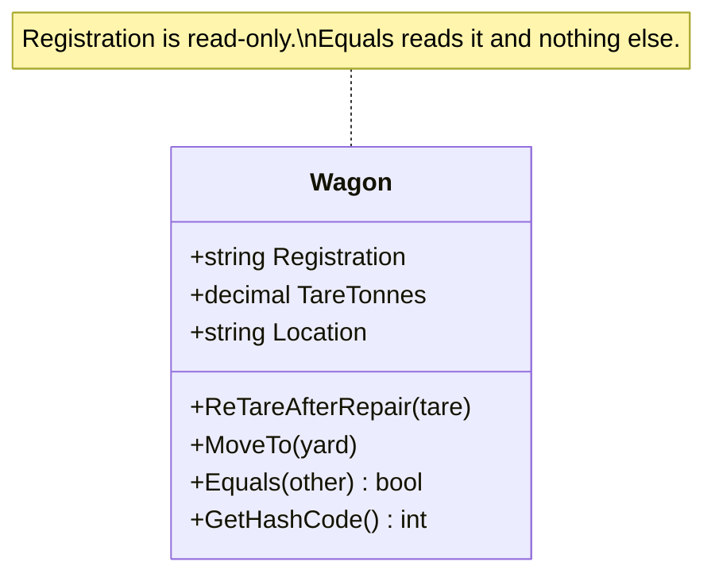

# Entity

🌍 🇬🇧 English (this file) · 🇫🇷 [Français](Entity-fr.md)

## Intent

Entity is a building block of a model-driven design for an object defined by a thread of continuity and
identity rather than by its attributes: two entities with equal attributes remain distinct.

## Problem

A wagon is followed through a freight fleet for decades. It is repainted, re-tared after a repair, moved
from yard to yard, its bogies replaced, leased to another operator.

Modelled by what can be said about it, the wagon disappears:

```csharp
public readonly record struct Wagon(decimal TareTonnes, string Location, string Livery);
```

Two wagons leaving the workshop with the same tare, the same capacity and the same livery are now one
wagon. And the same wagon twenty years apart matches none of what was recorded about it on delivery, so
it is now a different wagon. Both sentences are wrong, and the model has no way to say the thing the
yard staff say all day: *this one*.

## Solution

The pattern makes identity part of the model rather than a consequence of the data.

One attribute is singled out as the thread that runs through time — here the registration number — and
equality is defined on it alone. Everything else is free to change, because changing it no longer makes
a different object. The class is kept focused on that continuity: attributes and behaviour that have
nothing to do with who the object is belong elsewhere.

The identity has to be settled once, at the beginning, and never reassigned. An identity that can be
edited is not a thread; it is one more attribute.

## Structure



There is nothing to draw but one class, which is the point: an entity is a statement about a single
object, not an arrangement of several.

## The roles

| Role | Annotation | Applies to | What it carries |
|---|---|---|---|
| Entity | `[Entity]` | class, interface | An object of the domain defined by its identity rather than by its attributes. |

One role, so nothing to choose. The annotation is inherited, so a subclass of an entity is one too.

## The example

From [`EntityUsage.cs`](../../../../DesignPatternCatalog.Usage/DomainDrivenDesign/EntityUsage.cs).

```csharp
[Entity]
public sealed class Wagon {

    public Wagon(string registration, decimal tareTonnes) {
        Registration = registration;
        TareTonnes   = tareTonnes;
        Location     = "workshop";
    }

    // The identity: given at construction, never reassigned.
    public string Registration { get; }

    public decimal TareTonnes { get; private set; }
    public string  Location   { get; private set; }
```

The asymmetry between the first property and the two below it is the whole pattern in C#. `Registration`
has no setter at all; `TareTonnes` and `Location` have a private one. The identity is fixed at
construction, the rest is expected to move.

```csharp
    // A repair changes what the wagon weighs empty. It is still the same wagon — which is exactly
    // the sentence a value object could not have expressed.
    public void ReTareAfterRepair(decimal tareTonnes) => TareTonnes = tareTonnes;

    public void MoveTo(string yard) {
        _movements.Add($"{Location} → {yard}");
        Location = yard;
    }
```

An entity is mutable on purpose. This is worth stating plainly because immutability is otherwise a
default worth having: forbidding change here would produce a value object wearing an identifier, and the
sentence *the same wagon, re-tared* would become unsayable.

The mutators are named after what happened rather than after what they set. `ReTareAfterRepair` is an
event in the wagon's life; `SetTareTonnes` would be a field being written.

```csharp
    // Equality on identity, not on state.
    public override bool Equals(object? obj) => obj is Wagon other && other.Registration == Registration;

    public override int GetHashCode() => Registration.GetHashCode();

}
```

Two wagons that happen to weigh the same are not one wagon, and a wagon whose tare changed this morning
is not a new one. Both follow from these four lines, and neither follows from the annotation — the
annotation records the decision, the code enforces it.

`GetHashCode` reads the identity too, and it has to: a hash computed from mutable state would move a
wagon in a dictionary the first time it was re-tared, and the entry would become unreachable.

## Applicability

**Use Entity when an object is distinguished by its identity rather than by its attributes**, and make
that primary to its definition in the model.

**Use Entity when a thread of continuity runs through time and across distinct representations** — the
same object appearing in a form, in a table and in a message, and the model needing to say it is one
object.

**Use Entity when the model must define what it means for two things to be the same.** The book puts
this as an obligation of the modeller rather than of the framework: the means of identification may come
from outside or be an arbitrary identifier created by the system, but it must correspond to the identity
distinctions the domain actually makes.

## When not to use it

**Do not use Entity for everything.** The book is direct about this: a system in which every object is
an entity is bloated, and identity is expensive to track. Most objects in a working model turn out to
be value objects, and the question to ask of each candidate is whether the domain ever needs to point at
a particular one.

**Do not use Entity where two things with the same attributes are the same thing.** An ear tag, an
amount of money, a date range — writing one twice does not produce two of them, and giving it an
identifier makes the model assert a distinction the domain does not make.

**Do not use Entity as a name for "the thing with the database primary key".** This is a judgement the
field formed after the book, and it is worth stating because the mistake is common: a primary key is a
storage decision, and taking it as the definition produces one entity per table, including the tables
that exist for joins.

**Do not put on an entity what has nothing to do with its identity.** The book asks that the class be
kept simple and focused on life cycle and continuity. Behaviour that does not depend on which wagon this
is belongs on a value object or in a service, and an entity that has grown to hold everything about a
subject is the usual result of ignoring that.

## Advantages

* The model can say *this one*, which is the sentence the domain uses and which no description can
  express.
* Change becomes expressible: an entity can be modified through its whole life without becoming a
  different object.
* Equality has a single, stated meaning, so comparisons, collections and identity maps all agree.
* The class stays small when the discipline is kept, because everything not about continuity is pushed
  out of it.

## Drawbacks

* Identity has to be tracked, which is a real cost — one the book names as the reason not to make
  everything an entity.
* The identity has to be produced by something, and neither choice is free: an external identifier ties
  the model to whoever issues it, and an internal one has to be unique and stable.
* Mutability is invited, and an entity is the easiest place in a model for unrelated state to accumulate.

## Relations with other patterns

**`ValueObject`** is the other half of the same decision, and the one to reach for first. The question is
whether the domain distinguishes two instances with equal attributes; entity is the answer when it does.

**`Aggregate`** is built out of entities: its root is one, and the boundary states which entities may be
referenced from outside.

**`Repository`** gives access to entities by identity — which is possible precisely because they have
one, and is why a repository per value object makes no sense.

**`Factory`** produces an entity already carrying its identity, which is one of the reasons the creation
is worth encapsulating.

## Source

*Domain-Driven Design: Tackling Complexity in the Heart of Software*, Eric Evans, Addison-Wesley, 2003 —
chapter 5, the building blocks of a model-driven design.

* [Index entry](../../../generated/catalog-index.md#entity-domain-driven-design)
* [Generated attribute](../../../../DesignPatternCatalog.DomainDrivenDesign/Entity.cs)
* [Example](../../../../DesignPatternCatalog.Usage/DomainDrivenDesign/EntityUsage.cs)
