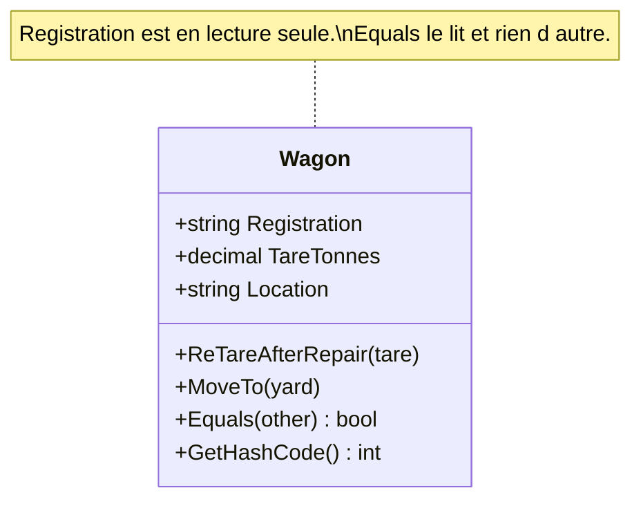

# Entity

🌍 🇫🇷 Français (ce fichier) · 🇬🇧 [English](Entity-en.md)

## Intention

Entity est une brique de la conception pilotée par le modèle, pour un objet défini par un fil de
continuité et d'identité plutôt que par ses attributs : deux entités aux attributs égaux restent
distinctes.

## Problème

Un wagon est suivi dans un parc de fret pendant des décennies. Il est repeint, retaré après une
réparation, déplacé de gare en gare, ses bogies sont remplacés, il est loué à un autre opérateur.

Modélisé par ce qu'on peut en dire, le wagon disparaît :

```csharp
public readonly record struct Wagon(decimal TareTonnes, string Location, string Livery);
```

Deux wagons sortant de l'atelier avec la même tare, la même capacité et la même livrée sont désormais un
seul wagon. Et le même wagon, vingt ans plus tard, ne correspond à rien de ce qui a été enregistré à sa
livraison : c'est donc un autre wagon. Les deux phrases sont fausses, et le modèle n'a aucun moyen de
dire ce que le personnel des gares dit toute la journée : *celui-là*.

## Solution

Le patron fait de l'identité une part du modèle plutôt qu'une conséquence des données.

Un attribut est désigné comme le fil qui court à travers le temps — ici le numéro d'immatriculation — et
l'égalité est définie sur lui seul. Tout le reste est libre de changer, puisque le changer ne fabrique
plus un autre objet. La classe reste centrée sur cette continuité : les attributs et les comportements
qui n'ont rien à voir avec l'identité de l'objet vivent ailleurs.

L'identité doit être fixée une fois, au début, et jamais réassignée. Une identité modifiable n'est pas un
fil ; c'est un attribut de plus.

## Structure



Il n'y a qu'une classe à dessiner, et c'est le propos : une entité est une affirmation sur un objet
unique, non un agencement de plusieurs.

## Les rôles

| Rôle | Annotation | S'applique à | Ce qu'il porte |
|---|---|---|---|
| Entity | `[Entity]` | classe, interface | Un objet du domaine défini par son identité plutôt que par ses attributs. |

Un seul rôle, donc rien à choisir. L'annotation est héritée : une sous-classe d'entité en est une aussi.

## L'exemple

Extrait de [`EntityUsage.cs`](../../../../DesignPatternCatalog.Usage/DomainDrivenDesign/EntityUsage.cs).

```csharp
[Entity]
public sealed class Wagon {

    public Wagon(string registration, decimal tareTonnes) {
        Registration = registration;
        TareTonnes   = tareTonnes;
        Location     = "workshop";
    }

    // The identity: given at construction, never reassigned.
    public string Registration { get; }

    public decimal TareTonnes { get; private set; }
    public string  Location   { get; private set; }
```

L'asymétrie entre la première propriété et les deux suivantes est tout le patron traduit en C#.
`Registration` n'a aucun accesseur en écriture ; `TareTonnes` et `Location` en ont un privé. L'identité
est fixée à la construction, le reste est censé bouger.

```csharp
    // A repair changes what the wagon weighs empty. It is still the same wagon — which is exactly
    // the sentence a value object could not have expressed.
    public void ReTareAfterRepair(decimal tareTonnes) => TareTonnes = tareTonnes;

    public void MoveTo(string yard) {
        _movements.Add($"{Location} → {yard}");
        Location = yard;
    }
```

Une entité est mutable délibérément. Cela mérite d'être dit nettement, parce que l'immuabilité est par
ailleurs un défaut de position recommandable : interdire le changement produirait ici un objet-valeur
portant un identifiant, et la phrase *le même wagon, retaré* deviendrait indicible.

Les mutateurs sont nommés d'après ce qui est arrivé plutôt que d'après ce qu'ils écrivent.
`ReTareAfterRepair` est un événement de la vie du wagon ; `SetTareTonnes` serait un champ affecté.

```csharp
    // Equality on identity, not on state.
    public override bool Equals(object? obj) => obj is Wagon other && other.Registration == Registration;

    public override int GetHashCode() => Registration.GetHashCode();

}
```

Deux wagons qui pèsent le même poids ne sont pas un wagon, et un wagon retaré ce matin n'est pas un
wagon neuf. Les deux découlent de ces quatre lignes, et aucune des deux ne découle de l'annotation —
l'annotation consigne la décision, le code l'applique.

`GetHashCode` lit l'identité lui aussi, et il le faut : un hachage calculé sur un état mutable
déplacerait le wagon dans un dictionnaire au premier retarage, et l'entrée deviendrait inatteignable.

## Possibilités d'application

**Utilisez Entity lorsqu'un objet se distingue par son identité plutôt que par ses attributs**, et faites
de cela l'élément premier de sa définition dans le modèle.

**Utilisez Entity lorsqu'un fil de continuité court à travers le temps et à travers des représentations
distinctes** — le même objet apparaissant dans un formulaire, dans une table et dans un message, le
modèle devant dire qu'il s'agit d'un seul objet.

**Utilisez Entity lorsque le modèle doit définir ce que veut dire « la même chose ».** Le livre pose cela
comme une obligation du modélisateur et non du cadre technique : le moyen d'identification peut venir de
l'extérieur ou être un identifiant arbitraire créé par le système, mais il doit correspondre aux
distinctions d'identité que le domaine fait réellement.

## Quand ne pas l'utiliser

**N'utilisez pas Entity pour tout.** Le livre est direct : un système où chaque objet est une entité est
boursouflé, et l'identité coûte cher à suivre. La plupart des objets d'un modèle qui fonctionne se
révèlent être des objets-valeurs, et la question à poser sur chaque candidat est de savoir si le domaine
a jamais besoin de désigner un exemplaire en particulier.

**N'utilisez pas Entity là où deux choses aux mêmes attributs sont la même chose.** Une boucle
d'identification, un montant, une période — les écrire deux fois n'en fabrique pas deux, et leur donner
un identifiant fait affirmer au modèle une distinction que le domaine ne fait pas.

**N'utilisez pas Entity comme nom de « la chose qui a une clé primaire ».** C'est un jugement que la
profession a formé après le livre, et il vaut d'être énoncé parce que l'erreur est fréquente : une clé
primaire est une décision de stockage, et la prendre pour définition produit une entité par table, y
compris les tables qui n'existent que pour joindre.

**Ne mettez pas sur une entité ce qui n'a rien à voir avec son identité.** Le livre demande que la classe
reste simple et centrée sur le cycle de vie et la continuité. Un comportement qui ne dépend pas de
*quel* wagon il s'agit appartient à un objet-valeur ou à un service, et une entité qui a grossi jusqu'à
tout porter d'un sujet est le résultat habituel de l'oubli de cette règle.

## Avantages

* Le modèle peut dire *celui-là*, qui est la phrase employée par le domaine et qu'aucune description ne
  sait exprimer.
* Le changement devient exprimable : une entité peut être modifiée toute sa vie sans devenir un autre
  objet.
* L'égalité a un sens unique et énoncé, si bien que comparaisons, collections et tables d'identité
  s'accordent.
* La classe reste petite quand la discipline est tenue, puisque tout ce qui ne relève pas de la
  continuité en est chassé.

## Inconvénients

* L'identité doit être suivie, ce qui est un coût réel — celui que le livre nomme comme la raison de ne
  pas tout transformer en entité.
* L'identité doit être produite par quelque chose, et aucun des deux choix n'est gratuit : un identifiant
  externe lie le modèle à qui l'émet, un identifiant interne doit être unique et stable.
* La mutabilité est invitée, et une entité est l'endroit le plus commode d'un modèle pour qu'un état sans
  rapport s'accumule.

## Liens avec les autres patrons

**`ValueObject`** est l'autre moitié de la même décision, et celle vers laquelle se tourner d'abord. La
question est de savoir si le domaine distingue deux exemplaires aux attributs égaux ; l'entité est la
réponse quand il les distingue.

**`Aggregate`** est bâti avec des entités : sa racine en est une, et la frontière énonce quelles entités
peuvent être référencées de l'extérieur.

**`Repository`** donne accès aux entités par leur identité — ce qui est possible précisément parce
qu'elles en ont une, et explique qu'un dépôt par objet-valeur n'ait aucun sens.

**`Factory`** produit une entité portant déjà son identité, ce qui est l'une des raisons pour lesquelles
la création mérite d'être encapsulée.

## Source

*Domain-Driven Design: Tackling Complexity in the Heart of Software*, Eric Evans, Addison-Wesley, 2003 —
chapitre 5, les briques de la conception pilotée par le modèle.

* [Entrée d'index](../../../generated/catalog-index.md#entity-domain-driven-design)
* [Attribut généré](../../../../DesignPatternCatalog.DomainDrivenDesign/Entity.cs)
* [Exemple](../../../../DesignPatternCatalog.Usage/DomainDrivenDesign/EntityUsage.cs)
