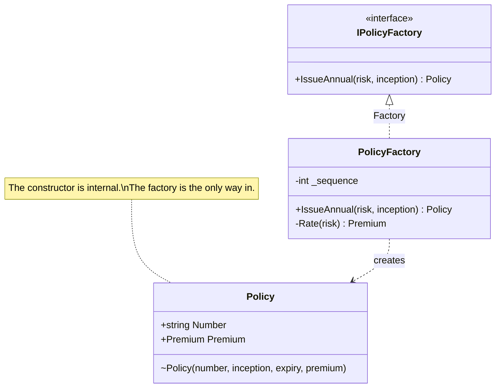

# Factory

🌍 🇬🇧 English (this file) · 🇫🇷 [Français](Factory-fr.md)

## Intent

Factory is a building block of a model-driven design that encapsulates the creation of a complex object
or of a whole aggregate, so that what comes out is valid from the outset.

## Problem

Insurance underwriting: issuing a policy. A policy is not valid because its fields were filled in. It is
valid because a premium was computed for a risk, a policy number was drawn from the register in force
that year, and the cover period was aligned on the inception date. Getting that wrong does not produce a
slightly off policy — it produces a document that pays out when it should not.

Left to a constructor, that knowledge has nowhere to live. Either the constructor grows a premium
calculation and a dependency on the numbering register:

```csharp
public Policy(string risk, DateOnly inception, INumberRegister register, IRatingTable rates) { … }
```

which is a lot of underwriting inside a data structure — or every caller assembles the policy
themselves:

```csharp
Policy policy = new(number, inception, inception.AddYears(1).AddDays(-1), premium);
```

and the fourth caller is the one that forgets to align the period.

## Solution

The pattern moves the assembly to an object whose whole job is the assembly.

The factory holds what has to be true at the moment of creation: the number is drawn, the period is
computed, the premium is rated. Its promise is narrow and worth stating — what comes out is a policy that
was never, at any instant, half built. There is no window in which a caller holds a policy with a number
and no premium.

The factory need have no responsibility in the domain model beyond that, and is still part of the domain
design. It is frequently a concept the business has a word for, which is why the abstraction is worth
declaring alongside the implementation.

## Structure



## The roles

| Role | Annotation | Applies to | What it carries |
|---|---|---|---|
| Factory | `[Factory]` | interface, class | Encapsulates the creation of a complex object or of a whole aggregate. |

One role, so nothing to choose. The annotation is inherited.

## The example

From [`FactoryUsage.cs`](../../../../DesignPatternCatalog.Usage/DomainDrivenDesign/FactoryUsage.cs).

```csharp
[Entity]
public sealed class Policy {

    // Internal: the factory is the only way in.
    internal Policy(string number, DateOnly inception, DateOnly expiry, Premium premium) {
        Number    = number;
        Inception = inception;
        Expiry    = expiry;
        Premium   = premium;
    }

    public string   Number    { get; }
    public DateOnly Inception { get; }
    public DateOnly Expiry    { get; }
    public Premium  Premium   { get; }

}
```

The `internal` constructor is what makes the factory the only door. Left public, it would be a second,
silent one into a state the factory exists to guarantee — and the second door is always the one someone
uses in a hurry.

Every property is get-only. A policy that could be edited after issue would make the factory's guarantee
hold for one instant rather than for the object's life.

```csharp
[Factory]
public interface IPolicyFactory {

    Policy IssueAnnual(string risk, DateOnly inception);

}
```

The signature is worth reading as an argument. Two parameters go in — the things the business knows —
and a valid policy comes out. The number, the expiry and the premium are absent from it because they are
not the caller's to supply; they are what the factory is for.

`IssueAnnual` is named after the underwriting act rather than after the class. This is the second of the
book's two requirements: the factory is abstracted to the type wanted, and its interface is stated in the
domain's language.

```csharp
[Factory]
public sealed class PolicyFactory : IPolicyFactory {

    private int _sequence;

    public Policy IssueAnnual(string risk, DateOnly inception) {
        string  number  = $"{inception.Year}-{++_sequence:D6}";
        Premium premium = Rate(risk);

        return new Policy(number, inception, inception.AddYears(1).AddDays(-1), premium);
    }

    private static Premium Rate(string risk) => new(risk == "fleet" ? 4_800m : 950m, "EUR");

}
```

Both the interface and the implementation carry the role. That is not the sample being thorough — a
factory is often a domain concept in its own right, named in the ubiquitous language, and the abstraction
is where that concept is declared.

Everything the invariant needs happens before anyone can observe the policy. This is the book's first
requirement, and it is what atomicity means here: the creation either produces a consistent policy or it
produces nothing.

Note that this factory holds `_sequence` and is therefore not stateless. A factory is not a domain
service, and the book does not ask it to be; a numbering register is state the act of issuing legitimately
depends on.

## Applicability

**Use Factory when creation is a major operation in itself** and the complex assembly does not fit the
responsibility of the object being created.

**Use Factory when making the client direct construction would muddy the client's design**, breach the
encapsulation of the assembled object or aggregate, or couple the client to the concrete classes being
instantiated.

**Create entire aggregates as a piece, enforcing their invariants.** The book makes this the reason a
factory is worth having for an aggregate at all: the root and its members come into existence together
or not at all.

**Make each creation method atomic**, so that the factory can only ever produce an object in a consistent
state, and **abstract the factory to the type wanted** rather than to the concrete class it creates.

## When not to use it

**Do not use Factory when a constructor is all that is needed.** The book gives the conditions
explicitly, and they are worth having in front of one before writing a factory: the class is the type
and there is no hierarchy to choose from, the client cares about the implementation and perhaps chooses
it, all of the object's attributes are available to the client, the construction is not complicated, and
it does not involve creating other objects. When those hold, a public constructor is the clearer design
and a factory only adds a layer.

**Do not use Factory to reconstitute an object as though it were new.** The book treats reconstitution as
a different case with different rules: a factory rebuilding a stored object assigns no new identity, and
has to deal with a violated invariant differently — the object existed, so failing is not the same
answer as it is at creation.

**Do not call a constructor from inside another class's constructor.** The book raises this directly:
creation that reaches into other creation belongs in a factory, where the sequence is visible.

**Do not use Factory where the object is trivial.** A value object of three fields validated in its
constructor is already atomic and already valid; wrapping it costs a type and buys nothing.

## Advantages

* The object is valid from its first instant, and there is no window in which a half-built one can be
  observed.
* The knowledge of how something is properly created lives in one place instead of at every call site.
* The client is coupled to the type it wants rather than to the concrete class it gets.
* The created class stays a model of its subject, rather than growing the dependencies that assembly
  requires.
* A whole aggregate can be created as a piece, with its invariants enforced at the boundary.

## Drawbacks

* A type is added that has no counterpart in the domain when the creation was not in fact a domain
  concept, and the indirection then costs without paying.
* The constructor has to be closed for the guarantee to hold, which constrains the class's visibility —
  `internal` here, and nothing narrower is available in C#.
* Reconstitution needs its own path, so the object frequently ends up with two ways in that must be kept
  in agreement.

## Relations with other patterns

**`Aggregate`** is the main reason to reach for a factory: creating a root and its members as one piece,
with the invariant already satisfied, is more than a constructor should carry.

**`Entity`** is what a factory typically produces, and the identity is one of the things the factory
settles.

**`Repository`** is the other half of an entity's life cycle: the factory makes new ones, the repository
finds existing ones. The book notes that a repository may delegate to a factory when reconstituting.

**`Service`** is the broader category a factory falls into — an operation belonging to no entity — and
the factory is named separately because what it encapsulates is specific enough to deserve it.

## Source

*Domain-Driven Design: Tackling Complexity in the Heart of Software*, Eric Evans, Addison-Wesley, 2003 —
chapter 6, the life cycle of a domain object.

* [Index entry](../../../generated/catalog-index.md#factory-domain-driven-design)
* [Generated attribute](../../../../DesignPatternCatalog.DomainDrivenDesign/Factory.cs)
* [Example](../../../../DesignPatternCatalog.Usage/DomainDrivenDesign/FactoryUsage.cs)
