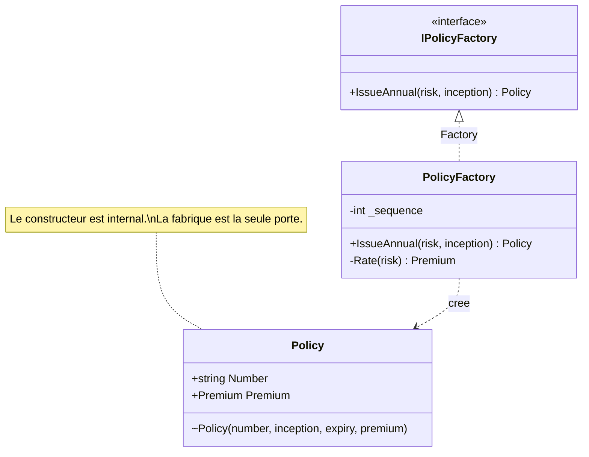

# Factory

🌍 🇫🇷 Français (ce fichier) · 🇬🇧 [English](Factory-en.md)

## Intention

Factory est une brique de la conception pilotée par le modèle qui encapsule la création d'un objet
complexe ou d'un agrégat entier, de sorte que ce qui en sort soit valide dès le premier instant.

## Problème

Souscription en assurance : émettre une police. Une police n'est pas valide parce que ses champs ont été
remplis. Elle est valide parce qu'une prime a été calculée pour un risque, qu'un numéro a été tiré du
registre en vigueur cette année-là, et que la période de couverture a été alignée sur la date d'effet. Se
tromper là-dessus ne produit pas une police légèrement fausse — cela produit un document qui indemnise
quand il ne devrait pas.

Laissée à un constructeur, cette connaissance n'a nulle part où vivre. Ou bien le constructeur se dote
d'un calcul de prime et d'une dépendance au registre de numérotation :

```csharp
public Policy(string risk, DateOnly inception, INumberRegister register, IRatingTable rates) { … }
```

ce qui fait beaucoup de souscription à l'intérieur d'une structure de données — ou bien chaque appelant
assemble la police lui-même :

```csharp
Policy policy = new(number, inception, inception.AddYears(1).AddDays(-1), premium);
```

et le quatrième appelant est celui qui oublie d'aligner la période.

## Solution

Le patron déplace l'assemblage vers un objet dont c'est tout le métier.

La fabrique porte ce qui doit être vrai à l'instant de la création : le numéro est tiré, la période
calculée, la prime tarifée. Sa promesse est étroite et mérite d'être énoncée — ce qui en sort est une
police qui n'a été, à aucun instant, à moitié construite. Il n'existe pas de fenêtre où un appelant tient
une police avec un numéro et sans prime.

La fabrique peut n'avoir aucune responsabilité dans le modèle du domaine au-delà de cela, et fait
pourtant partie de la conception du domaine. C'est fréquemment un concept que le métier sait nommer, et
c'est pourquoi l'abstraction mérite d'être déclarée à côté de l'implémentation.

## Structure



## Les rôles

| Rôle | Annotation | S'applique à | Ce qu'il porte |
|---|---|---|---|
| Factory | `[Factory]` | interface, classe | Encapsule la création d'un objet complexe ou d'un agrégat entier. |

Un seul rôle, donc rien à choisir. L'annotation est héritée.

## L'exemple

Extrait de [`FactoryUsage.cs`](../../../../DesignPatternCatalog.Usage/DomainDrivenDesign/FactoryUsage.cs).

```csharp
[Entity]
public sealed class Policy {

    // Internal: the factory is the only way in.
    internal Policy(string number, DateOnly inception, DateOnly expiry, Premium premium) {
        Number    = number;
        Inception = inception;
        Expiry    = expiry;
        Premium   = premium;
    }

    public string   Number    { get; }
    public DateOnly Inception { get; }
    public DateOnly Expiry    { get; }
    public Premium  Premium   { get; }

}
```

Le constructeur `internal` est ce qui fait de la fabrique l'unique porte. Laissé public, il en serait une
seconde, silencieuse, vers un état que la fabrique existe pour garantir — et la seconde porte est
toujours celle qu'on emprunte quand on est pressé.

Toutes les propriétés sont en lecture seule. Une police modifiable après émission ferait tenir la
garantie de la fabrique un instant plutôt que toute la vie de l'objet.

```csharp
[Factory]
public interface IPolicyFactory {

    Policy IssueAnnual(string risk, DateOnly inception);

}
```

La signature se lit comme un argument. Deux paramètres entrent — ce que le métier connaît — et une police
valide sort. Le numéro, l'échéance et la prime en sont absents parce qu'ils ne relèvent pas de
l'appelant : ils sont ce à quoi sert la fabrique.

`IssueAnnual` est nommé d'après l'acte de souscription et non d'après la classe. C'est la seconde des deux
exigences du livre : la fabrique est abstraite vers le type voulu, et son interface est énoncée dans le
langage du domaine.

```csharp
[Factory]
public sealed class PolicyFactory : IPolicyFactory {

    private int _sequence;

    public Policy IssueAnnual(string risk, DateOnly inception) {
        string  number  = $"{inception.Year}-{++_sequence:D6}";
        Premium premium = Rate(risk);

        return new Policy(number, inception, inception.AddYears(1).AddDays(-1), premium);
    }

    private static Premium Rate(string risk) => new(risk == "fleet" ? 4_800m : 950m, "EUR");

}
```

L'interface et l'implémentation portent toutes deux le rôle. Ce n'est pas l'exemple qui se montre
consciencieux — une fabrique est souvent un concept du domaine à part entière, nommé dans le langage
omniprésent, et l'abstraction est l'endroit où ce concept est déclaré.

Tout ce dont l'invariant a besoin se passe avant que quiconque puisse observer la police. C'est la
première exigence du livre, et c'est ce que veut dire l'atomicité ici : la création produit une police
cohérente, ou elle ne produit rien.

Noter que cette fabrique porte `_sequence` et n'est donc pas sans état. Une fabrique n'est pas un service
du domaine, et le livre ne lui demande pas de l'être ; un registre de numérotation est un état dont l'acte
d'émettre dépend légitimement.

## Possibilités d'application

**Utilisez Factory lorsque la création est en elle-même une opération d'importance** et que l'assemblage
complexe ne relève pas de la responsabilité de l'objet créé.

**Utilisez Factory lorsque laisser le client diriger la construction brouillerait la conception du
client**, romprait l'encapsulation de l'objet ou de l'agrégat assemblé, ou coupleraient le client aux
classes concrètes instanciées.

**Créez les agrégats entiers d'une pièce, en imposant leurs invariants.** Le livre en fait la raison pour
laquelle une fabrique vaut d'exister pour un agrégat : la racine et ses membres viennent au monde ensemble
ou pas du tout.

**Rendez chaque méthode de création atomique**, de sorte que la fabrique ne puisse jamais produire qu'un
objet cohérent, et **abstrayez la fabrique vers le type voulu** plutôt que vers la classe concrète
qu'elle crée.

## Quand ne pas l'utiliser

**N'utilisez pas Factory quand un constructeur suffit.** Le livre en donne les conditions explicitement,
et elles méritent d'être sous les yeux avant d'écrire une fabrique : la classe est le type et il n'y a
pas de hiérarchie où choisir, le client se soucie de l'implémentation et peut-être la choisit, tous les
attributs de l'objet sont à la disposition du client, la construction n'est pas compliquée, et elle
n'implique pas de créer d'autres objets. Quand ces conditions tiennent, un constructeur public est la
conception la plus claire et une fabrique n'ajoute qu'une couche.

**N'utilisez pas Factory pour reconstituer un objet comme s'il était neuf.** Le livre traite la
reconstitution comme un cas distinct aux règles distinctes : une fabrique qui rebâtit un objet stocké
n'attribue pas de nouvelle identité, et doit traiter autrement un invariant violé — l'objet a existé,
donc échouer n'est pas la même réponse qu'à la création.

**N'appelez pas un constructeur depuis le constructeur d'une autre classe.** Le livre le soulève
directement : une création qui en atteint une autre appartient à une fabrique, où la séquence est
visible.

**N'utilisez pas Factory là où l'objet est trivial.** Un objet-valeur de trois champs validé dans son
constructeur est déjà atomique et déjà valide ; l'envelopper coûte un type et n'achète rien.

## Avantages

* L'objet est valide dès son premier instant, et il n'existe pas de fenêtre où l'on puisse en observer un
  à demi construit.
* La connaissance de la façon dont une chose se crée correctement vit à un seul endroit au lieu de chaque
  site d'appel.
* Le client est couplé au type qu'il veut plutôt qu'à la classe concrète qu'il obtient.
* La classe créée reste un modèle de son sujet, au lieu de se doter des dépendances qu'exige l'assemblage.
* Un agrégat entier peut être créé d'une pièce, ses invariants imposés à la frontière.

## Inconvénients

* On ajoute un type sans contrepartie dans le domaine quand la création n'était en fait pas un concept du
  domaine, et l'indirection coûte alors sans rapporter.
* Le constructeur doit être fermé pour que la garantie tienne, ce qui contraint la visibilité de la
  classe — `internal` ici, et rien de plus étroit n'est disponible en C#.
* La reconstitution demande son propre chemin, si bien que l'objet finit souvent avec deux portes qu'il
  faut maintenir d'accord.

## Liens avec les autres patrons

**`Aggregate`** est la raison principale de recourir à une fabrique : créer une racine et ses membres
d'une pièce, l'invariant déjà satisfait, dépasse ce qu'un constructeur devrait porter.

**`Entity`** est ce qu'une fabrique produit typiquement, et l'identité est l'une des choses que la
fabrique règle.

**`Repository`** est l'autre moitié du cycle de vie d'une entité : la fabrique en fabrique de nouvelles,
le dépôt retrouve celles qui existent. Le livre note qu'un dépôt peut déléguer à une fabrique lors de la
reconstitution.

**`Service`** est la catégorie plus large dans laquelle tombe une fabrique — une opération n'appartenant à
aucune entité — et la fabrique est nommée à part parce que ce qu'elle encapsule est assez spécifique pour
le mériter.

## Source

*Domain-Driven Design: Tackling Complexity in the Heart of Software*, Eric Evans, Addison-Wesley, 2003 —
chapitre 6, le cycle de vie d'un objet du domaine.

* [Entrée d'index](../../../generated/catalog-index.md#factory-domain-driven-design)
* [Attribut généré](../../../../DesignPatternCatalog.DomainDrivenDesign/Factory.cs)
* [Exemple](../../../../DesignPatternCatalog.Usage/DomainDrivenDesign/FactoryUsage.cs)
