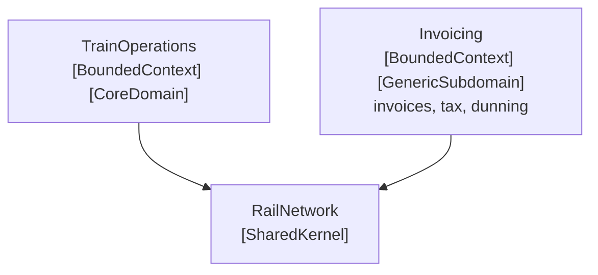

# Generic Subdomain

🌍 🇬🇧 English (this file) · 🇫🇷 [Français](GenericSubdomain-fr.md)

## Intent

Generic Subdomain is a cohesive part of the model that is necessary and in no way distinctive — every
organisation in the field needs it, and none competes on it.

## Problem

Regional rail. One assembly bills train operating companies for access to the network. It has invoices,
credit notes, tax rules, payment terms, dunning.

None of it is why anyone would choose this operator over another. Every railway in Europe bills track
access, and they all bill it the same way, because the way is fixed by regulation and by accountancy
rather than by anything the business decided.

Left unmarked, it competes for attention with everything else. Worse, it competes successfully: billing
has hard deadlines, visible failures and people who complain, so it pulls effort towards itself. A team
can spend a quarter perfecting a dunning workflow while path allocation stays crude, and nothing in the
codebase suggests that was a mistake.

## Solution

The pattern identifies what is not the motivation for the project, and says so.

Cohesive subdomains that are not the reason the project exists are identified, factored into generic
models, and placed in separate modules with no trace of the organisation's specialities left in them.
Once separated, their continuing development is given lower priority than the core domain, and the core
developers are kept off those tasks — because they gain little domain knowledge from them.

The book then names the options that become available once the separation exists: an off-the-shelf
solution, a published design or model, an outsourced implementation, or an in-house one. Marking the
subdomain is what makes that a decision rather than an oversight.

## Structure



Two contexts of comparable size, distinguished by one annotation each. Nothing else in the picture says
which deserves the modelling effort.

## The roles

| Role | Annotation | Applies to | What it carries |
|---|---|---|---|
| GenericSubdomain | `[assembly: GenericSubdomain]` | assembly | A part of the model that could be bought, outsourced or replaced by a published solution without weakening what the organisation is good at. Saying so is what keeps modelling effort away from it. |

One role, on an assembly. Unlike the core domain it is not exclusive: a system may have several generic
subdomains, and usually does.

## The example

From [`GenericSubdomainUsage.cs`](../../../../DesignPatternCatalog.Usage.Invoicing/GenericSubdomainUsage.cs).

```csharp
[assembly: GenericSubdomain]
```

```csharp
/// <summary>
///     What an operator owes for one month of track access.
/// </summary>
public sealed class TrackAccessInvoice {

    public TrackAccessInvoice(string operatorVatNumber, DateOnly period, decimal amountExcludingTax) {
        OperatorVatNumber  = operatorVatNumber;
        Period             = period;
        AmountExcludingTax = amountExcludingTax;
    }

    public string   OperatorVatNumber  { get; }
    public DateOnly Period             { get; }
    public decimal  AmountExcludingTax { get; }

}
```

The word to notice is not *unimportant* — an unbilled month is a very serious problem — but
**undistinctive**. The test the book gives is whether it could be bought, outsourced or replaced by a
published solution without weakening what the organisation is actually good at. Here the honest answer is
yes: this could be an off-the-shelf billing package tomorrow, and the railway would run exactly as well.

Saying so in the code is what the annotation is for, and it is a statement about where effort should
**not** go. The subtle modelling, the design reviews and the best people belong in train operations, which
is annotated as the [core domain](CoreDomain-en.md).

The class is plain on purpose: three properties, no invariant, no rich behaviour. That is not the sample
being lazy — it is the pattern's instruction to leave no trace of the organisation's specialities in a
generic model, and a deep model of invoicing would be effort spent where the book says not to spend it.

It is still a bounded context of its own. An *operator* here is a legal counterparty with a billing
address and a VAT number, which is not what *operator* means next door — hence `OperatorVatNumber` rather
than a licence.

## Applicability

**Identify cohesive subdomains that are not the motivation for your project.**

**Factor out generic models of these subdomains and place them in separate modules**, leaving no trace of
your specialities in them.

**Give their continuing development lower priority than the core domain**, once separated.

**Avoid assigning your core developers to those tasks**, because they gain little domain knowledge from
them.

**Consider off-the-shelf solutions or published models.** The book lists four options once the subdomain
is identified — an off-the-shelf solution, a published design or model, an outsourced implementation, or
an in-house one — and identifying the subdomain is what makes choosing among them possible.

## When not to use it

**Do not mark something generic because it is boring.** The test is whether the organisation competes on
it, not whether anyone enjoys it. A dull subdomain that is genuinely distinctive is core, and marking it
generic sends the effort away from where the product is won.

**Do not read *generic* as *unimportant*.** An unbilled month is a serious failure. The annotation directs
modelling effort; it does not license neglect, and a page that let the two blur would be doing harm.

**Do not assume generic means reusable.** The book warns against over-investing in making a generic
subdomain into a general-purpose framework: that is modelling effort spent exactly where the pattern says
not to spend it, in the name of a reuse that usually does not arrive.

**Do not leave your specialities in it.** A generic model with the organisation's peculiarities baked in
cannot be replaced by a bought solution, which removes the option the separation was for.

## Advantages

* Effort goes where the product is actually won, because the code says which part that is.
* The option to buy, outsource or adopt a published model stays open, since the subdomain is separable.
* The core domain gets smaller and clearer once what is generic has been factored out of it.
* A misallocation becomes visible — a quarter spent here rather than in the core is a decision someone
  can question.

## Drawbacks

* Marking a colleague's area *undistinctive* is a judgement about people's work as well as about code.
* The classification ages: a subdomain can become distinctive as the business changes, and nothing
  prompts a re-examination.
* Keeping specialities out takes discipline, and each one that creeps in quietly removes the option to
  replace the whole thing.
* The annotation directs attention and enforces nothing.

## Relations with other patterns

**`CoreDomain`** is the other half of the same distillation. Neither annotation means much alone: the pair
is a comparison.

**`BoundedContext`** is a separate claim about the same assembly — the sample's invoicing context is both,
and *operator* means something different inside it.

**`CohesiveMechanism`** is a different kind of separation, and the book distinguishes them explicitly: a
generic subdomain is a model of part of the domain, while a mechanism does not represent the domain at all
— it solves a computational problem the model poses.

**`SharedKernel`** is what a generic subdomain often ends up next to, since what several contexts need and
none competes on is a candidate for both.

## Source

*Domain-Driven Design: Tackling Complexity in the Heart of Software*, Eric Evans, Addison-Wesley, 2003 —
chapter 15, distillation.

* [Index entry](../../../generated/catalog-index.md#genericsubdomain-domain-driven-design)
* [Generated attribute](../../../../DesignPatternCatalog.DomainDrivenDesign/GenericSubdomain.cs)
* [Example](../../../../DesignPatternCatalog.Usage.Invoicing/GenericSubdomainUsage.cs)
