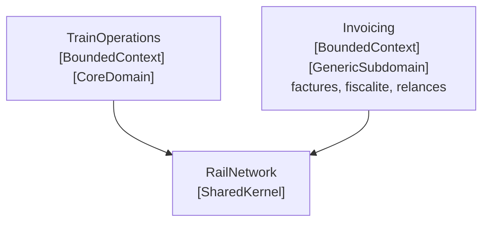

# Generic Subdomain

🌍 🇫🇷 Français (ce fichier) · 🇬🇧 [English](GenericSubdomain-en.md)

## Intention

Generic Subdomain est une part cohésive du modèle qui est nécessaire et nullement distinctive — toute
organisation du secteur en a besoin, et aucune ne concourt dessus.

## Problème

Réseau ferroviaire régional. Une assembly facture aux entreprises ferroviaires l'accès au réseau. Elle a
des factures, des avoirs, des règles fiscales, des conditions de paiement, des relances.

Rien de cela n'est la raison pour laquelle on choisirait cet opérateur plutôt qu'un autre. Tous les
chemins de fer d'Europe facturent les péages, et tous les facturent de la même façon, parce que la façon
est fixée par la réglementation et la comptabilité plutôt que par une décision du métier.

Laissée sans marque, elle concourt pour l'attention avec tout le reste. Pire, elle concourt avec succès :
la facturation a des échéances dures, des défaillances visibles et des gens qui se plaignent, si bien
qu'elle attire l'effort à elle. Une équipe peut passer un trimestre à perfectionner un enchaînement de
relances pendant que l'allocation de sillons reste grossière, et rien dans la base de code ne suggère que
c'était une erreur.

## Solution

Le patron identifie ce qui n'est pas la motivation du projet, et le dit.

Les sous-domaines cohésifs qui ne sont pas la raison d'être du projet sont identifiés, transformés en
modèles génériques et placés dans des modules séparés, sans qu'y subsiste aucune trace des spécialités de
l'organisation. Une fois séparés, leur développement continu reçoit une priorité inférieure à celle du
domaine central, et l'on évite d'y affecter les développeurs du noyau — parce qu'ils en tirent peu de
connaissance du domaine.

Le livre nomme ensuite les options que la séparation rend disponibles : une solution sur étagère, une
conception ou un modèle publiés, une implémentation sous-traitée, ou une implémentation interne. Marquer
le sous-domaine est ce qui en fait une décision plutôt qu'un oubli.

## Structure



Deux contextes de taille comparable, distingués par une annotation chacun. Rien d'autre dans l'image ne
dit lequel mérite l'effort de modélisation.

## Les rôles

| Rôle | Annotation | S'applique à | Ce qu'il porte |
|---|---|---|---|
| GenericSubdomain | `[assembly: GenericSubdomain]` | assembly | Une part du modèle qui pourrait être achetée, sous-traitée ou remplacée par une solution publiée sans affaiblir ce en quoi l'organisation est bonne. Le dire est ce qui tient l'effort de modélisation à distance. |

Un seul rôle, sur une assembly. Contrairement au domaine central, il n'est pas exclusif : un système peut
avoir plusieurs sous-domaines génériques, et en a d'ordinaire plusieurs.

## L'exemple

Extrait de [`GenericSubdomainUsage.cs`](../../../../DesignPatternCatalog.Usage.Invoicing/GenericSubdomainUsage.cs).

```csharp
[assembly: GenericSubdomain]
```

```csharp
/// <summary>
///     What an operator owes for one month of track access.
/// </summary>
public sealed class TrackAccessInvoice {

    public TrackAccessInvoice(string operatorVatNumber, DateOnly period, decimal amountExcludingTax) {
        OperatorVatNumber  = operatorVatNumber;
        Period             = period;
        AmountExcludingTax = amountExcludingTax;
    }

    public string   OperatorVatNumber  { get; }
    public DateOnly Period             { get; }
    public decimal  AmountExcludingTax { get; }

}
```

Le mot à remarquer n'est pas *sans importance* — un mois non facturé est un problème très sérieux — mais
**non distinctif**. Le test que donne le livre est de savoir si cela pourrait être acheté, sous-traité ou
remplacé par une solution publiée sans affaiblir ce en quoi l'organisation est réellement bonne. Ici la
réponse honnête est oui : cela pourrait être un progiciel de facturation dès demain, et le chemin de fer
tournerait exactement aussi bien.

Le dire dans le code est ce à quoi sert l'annotation, et c'est une affirmation sur l'endroit où l'effort ne
doit **pas** aller. La modélisation subtile, les revues de conception et les meilleurs appartiennent à
l'exploitation, annotée comme [domaine central](CoreDomain-fr.md).

La classe est ordinaire à dessein : trois propriétés, aucun invariant, aucun comportement riche. Ce n'est
pas l'exemple qui se relâche — c'est l'instruction du patron de ne laisser aucune trace des spécialités de
l'organisation dans un modèle générique, et un modèle profond de la facturation serait de l'effort dépensé
là où le livre dit de ne pas le dépenser.

C'est malgré tout un contexte borné à part entière. Un *opérateur* ici est une contrepartie juridique avec
une adresse de facturation et un numéro de TVA, ce qui n'est pas ce que veut dire *opérateur* à côté —
d'où `OperatorVatNumber` plutôt qu'une licence.

## Possibilités d'application

**Identifiez les sous-domaines cohésifs qui ne sont pas la motivation de votre projet.**

**Extrayez des modèles génériques de ces sous-domaines et placez-les dans des modules séparés**, sans y
laisser aucune trace de vos spécialités.

**Donnez à leur développement continu une priorité inférieure à celle du domaine central**, une fois
séparés.

**Évitez d'affecter à ces tâches les développeurs de votre noyau**, parce qu'ils en tirent peu de
connaissance du domaine.

**Envisagez les solutions sur étagère ou les modèles publiés.** Le livre énumère quatre options une fois le
sous-domaine identifié — solution sur étagère, conception ou modèle publiés, implémentation sous-traitée,
implémentation interne — et identifier le sous-domaine est ce qui rend le choix possible.

## Quand ne pas l'utiliser

**Ne marquez pas quelque chose comme générique parce que c'est ennuyeux.** Le test est de savoir si
l'organisation concourt dessus, non si quiconque y prend plaisir. Un sous-domaine terne mais réellement
distinctif est central, et le marquer générique envoie l'effort loin de là où le produit se gagne.

**Ne lisez pas *générique* comme *sans importance*.** Un mois non facturé est un échec sérieux.
L'annotation dirige l'effort de modélisation ; elle n'autorise pas la négligence, et une page qui
laisserait les deux se confondre ferait du tort.

**Ne supposez pas que générique veuille dire réutilisable.** Le livre met en garde contre le
surinvestissement consistant à transformer un sous-domaine générique en cadre à usage général : c'est de
l'effort de modélisation dépensé exactement là où le patron dit de ne pas le dépenser, au nom d'une
réutilisation qui d'ordinaire n'arrive pas.

**N'y laissez pas vos spécialités.** Un modèle générique avec les particularités de l'organisation cuites
dedans ne peut pas être remplacé par une solution achetée, ce qui supprime l'option pour laquelle la
séparation existait.

## Avantages

* L'effort va là où le produit se gagne réellement, parce que le code dit quelle part c'est.
* L'option d'acheter, de sous-traiter ou d'adopter un modèle publié reste ouverte, puisque le sous-domaine
  est séparable.
* Le domaine central devient plus petit et plus clair une fois le générique sorti de lui.
* Une mauvaise affectation devient visible — un trimestre passé ici plutôt que dans le noyau est une
  décision que quelqu'un peut contester.

## Inconvénients

* Marquer le domaine d'un collègue comme *non distinctif* est un jugement sur le travail de gens autant
  que sur du code.
* La classification vieillit : un sous-domaine peut devenir distinctif quand le métier change, et rien
  n'invite au réexamen.
* Tenir les spécialités dehors demande de la discipline, et chacune qui s'y glisse retire silencieusement
  l'option de tout remplacer.
* L'annotation dirige l'attention et n'impose rien.

## Liens avec les autres patrons

**`CoreDomain`** est l'autre moitié de la même distillation. Aucune des deux annotations ne veut dire
grand-chose seule : la paire est une comparaison.

**`BoundedContext`** est une affirmation distincte sur la même assembly — le contexte de facturation de
l'exemple est les deux, et *opérateur* y veut dire autre chose.

**`CohesiveMechanism`** est une séparation d'une autre espèce, et le livre les distingue explicitement : un
sous-domaine générique est un modèle d'une part du domaine, tandis qu'un mécanisme ne représente pas le
domaine du tout — il résout un problème calculatoire que le modèle pose.

**`SharedKernel`** est ce à côté de quoi un sous-domaine générique finit souvent, puisque ce dont
plusieurs contextes ont besoin et sur quoi aucun ne concourt est candidat aux deux.

## Source

*Domain-Driven Design: Tackling Complexity in the Heart of Software*, Eric Evans, Addison-Wesley, 2003 —
chapitre 15, la distillation.

* [Entrée d'index](../../../generated/catalog-index.md#genericsubdomain-domain-driven-design)
* [Attribut généré](../../../../DesignPatternCatalog.DomainDrivenDesign/GenericSubdomain.cs)
* [Exemple](../../../../DesignPatternCatalog.Usage.Invoicing/GenericSubdomainUsage.cs)
