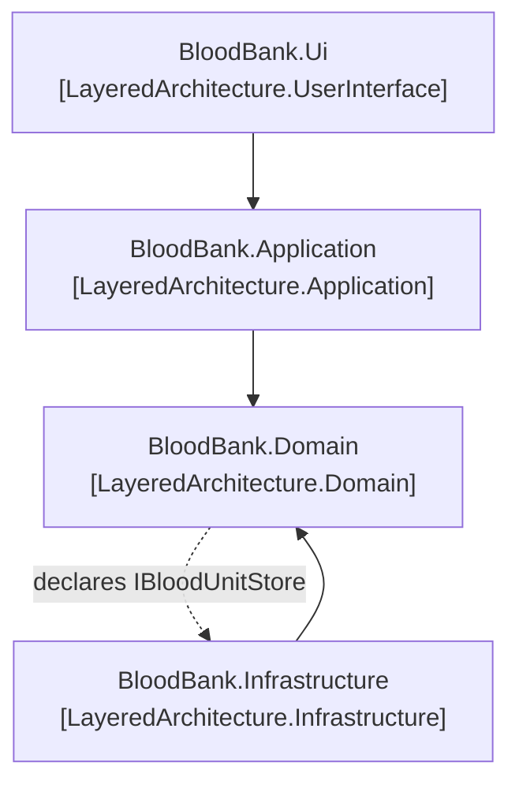

# Layered Architecture

🌍 🇬🇧 English (this file) · 🇫🇷 [Français](LayeredArchitecture-fr.md)

## Intent

Layered Architecture partitions a system so that the model is isolated from the user interface, the
application logic and the technical plumbing, and can be reasoned about without any of them.

## Problem

A blood establishment collects from donors, screens what is collected, and issues units to hospitals. A
unit of red cells expires thirty-five days after collection, and issuing an expired unit is the kind of
mistake that reaches a patient.

That rule has to hold for three callers: the counter clerk, the overnight batch that supplies the air
ambulance, and the import that reconciles a transfer from another centre.

Written in the screen, it holds for one of the three:

```csharp
public string Submit() {
    if (DateTime.Today > unit.CollectedOn.AddDays(35)) { return "Expired."; }
    …
}
```

The batch does not go through this screen and neither does the import. Written in a stored procedure
instead, it holds for all three and is invisible to the reviewer reading the model. There is exactly one
place it can live such that none of the three can skip it and everyone can see it — and finding that
place is what the pattern is about.

## Solution

The pattern partitions the program and fixes the direction of dependency.

Four layers, each cohesive, each depending only on what is below it. The domain layer holds the concepts,
their state and their rules, and — this is the part that matters — references none of the others. The
application layer coordinates and is kept deliberately thin. The user interface shows and interprets.
Infrastructure provides the technical means, and implements what the layers above declare rather than
being called into their vocabulary.

Concentrating the model in one layer is what lets the domain objects stop displaying themselves, storing
themselves and managing application tasks, and become rich enough to be worth having.

## Structure



Four assemblies rather than four classes, which is why this diagram is not a class diagram. Every solid
arrow is a project reference; the dashed one is not a reference at all but the inversion — the domain
declares the interface, infrastructure implements it, and the arrow of dependency stays pointed at the
model.

## The roles

| Role | Annotation | Applies to | What it carries |
|---|---|---|---|
| UserInterface | `[LayeredArchitecture.UserInterface]` | assembly | Shows information and interprets what the user does. It holds no rule of the domain: a rule found here is a rule no other channel can reach. |
| Application | `[LayeredArchitecture.Application]` | assembly | Coordinates the work and is kept deliberately thin. It states what the system does, never what the business is. |
| Domain | `[LayeredArchitecture.Domain]` | assembly | The business concepts, their state and their rules. The whole point of naming the layers is that this one references none of them. |
| Infrastructure | `[LayeredArchitecture.Infrastructure]` | assembly | The technical means the layers above stand on. It implements what they declare, which is the inversion that keeps the model free of a database. |

Every role applies to an assembly and to nothing else. A layer is a partition of the whole program, and
an assembly is the smallest thing in C# that can make one claim about all the code it holds.

## The example

Told across four projects, because a layered architecture is a partition. The story starts in
[`BloodBank.Domain`](../../../../DesignPatternCatalog.Usage.BloodBank.Domain/LayeredArchitectureUsage.cs).

```csharp
[assembly: LayeredArchitecture.Domain]

public sealed class BloodUnit {

    private static readonly TimeSpan ShelfLife = TimeSpan.FromDays(35);

    public DateTime ExpiresOn => CollectedOn + ShelfLife;

    public void IssueTo(string hospital, DateTime on) {
        if (IssuedTo is not null) { throw new InvalidOperationException($"Unit {Reference} was already issued to {IssuedTo}."); }
        if (on > ExpiresOn) { throw new InvalidOperationException($"Unit {Reference} expired on {ExpiresOn:d}."); }

        IssuedTo = hospital;
    }

}
```

The rule, in the only arrangement in which none of the three callers can be the one that forgets: the
only way to issue a unit is to ask a unit.

```csharp
public interface IBloodUnitStore {

    BloodUnit? Find(string reference);

    void Save(BloodUnit unit);

}
```

The interface belongs to the model because the model is what states its needs. Its implementation lives
in infrastructure — which is how this assembly can reference nothing and still be persisted.

Next, [`BloodBank.Application`](../../../../DesignPatternCatalog.Usage.BloodBank.Application/ApplicationLayerUsage.cs):

```csharp
[assembly: LayeredArchitecture.Application]

public string Issue(string reference, string hospital, DateTime on) {
    BloodUnit? unit = _store.Find(reference);
    if (unit is null) { return $"No unit {reference}."; }

    try {
        unit.IssueTo(hospital, on);
        _store.Save(unit);

        return $"Unit {reference} issued to {hospital}.";
    } catch (InvalidOperationException refused) {
        return refused.Message;
    }
}
```

Find, tell, save, report. Every one of those is coordination, and the layer's instruction is a restraint
rather than a capability: keep it thin.

What makes it worth naming is how easily it stops being thin. Writing `if (on > unit.ExpiresOn)` right
here is one line, it gives a nicer message, and the screen would show it sooner. It is also the first
line of a second model — one the batch and the import do not share — and once two rules live here nobody
can say which layer decides anything.

Then [`BloodBank.Infrastructure`](../../../../DesignPatternCatalog.Usage.BloodBank.Infrastructure/InfrastructureLayerUsage.cs):

```csharp
[assembly: LayeredArchitecture.Infrastructure]

public sealed class BloodUnitStore : IBloodUnitStore {

    private readonly Dictionary<string, BloodUnit> _units = new(StringComparer.Ordinal);

    public BloodUnit? Find(string reference) {
        return _units.TryGetValue(reference, out BloodUnit? unit) ? unit : null;
    }

}
```

This assembly references the domain; the domain does not reference this. The direction is not free — it
is bought by having the model declare the interface it needs and having this implement it.

And finally [`BloodBank.Ui`](../../../../DesignPatternCatalog.Usage.BloodBank.Ui/UserInterfaceLayerUsage.cs):

```csharp
[assembly: LayeredArchitecture.UserInterface]

public string Submit(DateTime on) {
    if (Reference.Length == 0) { return "Enter a unit reference."; }

    return _service.Issue(Reference, Hospital, on);
}
```

Almost empty, which is the point. It does not know that a unit expires after thirty-five days, and it
does not know that an already-issued unit cannot be issued twice.

What the four annotations add is the converse, and it is the part nobody enforces by hand: an
architecture rule ranging over them can refuse the reference that starts the erosion — the domain
reaching for the data access library, or the screen reaching past the application layer for a `BloodUnit`
to render a field. Neither looks like a mistake in review. Both are one line, and both work.

## Applicability

**Use Layered Architecture to partition a complex program**, developing within each layer a design that
is cohesive and that depends only on the layers below.

**Concentrate all the code related to the domain model in one layer**, isolated from the user interface,
the application and the infrastructure.

**Use Layered Architecture so that domain objects can stop displaying themselves, storing themselves and
managing application tasks**, and become free to express the model. The book gives this as the reason the
partition is worth its cost: a model can only become rich enough and clear enough to carry business
knowledge if it is not also doing those things.

**Follow standard architectural patterns to provide loose coupling to the layers above**, so that the
dependency runs one way.

## When not to use it

**Do not use Layered Architecture where the project cannot repay it.** The book states this in the Smart
UI section, which exists precisely to name the circumstances under which the layered answer is the wrong
one: a small, simple project, built by developers without the design skill the model layer demands, that
will not be extended. There the partition costs more than it returns, and the book says so rather than
implying it.

**Do not use Layered Architecture where the rule genuinely has one caller and always will.** The
argument above turns on three callers. A screen that is the only way into a system it will outlive holds
its rule where the rule is used, and that is the Smart UI's legitimate case.

**Do not treat the layers as a naming convention.** Four projects with the right names and a reference
from the domain to the data access library is not this pattern; the direction of dependency is the whole
of it, and it is what nothing in the language checks.

**Do not let the application layer become a second model.** The book's restraint on it — thin,
coordination only — is the one most often ignored, and a fat application layer produces two places where
a rule might live and no way to know which one decided.

## Advantages

* A rule lives in one place and every caller reaches it, which is what makes it a rule rather than a
  habit.
* The model can be compiled, read, reasoned about and tested with no database, no screen and no framework
  anywhere near it.
* Each layer is cohesive and can be understood without the others, which is what makes a large program
  navigable.
* The dependency direction is stated rather than assumed, so an architecture rule has two named ends and
  can refuse a crossing.
* Substituting infrastructure — another store, another transport — touches nothing above it.

## Drawbacks

* It costs projects that are too small to repay it, which is the book's own reason for naming Smart UI.
* The inversion is not free: the model has to declare the interfaces it needs, which is an extra
  abstraction per technical need.
* Nothing in C# enforces the partition. The annotations record it, and only a rule written over them can
  refuse the one sensible-looking reference that undoes it.
* A thin application layer requires continuous restraint, and no test goes red when it thickens.

## Relations with other patterns

**`SmartUi`** is what the book presents as the alternative, and names as the anti-pattern — while giving
the circumstances under which it is nonetheless right. The two patterns are best read together.

**`Service`** is where the layers become practically visible: the same word means a different thing in
the domain layer and in the application layer, and the partition is what lets the difference be stated.

**`Repository`** is the pattern in which the inversion is most often met — the interface declared by the
domain, the implementation living in infrastructure.

**`BoundedContext`** partitions along a different axis. A layer separates concerns within one model; a
bounded context separates models.

## Source

*Domain-Driven Design: Tackling Complexity in the Heart of Software*, Eric Evans, Addison-Wesley, 2003 —
chapter 4, isolating the domain.

* [Index entry](../../../generated/catalog-index.md#layeredarchitecture-domain-driven-design)
* [Generated attribute](../../../../DesignPatternCatalog.DomainDrivenDesign/LayeredArchitecture.cs)
* [Example](../../../../DesignPatternCatalog.Usage.BloodBank.Domain/LayeredArchitectureUsage.cs)
