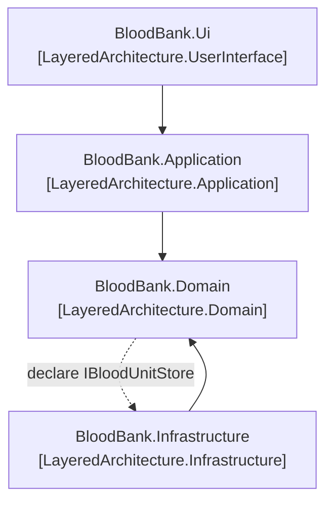

# Layered Architecture

🌍 🇫🇷 Français (ce fichier) · 🇬🇧 [English](LayeredArchitecture-en.md)

## Intention

Layered Architecture partitionne un système de sorte que le modèle soit isolé de l'interface utilisateur,
de la logique applicative et de la plomberie technique, et puisse être raisonné sans aucun des trois.

## Problème

Un établissement de transfusion prélève des donneurs, qualifie ce qui est prélevé, et délivre des unités
aux hôpitaux. Une unité de globules rouges se périme trente-cinq jours après le prélèvement, et délivrer
une unité périmée est le genre d'erreur qui atteint un patient.

Cette règle doit tenir pour trois appelants : l'agent du comptoir, le traitement de nuit qui approvisionne
l'hélicoptère sanitaire, et l'import qui réconcilie un transfert venu d'un autre centre.

Écrite dans l'écran, elle tient pour un des trois :

```csharp
public string Submit() {
    if (DateTime.Today > unit.CollectedOn.AddDays(35)) { return "Expired."; }
    …
}
```

Le traitement de nuit ne passe pas par cet écran, l'import non plus. Écrite dans une procédure stockée,
elle tient pour les trois et devient invisible au relecteur qui lit le modèle. Il y a exactement un
endroit où elle peut vivre tel qu'aucun des trois ne puisse la sauter et que tout le monde la voie — et
trouver cet endroit est ce dont traite le patron.

## Solution

Le patron partitionne le programme et fixe le sens de la dépendance.

Quatre couches, chacune cohésive, chacune ne dépendant que de ce qui est en dessous. La couche du domaine
porte les concepts, leur état et leurs règles, et — c'est la part qui compte — ne référence aucune des
autres. La couche applicative coordonne et reste délibérément mince. L'interface utilisateur montre et
interprète. L'infrastructure fournit les moyens techniques, et implémente ce que les couches supérieures
déclarent au lieu d'être appelée dans leur vocabulaire.

Concentrer le modèle dans une couche est ce qui permet aux objets du domaine de cesser de s'afficher, de
se stocker et de gérer des tâches applicatives, et de devenir assez riches pour valoir la peine.

## Structure



Quatre assemblies plutôt que quatre classes, et c'est pourquoi ce diagramme n'est pas un diagramme de
classes. Chaque flèche pleine est une référence de projet ; la flèche pointillée n'est pas une référence
du tout mais l'inversion — le domaine déclare l'interface, l'infrastructure l'implémente, et la flèche de
dépendance reste pointée vers le modèle.

## Les rôles

| Rôle | Annotation | S'applique à | Ce qu'il porte |
|---|---|---|---|
| UserInterface | `[LayeredArchitecture.UserInterface]` | assembly | Montre l'information et interprète ce que fait l'utilisateur. Elle ne porte aucune règle du domaine : une règle trouvée ici est une règle qu'aucun autre canal ne peut atteindre. |
| Application | `[LayeredArchitecture.Application]` | assembly | Coordonne le travail et reste délibérément mince. Elle énonce ce que le système fait, jamais ce qu'est le métier. |
| Domain | `[LayeredArchitecture.Domain]` | assembly | Les concepts métier, leur état et leurs règles. Tout l'intérêt de nommer les couches est que celle-ci n'en référence aucune. |
| Infrastructure | `[LayeredArchitecture.Infrastructure]` | assembly | Les moyens techniques sur lesquels les couches supérieures reposent. Elle implémente ce qu'elles déclarent, ce qui est l'inversion qui garde le modèle libre de toute base de données. |

Chaque rôle s'applique à une assembly et à rien d'autre. Une couche est une partition du programme
entier, et une assembly est la plus petite chose qu'offre C# capable de faire une affirmation sur tout le
code qu'elle contient.

## L'exemple

Raconté à travers quatre projets, parce qu'une architecture en couches est une partition. L'histoire
commence dans
[`BloodBank.Domain`](../../../../DesignPatternCatalog.Usage.BloodBank.Domain/LayeredArchitectureUsage.cs).

```csharp
[assembly: LayeredArchitecture.Domain]

public sealed class BloodUnit {

    private static readonly TimeSpan ShelfLife = TimeSpan.FromDays(35);

    public DateTime ExpiresOn => CollectedOn + ShelfLife;

    public void IssueTo(string hospital, DateTime on) {
        if (IssuedTo is not null) { throw new InvalidOperationException($"Unit {Reference} was already issued to {IssuedTo}."); }
        if (on > ExpiresOn) { throw new InvalidOperationException($"Unit {Reference} expired on {ExpiresOn:d}."); }

        IssuedTo = hospital;
    }

}
```

La règle, dans le seul agencement où aucun des trois appelants ne peut être celui qui oublie : le seul
moyen de délivrer une unité est de le demander à une unité.

```csharp
public interface IBloodUnitStore {

    BloodUnit? Find(string reference);

    void Save(BloodUnit unit);

}
```

L'interface appartient au modèle parce que c'est le modèle qui énonce ses besoins. Son implémentation vit
dans l'infrastructure — c'est ainsi que cette assembly peut ne rien référencer et être malgré tout
persistée.

Ensuite,
[`BloodBank.Application`](../../../../DesignPatternCatalog.Usage.BloodBank.Application/ApplicationLayerUsage.cs) :

```csharp
[assembly: LayeredArchitecture.Application]

public string Issue(string reference, string hospital, DateTime on) {
    BloodUnit? unit = _store.Find(reference);
    if (unit is null) { return $"No unit {reference}."; }

    try {
        unit.IssueTo(hospital, on);
        _store.Save(unit);

        return $"Unit {reference} issued to {hospital}.";
    } catch (InvalidOperationException refused) {
        return refused.Message;
    }
}
```

Trouver, dire, enregistrer, rendre compte. Chacune de ces actions est de la coordination, et l'instruction
de la couche est une retenue plutôt qu'une capacité : la garder mince.

Ce qui rend cela digne d'être nommé, c'est la facilité avec laquelle elle cesse d'être mince. Écrire
`if (on > unit.ExpiresOn)` ici même fait une ligne, donne un meilleur message, et l'écran l'afficherait
plus tôt. C'est aussi la première ligne d'un second modèle — que le traitement de nuit et l'import ne
partagent pas — et dès que deux règles vivent ici, plus personne ne peut dire quelle couche décide de
quoi.

Puis
[`BloodBank.Infrastructure`](../../../../DesignPatternCatalog.Usage.BloodBank.Infrastructure/InfrastructureLayerUsage.cs) :

```csharp
[assembly: LayeredArchitecture.Infrastructure]

public sealed class BloodUnitStore : IBloodUnitStore {

    private readonly Dictionary<string, BloodUnit> _units = new(StringComparer.Ordinal);

    public BloodUnit? Find(string reference) {
        return _units.TryGetValue(reference, out BloodUnit? unit) ? unit : null;
    }

}
```

Cette assembly référence le domaine ; le domaine ne référence pas celle-ci. Le sens n'est pas gratuit — il
s'achète en faisant déclarer au modèle l'interface dont il a besoin et en la faisant implémenter ici.

Et enfin
[`BloodBank.Ui`](../../../../DesignPatternCatalog.Usage.BloodBank.Ui/UserInterfaceLayerUsage.cs) :

```csharp
[assembly: LayeredArchitecture.UserInterface]

public string Submit(DateTime on) {
    if (Reference.Length == 0) { return "Enter a unit reference."; }

    return _service.Issue(Reference, Hospital, on);
}
```

Presque vide, et c'est le propos. L'écran ne sait pas qu'une unité se périme après trente-cinq jours, et
il ne sait pas qu'une unité déjà délivrée ne peut pas l'être deux fois.

Ce que les quatre annotations ajoutent est la réciproque, et c'est la part que personne n'applique à la
main : une règle d'architecture portant sur elles peut refuser la référence par laquelle l'érosion
commence — le domaine qui atteint la bibliothèque d'accès aux données, ou l'écran qui passe par-dessus la
couche applicative pour attraper un `BloodUnit` et afficher un champ. Aucune des deux ne ressemble à une
erreur en relecture. Les deux font une ligne, et les deux fonctionnent.

## Possibilités d'application

**Utilisez Layered Architecture pour partitionner un programme complexe**, en développant dans chaque
couche une conception cohésive qui ne dépend que des couches inférieures.

**Concentrez dans une seule couche tout le code lié au modèle du domaine**, isolé de l'interface
utilisateur, de l'applicatif et de l'infrastructure.

**Utilisez Layered Architecture pour que les objets du domaine cessent de s'afficher, de se stocker et de
gérer des tâches applicatives**, et soient libres d'exprimer le modèle. Le livre en fait la raison pour
laquelle la partition vaut son coût : un modèle ne peut devenir assez riche et assez clair pour porter la
connaissance métier que s'il ne fait pas aussi ces choses-là.

**Suivez les patrons d'architecture usuels pour offrir un couplage lâche aux couches supérieures**, de
sorte que la dépendance aille dans un seul sens.

## Quand ne pas l'utiliser

**N'utilisez pas Layered Architecture là où le projet ne peut pas la rentabiliser.** Le livre l'énonce
dans la section Smart UI, qui existe précisément pour nommer les circonstances où la réponse en couches
est la mauvaise : un projet petit et simple, construit par des développeurs sans la compétence de
conception qu'exige une couche de modèle, et qui ne sera pas étendu. Là, la partition coûte plus qu'elle
ne rapporte, et le livre le dit au lieu de le laisser entendre.

**N'utilisez pas Layered Architecture là où la règle a vraiment un seul appelant et en aura toujours un
seul.** L'argument ci-dessus repose sur trois appelants. Un écran qui est l'unique entrée d'un système
qu'il survivra garde sa règle là où elle sert, et c'est le cas légitime du Smart UI.

**Ne prenez pas les couches pour une convention de nommage.** Quatre projets aux bons noms et une
référence du domaine vers la bibliothèque d'accès aux données, ce n'est pas ce patron ; le sens de la
dépendance en est la totalité, et c'est ce que rien dans le langage ne contrôle.

**Ne laissez pas la couche applicative devenir un second modèle.** La retenue que le livre lui impose —
mince, coordination seulement — est celle qu'on ignore le plus souvent, et une couche applicative épaisse
produit deux endroits où une règle pourrait vivre et aucun moyen de savoir lequel a décidé.

## Avantages

* Une règle vit à un seul endroit et tous les appelants l'atteignent, ce qui en fait une règle plutôt
  qu'une habitude.
* Le modèle se compile, se lit, se raisonne et se teste sans base de données, sans écran et sans cadre
  technique à proximité.
* Chaque couche est cohésive et se comprend sans les autres, ce qui rend un grand programme navigable.
* Le sens de la dépendance est énoncé plutôt que supposé, si bien qu'une règle d'architecture dispose de
  deux extrémités nommées et peut refuser un franchissement.
* Substituer une infrastructure — un autre stockage, un autre transport — ne touche rien au-dessus d'elle.

## Inconvénients

* Elle coûte aux projets trop petits pour la rentabiliser, ce qui est la raison même pour laquelle le
  livre nomme Smart UI.
* L'inversion n'est pas gratuite : le modèle doit déclarer les interfaces dont il a besoin, soit une
  abstraction de plus par besoin technique.
* Rien en C# n'impose la partition. Les annotations la consignent, et seule une règle écrite sur elles
  peut refuser l'unique référence d'apparence sensée qui la défait.
* Une couche applicative mince exige une retenue continue, et aucun test ne passe au rouge quand elle
  épaissit.

## Liens avec les autres patrons

**`SmartUi`** est ce que le livre présente comme l'alternative, et nomme comme l'anti-patron — tout en
donnant les circonstances où il a malgré tout raison. Les deux patrons se lisent au mieux ensemble.

**`Service`** est l'endroit où les couches deviennent pratiquement visibles : le même mot désigne une
chose différente dans la couche du domaine et dans la couche applicative, et la partition est ce qui
permet d'énoncer la différence.

**`Repository`** est le patron où l'inversion se rencontre le plus souvent — l'interface déclarée par le
domaine, l'implémentation vivant dans l'infrastructure.

**`BoundedContext`** partitionne selon un autre axe. Une couche sépare des préoccupations à l'intérieur
d'un modèle ; un contexte borné sépare des modèles.

## Source

*Domain-Driven Design: Tackling Complexity in the Heart of Software*, Eric Evans, Addison-Wesley, 2003 —
chapitre 4, isoler le domaine.

* [Entrée d'index](../../../generated/catalog-index.md#layeredarchitecture-domain-driven-design)
* [Attribut généré](../../../../DesignPatternCatalog.DomainDrivenDesign/LayeredArchitecture.cs)
* [Exemple](../../../../DesignPatternCatalog.Usage.BloodBank.Domain/LayeredArchitectureUsage.cs)
