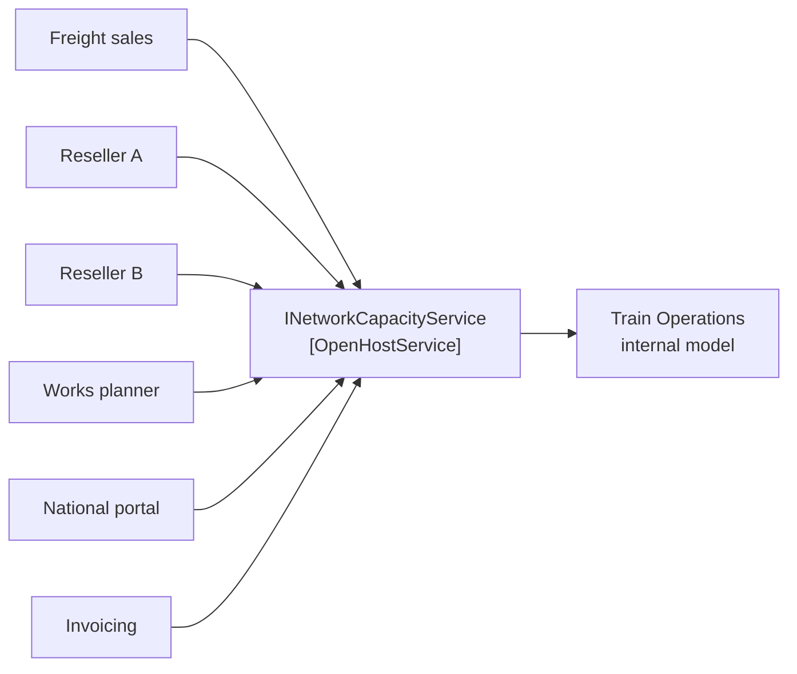

# Open Host Service

🌍 🇬🇧 English (this file) · 🇫🇷 [Français](OpenHostService-fr.md)

## Intent

Open Host Service is a protocol offering the services of a subsystem to any number of consumers, rather
than a translation negotiated with each one in turn.

## Problem

Regional rail. Six parties want to know whether a section is free at a given minute: the freight sales
desk, two ticket resellers, the engineering works planner, the national path-request portal, and the
invoicing context reconciling what was booked against what ran.

The way that usually goes is six integrations, negotiated one at a time, each shaped by whoever asked
most recently:

```csharp
bool IsFreeForFreight(string section, DateTime from, DateTime to, string haulier);
bool CheckAvailability(SectionId section, DateOnly day, TimeOnly at);   // for reseller A
AvailabilityDto Lookup(string sectionCode, string isoTimestamp);        // for reseller B
```

Each is reasonable on the day it is written. Together they are six things to maintain, and a change to
the model has to be agreed six times.

## Solution

The pattern turns the direction of design around.

A protocol is defined that gives access to the subsystem as a set of services, and it is opened so that
everyone who needs to integrate can use it. It is designed once, for all comers, rather than shaped by
whoever asked first.

The difference is not technical — it is who the interface is designed for. An integration built for one
consumer answers that consumer's question; a host service answers the question the subsystem is able to
answer, and lets consumers take what they need.

When a new integration requirement arrives, the protocol is enhanced and expanded. The exception the book
names is a single team with idiosyncratic needs: that one gets a one-off translator, so the shared
protocol can stay simple and coherent.

## Structure



Six arrows into one box. The picture is the pattern: the alternative has six boxes and six arrows, and no
box that anyone owns.

## The roles

| Role | Annotation | Applies to | What it carries |
|---|---|---|---|
| OpenHostService | `[OpenHostService]` | interface, class | The protocol a subsystem offers to all comers. Designed once for many consumers, and enhanced for a particular one only through an extension that does not disturb the others. |

One role, not repeatable. A subsystem offering two open host services is offering neither: the point is
that there is one place to look.

## The example

From [`OpenHostServiceUsage.cs`](../../../../DesignPatternCatalog.Usage.TrainOperations/OpenHostServiceUsage.cs).

```csharp
/// <summary>
///     What the network can still take. Designed for every consumer, not for the one who asked first.
/// </summary>
[OpenHostService]
public interface INetworkCapacityService {

    bool IsSectionAvailable(SectionId section, DateOnly day, TimeOnly from, TimeOnly to);

    IReadOnlyCollection<SectionId> SectionsAvailableAt(DateOnly day, TimeOnly at);

}
```

Two methods, and two decisions worth reading off them.

**The protocol speaks the shared kernel's vocabulary.** `SectionId` comes from
[`RailNetwork`](SharedKernel-en.md), and `TrainPath` — the operations model's own central concept — does
not appear at all. That is deliberate: exposing it would tie every consumer to a model that changes
whenever the railway changes, and the six of them would then have to absorb every internal refactoring.

**Neither method is shaped by a particular consumer.** `IsSectionAvailable` answers about a section the
caller already has in mind; `SectionsAvailableAt` answers when the caller does not. Between them they
cover what the subsystem can say, rather than what the freight desk happened to ask for in the first
meeting.

A consumer wanting more than this gets an extension rather than a change. The freight desk's reservation
service sits beside this one instead of adding a parameter the other five would have to absorb — which is
the book's own escape hatch for idiosyncratic needs, and the reason the shared protocol stays coherent.

## Applicability

**Define a protocol that gives access to your subsystem as a set of services.**

**Open the protocol so that all who need to integrate with you can use it.**

**Enhance and expand the protocol to handle new integration requirements**, so that the shared protocol
grows with the demands on it.

**Use a one-off translator for a single team with idiosyncratic needs**, augmenting the protocol for that
special case so that the shared one can stay simple and coherent.

The book's stated context is a subsystem that has to be integrated with many others, where customising a
translator for each would bog the team down.

## When not to use it

**Do not use it for one consumer.** The pattern's cost is designing for people who are not in the room.
With a single integration, that cost buys nothing, and a translator shaped for the one consumer is the
better answer.

**Do not expose the internal model through it.** A protocol carrying the subsystem's own central types
makes every internal change a breaking change for every consumer, which is the failure the pattern exists
to prevent. Speak a shared or published vocabulary instead.

**Do not bend it for one consumer.** The book's instruction is the opposite: the idiosyncratic case gets
its own translator. A protocol with a parameter that only one caller ever sets is on its way back to being
six integrations in one interface.

**Do not use it where you are downstream.** This is the upstream side's pattern. A consumer facing a
system that will not publish anything needs an anticorruption layer, not this.

## Advantages

* One protocol to design, document, version and maintain, instead of one per consumer.
* A model change is agreed once, not once per integration.
* New consumers integrate without a negotiation, because the protocol is already there and already
  documented.
* The subsystem's internal model stays free to change, since it is not what consumers depend on.
* The idiosyncratic case has a named home — a one-off translator — instead of being absorbed into the
  shared protocol.

## Drawbacks

* Designing for consumers who are not in the room is harder than designing for the one who asked, and the
  first version is usually wrong somewhere.
* A published protocol is a commitment: changing it means coordinating with everyone who speaks it.
* It answers the question the subsystem can answer, which may not be exactly the question a given
  consumer wanted.
* It needs an owner. A protocol for all comers with nobody responsible for it drifts into whatever the
  most recent caller needed.

## Relations with other patterns

**`PublishedLanguage`** is what an open host service usually speaks, and the book pairs them: the protocol
is the access, the language is the vocabulary it exchanges.

**`AnticorruptionLayer`** is the same integration seen from downstream. Where the upstream side publishes
a host service, its consumers need much less of a layer — sometimes none.

**`BoundedContext`** is what the service is offered from and what it protects: the protocol is the
boundary made callable.

**`SharedKernel`** is the alternative for two contexts that can agree on shared types. This pattern needs
no agreement from consumers at all, which is why it scales to six of them.

**`Service`** is the unit the protocol is composed of, in the book's own wording.

## Source

*Domain-Driven Design: Tackling Complexity in the Heart of Software*, Eric Evans, Addison-Wesley, 2003 —
chapter 14, maintaining model integrity.

* [Index entry](../../../generated/catalog-index.md#openhostservice-domain-driven-design)
* [Generated attribute](../../../../DesignPatternCatalog.DomainDrivenDesign/OpenHostService.cs)
* [Example](../../../../DesignPatternCatalog.Usage.TrainOperations/OpenHostServiceUsage.cs)
