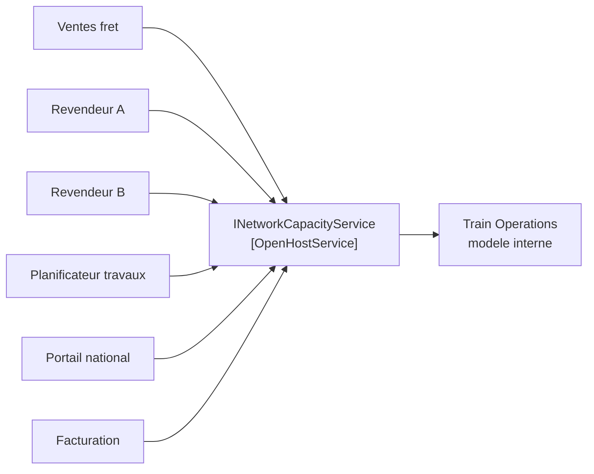

# Open Host Service

🌍 🇫🇷 Français (ce fichier) · 🇬🇧 [English](OpenHostService-en.md)

## Intention

Open Host Service est un protocole offrant les services d'un sous-système à un nombre quelconque de
consommateurs, plutôt qu'une traduction négociée avec chacun tour à tour.

## Problème

Réseau ferroviaire régional. Six parties veulent savoir si une section est libre à une minute donnée : le
bureau des ventes fret, deux revendeurs de billets, le planificateur des travaux, le portail national de
demande de sillons, et le contexte de facturation qui rapproche le réservé du circulé.

Cela se passe d'ordinaire ainsi : six intégrations, négociées une à une, chacune façonnée par celui qui a
demandé en dernier.

```csharp
bool IsFreeForFreight(string section, DateTime from, DateTime to, string haulier);
bool CheckAvailability(SectionId section, DateOnly day, TimeOnly at);   // pour le revendeur A
AvailabilityDto Lookup(string sectionCode, string isoTimestamp);        // pour le revendeur B
```

Chacune est raisonnable le jour où on l'écrit. Ensemble, ce sont six choses à maintenir, et un changement
du modèle doit être convenu six fois.

## Solution

Le patron retourne le sens de la conception.

Un protocole est défini, qui donne accès au sous-système sous forme d'un ensemble de services, et il est
ouvert de sorte que tous ceux qui ont besoin de s'intégrer puissent l'employer. Il est conçu une fois,
pour tous les venants, plutôt que façonné par celui qui a demandé le premier.

La différence n'est pas technique — elle porte sur la personne pour qui l'interface est conçue. Une
intégration bâtie pour un consommateur répond à la question de ce consommateur ; un service hôte répond à
la question que le sous-système est capable de répondre, et laisse les consommateurs y prendre ce dont ils
ont besoin.

Quand un nouveau besoin d'intégration arrive, le protocole est enrichi et étendu. L'exception que nomme le
livre est celle d'une équipe unique aux besoins idiosyncrasiques : celle-là reçoit un traducteur
ponctuel, pour que le protocole partagé reste simple et cohérent.

## Structure



Six flèches vers une boîte. L'image est le patron : l'alternative a six boîtes et six flèches, et aucune
boîte que quiconque possède.

## Les rôles

| Rôle | Annotation | S'applique à | Ce qu'il porte |
|---|---|---|---|
| OpenHostService | `[OpenHostService]` | interface, classe | Le protocole qu'un sous-système offre à tous les venants. Conçu une fois pour de nombreux consommateurs, et enrichi pour l'un d'eux en particulier seulement par une extension qui ne dérange pas les autres. |

Un seul rôle, non répétable. Un sous-système qui offre deux services hôtes ouverts n'en offre aucun : le
propos est qu'il y ait un seul endroit où regarder.

## L'exemple

Extrait de [`OpenHostServiceUsage.cs`](../../../../DesignPatternCatalog.Usage.TrainOperations/OpenHostServiceUsage.cs).

```csharp
/// <summary>
///     What the network can still take. Designed for every consumer, not for the one who asked first.
/// </summary>
[OpenHostService]
public interface INetworkCapacityService {

    bool IsSectionAvailable(SectionId section, DateOnly day, TimeOnly from, TimeOnly to);

    IReadOnlyCollection<SectionId> SectionsAvailableAt(DateOnly day, TimeOnly at);

}
```

Deux méthodes, et deux décisions qui s'y lisent.

**Le protocole parle le vocabulaire du noyau partagé.** `SectionId` vient de
[`RailNetwork`](SharedKernel-fr.md), et `TrainPath` — le concept central du modèle d'exploitation —
n'apparaît pas du tout. C'est délibéré : l'exposer lierait chaque consommateur à un modèle qui change dès
que le chemin de fer change, et les six devraient alors absorber chaque remaniement interne.

**Aucune des deux méthodes n'est façonnée par un consommateur particulier.** `IsSectionAvailable` répond
au sujet d'une section que l'appelant a déjà en tête ; `SectionsAvailableAt` répond quand il ne l'a pas. À
elles deux, elles couvrent ce que le sous-système sait dire, plutôt que ce que le bureau fret s'est trouvé
demander à la première réunion.

Un consommateur qui veut davantage obtient une extension et non un changement. Le service de réservation
du bureau fret siège à côté de celui-ci au lieu d'ajouter un paramètre que les cinq autres devraient
absorber — ce qui est l'issue de secours du livre lui-même pour les besoins idiosyncrasiques, et la raison
pour laquelle le protocole partagé reste cohérent.

## Possibilités d'application

**Définissez un protocole qui donne accès à votre sous-système sous forme d'un ensemble de services.**

**Ouvrez le protocole de sorte que tous ceux qui ont besoin de s'intégrer à vous puissent l'employer.**

**Enrichissez et étendez le protocole pour traiter les nouveaux besoins d'intégration**, de sorte que le
protocole partagé croisse avec les demandes qui lui sont faites.

**Employez un traducteur ponctuel pour une équipe unique aux besoins idiosyncrasiques**, en augmentant le
protocole pour ce cas particulier afin que le protocole partagé reste simple et cohérent.

Le contexte que le livre énonce est celui d'un sous-système à intégrer avec de nombreux autres, où
personnaliser un traducteur pour chacun embourberait l'équipe.

## Quand ne pas l'utiliser

**Ne l'employez pas pour un seul consommateur.** Le coût du patron est de concevoir pour des gens qui ne
sont pas dans la pièce. Avec une intégration unique, ce coût n'achète rien, et un traducteur façonné pour
l'unique consommateur est la meilleure réponse.

**N'exposez pas le modèle interne à travers lui.** Un protocole qui transporte les types centraux du
sous-système fait de chaque changement interne une rupture pour chaque consommateur, ce qui est l'échec que
le patron existe pour prévenir. Parlez plutôt un vocabulaire partagé ou publié.

**Ne le pliez pas pour un consommateur.** L'instruction du livre est l'inverse : le cas idiosyncrasique
reçoit son propre traducteur. Un protocole avec un paramètre qu'un seul appelant renseigne jamais est en
route pour redevenir six intégrations dans une interface.

**Ne l'employez pas là où vous êtes en aval.** C'est le patron du côté amont. Un consommateur face à un
système qui ne publiera rien a besoin d'une couche anticorruption, non de ceci.

## Avantages

* Un protocole à concevoir, documenter, versionner et maintenir, au lieu d'un par consommateur.
* Un changement de modèle est convenu une fois, non une fois par intégration.
* Les nouveaux consommateurs s'intègrent sans négociation, puisque le protocole est déjà là et déjà
  documenté.
* Le modèle interne du sous-système reste libre de changer, puisque ce n'est pas de lui que dépendent les
  consommateurs.
* Le cas idiosyncrasique a un foyer nommé — un traducteur ponctuel — au lieu d'être absorbé dans le
  protocole partagé.

## Inconvénients

* Concevoir pour des consommateurs qui ne sont pas dans la pièce est plus difficile que concevoir pour
  celui qui a demandé, et la première version est d'ordinaire fausse quelque part.
* Un protocole publié est un engagement : le changer suppose de se coordonner avec tous ceux qui le
  parlent.
* Il répond à la question que le sous-système sait répondre, qui peut ne pas être exactement la question
  qu'un consommateur donné voulait.
* Il lui faut un propriétaire. Un protocole pour tous les venants dont personne n'est responsable dérive
  vers ce dont le dernier appelant a eu besoin.

## Liens avec les autres patrons

**`PublishedLanguage`** est ce qu'un service hôte ouvert parle d'ordinaire, et le livre les associe : le
protocole est l'accès, le langage est le vocabulaire qu'il échange.

**`AnticorruptionLayer`** est la même intégration vue de l'aval. Là où le côté amont publie un service
hôte, ses consommateurs ont besoin de bien moins de couche — parfois d'aucune.

**`BoundedContext`** est ce depuis quoi le service est offert et ce qu'il protège : le protocole est la
frontière rendue appelable.

**`SharedKernel`** est la solution de rechange pour deux contextes qui peuvent s'accorder sur des types
partagés. Ce patron-ci ne demande aucun accord aux consommateurs, et c'est pourquoi il passe à six.

**`Service`** est l'unité dont le protocole est composé, selon les propres mots du livre.

## Source

*Domain-Driven Design: Tackling Complexity in the Heart of Software*, Eric Evans, Addison-Wesley, 2003 —
chapitre 14, préserver l'intégrité du modèle.

* [Entrée d'index](../../../generated/catalog-index.md#openhostservice-domain-driven-design)
* [Attribut généré](../../../../DesignPatternCatalog.DomainDrivenDesign/OpenHostService.cs)
* [Exemple](../../../../DesignPatternCatalog.Usage.TrainOperations/OpenHostServiceUsage.cs)
