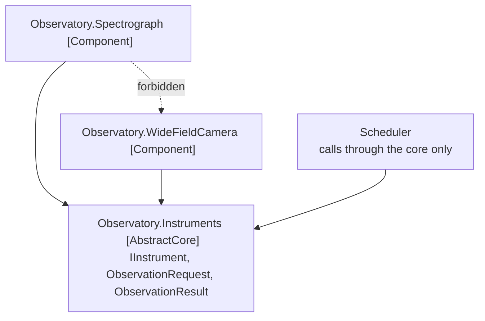

# Pluggable Component Framework

🌍 🇬🇧 English (this file) · 🇫🇷 [Français](PluggableComponentFramework-fr.md)

## Intent

Pluggable Component Framework distils a core of abstract interfaces that several teams share, and lets
diverse implementations of that core be substituted for one another without any of them knowing the
others exist.

## Problem

A shared telescope, with instruments built by different institutes over twenty years. An échelle
spectrograph delivered in 2011, a wide-field camera delivered in 2019, and an instrument that will be
commissioned in 2031 must all run under a scheduler written in 2011, without any of them being changed.

The teams do not report to each other, nobody can be told to rebuild, and the scheduler cannot know what
an échelle grating is.

Written as the scheduler knowing its instruments, the arrangement fails on delivery of the second one:

```csharp
if (instrument is EchelleSpectrograph echelle) { echelle.SetGratingAngle(…); }
else if (instrument is WideFieldCamera camera) { camera.SelectFilter(…); }
```

Every new instrument is a change to the scheduler, which means every institute waits for the observatory
to release, and the observatory carries knowledge of hardware it has never seen.

## Solution

The pattern distils a core and freezes it.

An abstract core of interfaces and interactions is distilled, and a framework created that allows diverse
implementations of those interfaces to be freely substituted. Any application may use those components,
so long as it operates strictly through the interfaces of the abstract core.

The circumstance is specific, and it is the reason not to reach for this casually. The book says the
opportunity arises in a very mature model that is deep and distilled, and usually only after a few
applications have already been implemented in the same domain.

What the arrangement costs is where the discipline is. Anything added to the core must be implemented by
every component, including the ones whose authors have moved on — so the core is distilled, not
accumulated.

## Structure



Two rules, and the dashed arrow is the one that is invisible in a diff: a component may reference the
core, and no component may reference a sibling.

## The roles

| Role | Annotation | Applies to | What it carries |
|---|---|---|---|
| AbstractCore | `[assembly: PluggableComponentFramework.AbstractCore]` | assembly | The shared interfaces every component implements and every application calls through. Distilled rather than accumulated: anything added must be implemented by all of them. |
| Component | `[assembly: PluggableComponentFramework.Component]` | assembly | One interchangeable implementation of the abstract core. It may reference the core and nothing of any sibling. |

Both on assemblies, neither repeatable. The two roles are what let a rule state the two dependency rules
above, which is the whole reason the annotations exist here.

## The example

Told across three assemblies. The core is
[`Observatory.Instruments`](../../../../DesignPatternCatalog.Usage.Observatory.Instruments/PluggableComponentFrameworkUsage.cs).

```csharp
[assembly: PluggableComponentFramework.AbstractCore]
```

```csharp
/// <remarks>
///     Three members, and it stays at three. Each addition would have to be implemented by instruments
///     whose teams no longer exist, which is the constraint that makes distillation a requirement rather
///     than good taste.
/// </remarks>
public interface IInstrument {

    string Name { get; }

    bool CanObserve(ObservationRequest request);

    ObservationResult Observe(ObservationRequest request);

}
```

Three members, and the pressure to add a fourth is permanent: the spectrograph team wants a slit width
here, the camera team wants a filter wheel, and each request is reasonable on its own. A core that grants
them is a core that no new component can implement.

```csharp
/// <summary>
///     What an astronomer asks for, in terms no instrument is privileged by.
/// </summary>
public sealed record ObservationRequest(string Target, TimeSpan Exposure, string Band);

/// <summary>
///     What comes back, in the same shared vocabulary.
/// </summary>
public sealed record ObservationResult(string Instrument, string ArchivePath, bool Usable);
```

*In terms no instrument is privileged by* is the design constraint. A request carrying a grating angle
would make the spectrograph the reference implementation and every other instrument a special case.

Then a component,
[`Observatory.Spectrograph`](../../../../DesignPatternCatalog.Usage.Observatory.Spectrograph/SpectrographComponentUsage.cs).

```csharp
[assembly: PluggableComponentFramework.Component]

public sealed class EchelleSpectrograph : IInstrument {

    public string Name => "Échelle spectrograph";

    /// <summary>
    ///     Refuses what it cannot do well, in its own terms, without the scheduler knowing any of them.
    /// </summary>
    public bool CanObserve(ObservationRequest request) {
        return request.Band is "optical" or "near-infrared" && request.Exposure >= TimeSpan.FromMinutes(5);
    }

    public ObservationResult Observe(ObservationRequest request) {
        return new ObservationResult(Name, $"/archive/echelle/{request.Target}", CanObserve(request));
    }

}
```

Everything specific to the instrument is behind the shared interface — the grating angles, the calibration
lamps, the fact that it is useless in bright moonlight. `CanObserve` is where that knowledge lives, and
the scheduler learns none of it: it asks, and the instrument answers.

This assembly references the abstract core and nothing else, and the important half of that is the
*nothing else*. The wide-field camera next door has a good exposure-time calculator, and using it from
here would be two lines and would work. It would also mean the spectrograph could no longer be deployed
without the camera, and the property the whole arrangement was bought for — swap one instrument, leave the
rest — would be gone, with no error message and no failing test.

## Applicability

**Distil an abstract core of interfaces and interactions, and create a framework that allows diverse
implementations of those interfaces to be freely substituted.**

**Allow any application to use those components, so long as it operates strictly through the interfaces of
the abstract core.**

**Use it on a very mature model that is deep and distilled.** The book is explicit that the opportunity
arises there, and usually only after a few applications have already been implemented in the same domain.

## When not to use it

**Do not use it early.** The book puts this first among the limitations: the pattern is very difficult to
apply. It requires precision in the design of the interfaces and a model deep enough to capture the
necessary behaviour in the abstract core — neither of which is available before several applications have
been built.

**Do not use it where the freedom is wanted in the other direction.** The book names this as the second
major downside: the arrangement gives a great deal of freedom to component implementers, and leaves
applications with limited options. Where the applications are what must vary, this is the wrong shape.

**Do not use it without the constraint that justifies it.** Several teams that do not report to each
other, interoperating over a long period, none able to be told to rebuild. That is real at an observatory
and rare elsewhere; without it, a shared library and a release cadence are cheaper.

**Do not let the core accumulate.** Every addition must be implemented by every component, including the
ones nobody maintains. A framework that keeps growing its core has stopped being one.

**Do not let a component reach into a sibling.** It is one line in a project file, it works, and it
silently removes the substitutability that was the entire purchase.

## Advantages

* An implementation written twenty years apart from the application runs under it unchanged.
* Teams that do not coordinate can nonetheless interoperate, because the only agreement is the core.
* A component can be swapped, added or retired without any other component or the application being
  touched.
* The core stays small, because the cost of growing it falls on everyone and is therefore visible.
* The two dependency rules are checkable, which matters because both are invisible in review.

## Drawbacks

* It is very difficult to apply, and needs a maturity that early projects do not have.
* The freedom is one-directional: components gain a great deal, applications are left with limited
  options.
* The core is under permanent pressure to grow, and each request to grow it is individually reasonable.
* A core that turns out to be wrong is nearly impossible to change, since every component implements it.
* Nothing in the language prevents the sibling reference that ends the arrangement.

## Relations with other patterns

**`CoreDomain`** is the prerequisite. The book presents this pattern as available to a model that has
already been distilled, and the abstract core is a distillation of a distillation.

**`BoundedContext`** is what each component is, in practice: its own model behind a shared interface.

**`PublishedLanguage`** is the closest relative among the integration patterns — the abstract core is a
vocabulary published to implementers rather than to consumers.

**`AnticorruptionLayer`** is what a component needs if it must talk to something outside the framework
without letting that model in.

**`CohesiveMechanism`** and this pattern are both about factoring out something reusable, and they differ
in what is shared: a mechanism shares a solution, a framework shares a vocabulary.

## Source

*Domain-Driven Design: Tackling Complexity in the Heart of Software*, Eric Evans, Addison-Wesley, 2003 —
chapter 16, large-scale structure.

* [Index entry](../../../generated/catalog-index.md#pluggablecomponentframework-domain-driven-design)
* [Generated attribute](../../../../DesignPatternCatalog.DomainDrivenDesign/PluggableComponentFramework.cs)
* [Example](../../../../DesignPatternCatalog.Usage.Observatory.Instruments/PluggableComponentFrameworkUsage.cs)
