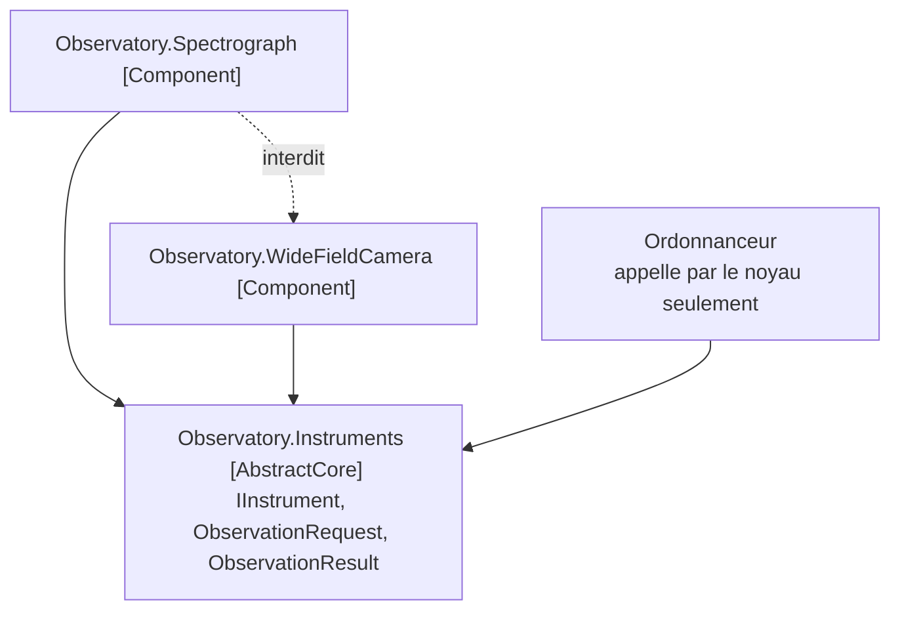

# Pluggable Component Framework

🌍 🇫🇷 Français (ce fichier) · 🇬🇧 [English](PluggableComponentFramework-en.md)

## Intention

Pluggable Component Framework distille un noyau d'interfaces abstraites que plusieurs équipes partagent,
et permet à des implémentations diverses de ce noyau d'être substituées les unes aux autres sans qu'aucune
sache que les autres existent.

## Problème

Un télescope partagé, avec des instruments construits par différents instituts sur vingt ans. Un
spectrographe échelle livré en 2011, une caméra grand champ livrée en 2019, et un instrument qui sera mis
en service en 2031 doivent tous tourner sous un ordonnanceur écrit en 2011, sans qu'aucun d'eux soit
changé.

Les équipes ne relèvent pas les unes des autres, on ne peut demander à personne de reconstruire, et
l'ordonnanceur ne peut pas savoir ce qu'est un réseau échelle.

Écrit avec un ordonnanceur qui connaît ses instruments, l'agencement échoue à la livraison du second :

```csharp
if (instrument is EchelleSpectrograph echelle) { echelle.SetGratingAngle(…); }
else if (instrument is WideFieldCamera camera) { camera.SelectFilter(…); }
```

Chaque nouvel instrument est un changement de l'ordonnanceur, ce qui veut dire que chaque institut attend
que l'observatoire publie, et que l'observatoire porte la connaissance d'un matériel qu'il n'a jamais vu.

## Solution

Le patron distille un noyau et le gèle.

Un noyau abstrait d'interfaces et d'interactions est distillé, et un cadre créé qui permet à des
implémentations diverses de ces interfaces d'être librement substituées. N'importe quelle application peut
employer ces composants, du moment qu'elle opère strictement à travers les interfaces du noyau abstrait.

La circonstance est précise, et c'est la raison de ne pas y recourir à la légère. Le livre dit que
l'occasion se présente dans un modèle très mûr, profond et distillé, et d'ordinaire seulement après que
quelques applications ont déjà été implémentées dans le même domaine.

Ce que l'agencement coûte est l'endroit où se trouve la discipline. Tout ce qui est ajouté au noyau doit
être implémenté par chaque composant, y compris ceux dont les auteurs sont partis — le noyau est donc
distillé, non accumulé.

## Structure



Deux règles, et la flèche pointillée est celle qui est invisible dans un diff : un composant peut
référencer le noyau, et aucun composant ne peut référencer un frère.

## Les rôles

| Rôle | Annotation | S'applique à | Ce qu'il porte |
|---|---|---|---|
| AbstractCore | `[assembly: PluggableComponentFramework.AbstractCore]` | assembly | Les interfaces partagées que chaque composant implémente et par lesquelles chaque application appelle. Distillé et non accumulé : tout ajout doit être implémenté par tous. |
| Component | `[assembly: PluggableComponentFramework.Component]` | assembly | Une implémentation interchangeable du noyau abstrait. Elle peut référencer le noyau et rien d'aucun frère. |

Les deux sur des assemblies, aucun répétable. Les deux rôles sont ce qui permet à une règle d'énoncer les
deux règles de dépendance ci-dessus, ce qui est toute la raison d'être des annotations ici.

## L'exemple

Raconté à travers trois assemblies. Le noyau est
[`Observatory.Instruments`](../../../../DesignPatternCatalog.Usage.Observatory.Instruments/PluggableComponentFrameworkUsage.cs).

```csharp
[assembly: PluggableComponentFramework.AbstractCore]
```

```csharp
/// <remarks>
///     Three members, and it stays at three. Each addition would have to be implemented by instruments
///     whose teams no longer exist, which is the constraint that makes distillation a requirement rather
///     than good taste.
/// </remarks>
public interface IInstrument {

    string Name { get; }

    bool CanObserve(ObservationRequest request);

    ObservationResult Observe(ObservationRequest request);

}
```

Trois membres, et la pression pour en ajouter un quatrième est permanente : l'équipe du spectrographe veut
une largeur de fente ici, l'équipe de la caméra veut une roue à filtres, et chaque demande est raisonnable
prise seule. Un noyau qui les accorde est un noyau qu'aucun nouveau composant ne peut implémenter.

```csharp
/// <summary>
///     What an astronomer asks for, in terms no instrument is privileged by.
/// </summary>
public sealed record ObservationRequest(string Target, TimeSpan Exposure, string Band);

/// <summary>
///     What comes back, in the same shared vocabulary.
/// </summary>
public sealed record ObservationResult(string Instrument, string ArchivePath, bool Usable);
```

*Dans des termes qui ne privilégient aucun instrument* est la contrainte de conception. Une requête portant
un angle de réseau ferait du spectrographe l'implémentation de référence et de tous les autres instruments
des cas particuliers.

Puis un composant,
[`Observatory.Spectrograph`](../../../../DesignPatternCatalog.Usage.Observatory.Spectrograph/SpectrographComponentUsage.cs).

```csharp
[assembly: PluggableComponentFramework.Component]

public sealed class EchelleSpectrograph : IInstrument {

    public string Name => "Échelle spectrograph";

    /// <summary>
    ///     Refuses what it cannot do well, in its own terms, without the scheduler knowing any of them.
    /// </summary>
    public bool CanObserve(ObservationRequest request) {
        return request.Band is "optical" or "near-infrared" && request.Exposure >= TimeSpan.FromMinutes(5);
    }

    public ObservationResult Observe(ObservationRequest request) {
        return new ObservationResult(Name, $"/archive/echelle/{request.Target}", CanObserve(request));
    }

}
```

Tout ce qui est propre à l'instrument est derrière l'interface partagée — les angles de réseau, les lampes
d'étalonnage, le fait qu'il ne vaut rien en pleine lune. `CanObserve` est l'endroit où cette connaissance
vit, et l'ordonnanceur n'en apprend rien : il demande, et l'instrument répond.

Cette assembly référence le noyau abstrait et rien d'autre, et la moitié importante est le *rien d'autre*.
La caméra grand champ voisine a un bon calculateur de temps de pose, et l'employer d'ici ferait deux
lignes et fonctionnerait. Cela voudrait aussi dire que le spectrographe ne pourrait plus être déployé sans
la caméra, et la propriété pour laquelle tout l'agencement a été acheté — échanger un instrument, laisser
le reste — aurait disparu, sans message d'erreur et sans test en échec.

## Possibilités d'application

**Distillez un noyau abstrait d'interfaces et d'interactions, et créez un cadre qui permette à des
implémentations diverses de ces interfaces d'être librement substituées.**

**Permettez à n'importe quelle application d'employer ces composants, du moment qu'elle opère strictement
à travers les interfaces du noyau abstrait.**

**Employez-le sur un modèle très mûr, profond et distillé.** Le livre est explicite : l'occasion se
présente là, et d'ordinaire seulement après que quelques applications ont déjà été implémentées dans le
même domaine.

## Quand ne pas l'utiliser

**Ne l'employez pas tôt.** Le livre met cela en tête de ses limites : le patron est très difficile à
appliquer. Il exige de la précision dans la conception des interfaces et un modèle assez profond pour
capter le comportement nécessaire dans le noyau abstrait — dont aucun n'est disponible avant que plusieurs
applications aient été construites.

**Ne l'employez pas là où la liberté est voulue dans l'autre sens.** Le livre le nomme comme sa seconde
grande limite : l'agencement donne une grande liberté aux auteurs de composants, et laisse aux
applications des options limitées. Là où ce sont les applications qui doivent varier, ce n'est pas la
bonne forme.

**Ne l'employez pas sans la contrainte qui le justifie.** Plusieurs équipes qui ne relèvent pas les unes
des autres, interopérant sur une longue période, aucune ne pouvant se voir demander de reconstruire. C'est
réel dans un observatoire et rare ailleurs ; sans cela, une bibliothèque partagée et un rythme de
publication coûtent moins cher.

**Ne laissez pas le noyau accumuler.** Chaque ajout doit être implémenté par chaque composant, y compris
ceux que personne ne maintient. Un cadre dont le noyau ne cesse de croître a cessé d'en être un.

**Ne laissez pas un composant atteindre un frère.** C'est une ligne dans un fichier de projet, cela
fonctionne, et cela supprime silencieusement la substituabilité qui était tout l'achat.

## Avantages

* Une implémentation écrite vingt ans après l'application tourne sous elle sans changement.
* Des équipes qui ne se coordonnent pas peuvent néanmoins interopérer, puisque le seul accord est le
  noyau.
* Un composant peut être échangé, ajouté ou retiré sans qu'aucun autre composant ni l'application soit
  touché.
* Le noyau reste petit, parce que le coût de le faire croître retombe sur tout le monde et est donc
  visible.
* Les deux règles de dépendance sont contrôlables, ce qui compte parce que toutes deux sont invisibles en
  relecture.

## Inconvénients

* Il est très difficile à appliquer, et demande une maturité que les projets jeunes n'ont pas.
* La liberté est à sens unique : les composants en gagnent beaucoup, les applications restent avec des
  options limitées.
* Le noyau est sous une pression permanente de croissance, et chaque demande de le faire croître est
  individuellement raisonnable.
* Un noyau qui se révèle faux est presque impossible à changer, puisque chaque composant l'implémente.
* Rien dans le langage n'empêche la référence entre frères qui met fin à l'agencement.

## Liens avec les autres patrons

**`CoreDomain`** en est le prérequis. Le livre présente ce patron comme accessible à un modèle déjà
distillé, et le noyau abstrait est une distillation de distillation.

**`BoundedContext`** est ce qu'est chaque composant en pratique : son propre modèle derrière une interface
partagée.

**`PublishedLanguage`** est le plus proche parent parmi les patrons d'intégration — le noyau abstrait est
un vocabulaire publié aux implémenteurs plutôt qu'aux consommateurs.

**`AnticorruptionLayer`** est ce dont un composant a besoin s'il doit parler à quelque chose d'extérieur au
cadre sans laisser entrer ce modèle.

**`CohesiveMechanism`** et ce patron portent tous deux sur l'extraction de quelque chose de réutilisable,
et diffèrent par ce qui est partagé : un mécanisme partage une solution, un cadre partage un vocabulaire.

## Source

*Domain-Driven Design: Tackling Complexity in the Heart of Software*, Eric Evans, Addison-Wesley, 2003 —
chapitre 16, la structure à grande échelle.

* [Entrée d'index](../../../generated/catalog-index.md#pluggablecomponentframework-domain-driven-design)
* [Attribut généré](../../../../DesignPatternCatalog.DomainDrivenDesign/PluggableComponentFramework.cs)
* [Exemple](../../../../DesignPatternCatalog.Usage.Observatory.Instruments/PluggableComponentFrameworkUsage.cs)
